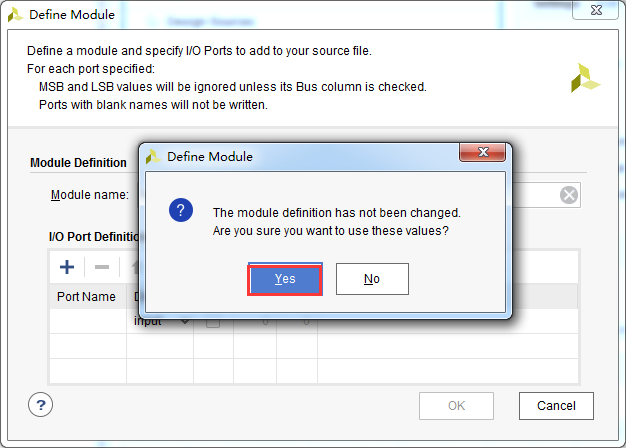
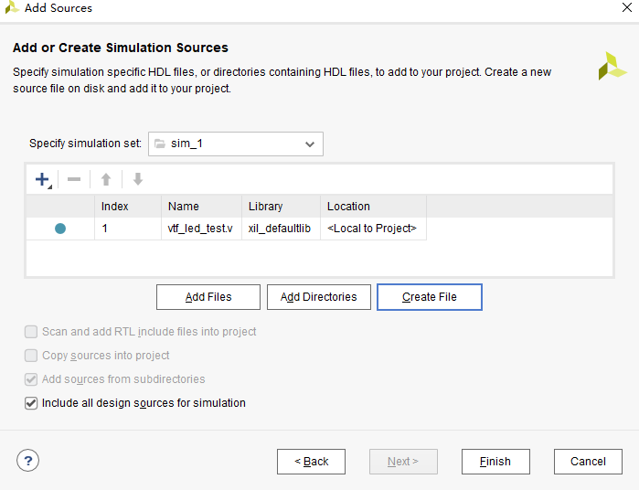
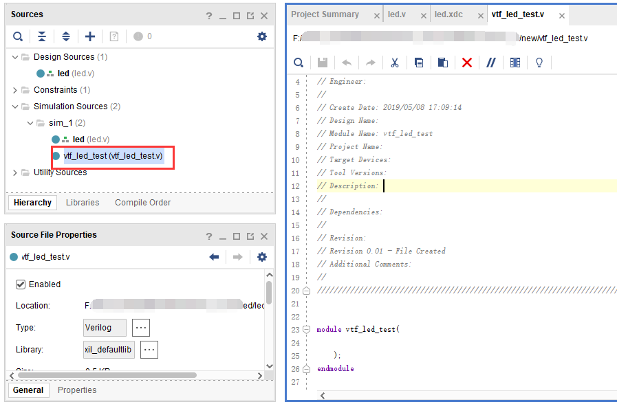

.. _Alinx官网: http://www.alinx.com

.. image:: images/images_0/88.png  

========================================
"Chapter 4" PL's "Hello world" LED experiment
========================================
**Experimental Vivado project for "led"**

- For ZYNQ, PL (FPGA) development is very important. This is where ZYNQ has an advantage over other ARMs. It can customize many peripherals on the ARM side. Let us pass an LED before customizing the peripherals on the ARM side. To familiarize yourself with the development process of PL (FPGA) and the basic operation of Vivado software, this development process is exactly the same as the FPGA chip without ARM.

- In this routine, what we are going to do is the LED light control experiment, control the LED light on the development board to flip once every second, and realize the control of on, off, on, and off. Can control LED lights, and other peripherals will also be able to slowly.

4.1 LED hardware introduction
========================================

1. A red user LED is connected to the PL part of the development board. This 1 light is fully controlled by the PL. If images1 is high level, the triode is turned on, and the light will be on, otherwise it will be off.

.. image:: images/images_4/1.png
   :align: center

2. We can determine the binding relationship between the LED and PL pins according to the wiring relationship in the schematic diagram.

.. image:: images/images_4/2.png
   :align: center

3. **The IOs starting with PS_MIO in the schematic diagram are all PS-side IOs, which do not need to be bound, nor can they be bound**

4.2 Create a vivado project
========================================
1. Start Vivado, which can be started by double-clicking the Vivado shortcut in Windows.

.. image:: images/images_4/5.png
   :align: center

2. Click "Create New Project" in the Vivado development environment to create a new project.

.. image:: images/images_4/6.png
   :align: center

3. A wizard to create a new project pops up, click "Next"

.. image:: images/images_4/7.png
   :align: center

4. In the pop-up dialog box, enter the project name and the directory where the project is stored. Here we take a led project name. It should be noted that the project path "Project location" cannot have Chinese spaces, and the path name cannot be too long.

.. image:: images/images_4/8.png
   :align: center

5. Select "RTL Project" in the project type
6. Select "Verilog" as the target language "Target language". Although Verilog is selected, VHDL can also be used, and multi-language mixed programming is supported.

7. Click "Next" without adding any files

.. image:: images/images_4/11.png
    :align: center

8. Take the AXU3EG development board as an example, in the "Part" option, select "Zynq UltraScale+ MPSoCs" for the device family "Family", select "sfvc784" for the package type "Package", select "-1" for Speed, and select "I" for Temperature Reduce your options. Select "xczu3eg-sfvc784-1-i" in the drop-down list, "-1" indicates the speed level, the larger the number, the better the performance, and the chip with high speed is backward compatible with the chip with low speed. (The model selected in the routine is "xazu3eg-sfvc784-1-i", the two are compatible)

For the AXU4EV development board, in the "Part" option, select "Zynq UltraScale+ MPSoCs" for the device family "Family", select "sfvc784" for the package type "Package", select "-1" for Speed, and select "I" for Temperature to reduce the selection range. Select "xczu4ev-sfvc784-1-i" in the drop-down list;

.. image:: images/images_4/13.png
    :align: center

For the AXU5EV development board, in the "Part" option, select "Zynq UltraScale+ MPSoCs" for the device family "Family", select "sfvc784" for the package type "Package", select "-1" for Speed, and select "I" for Temperature to reduce the selection range. Select "xczu5ev-sfvc784-1-i" in the drop-down list; (the model selected in the routine is "xazu5ev-sfvc784-1-i", both are compatible)

9. Click "Finish" to complete the creation of the project named "led".

.. image:: images/images_4/15.png
    :align: center

10. Vivado software interface

.. image:: images/images_4/16.png
    :align: center

4.3 Create a Verilog HDL file to light up the LED
============================================

1. Click the Add Sources icon under Project Manager (or use the shortcut key Alt+A)

2. Select "Add or create design sources" and click "Next"

.. image:: images/images_4/18.png
    :align: center

3. Select "Create File"

4. Set the file name "File name" to "led", click "OK"

.. image:: images/images_4/20.png
    :align: center

5. Click "Finish" to complete adding the "led.v" file

6. In the pop-up module definition "Define Module", you can specify the module name "Module name" of the "led.v" file. Here, the default is not changed to "led". You can also specify some ports, which are not specified here temporarily. Click "OK".

7. Select "Yes" in the pop-up dialog box

8. Double-click "led.v" to open the file, and then edit

9. Write "led.v", here defines a 32-bit register timer, which is used to count 0~199999999 (1 second), and when the count reaches 199999999 (1 second), the register timer becomes 0 and flips Four LEDs. In this way, if the original LED is off, it will be on, and if the original LED is on, it will be off. Since the input clock is a 200MHz differential clock, it is necessary to add the IBUFDS primitive to connect the differential signal. The code after writing is as follows:

::

 `timescale 1ns / 1ps 
 module led(
 //Differential system clock
     input sys_clk_p,
     input sys_clk_n,
     input rst_n,
     output reg  led
     );
 reg[31:0] timer_cnt;
 wire sys_clk ;
    IBUFDS IBUFDS_inst (
       .O(sys_clk),  // Buffer output
       .I(sys_clk_p),  // Diff_p buffer input (connect directly to top-level port)
       .IB(sys_clk_n) // Diff_n buffer input (connect directly to top-level port)
    );
 always@(posedge sys_clk)
 begin
     if (!rst_n)
     begin
       led <= 1'b0 ;
       timer_cnt <= 32'd0 ;
     end
     else if(timer_cnt >= 32'd199_999_999)   //1 second counter, 200M-1=199999999
     begin
         led <= ~led;
         timer_cnt <= 32'd0;
     end
     else
     begin
         led <= led;
         timer_cnt <= timer_cnt + 32'd1;
     end
 end
 endmodule

10. Save after writing the code

4.4 Add pin constraints
============================================
The constraint file format used by Vivado is an xdc file. The xdc file mainly completes pin constraints, clock constraints, and group constraints. Here we need to assign the input and output ports in the led.v program to the real pins of the FPGA.

1. Click "Open Elaborated Design"

.. image:: images/images_4/25.png
    :align: center

2. Click the "OK" button in the pop-up window

.. image:: images/images_4/26.png
    :align: center

3. Select "Window -> I/O Ports" from the menu

4. You can see the pin assignment in the pop-up I/O Ports

5. Bind the reset signal rst_n to the button on the PL terminal, assign pins and level standards to the LED and the clock, and click the save icon after completion

6. A pop-up window asks to save the constraint file. We fill in "led" for the file name and "XDC" for the file type by default. Click "OK"

7. Open the "led.xdc" file just generated, we can see that it is a TCL script, if we understand the syntax, we can completely constrain the pins by writing the led.xdc file by ourselves

**Let’s introduce the most basic syntax of XDC writing. Ordinary IO ports only need to constrain the pin number and voltage. The pin constraints are as follows:**

set_property PACKAGE_PIN "pin number" [get_ports "port name"]

**Constraints for level signals are as follows:**

set_property IOSTANDARD "level standard" [get_ports "port name"]

Here you need to pay attention to the capitalization of the text. If the port name is an array, use { } to scrape it up. The port name must be consistent with the name in the source code, and the port name cannot be the same as the keyword.
The number after "LVCMOS33" in the level standard refers to the BANK voltage of the FPGA, and the voltage of the bank where the LED is located is 3.3 volts, so the level standard is "LVCMOS33". **Vivado by default requires all IOs to be assigned the correct level standard and pin number. **

4.5 Add Timing Constraints
============================================
In addition to pin assignment, an FPGA design also has an important constraint, that is, timing constraints. Here, a wizard is used to demonstrate how to perform a timing constraint.

1. Click "Run Synthesis" to start synthesis

2. A dialog box pops up and click "OK"

.. image:: images/images_4/33.png
    :align: center

3. Click "Cancel" after the synthesis is complete

.. image:: images/images_4/34.png
    :align: center

4. Click "Constraints Wizard"

5. Click "Next" in the pop-up window

6. The timing constraint wizard analyzes the clock in the design, here set the "sys_clk_p" frequency to 200Mhz, and then click "Skip to Finish" to end the timing constraint wizard.

7. Click "OK" in the pop-up window

8. Click "Finish"

9. At this time, the led.xdc file has been updated, click "Reload" to reload the file, and save the file

 
4.6 Generate BIT file
============================================

1. The compilation process can be subdivided into synthesis, layout and routing, bit file generation, etc. Here we directly click "Generate Bitstream" to directly generate bit files.

2. In the pop-up dialog box, you can choose the number of tasks. This is related to the number of CPU cores. Generally, the larger the number, the faster the compilation. Click "OK"

.. image:: images/images_4/42.png
    :align: center

3. Start compiling at this time, and you can see a status message in the upper right corner. During the compiling process, it may be blocked by anti-virus software or computer housekeeper, resulting in failure to compile or a long time without successful compilation.

.. image:: images/images_4/43.png
    :align: center

4. There are no errors in the compilation. After the compilation is completed, a dialog box pops up for us to choose the follow-up operation. You can choose "Open Hardware Manger", of course, you can also choose "Cancel". Here we choose "Cancel" and don't download it yet.

4.7 Vivado Simulation
============================================
Next, we might as well have a small test and use the simulation tool that comes with Vivado to output waveforms to verify whether the program design results of the running water lamp are consistent with our expectations (note: it can also be simulated before generating the bit file). Specific steps are as follows:

1. Set the simulation configuration of Vivado, right-click Simulation Settings in SIMULATION.

.. image:: images/images_4/45.png
    :align: center

2. In the Simulation Settings window, configure as shown in the figure below. Here, set it to 50ms (set it yourself according to your needs). Others follow the default settings, and click OK to complete.

3. To add a stimulus test file, click the Add Sources icon under the Project Manager, set as shown below and click Next.

4. Click Create File to generate the simulation stimulus file.

.. image:: images/images_4/48.png
    :align: center

**Enter the name of the stimulus file in the pop-up dialog box, here we enter the name vtf_led_test. **

5. Click the Finish button to return.

Here we do not add IO Ports, click OK.

In the Simulation Sources directory, there is a vtf_led_test file just added. Double-click to open this file, you can see that there is only the definition of the module name, and nothing else.

6. Next we need to write the content of this vtf_led_test.v file. First define the input and output signals, and then need to instantiate the led_test module, let the led_test program be a part of this test program. Then add reset and clock stimulus. The completed vtf_led_test.v file is as follows:
::

  `timescale 1ns / 1ps
  //////////////////////////////////////////////////// //////////////////////////////////
  // Module Name: vtf_led_test
  //////////////////////////////////////////////////// //////////////////////////////////
  module vtf_led_test;
  // Inputs
  reg sys_clk_p;
  reg rst_n;
  wire sys_clk_n;
  // Outputs
  wire led;
  // Instantiate the Unit Under Test (UUT)
  led uut (
      .sys_clk_p(sys_clk_p),
      .sys_clk_n(sys_clk_n),
      .rst_n(rst_n),
      .led(led)
   );
  initial
  begin
  // Initialize Inputs
      sys_clk_p = 0;
      rst_n = 0;
  // Wait for global reset to finish
  #1000;
      rst_n = 1;
  end
  //Create clock
  always #2.5 sys_clk_p = ~ sys_clk_p;
  assign sys_clk_n = ~sys_clk_p;
  endmodule

7. Save after writing, vtf_led_test.v automatically becomes the top layer of this simulation Hierarchy, and below it is the design file led_test.v.

.. image:: images/images_4/53.png
    :align: center

8. Click the Run Simulation button and select Run Behavioral Simulation. Here we can do a behavioral simulation.
 
.. image:: images/images_4/54.png
    :align: center

**If there are no errors, the simulation software in Vivado starts working. **

9. After the simulation interface pops up, as shown in the figure below, the interface is the waveform of 50ms when the simulation software automatically runs to the simulation setting.

 
Since LED[3:0] is designed to change state in the program for a long time, and the simulation is time-consuming, observe the change of timer[31:0] counter here. Put it into the Wave for observation (click uut under the Scope interface, then right-click to select timer under the Objects interface, and select Add Wave Window in the pop-up drop-down menu).
 

After adding, the timer is displayed on the Wave waveform interface, as shown in the figure below.
 
.. image:: images/images_4/57.png
    :align: center

10. Click the Restart button marked below to reset, and then click the Run All button. (Patience is required!!!), you can see that the simulated waveform matches the design. (Note: The longer the simulation time, the larger the disk space occupied by the simulated waveform file, and the waveform file is in the xx.sim folder of the project directory)

We can see that the LED signal will become 1, indicating that the LED light will become brighter.

4.8 download
============================================
1. Connect the JTAG interface of the development board, and power up the development board

.. image:: images/images_4/60.png
    :align: center

Note that the DIP switch should select the JTAG mode, that is, all of them are pulled to "ON", and the value represented by "ON" is 0. If the JTAG mode is not used, an error will be reported when downloading.

 
2. Click "Auto Connect" on the "HARDWARE MANAGER" interface to automatically connect to the device

.. image:: images/images_4/62.png
    :align: center

3. You can see that JTAG scans to arm and FPGA cores

 
4. Select the chip, right click "Program Device..."

5. Click "Program" in the pop-up window

.. image:: images/images_4/65.png
    :align: center

6. Waiting for download

.. image:: images/images_4/66.png
    :align: center

7. After the download is complete, we can see that the PL LED starts to change once per second. So far, the simple process experience of Vivado is completed. The following chapters will introduce that if the program is burned to Flash, it needs the cooperation of the PS system to complete it. Only PL projects cannot directly burn the Flash. It is introduced in the FAQ in the chapter "Experience ARM, output "Hello World" on bare metal".

4.9 Online debugging
============================================
The simulation and downloading are introduced above, but the simulation does not require the program to be written to the board, which is an ideal result. The following introduces the Vivado online debugging method to observe the changes of internal signals. Vivado has an embedded logic analyzer called ILA, which can be used to observe the changes of internal signals online, which is very helpful for debugging. In this experiment we observe the signal changes of timer_cnt and led.

Add ILA IP core
~~~~~~~~~~~~~~~~~~~~~~~~~~~~~~~~~~~~~~~~
1. Click IP Catalog, search for ila in the search box, and double-click the IP of ILA

.. image:: images/images_4/67.png
    :align: center

2. Change the name to ila. Since two signals are to be sampled, the number of Probes is set to 2. Sample Data Depth refers to the sampling depth. The higher the setting is, the more signals will be collected, and the more resources will be consumed.

.. image:: images/images_4/68.png
    :align: center
    
3. On the Probe_Ports page, set the width of the Probe, set the bit width of PROBE0 to 32 for sampling timer_cnt, and set the bit width of PROBE1 to 1 for sampling led. click OK

    
pop-up interface, select OK

.. image:: images/images_4/70.png
    :align: center
    
Then set as follows, click Generate

.. image:: images/images_4/71.png
    :align: center
    
4. Instantiate ila in led.v and save

.. image:: images/images_4/72.png
    :align: center
   
5. Regenerate Bitstream

.. image:: images/images_4/73.png
    :align: center
    
6. Download program

    
7. Now you see bit and ltx files, click program

8. At this time, the online debugging window pops up, and the signal we added appears

.. image:: images/images_4/76.png
    :align: center
    
Click the run button, the signal data appears

    
You can also trigger the acquisition, click "+" in the Trigger Setup window, and select the timer_cnt signal in depth

    
Change Radix to U, which is decimal, and set it to 199999999 in Value, which is the maximum value of timer_cnt count

.. image:: images/images_4/79.png
    :align: center
    
Click Run again, and you can see that the trigger is successful. At this time, timer_cnt is displayed as hexadecimal, and the led is also flipped at this time.

.. image:: images/images_4/80.png
    :align: center
    
MARK DEBUG
~~~~~~~~~~~~~~~~~~~~~~~~~~~~~~~~~~~~~~~
The online debugging method of adding ILA IP is introduced above, and the following introduces adding comprehensive attributes in the code to realize online debugging.
1. First open led.v, and comment out the instantiation part of ila

.. image:: images/images_4/81.png
    :align: center

2. Add ( MARK_DEBUG=”true” ) before the definitions of led and timer_cnt, and save the file

3. Click General

.. image:: images/images_4/83.png
    :align: center
     
4. After the synthesis is finished, click Set Up Debug

     
5. The pop-up window clicks Next

.. image:: images/images_4/85.png
    :align: center
     
Click Next by default

.. image:: images/images_4/86.png
    :align: center
     
Sample depth window, select Next

.. image:: images/images_4/87.png
    :align: center
     
Click Finish

     
click save

     
You can see the added ila core constraint in the xdc file

.. image:: images/images_4/89.png
    :align: center
     
5. Regenerate the bitstream

.. image:: images/images_4/90.png
    :align: center
     
6. The debugging method is the same as before, no more details.

4.10 Experiment summary
==============================================
This chapter introduces how to develop programs on the PL side, including methods such as project establishment, constraints, simulation, and online debugging. You can refer to this method in subsequent code development methods.

.. image:: images/images_0/888.png

*ZYNQ MPSoC Development Platform FPGA Tutorial* - `Alinx Official Website <https://www.alinx.com/en>`_