.. image:: images/images_0/88.png  
============================================
"Chapter 5" PLL experiment under Vivado
============================================

**Experimental Vivado project is "pll_test"**

Many beginners have doubts when they see only one 200Mhz clock input on the board. Why is the clock 200Mhz? What if they want to work at 100Mhz or 150Mhz? In fact, many FPGA chips have integrated PLL inside, and other manufacturers may not call it PLL. There are also similar functional modules, which can be multiplied and divided by PLL to generate many other clocks. This experiment learns the use of PLL and the method of using IP core of vivado by calling PLL IP core.

5.1 Experimental principle
==========================================
- PLL (phase-locked loop), that is, phase-locked loop. It is an important resource in FPGA. Because a complex FPGA system often needs multiple clock signals with different frequencies and phases. Therefore, the number of PLLs in an FPGA chip is an important indicator to measure the capability of FPGA chips. In the FPGA design, the high-speed design of the FPGA clock system is extremely important. A low-jitter, low-latency system clock will increase the success rate of FPGA design.
- This experiment will demonstrate the method of using PLL in Vivado software by using PLL to output a square wave to the expansion port on the development board.
- The FPGA of the Ultrascale+ series uses dedicated global (Global) and regional (Regional) IO and clock resources to manage various clock requirements in the design. Clock Management Tiles (CMT) provides clock synthesis (Clock frequency synthesis), tilt correction (deskew), filter jitter (jitter filtering) functions.
- Each CMTs contains a MMCM (mixed-mode clock manager) and a PLL. As shown in the figure below, the input of CMT can be BUFR, IBUFG, BUFG, GT, BUFH, local wiring (not recommended), and the output needs to be connected to BUFG or BUFH before use

Mixed-Mode Clock Manager (MMCM)
~~~~~~~~~~~~~~~~~~~~~~~~~~~~~~~~~~~~~
MMCM is used to generate different clock signals with a set phase and frequency relationship with a given input clock. MMCM provides extensive and powerful clock management functions,
The functional block diagram inside the MMCM is shown in the figure below:

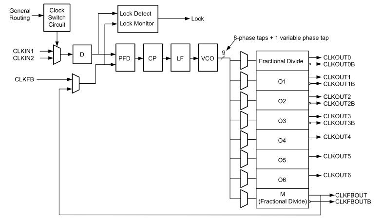

Digital Phase Locked Loop (PLL)
~~~~~~~~~~~~~~~~~~~~~~~~~~~~~~~~~~~~~
Phase-locked loops (PLLs) are primarily used for frequency synthesis. Multiple clock signals can be generated from one input clock signal using one PLL. Compared with MMCM, it cannot perform clock deskew, does not have advanced phase adjustment, and the adjustable range of frequency multiplier and frequency divider is small.
The PLL functional block diagram is shown in the figure below:

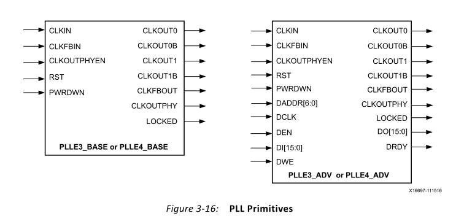

If you want to know more about clocking resources, I suggest you take a look at the document "7 Series FPGAs Clocking Resources User Guide" provided by Xilinx.

5.2 Create a Vivado project
==========================================
In this experiment, we will demonstrate how to use the PLL IP core provided by Xilinx to generate clocks of different frequencies, and output one of the clocks to the external IO of the FPGA. The following are the detailed steps of the program design.

1) Create a new pll_test project, click IP Catalog under the Project Manager interface.

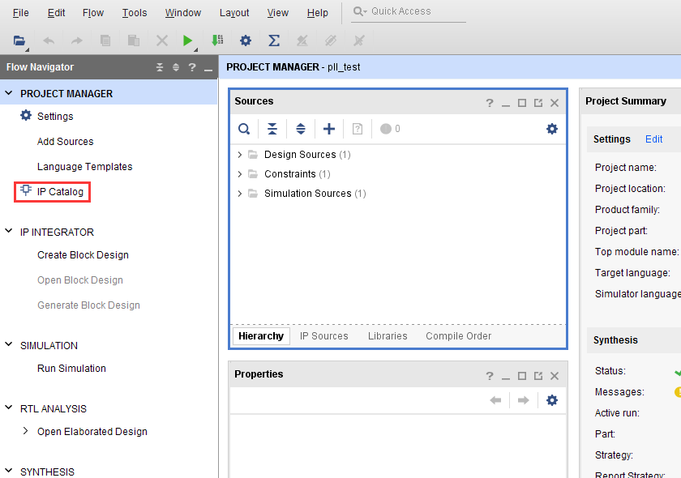

2) In the IP Catalog interface, select Clocking Wizard under FPGA Features and Design\Clocking, and double-click to open the configuration interface.

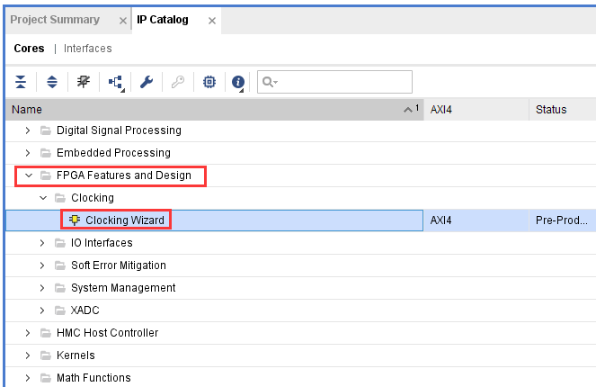
 
3) The name of this Clocking Wizard is clk_wiz_0 by default, we will not modify it here. In the first interface Clocking Options, the input clock frequency is 200Mhz, and Differential clock capable pin is selected, because the clock input is differential.

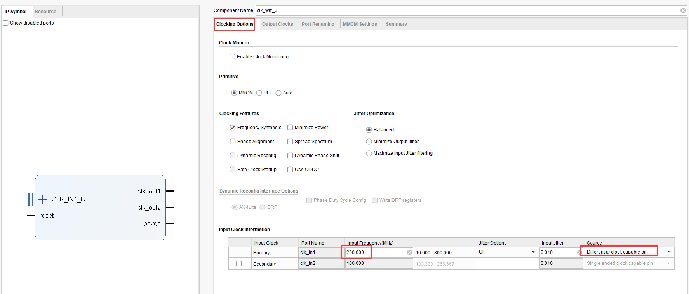

4) Select clk_out1~clk_out4 four clock outputs in the Output Clocks interface, the frequencies are 200Mhz, 100Mhz, 50Mhz, 25Mhz respectively. Here you can also set the phase of the clock output, we do not set, keep the default phase, click OK to complete,

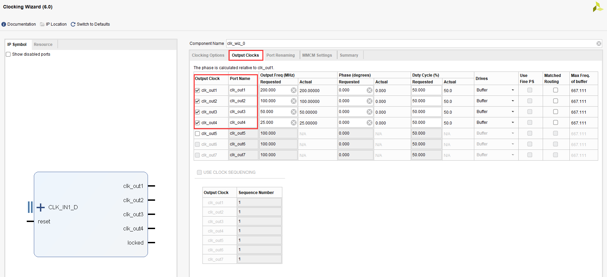
 
5) Click the Generate button in the pop-up dialog box to generate the design file of the PLL IP.

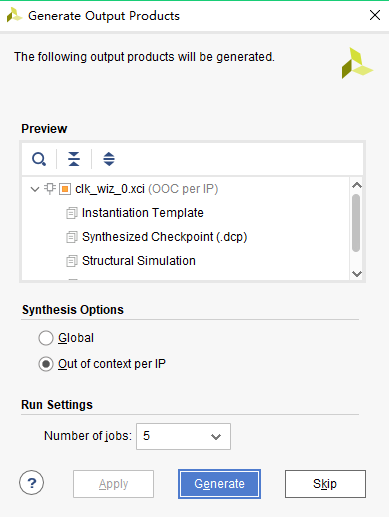
 
6) At this time, an IP of clk_wiz_0.xci will be automatically added to our pll_test project, and users can double-click it to modify the configuration of this IP.

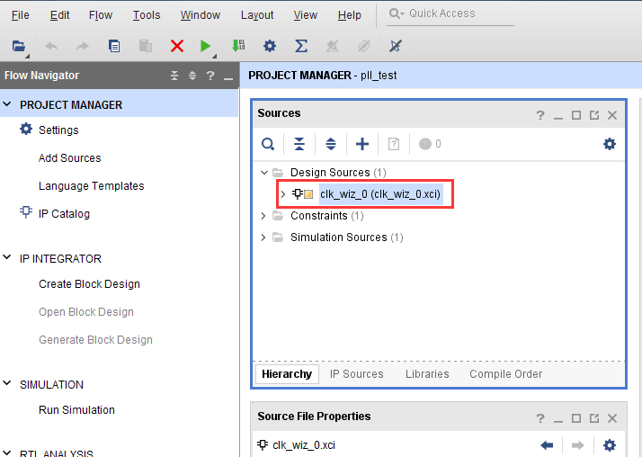
 
Select the IP Sources page, and then double-click to open the clk_wiz_0.veo file, which provides the instantiation template of this IP. We only need to copy the contents of the box to our verilog program and instantiate the IP.

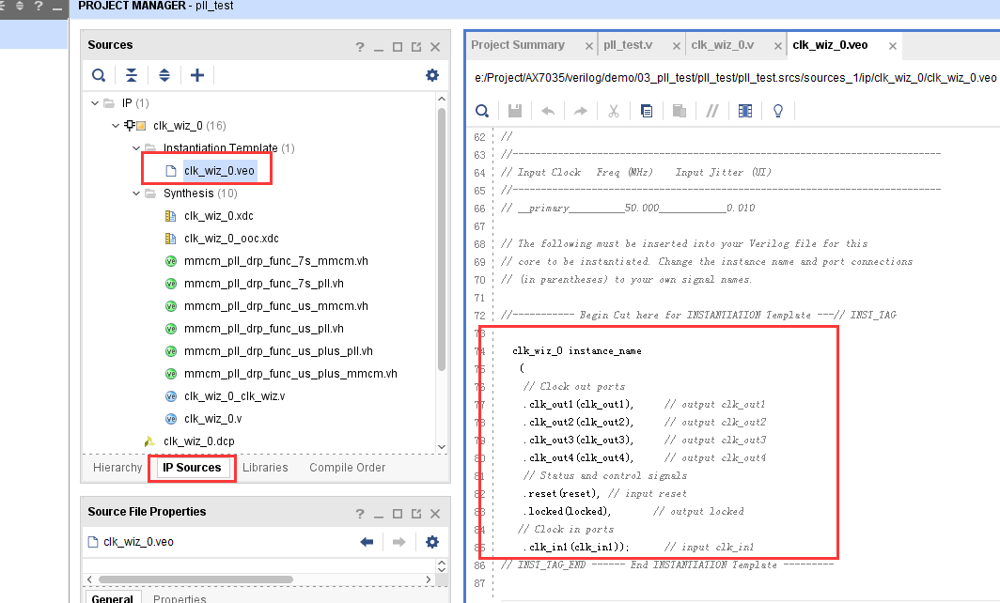
 
7) Let's write a top-level design file to instantiate this PLL IP, and write the pll_test.v code as follows. Note that the reset of the PLL is active high, that is, it is always in the reset state when the high level is high, and the PLL will not work, which many novices will ignore. Here we bind rst_n to a button, and the button is a low-level reset, so it needs to be connected to the reset of the PLL in reverse.
 
 `timescale 1ns / 1ps
 module pll_test(
 input      sys_clk_p,            //system clock 200Mhz on board
 input      sys_clk_n,            //system clock 200Mhz on board
 input       rst_n,             //reset ,low active
 output      clk_out           //pll clock output 
 
     );
     
 wire        locked;
     
 clk_wiz_0 clk_wiz_0_inst
        (
         // Clock out ports
         .clk_out1(),     // output clk_out1
         .clk_out2(),     // output clk_out2
         .clk_out3(),     // output clk_out3
         .clk_out4(clk_out),     // output clk_out4
         // Status and control signals
         .reset(~rst_n), // input reset
         .locked(locked),       // output locked
        // Clock in ports
         .clk_in1_p(sys_clk_p),    // input clk_in1_p
         .clk_in1_n(sys_clk_n));    // input clk_in1_n
 
 endmodule

In the program, first instantiate clk_wiz_0, input the differential 200Mhz clock signal to clk_in1_p and clk_in1_n of clk_wiz_0, and assign the output of clk_out4 to clk_out.

*Note: The purpose of instantiation is to call the instantiated module in the upper-level module to complete the code function. The format of the instantiation signal in Verilog is as follows: the module name must be consistent with the name of the module to be instantiated, such as clk_wiz_0 in the program , including module signal names must also be consistent, such as clk_in1, clk_out1, clk_out2..... The connection signal is the signal transmitted between the TOP program and the module, and the connection signals between modules cannot conflict with each other, otherwise compilation errors will occur. *

8) After saving the project, pll_test automatically becomes the top file, and clk_wiz_0 becomes a submodule of the Pll_test file.

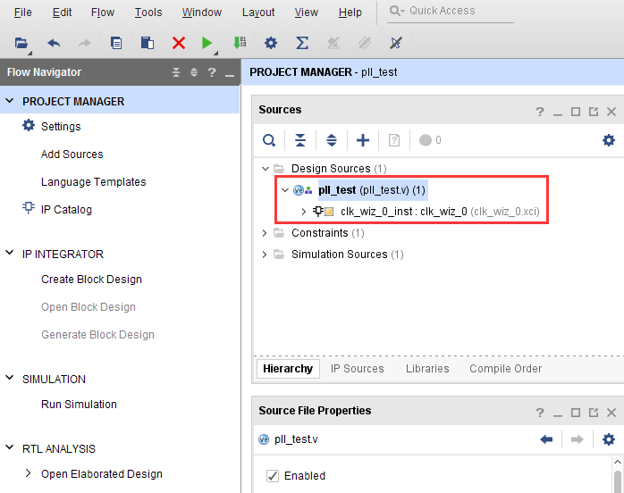

9) Add the xdc pin constraint file pll.xdc to the project. For the adding method, refer to "PL's "Hello World" LED Experiment", or you can directly copy the following content. And compile and generate bitstream.
    
::

  ###################Compress Bitstream##############################
  set_property BITSTREAM.GENERAL.COMPRESS TRUE [current_design]
 
  set_property PACKAGE_PIN AE5 [get_ports sys_clk_p]
  set_property IOSTANDARD DIFF_SSTL12 [get_ports sys_clk_p]
 
  create_clock -period 5.000 -name sys_clk_p -waveform {0.000 2.500} [get_ports sys_clk_p]
 
  set_property PACKAGE_PIN AF12 [get_ports rst_n]
  set_property IOSTANDARD LVCMOS33 [get_ports rst_n]
 
  set_property PACKAGE_PIN AG11 [get_ports clk_out]
  set_property IOSTANDARD LVCMOS33 [get_ports clk_out]

5.3 Simulation
==========================================
Add a vtf_pll_test simulation file. After running, the PLL lock signal will become high, indicating that the PLL IP phase-locked loop has been initialized. clk_out has a clock signal output, and the output frequency is 1/8 of the input clock frequency, which is 25Mhz. The simulation method can refer to "PL's "Hello World" LED experiment".

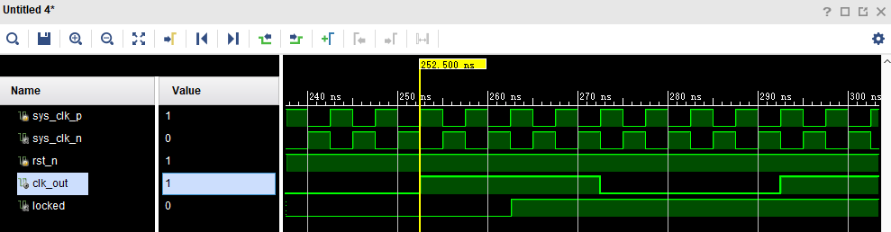
 

5.4 On-Board Verification
==========================================
Compile the project and generate the pll_test.bit file, then download the bit file to the FPGA, then we can use an oscilloscope to measure the output clock waveform.
Connect the ground wire of the oscilloscope probe to the ground of the development board (PIN1 pin of the development board J46), and connect the signal end to the PIN3 pin of the development board J46 (care should be taken when measuring, to avoid the oscilloscope probe touching other pins and causing power failure). shorted to ground).
At this time, we can see the 25Mhz clock waveform in the oscilloscope, the amplitude of the waveform is 3.3V, and the duty ratio is 1:1. The waveform display is as shown in the figure below:

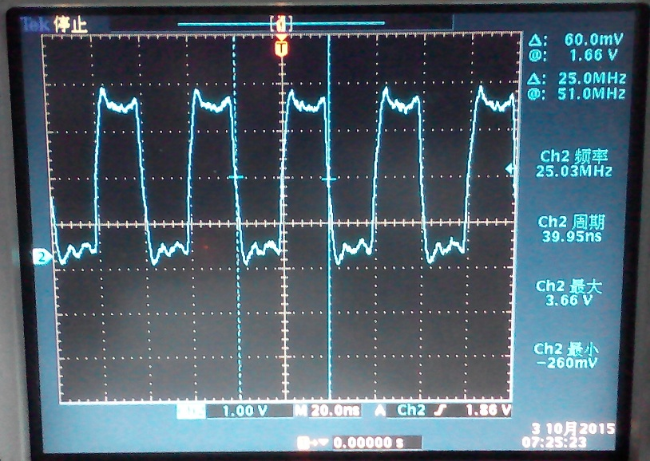
 
If you want to output waveforms of other frequencies, you can modify the clock output to clk_out2 or clk_out3 or clk_out4 of clk_wiz_0. You can also modify the clk_out4 of clk_wiz_0 to the frequency you want. You also need to pay attention here, because the output of the clock is obtained by multiplying and dividing the frequency of the input clock signal by the PLL, so not all clock frequencies are available. It can be accurately generated by PLL, but PLL will automatically calculate the clock frequency close to the actual output for you.
In addition, it should be noted that the bandwidth and sampling rate of some users' oscilloscopes are too low, which will cause the high-frequency part to attenuate too much when measuring high-frequency clock signals, and the amplitude of the measured waveform will become lower.

.. image:: images/images_0/888.png

*ZYNQ MPSoC Development Platform FPGA Tutorial* - `Alinx Official Website <http://www.alinx.com>`_