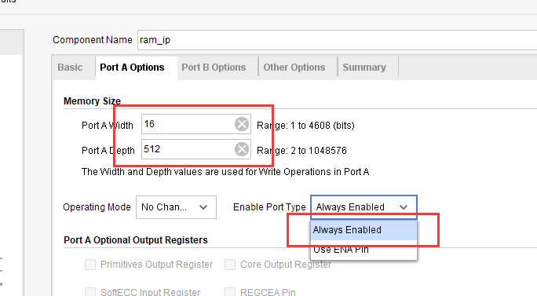
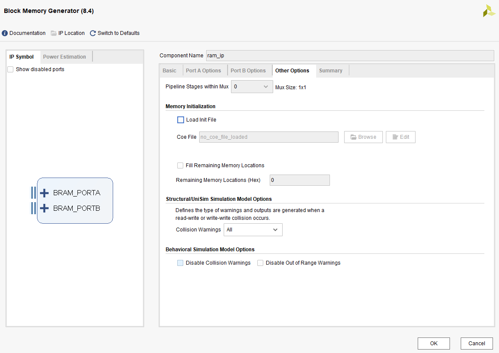
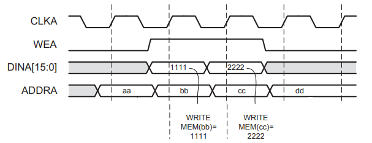
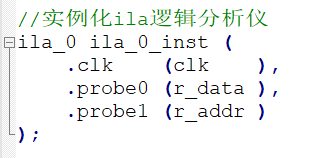
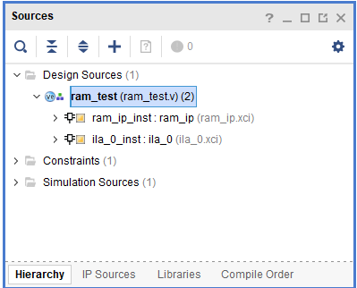

.. image:: images/images_0/88.png  

========================================
"Chapter 6" FPGA on-chip RAM test experiment
========================================
**Experimental Vivado project is "ram_test"**

RAM is a commonly used basic module in FPGA, which can be widely used in caching data, and it is also the basis of ROM and FIFO. This experiment will introduce how to use the RAM inside the FPGA and the data read and write operations of the program.

6.1 Experimental principle
============================================
Xilinx has provided us with the IP core of RAM in VIVADO, we only need to instantiate a RAM through the IP core, and write and read the data stored in RAM according to the read and write timing of RAM. In the experiment, we will use the online logic analyzer ILA integrated by VIVADO, we can observe the read and write timing of RAM and the data read from RAM.

6.2 Create a Vivado project
============================================
Before adding RAM IP, create a new ram_test project, and then add RAM IP to the project, as follows:

1. Click IP Catalog in the figure below, search for RAM in the interface that pops up on the right, find Block Memory Generator, and double-click to open it.

.. image:: images/images_6/1.png
    :align: center
   
2. Change Component Name to ram_ip, and under the Basic column, change Memory Type to Simple Dual Port RAM, that is, pseudo dual-port RAM. Generally speaking, "Simple Dual Port RAM" is the most commonly used, because it is two ports, the input and output signals are independent.

.. image:: images/images_6/2.png
    :align: center

3. Switch to the Port A Options column, and change the RAM bit width Port A Width to 16, which is the data width. Change the RAM depth Port A Depth to 512, the depth refers to how much data can be stored in the RAM. Change the enable pin Enable Port Type to Always Enable.

4. Switch to the Port B Options column, change the RAM bit width Port B Width to 16, enable the pin Enable Port Type to Always Enable, of course, you can also use ENB Pin, which is equivalent to reading the enable signal. The Primitives Output Register is unchecked. Its function is to add a register to the output data, which can effectively improve the timing, but the read data will lag behind the address by two cycles. In many cases, this feature is not enabled, keeping the data one cycle behind the address.

.. image:: images/images_6/4.png
    :align: center

5. In the Other Options column, it is not necessary to initialize the RAM data like ROM, we can write in the program, so configure the default, just click OK.

6. Click “Generate” to generate RAM IP.

.. image:: images/images_6/6.png
    :align: center

6.3 RAM port definition and timing
============================================
The Simple Dual Port RAM module ports are described as follows:
==============
::

 Signal name   Direction      Description
 clka          in             port A clock input
 wea           in             port A enabled
 addra         in             port A address input
 dina          in             port A data input
 clkb          in             port B clock input
 addrb         in             port B address input
 doutb         out            port B data output

The data writing and reading of RAM are all operated according to the rising edge of the clock. When the port A data is written, the wea signal needs to be set high, and the address and the data to be written are provided at the same time. The following figure shows the timing diagram of input writing to RAM.

**RAM write timing**
Port B cannot write data, but can only read data from RAM, as long as the address is provided, and in general, valid data can be collected in the next cycle.

.. image:: images/images_6/8.png
    :align: center

**RAM read timing**

6.4 Test program writing
============================================

The following is the writing of the RAM test program. Due to the function of testing the RAM, we write a series of continuous data to the port A of the RAM, write only once, and read it from the port B, and use the logic analyzer to view the data. code show as below
::

 `timescale 1ns / 1ps
 //////////////////////////////////////////////////////////////////////////////////
 module ram_test(
 input      sys_clk_p,              //system clock 200Mhz on board
 input      sys_clk_n,              //system clock 200Mhz on board
 input      rst_n                   //reset signal, active low
                );
 reg        [8:0]       w_addr;     //RAM PORTA write address
 reg        [15:0]      w_data;     //RAM PORTA write data
 reg                    wea;        //RAM PORTA enable
 reg        [8:0]       r_addr;     //RAM PORTB read address
 wire       [15:0]      r_data;     //RAM PORTB read data
 wire clk ;
    IBUFDS IBUFDS_inst (
       .O(clk),                     // Buffer output
       .I(sys_clk_p),               // Diff_p buffer input (connect directly to top-level port)
       .IB(sys_clk_n)               // Diff_n buffer input (connect directly to top-level port)
    );
 //Generate RAM PORTB read address
 always @(posedge clk or negedge rst_n)
 begin
   if(!rst_n)
        r_addr <= 9'd0;
   else if (|w_addr)                //w_addr bit or, not equal to 0
     r_addr <= r_addr+1'b1;
   else
        r_addr <= 9'd0;
 end
 // Generate RAM PORTA write enable signal
 always@(posedge clk or negedge rst_n)
 begin
   if(!rst_n)
          wea <= 1'b0;
   else
   begin
      if(&w_addr)                   //The bits of w_addr are all 1, a total of 512 data are written, and the  writing is completed
         wea <= 1'b0;
      else
         wea    <= 1'b1;            //ram write enable
   end
 end
 //Generate the address and data written by RAM PORTA
 always@(posedge clk or negedge rst_n)
 begin
   if(!rst_n)
   begin
          w_addr <= 9'd0;
          w_data <= 16'd1;
   end
   else
   begin
      if(wea)                                   //ram write enable is valid
         begin
                if (&w_addr)                    //The bits of w_addr are all 1, a total of 512 data are written,  and the writing is completed
                begin
                        w_addr <= w_addr ;      //Keep the value of address and data, and only write to RAM  once
                        w_data <= w_data ;
                end
                else
                begin
                        w_addr <= w_addr + 1'b1;
                        w_data <= w_data + 1'b1;
                end
         end
   end
 end
 //Instantiate RAM
 ram_ip ram_ip_inst (
   .clka      (clk          ),     // input clka
   .wea       (wea          ),     // input  [0 : 0]  wea
   .addra     (w_addr       ),     // input  [8 : 0]  addra
   .dina      (w_data       ),     // input  [15 : 0] dina
   .clkb      (clk          ),     // input           clkb
   .addrb     (r_addr       ),     // input  [8 : 0]  addrb
   .doutb     (r_data       )      // output [15 : 0] doutb
 );
 //Instantiate ILA logic analyzer
 ila_0 ila_0_inst (
        .clk    (clk    ),
        .probe0 (r_data ),
        .probe1 (r_addr )
 );
 endmodule

In order to see the data value read in RAM in real time, we have added the ILA tool to observe the data signal and address signal of RAM PORTB. For how to generate ILA, please refer to "PL's "Hello World" LED Experiment".

The program structure is as follows:

binding pin
::

 ##################Compress Bitstream############################
 set_property BITSTREAM.GENERAL.COMPRESS TRUE [current_design]
 set_property PACKAGE_PIN AE5 [get_ports sys_clk_p]
 set_property IOSTANDARD DIFF_SSTL12 [get_ports sys_clk_p]
 create_clock -period 5.000 -name sys_clk_p -waveform {0.000 2.500} [get_ports sys_clk_p]
 set_property PACKAGE_PIN AF12 [get_ports rst_n]
 set_property IOSTANDARD LVCMOS33 [get_ports rst_n]

6.5 Simulation
============================================
The simulation method refers to "PL's "Hello World" LED experiment". The simulation results are as follows. From the figure, it can be seen that the data written in address 1 is 0002. In the next cycle, that is, at time 2, valid data is read out.

.. image:: images/images_6/11.png
    :align: center

6.6 On-Board Verification
============================================
Generate bitstream, and download the bit file to FPGA. Next, we use ILA to observe whether the data read from RAM is the data we initialized.
Set the address of r_addr to 0 in the Waveform window as the trigger condition. We can see that r_addr is continuously accumulating from 0 to 1ff. With the change of r_addr, r_data is also changing. The data of r_data is exactly what we wrote into RAM There are 512 data. It should be noted here that when a new address appears in r_addr, the data corresponding to r_data will appear after a delay of two clock cycles. The data appears two clock cycles later than the address, which is consistent with the simulation results.

.. image:: images/images_6/12.png
    :align: center

.. image:: images/images_0/888.png

*ZYNQ MPSoC Development Platform FPGA Tutorial* - `Alinx Official Website <https://www.alinx.com/en>`_