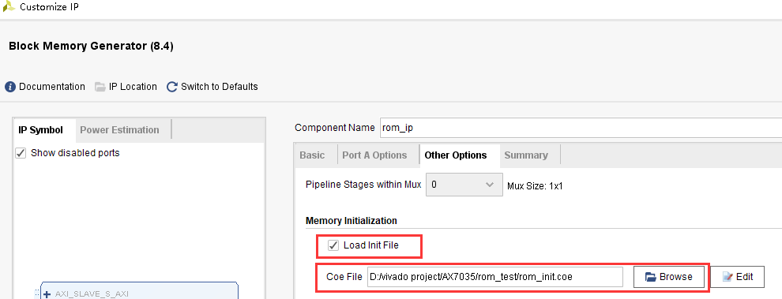

.. image:: images/images_0/88.png

============================================
"Chapter 7" FPGA on-chip ROM test experiment
============================================
**Experimental Vivado project is "rom_test".**

The FPGA itself is based on the SRAM architecture. After the power is turned off, the program disappears. So how to use the FPGA to implement a ROM? We can use the RAM resources inside the FPGA to implement the ROM, but it is not a ROM in the true sense. Write the initialized value into RAM first. This experiment will introduce how to use the ROM inside the FPGA and the data read operation of the ROM by the program.

7.1 Experimental principle
============================================
Xilinx has provided us with the ROM IP core in VIVADO, we only need to instantiate a ROM through the IP core, and read the data stored in the ROM according to the read timing of the ROM. In the experiment, we will use the online logic analyzer ILA integrated by VIVADO, we can observe the read timing of ROM and the data read from ROM.

7.2 Program design
============================================
7.2.1 Create ROM initialization file
----------------------------------------
Since it is a ROM, we must prepare data for it in advance, and then when the FPGA is actually running, we can directly read the pre-stored data in these ROMs. The on-chip ROM of Xilinx FPGA supports initialization data configuration. As shown in the figure below, we can create a file named rom_init.coe, note that the suffix must be ".coe", and the previous name can of course be arbitrary.

The content format of the ROM initialization file is very simple, as shown in the figure below. The first line defines the data format, 16 means the data format of ROM is hexadecimal. From the 3rd line to the 34th line, it is the initialization data of this 32*8bit size ROM. Use a comma after each line of numbers, and a semicolon at the end of the last line of numbers.

.. image:: images/images_7/image2.png
    :align: center

After the rom_init.coe is written, save it, and then we start to design and configure the ROM IP core.

7.2.2 Add ROM IP core
---------------------------------------
Before adding ROM IP, create a new rom_test project, and then add ROM IP to the project, the method is as follows:
1) Click IP Catalog in the figure below, search for rom in the interface that pops up on the right, find Block Memory Generator, and double-click to open it.

.. image:: images/images_7/image3.png
    :align: center

2) Change Component Name to rom_ip, and under the Basic column, change Memory Type to Single Prot ROM.

.. image:: images/images_7/image4.png
    :align: center

3) Switch to the Port A Options column, change the ROM bit width Port A Width to 8, change the ROM depth Port A Depth to 32, enable the pin Enable Port Type to Always, and cancel the Primitives Output Register

.. image:: images/images_7/image5.png
    :align: center

4) Under the Options column, check Load Init File, click Browse, and select the previously created .coe file.

5) Click ok, click Generate to generate the ip core.

.. image:: images/images_7/image7.png
    :align: center

7.3 ROM test program writing
============================================
The program design of ROM is very simple. In the program, as long as we change the address of ROM every clock, ROM will output the internal storage data of the current address and instantiate ILA to observe the changes of address and data. The instantiation and program design of ROM IP are as follows:
::

 `timescale 1ns / 1ps
 
 module rom_test(
   input    sys_clk_p,        //system clock 200Mhz postive pin
   input    sys_clk_n,        //system clock 200Mhz negetive pin 
   input    rst_n             //Reset, active low
     );
 
 wire    [7:0] rom_data;      //ROM read data
 reg     [4:0] rom_addr;      //ROM input address
 
 wire sys_clk ;
 
 IBUFDS IBUFDS_inst (
    .O(sys_clk),     // Buffer output
    .I(sys_clk_p),   // Diff_p buffer input (connect directly to top-level port)
    .IB(sys_clk_n)   // Diff_n buffer input (connect directly to top-level port)
 );
 
 //Generate ROM address to read data
 always @ (posedge sys_clk or negedge rst_n)
 begin
     if(!rst_n)
         rom_addr <= 10'd0;
     else
         rom_addr <= rom_addr+1'b1;
 end        
 //Instantiating ROM
 rom_ip rom_ip_inst
 (
     .clka   (sys_clk    ),      //inoput clka
     .addra  (rom_addr   ),      //input [4:0] addra
     .douta  (rom_data   )       //output [7:0] douta
 );
 //Instantiated logic analyzer
 ila_0 ila_m0
 (
     .clk    (sys_clk),
     .probe0 (rom_addr),
 	.probe1 (rom_data)
 );
 
 endmodule

binding pin
::

 ##################Compress Bitstream############################
 set_property BITSTREAM.GENERAL.COMPRESS TRUE [current_design]
 set_property PACKAGE_PIN AE5 [get_ports sys_clk_p]
 set_property IOSTANDARD DIFF_SSTL12 [get_ports sys_clk_p]
 create_clock -period 5.000 -name sys_clk_p -waveform {0.000 2.500} [get_ports sys_clk_p]
 set_property PACKAGE_PIN AF12 [get_ports rst_n]
 set_property IOSTANDARD LVCMOS33 [get_ports rst_n]

7.4 Simulation
============================================
The simulation results are as follows, which is in line with expectations. Like the read data of RAM, the data also lags behind the address by one cycle.

.. image:: images/images_7/image8.png
    :align: center

7.5 On-Board Verification
============================================
Taking address 0 as the trigger condition, it can be seen that the read data is consistent with the simulation.

.. image:: images/images_7/image9.png
    :align: center

.. image:: images/images_0/888.png

*ZYNQ MPSoC Development Platform FPGA Tutorial* - `Alinx Official Website <https://www.alinx.com/en>`_