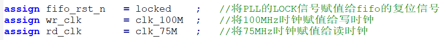
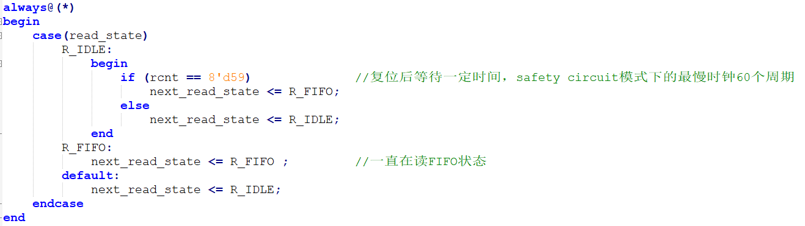
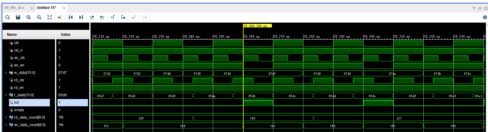
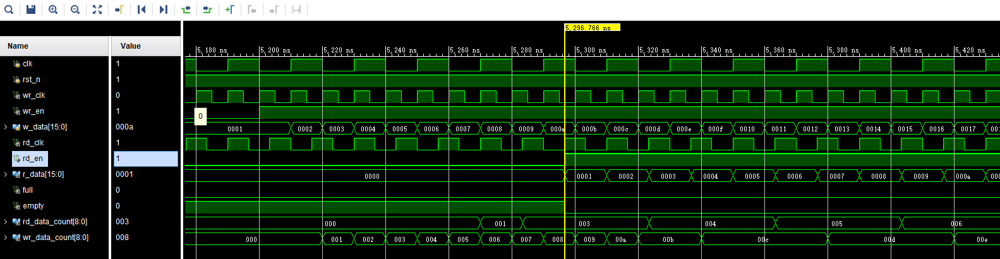
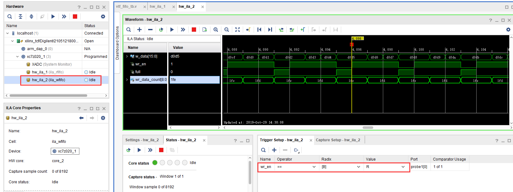

.. image:: images/images_0/88.png  
============================================
"Chapter 8" FPGA on-chip FIFO read and write test experiment
============================================
**Experimental Vivado project is "fifo_test".**

FIFO is a very important module in FPGA applications, widely used in data buffering, data processing across clock domains, etc. Learning FIFO well is the key to FPGA, and using FIFO flexibly is an essential skill for an FPGA engineer. This chapter mainly introduces the use of FIFO IP provided by XILINX for reading and writing tests.

8.1 Experimental principle
============================================
FIFO: First in, First out means that the advanced data goes out first, and the last data goes out last. Xilinx has provided us with the FIFO IP core in VIVADO, we only need to instantiate a FIFO through the IP core, and write and read the data stored in the FIFO according to the read and write timing of the FIFO.

In fact, FIFO also adds many functions on the basis of RAM. The typical structure of FIFO is as follows, which is mainly divided into two parts: read and write. In addition, there are status signals, empty and full signals, and data quantity status signals. The biggest difference is that FIFO has no address line, and it cannot read data at random addresses. What is random read data, that is, data at a certain address can be read arbitrarily. The FIFO is different and cannot be read randomly. The advantage of this is that it does not need to control the address line frequently.

Although the user cannot see the address line, there is still an address operation inside the FIFO, which is used to control the read and write interface of the RAM. Its address is shown in the figure below during read and write operations, and the depth value is the maximum number of data that can be stored in a FIFO. In the initial state, the read and write addresses are both 0. After writing a piece of data into the FIFO, add 1 to the write address, and after reading out a piece of data from the FIFO, add 1 to the read address. At this time, the state of the FIFO is empty, because one data is written and another data is read out.

.. image:: images/images_8/image2.png
    :align: center

FIFO can be imagined as a pool. Writing channels is adding water, and reading channels is releasing water. If water is added and released continuously, if the speed of adding water is faster than the speed of water release, then FIFO will fill up. If it is full, and water is continuesly added it will overflow. If the speed of water release is faster than the speed of adding water, then the FIFO will be free. Therefore, it is a very difficult task to grasp the timing and speed of adding water and releasing water to ensure that there is always water in the pool. That is to judge the state of empty and full, choose the opportunity to write data or read data.

According to the read and write clock, it can be divided into synchronous FIFO (same read and write clock) and asynchronous FIFO (different read and write clock). Synchronous FIFO control is relatively simple, no longer introduced, this section of the experiment mainly introduces the control of asynchronous FIFO, in which the read clock is 75MHz, and the write clock is 100MHz. In the experiment, we will use VIVADO integrated logic analyzer ILA, we can observe the read and write timing of FIFO and the data read from FIFO.

8.2 Create a Vivado project
============================================

8.2.1 Add FIFO IP core
----------------------------------------

Before adding FIFO IP, create a fifo_test project, and then add FIFO IP to the project, as follows:

1) Click IP Catalog in the figure below, search for fifo in the interface that pops up on the right, find FIFO Generator, and double-click to open it.

.. image:: images/images_8/image3.png
    :align: center

2) In the configuration page that pops up, you can choose to use the read and write clock separately or use the same one. Generally speaking, we use FIFO to cache data, and usually the clock speeds on both sides are different. So the independent clock is the most commonly used, here we select "Independent Clocks Block RAM", and then click "Next" to go to the next configuration page.

3) Switch to the Native Ports column, select the data bit width of 16, the FIFO depth of 512, you can set it yourself according to your needs in actual use. There are two modes of Read Mode, a Standard FIFO, which is a common FIFO, and the data lags behind the read signal by one cycle, and another mode is First Word Fall Through, data prefetch mode, referred to as FWFT mode. That is to say, FIFO will take out a data in advance, and when the read signal is valid, the corresponding data is also valid. We first do experiments with standard FIFOs.

.. image:: images/images_8/image5.png
    :align: center

1) Switch to the Data Counts column, enable Write Data Count (how much data has been written into the FIFO) and Read Data Count (how much data in the FIFO can be read), so that we can see how much data is inside the FIFO through these two values. Click OK, Generate to generate FIFO IP.

.. image:: images/images_8/image6.png
    :align: center

8.2.2 FIFO port definition and timing
-------------------------------------

.. csv-table:: 
  :header: "Signal name", "Direction", "Description"
  :widths: 30, 30, 50

  "rst	            ",in	,"Reset signal, active high"
  "wr_clk	        ",in	,"Write clock input"
  "rd_clk	        ",in	,"Read clock input"
  "din	            ",in	,"Write data"
  "wr_en	        ",in	,"Write enable, active high"
  "rd_en	        ",in	,"Read enable, active high"
  "dout	            ",out	,"Read data"
  "full	            ",out	,"Full signal"
  "empty	        ",out	,"Empty signal"
  "rd_data_count	",out	,"Number of readable data"
  "wr_data_count	",out	,"Amount of data written"

The data writing and reading of FIFO are operated according to the rising edge of the clock. When the wr_en signal is high, the FIFO data is written. When the almost_full signal is valid, it means that the FIFO can only write one more data. Once a data is written , the full signal will be pulled high. If wr_en is still valid in the case of full, that is, continue to write data to the FIFO, the overflow of the FIFO will be valid, indicating overflow.

**Standard FIFO write timing**
When the rd_en signal is high, read FIFO data, and the data is valid in the next cycle. valid is a data valid signal, almost_empty means that there is still a data read, when another data is read, the empty signal is valid, if you continue to read, underflow is valid, indicating underflow, and the data read at this time is invalid.

.. image:: images/images_8/image8.png
    :align: center

**Standard FIFO read timing**

From the timing diagram of reading data in FWFT mode, it can be seen that when the rd_en signal is valid, the valid data D0 is ready to be valid on the data line, and it will not be delayed by another cycle. This is where it differs from a standard FIFO.

.. image:: images/images_8/image9.png
    :align: center

**FWFT FIFO read timing**

For details about FIFO, please refer to the pg057 document, which can be downloaded from the Xilinx official website.

8.3 FIFO test program writing
============================================
We design according to the asynchronous FIFO, and use PLL to generate two clocks, 100MHz and 75MHz, respectively, for writing clock and reading clock, that is, the writing clock frequency is higher than the reading clock frequency.
::

 `timescale 1ns / 1ps
 module fifo_test
 	(
 		input		sys_clk_p,				//system clock 200Mhz postive pin
 		input		sys_clk_n,				//system clock 200Mhz negetive pin 
 		input		rst_n					//Reset signal, active low
 	); 
 
 reg		[15:0]		w_data;					//FIFO write data
 wire				wr_en;					//FIFO write enable
 wire				rd_en;					//FIFO read enable
 wire		[15:0]		r_data;					//FIFO read data
 wire				full;					//FIFO full signal
 wire				empty;					//FIFO empty signal
 wire		[8:0]		rd_data_count;				//Number of readable data
 wire		[8:0]		wr_data_count;				//Amount of written data
 	
 wire				clk_100M;				//PLL generates 100MHz clock
 wire				clk_75M;				//PLL generates 75MHz clock
 wire				locked;					//PLL lock signal, can be used as system reset signal, high level means lock
 wire				fifo_rst_n;				//FIFO reset signal, active low
 
 wire				wr_clk;					//Write FIFO Clock
 wire				rd_clk;					//Read FIFO clock
 reg		[7:0]		wcnt;					//Wait counter after write FIFO reset
 reg		[7:0]		rcnt;					//Wait counter after read FIFO reset
 
 //Instantiate PLL to generate 100MHz and 75MHz clock
 clk_wiz_0 fifo_pll
  (
   // Clock out ports
   .clk_out1(clk_100M),			// output clk_out1
   .clk_out2(clk_75M),			// output clk_out2
   // Status and control signals
   .reset(~rst_n),				// input reset
   .locked(locked),				// output locked
   // Clock in ports
   .clk_in1_p(sys_clk_p),		// input clk_in1
   .clk_in1_n(sys_clk_n)		// input clk_in1
   );     			
 
 assign fifo_rst_n 	= locked	;	//Assign the LOCK signal of the PLL to the reset signal of the FIFO
 assign wr_clk 		= clk_100M 	;	//Assign 100MHz clock to write clock
 assign rd_clk 		= clk_75M 	;	//Assign the 75MHz clock to the read clock
 
 
 /* Write FIFO state machine */
 localparam      W_IDLE      = 1	;
 localparam      W_FIFO     	= 2	; 
 
 reg[2:0]  write_state;
 reg[2:0]  next_write_state;
 
 always@(posedge wr_clk or negedge fifo_rst_n)
 begin 
 	if(!fifo_rst_n)
 		write_state <= W_IDLE;
 	else
 		write_state <= next_write_state;
 end
 
 always@(*)
 begin
 	case(write_state)
 		W_IDLE:
 			begin
 				if(wcnt == 8'd79)               //Wait for a certain time after reset, the slowest clock in safety circuit mode is 60 cycles
 					next_write_state <= W_FIFO;
 				else
 					next_write_state <= W_IDLE;
 			end
 		W_FIFO:
 			next_write_state <= W_FIFO;			//Always writing FIFO status
 		default:
 			next_write_state <= W_IDLE;
 	endcase
 end
 //In the IDLE state, that is, after reset, the counter counts
 always@(posedge wr_clk or negedge fifo_rst_n)
 begin 
 	if(!fifo_rst_n)
 		wcnt <= 8'd0;
 	else if (write_state == W_IDLE)
 		wcnt <= wcnt + 1'b1 ;
 	else
 		wcnt <= 8'd0;
 end
 //In the state of writing FIFO, if it is not full, write data to FIFO
 assign wr_en = (write_state == W_FIFO) ? ~full : 1'b0; 
 //When the write enable is valid, the write data value is increased by 1
 always@(posedge wr_clk or negedge fifo_rst_n)
 begin
 	if(!fifo_rst_n)
 		w_data <= 16'd1;
 	else if (wr_en)
 		w_data <= w_data + 1'b1;
 end
 
 /* Read FIFO state machine */
 
 localparam      R_IDLE      = 1	;
 localparam      R_FIFO     	= 2	; 
 reg[2:0]  read_state;
 reg[2:0]  next_read_state;
 
 ///Generate FIFO read data
 always@(posedge rd_clk or negedge fifo_rst_n)
 begin
 	if(!fifo_rst_n)
 		read_state <= R_IDLE;
 	else
 		read_state <= next_read_state;
 end
 
 always@(*)
 begin
 	case(read_state)
 		R_IDLE:
 			begin
 				if (rcnt == 8'd59)             	//Wait for a certain time after reset, the slowest clock in safety circuit mode is 60 cycles
 					next_read_state <= R_FIFO;
 				else
 					next_read_state <= R_IDLE;
 			end
 		R_FIFO:	
 			next_read_state <= R_FIFO ;			//Always reading FIFO status
 		default:
 			next_read_state <= R_IDLE;
 	endcase
 end
 
 //In the IDLE state, that is, after reset, the counter counts
 always@(posedge rd_clk or negedge fifo_rst_n)
 begin 
 	if(!fifo_rst_n)
 		rcnt <= 8'd0;
 	else if (write_state == W_IDLE)
 		rcnt <= rcnt + 1'b1 ;
 	else
 		rcnt <= 8'd0;
 end
 //In the state of reading FIFO, if it is not empty, read data from FIFO
 assign rd_en = (read_state == R_FIFO) ? ~empty : 1'b0; 
 
 //Instantiate FIFO
 fifo_ip fifo_ip_inst 
 (
   .rst            (~fifo_rst_n    	),   // input rst
   .wr_clk         (wr_clk          	),   // input wr_clk
   .rd_clk         (rd_clk          	),   // input rd_clk
   .din            (w_data       	),   // input [15 : 0] din
   .wr_en          (wr_en        	),   // input wr_en
   .rd_en          (rd_en        	),   // input rd_en
   .dout           (r_data       	),   // output [15 : 0] dout
   .full           (full         	),   // output full
   .empty          (empty        	),   // output empty
   .rd_data_count  (rd_data_count	),   // output [8 : 0] rd_data_count
   .wr_data_count  (wr_data_count	)    // output [8 : 0] wr_data_count
 );
 
 //Write Channel Logic Analyzer
 ila_m0 ila_wfifo (
 	.clk(wr_clk), 
 	.probe0(w_data), 	
 	.probe1(wr_en), 	
 	.probe2(full), 		
 	.probe3(wr_data_count)
 );
 //Read Channel Logic Analyzer
 ila_m0 ila_rfifo (
 	.clk(rd_clk), 
 	.probe0(r_data), 	
 	.probe1(rd_en), 	
 	.probe2(empty), 		
 	.probe3(rd_data_count)
 );
  	
 endmodule

In the program, the lock signal of the PLL is used as the reset of the fifo, and the 100MHz clock is assigned to the write clock, and the 75MHz clock is assigned to the read clock.

One thing to note is that the FIFO setting defaults to safety circuit. This function is to ensure that the input signal arriving at the internal RAM is synchronous. In this case, if it is reset asynchronously, it needs to wait for 60 slowest clock cycles. In this experiment, that is 60 cycles of 75MHz, then the 100MHz clock needs about (100/75)x60=80 cycles.

.. image:: images/images_8/image11.png
    :align: center

Therefore, in the write state machine, wait for 80 cycles to enter the write FIFO state

.. image:: images/images_8/image12.png
    :align: center

In the read state machine, wait 60 cycles to enter the read state

If the FIFO is not full, keep writing data to the FIFO

If the FIFO is not empty, keep reading data from the FIFO

.. image:: images/images_8/image15.png
    :align: center

Instantiate two logic analyzers and connect the signals of the write channel and the read channel respectively

.. image:: images/images_8/image16.png
    :align: center

8.4 Simulation
============================================
The following is the simulation result. It can be seen that the write enable wr_en starts to write data after it becomes effective. The initial value is 0001. It takes a certain period of time from the beginning of writing until empty is not empty, because the internal synchronization process is still required. After it is not empty, start to read data, and the read data lags one cycle relative to rd_en.

.. image:: images/images_8/image17.png
    :align: center

You can see later that if the FIFO is full, according to the design of the program, it will not write data to the FIFO when it is full, and wr_en will be lowered. Why is it full, because the write clock is faster than the read clock. If the write clock and the read clock are swapped, that is, the read clock is fast, there will be a read empty situation, you can try it.

If you change the Read Mode of FIFO to First Word Fall Through

.. image:: images/images_8/image19.png
    :align: center

The simulation results are as follows. It can be seen that the data is also valid when rd_en is valid, and there is no difference of one cycle

8.5 On-Board Verification
============================================
After generating the bit file and downloading the bit file, there will be two ILA. Let’s look at the write channel first. You can see that when the full signal is high, wr_en is low, and no more data will be written into it.

And the read channel is also consistent with the simulation

.. image:: images/images_8/image22.png
    :align: center

If you use the rising edge of rd_en as the trigger condition, click Run, and then press Reset, which is the PL KEY1 we bound, the following results will appear, which is consistent with the simulation. In standard FIFO mode, the data lags behind rd_en by one cycle.

.. image:: images/images_8/image23.png
    :align: center

.. image:: images/images_0/888.png

*ZYNQ MPSoC Development Platform FPGA Tutorial* - `Alinx Official Website <https://www.alinx.com/en>`_
