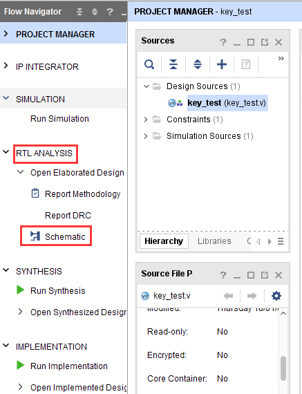

.. image:: images/images_0/88.png  
============================================
"Chapter Nine" Vivado Down Button Experiment
============================================
**Experimental Vivado project is "key_test".**

Keys are the most commonly used and simplest peripherals in FPGA design. This chapter uses key detection experiments to test whether the key functions of the development board are normal, and understand the specific relationship between hardware description language and FPGA, and learn the use of Vivado RTL ANALYSIS.

9.1 Button hardware circuit
============================================

.. image:: images/images_9/image1.png
    :align: center

AXU3EG/AXU4EV/AXU5EV development board key part circuit

It can be seen from the figure that when the button of the circuit is released, it is at a high level, and when it is pressed, it is at a low level.

AXU3EG/AXU4EV/AXU5EV development board LED part circuit

As for the LED part, the high level is on, and the low level is off.

9.2 Program design
============================================
This program is not designed to be very complicated, and the connection between the hardware description language and the FPGA hardware can be seen through the simple hardware description language. First, we pass the key input through a NOT gate and then through 2 sets of D flip-flops. The signal passing through the D flip-flop will be latched on the rising edge of the clock input of the D flip-flop and then sent to the output.

Before the hardware description language coding, we have completed the hardware construction, which is a normal development process. With the hardware design idea, the design can be completed no matter through drawing or through Verilog HDL, VHDL, and the tool is selected according to the complex program of the design and the familiar program of a certain language.

9.3 Create a Vivado project
============================================
1) Firstly, create a key test project, add verilog test code, and complete the process of compiling and assigning pins.

.. image:: images/images_9/image4.png
    :align: center

::

 `timescale 1ns / 1ps
 module key_test
 (
   input       sys_clk_p,        //system clock 200Mhz postive pin
   input       sys_clk_n,        //system clock 200Mhz negetive pin 
   input       key,              //input four key signal,when the keydown,the value is 0
   output      led               //LED display ,when the siganl low,LED lighten
 );
 
 reg led_r;           //define the first stage register, generate four D Flip-flop 
 reg led_r1;          //define the second stage register,generate four D Flip-flop
 
 wire clk ;
 
 IBUFDS IBUFDS_inst (
    .O(clk),         // Buffer output
    .I(sys_clk_p),   // Diff_p buffer input (connect directly to top-level port)
    .IB(sys_clk_n)   // Diff_n buffer input (connect directly to top-level port)
 );
 
 always@(posedge clk)
 begin
 	led_r <=  ~key;        //first stage latched data
 end
 
 always@(posedge clk)
 begin
 	led_r1 <= led_r;      //second stage latched data
 end
 
 assign led = led_r1;
 
 endmodule

2) We can use RTL ANALYSIS tool to view the design

3) Analyzing the RTL diagram, it can be seen that the first stage D flip-flop is input after inversion, and the second stage is directly input, which is consistent with the expected design.

9.4 On-Board Verification
============================================
After the Bit file is downloaded to the development board, the "PL LED" on the development board is off, and the button "PL KEY" is pressed and the "PL LED" is on.

.. image:: images/images_0/888.png

*ZYNQ MPSoC Development Platform FPGA Tutorial* - `Alinx Official Website <https://www.alinx.com/en>`_