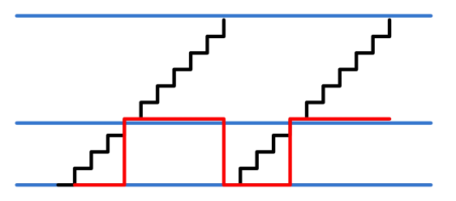

.. image:: images/images_0/88.png

============================================
"Chapter 10" PWM Breathing Light Experiment
============================================
**Experimental Vivado project is "pwm_led".**

This article mainly explains the use of PWM to control LEDs to achieve the effect of breathing lights.

10.1 Experimental principle
============================================
As shown in the figure below, using an N-bit counter, the maximum value can be expressed as 2 to the Nth power, and the minimum value is 0. The counter accumulates with "period" as the step value. After adding to the maximum value, it will overflow and enter the next accumulation cycle. When the counter value is greater than "duty", the pulse output is high, otherwise the output is low, so that the pulse output with adjustable pulse duty ratio shown in the red line in the figure can be completed, and "period" can adjust the pulse frequency, which can be understood as The step value of the counter.

Schematic diagram of PWM pulse width modulation
The square wave output with different pulse duty ratio is added to the LED, and the LED light will display different brightness. By continuously adjusting the duty ratio of the square wave, the brightness of the LED light can be adjusted.

10.2 Experimental design
============================================

The design of the PWM module is very simple. It has been mentioned in the above principle, and the principle will not be mentioned here.

.. csv-table:: 
  :header: "Signal name", "Direction", "Description"
  :widths: 20, 10, 30

		
  "clk	    ",in	,"Clock input"
  "rst	    ",in	,"Asynchronous reset input, high reset"
  "period	",in	,"PWM pulse width period (frequency) control. period = PWM output frequency * (2 to the Nth power) / system clock frequency. Obviously, the larger N is, the higher the frequency accuracy will be."
  "duty	    ",in	,"Duty cycle control, duty cycle = duty / (2 to the Nth power) * 100%"

PWM module (ax_pwm) port

::

 `timescale 1ns / 1ps
 module ax_pwm
 #(
 	parameter N = 16		//pwm bit width 
 )
 (
     input         clk,
     input         rst,
     input[N - 1:0]period,	//pwm step value
     input[N - 1:0]duty,	//duty value
     output        pwm_out	//pwm output
     );
  
 reg[N - 1:0] period_r;		//period register
 reg[N - 1:0] duty_r;		//duty register
 reg[N - 1:0] period_cnt;	//period counter
 reg pwm_r;
 assign pwm_out = pwm_r;
 always@(posedge clk or posedge rst)
 begin
     if(rst==1)
     begin
         period_r <= { N {1'b0} };
         duty_r <= { N {1'b0} };
     end
     else
     begin
         period_r <= period;
         duty_r   <= duty;
     end
 end
 //period counter, step is period value
 always@(posedge clk or posedge rst)
 begin
     if(rst==1)
         period_cnt <= { N {1'b0} };
     else
         period_cnt <= period_cnt + period_r;
 end
 
 always@(posedge clk or posedge rst)
 begin
     if(rst==1)
     begin
         pwm_r <= 1'b0;
     end
     else
     begin
         if(period_cnt >= duty_r)	//If period counter is bigger or equals to duty value, then set pwm value to high
             pwm_r <= 1'b1;
         else
             pwm_r <= 1'b0;
     end
 end

So how to achieve the effect of the breathing light? We know that the effect of the breathing light is the process of changing from dark to bright, and then from bright to dark, and the effect of light and dark is adjusted by the duty cycle, so we mainly control the duty cycle, that is, control the duty value.

In the following test code, by setting the value of period, set the frequency of PWM to 200Hz, the state of PWM_PLUS is to increase the duty value, if it increases to the maximum value, set pwm_flag to 1, and start to reduce the duty value until it is reduced to the minimum value, then start to increase the duty value, and continue to cycle. The PWM_GAP state is the adjustment interval, and the time is 100us.
::

 `timescale 1ns / 1ps
 module pwm_test(
	input			sys_clk_p,			//system clock 200Mhz postive pin
	input			sys_clk_n,			//system clock 200Mhz negetive pin 
	input			rst_n,				//low active
	output			led				//high-on, low-off
                 );					  
 localparam CLK_FREQ = 200;					//200MHz
 localparam US_COUNT = CLK_FREQ;				//1 us counter
 localparam MS_COUNT = CLK_FREQ*1000;				//1 ms counter
 
 localparam DUTY_STEP	  = 32'd100000;				//duty step
 localparam DUTY_MIN_VALUE = 32'h6fffffff;			//duty minimum value
 localparam DUTY_MAX_VALUE = 32'hffffffff;			//duty maximum value
 					  
 localparam IDLE		= 0;				//IDLE state
 localparam PWM_PLUS	= 1;					//PWM duty plus state
 localparam PWM_MINUS	= 2;					//PWM duty minus state
 localparam PWM_GAP		= 3;				//PWM duty adjustment gap
 
 wire 		pwm_out;	//pwm output
 reg[31:0] 	period;		//pwm step value
 reg[31:0] 	duty;		//duty value
 reg		pwm_flag ;	//duty value plus and minus flag, 0: plus; 1: minus
 
 reg[3:0] 	state;
 reg[31:0] 	timer;		//duty adjustment counter
 
 assign led = pwm_out;		//led high active
 
 wire clk ;
 
 IBUFDS IBUFDS_inst (
    .O(clk),			// Buffer output
    .I(sys_clk_p),		// Diff_p buffer input (connect directly to top-level port)
    .IB(sys_clk_n)		// Diff_n buffer input (connect directly to top-level port)
 );
 
 always@(posedge clk or negedge rst_n)
 begin
 	if(rst_n == 1'b0)
 	begin
 		period 		<= 32'd0;
 		timer 		<= 32'd0;
 		duty 		<= 32'd0;
 		pwm_flag 	<= 1'b0 ;
 		state 		<= IDLE;
 	end
 	else
 		case(state)
 			IDLE:
 			begin
 				period 		<= 32'd17179;   //The pwm step value, pwm 200Hz(period = 200*2^32/50000000)
 				state  		<= PWM_PLUS;
 				duty   		<= DUTY_MIN_VALUE;				
 			end
 			PWM_PLUS :
 			begin
 				if (duty > DUTY_MAX_VALUE - DUTY_STEP)	//If duty is bigger than DUTY MAX VALUE minus DUTY_STEP , begin to minus duty value
 				begin
 					pwm_flag 	<= 1'b1 ;
 					duty   		<= duty - DUTY_STEP ;
 				end
 				else
 				begin
 					pwm_flag 	<= 1'b0 ;					
 					duty   		<= duty + DUTY_STEP ;	
 				end
 				
 				state  		<= PWM_GAP ;
 			end
 			PWM_MINUS :
 			begin
 				if (duty < DUTY_MIN_VALUE + DUTY_STEP)	//If duty is little than DUTY MIN VALUE plus duty step, begin to add duty value
 				begin
 					pwm_flag 	<= 1'b0 ;
 					duty   		<= duty + DUTY_STEP ;
 				end
 				else
 				begin
 					pwm_flag 	<= 1'b1 ;
 					duty   		<= duty - DUTY_STEP ;	
 				end	
 				state  		<= PWM_GAP ;
 			end
 			PWM_GAP:
 			begin
 				if(timer >= US_COUNT*100)      //Adjustment gap is 100us
 				begin
 					if (pwm_flag)
 						state <= PWM_MINUS ;
 					else
 						state <= PWM_PLUS ;
 						
 					timer <= 32'd0;
 				end
 				else
 				begin
 					timer <= timer + 32'd1;
 				end
 			end
 			default:
 			begin
 				state <= IDLE;		
 			end			
 		endcase
 end
 
 //Instantiate pwm module
 ax_pwm
 #(
   .N(32)
  ) 
 ax_pwm_m0(
     .clk      (clk),
     .rst      (~rst_n),
     .period   (period),
     .duty     (duty),
     .pwm_out  (pwm_out)
     );	
 endmodule

10.3 Download Verification
============================================
Generate a bitstream and download the bit file, you can see that the PL LED light produces a breathing light effect. PWM is a commonly used module, such as fan speed control, motor speed control and so on.

.. image:: images/images_0/888.png

*ZYNQ MPSoC Development Platform FPGA Tutorial* - `Alinx Official Website <https://www.alinx.com/en>`_
