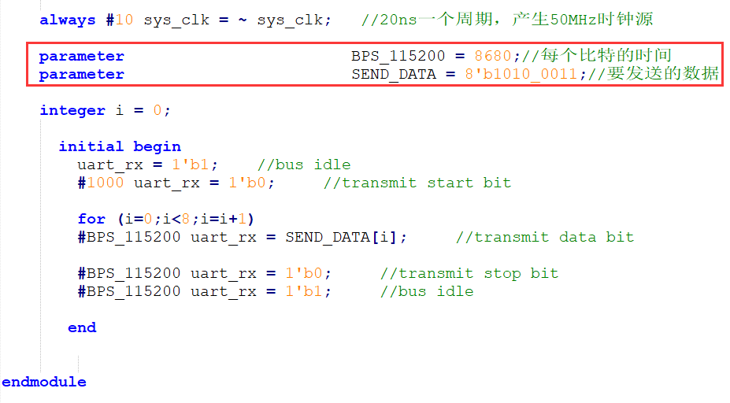

.. image:: images/images_0/88.png  

========================================
《第十一章》UART 实验
========================================
实验Vivado工程为“rs232_test”。

本章利用开发板上PL端的UART接口电路实现UART数据传输。

11.1 程序设计
========================================
本文所述的串口指异步串行通信,异步串行是指UART(Universal Asynchronous Receiver/Transmitter),通用异步接收/发送。本实验程序设计为每秒钟向串口发送” HELLO ALINX”,如果收到RXD接收的数据,再把接收的数据发送出去,实现回环的功能。

.. image:: images/images_11/image1.png  
   :align: center

11.1.1 异步串口通信协议
----------------------------------------
消息帧从一个低位起始位开始,后面是7个或8个数据位,一个可用的奇偶位和一个或几个高位停止位。接收器发现开始位时它就知道数据准备发送,并尝试与发送器时钟频率同步。如果选择了奇偶校验,UART就在数据位后面加上奇偶位。奇偶位可用来帮助错误校验。在接收过程中,UART从消息帧中去掉起始位和结束位,对进来的字节进行奇偶校验,并将数据字节从串行转换成并行。UART 传输时序如下图所示:

.. image:: images/images_11/image2.png  
   :align: center

从波形上可以看出起始位是低电平,停止位和空闲位都是高电平,也就是说没有数据传输时是高电平,利用这个特点我们可以准确接收数据,当一个下降沿事件发生时,我们认为将进行一次数据传输。

11.1.2波特率
----------------------------------------
常见的串口通信波特率有2400 、9600、115200等,发送和接收波特率必须保持一致才能正确通信。波特率是指1秒最大传输的数据位数,包括起始位、数据位、校验位、停止位。假如通信波特率设定为9600,那么一个数据位的时间长度是1/9600秒,本实验中的波特率由50MHz时钟产生。

11.1.3 接收模块设计
----------------------------------------
串口接收模块uart_rx是个参数化可配置模块,参数“CLK_FRE”定义接收模块的系统时钟频率,单位是Mhz,参数“BAUD_RATE”是波特率。接收状态机状态转换图如下:

.. image:: images/images_11/image3.png  
   :align: center

“S_IDLE”状态为空闲状态,上电后进入“S_IDLE”,如果信号“rx_pin”有下降沿,我们认为是串口的起始位,进入状态“S_START”,等一个BIT时间起始位结束后进入数据位接收状态“S_REC_BYTE”,本实验中数据位设计是8位,接收完成以后进入“S_STOP”状态,在“S_STOP”没有等待一个BIT周期, **只等待了半个BIT时间**,这是因为如果等待了一个周期,有可能会错过下一个数据的起始位判断,最后进入“S_DATA”状态,将接收到的数据送到其他模块。在这个模块我们提一点:为了满足采样定理,在接受数据时每个数据都在波特率计数器的时间中点进行采样,以避免数据出错的情况:
::

 //receive serial data bit data
 always@(posedge clk or negedge rst_n)
 begin
 	if(rst_n == 1'b0)
 		rx_bits <= 8'd0;
 	else if(state == S_REC_BYTE && cycle_cnt == CYCLE/2 - 1)
 		rx_bits[bit_cnt] <= rx_pin;
 	else
 		rx_bits <= rx_bits; 
 end

**注意:本实验没有设计奇偶校验位。**

信号名称	方向	宽度(bit)	说明
clk	in	1	系统时钟
rst_n	in	1	异步复位,低电平复位
rx_data	out	8	接收到的串口数据(8位数据)
rx_data_valid	out	1	接收到的串口数据有效(高有效)
rx_data_ready	in	1	表示用户可以从接收模块接收数据,当rx_data_ready和rx_data_valid都为高时数据送出
rx_pin	in	1	串口接收数据输入
串口接收模块uart_rx端口

11.1.4 发送模块设计
-----------------------------------
发送模块uart_tx设计和接收模块相似,也是使用状态机,状态转换图如下:

.. image:: images/images_11/image4.png  
   :align: center

上电后进入“S_IDLE”空闲状态,如果有发送请求,进入发送起始位状态“S_START”,起始位发送完成后进入发送数据位状态“S_SEND_BYTE”,数据位发送完成后进入发送停止位状态“S_STOP”,停止位发送完成后又进入空闲状态。在数据发送模块中,从顶层模块写入的数据直接传递给寄存器‘tx_reg',并通过‘tx_reg'寄存器模拟串口传输协议在状态机的条件转换下进行数据传送:
::

 always@(posedge clk or negedge rst_n)
 begin
 	if(rst_n == 1'b0)
 		tx_reg <= 1'b1;
 	else
 		case(state)
 			S_IDLE,S_STOP:
 				tx_reg <= 1'b1; 
 			S_START:
 				tx_reg <= 1'b0; 
 			S_SEND_BYTE:
 				tx_reg <= tx_data_latch[bit_cnt];
 			default:
 				tx_reg <= 1'b1; 
 		endcase
 end

串口发送模块uart_tx端口

.. csv-table:: 
  :header: "信号名称", "方向", "宽度(bit)","说明"
  :widths: 20, 10, 10, 40

  "clk	            ",in	,1	,"系统时钟"
  "rst_n	        ",in	,1	,"异步复位,低电平复位"
  "tx_data	        ",in	,8	,"要发送的串口数据(8位数据)"
  "tx_data_valid	",in	,1	,"发送的串口数据有效(高有效)"
  "tx_data_ready	",out	,1	,"发送模块已准备好发送数据,用户可将tx_data_valid信号拉高发送数据给发送模块。当tx_data_ready和tx_data_valid都为高时数据被发送"
  "tx_pin	        ",out	,1	,"串口发送数据发送"

11.1.5 波特率的产生
------------------------------------
在发送和接收模块中,声明了参数CYCLE,也就是UART一个周期的计数值,当然计数是在50MHz时钟下进行的。用户只要设定好CLK_FRE和BAUD_RATE这两个参数即可。

.. image:: images/images_11/image5.png  
   :align: center

11.1.6 测试程序
-------------------------------------
测试程序设计FPGA为1秒向串口发送一次“HELLO ALINX\r\n”,不发送期间,如果接受到串口数据,直接把接收到的数据送到发送模块再返回。“\r\n”,在这里和C语言中表示一致,都是回车换行。
测试程序分别例化了发送模块和接收模块,同时将参数传递进去,波特率设置为115200。
::

 always@(posedge sys_clk or negedge rst_n)
 begin
 	if(rst_n == 1'b0)
 	begin
 		wait_cnt <= 32'd0;
 		tx_data <= 8'd0;
 		state <= IDLE;
 		tx_cnt <= 8'd0;
 		tx_data_valid <= 1'b0;
 	end
 	else
 	case(state)
 		IDLE:
 			state <= SEND;
 		SEND:
 		begin
 			wait_cnt <= 32'd0;
 			tx_data <= tx_str;
 
 			if(tx_data_valid == 1'b1 && tx_data_ready == 1'b1 && tx_cnt < 8'd12)//Send 12 bytes data
 			begin
 				tx_cnt <= tx_cnt + 8'd1; //Send data counter
 			end
 			else if(tx_data_valid && tx_data_ready)//last byte sent is complete
 			begin
 				tx_cnt <= 8'd0;
 				tx_data_valid <= 1'b0;
 				state <= WAIT;
 			end
 			else if(~tx_data_valid)
 			begin
 				tx_data_valid <= 1'b1;
 			end
 		end
 		WAIT:
 		begin
 			wait_cnt <= wait_cnt + 32'd1;
 
 			if(rx_data_valid == 1'b1)
 			begin
 				tx_data_valid <= 1'b1;
 				tx_data <= rx_data;   // send uart received data
 			end
 			else if(tx_data_valid && tx_data_ready)
 			begin
 				tx_data_valid <= 1'b0;
 			end
 			else if(wait_cnt >= CLK_FRE * 1000000) // wait for 1 second
 				state <= SEND;
 		end
 		default:
 			state <= IDLE;
 	endcase
 end
 
 //combinational logic
 //Send "HELLO ALINX\r\n"
 always@(*)
 begin
 	case(tx_cnt)
 		8'd0 :  tx_str <= "H";
 		8'd1 :  tx_str <= "E";
 		8'd2 :  tx_str <= "L";
 		8'd3 :  tx_str <= "L";
 		8'd4 :  tx_str <= "O";
 		8'd5 :  tx_str <= " ";
 		8'd6 :  tx_str <= "A";
 		8'd7 :  tx_str <= "L";
 		8'd8 :  tx_str <= "I";
 		8'd9 :  tx_str <= "N";
 		8'd10:  tx_str <= "X";
 		8'd11:  tx_str <= "\r";
 		8'd12:  tx_str <= "\n";
 		default:tx_str <= 8'd0;
 	endcase
 end
 uart_rx#
 (
     .CLK_FRE(CLK_FRE),
     .BAUD_RATE(115200)
 ) uart_rx_inst
 (
     .clk                        (sys_clk                  ),
     .rst_n                      (rst_n                    ),
     .rx_data                    (rx_data                  ),
     .rx_data_valid              (rx_data_valid            ),
     .rx_data_ready              (rx_data_ready            ),
     .rx_pin                     (uart_rx                  )
 );
 
 uart_tx#
 (
     .CLK_FRE(CLK_FRE),
     .BAUD_RATE(115200)
 ) uart_tx_inst
 (
     .clk                        (sys_clk                  ),
     .rst_n                      (rst_n                    ),
     .tx_data                    (tx_data                  ),
     .tx_data_valid              (tx_data_valid            ),
     .tx_data_ready              (tx_data_ready            ),
     .tx_pin                     (uart_tx                  )
 );

11.2仿真
========================================
这里我们添加了一个串口接收的激励程序vtf_uart_test.v文件,用来仿真uart串口接收。这里向串口模块的uart_rx发送0xa3的数据, 每位的数据按115200的波特率发送,1位起始位,8位数据位和1位停止位。

仿真的结果如下,当程序接收到8位数据的时候,rx_data_valid有效,rx_data[7:0]的数据位a3。

.. image:: images/images_11/image7.png  
   :align: center

11.3实验测试
========================================
通过USB连接PL_UART接口到电脑上

.. image:: images/images_11/image8.png  
   :align: center

在设备管理器中找到串口号”COM5”

.. image:: images/images_11/image9.png  
   :align: center

打开串口调试,端口选择“COM79”(根据自己情况选择),波特率设置115200,检验位选None,数据位选8,停止位选1,然后点击“打开串口”。此软件在例程文件夹下。

打开串口以后,每秒可收到“HELLO ALINX”,在发送区输入框输入要发送的文字,点击“手动发送”,可以看到接收到自己发送的字符。

.. image:: images/images_11/image11.png  
   :align: center

*ZYNQ MPSoC开发平台 FPGA教程*    - `Alinx官方网站 <http://www.alinx.com>`_