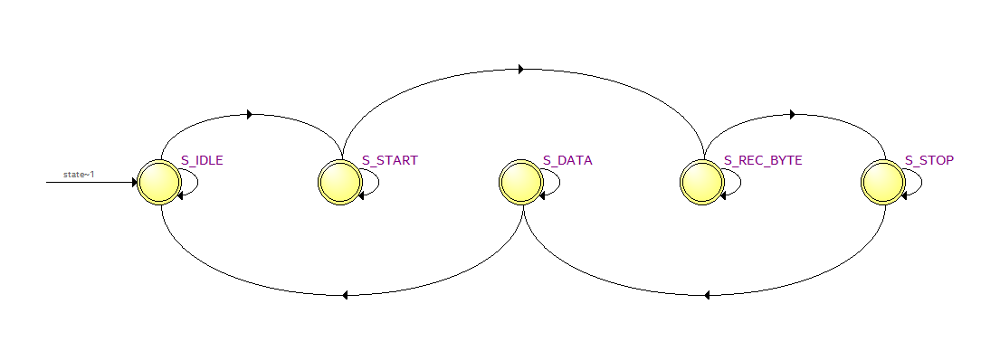
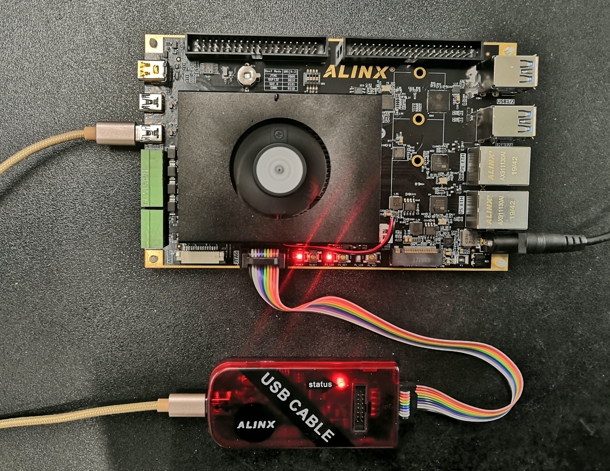

.. image:: images/images_0/88.png  

============================================
"Chapter 11" UART experiment
============================================
The experimental Vivado project is "rs232_test".

This chapter uses the UART interface circuit on the PL end of the development board to realize UART data transmission.

11.1 Programming
============================================
The serial port described in this article refers to asynchronous serial communication, and asynchronous serial refers to UART (Universal Asynchronous Receiver/Transmitter), which is universal asynchronous reception/transmission. This experiment program is designed to send "HELLO ALINX" to the serial port every second. If the data received by RXD is received, the received data will be sent out to realize the loopback function.

.. image:: images/images_11/image1.png
    :align: center

11.1.1 Asynchronous serial communication protocol
----------------------------------------
A message frame starts with a low start bit, followed by 7 or 8 data bits, an available parity bit and one or several high stop bits. When the receiver sees the start bit it knows that data is ready to be sent and tries to synchronize with the transmitter clock frequency. If parity is selected, the UART adds a parity bit after the data bits. Parity bits can be used to aid in error checking. During reception, the UART strips the start and stop bits from the message frame, performs a parity check on the incoming bytes, and converts the data bytes from serial to parallel. The UART transmission timing is shown in the figure below:

.. image:: images/images_11/image2.png
    :align: center

It can be seen from the waveform that the start bit is low level, the stop bit and the idle bit are both high level, that is to say, it is high level when there is no data transmission. Using this feature, we can receive data accurately. When a falling edge event occurs, we assume that a data transfer will take place.

11.1.2 Baud rate
----------------------------------------
Common serial communication baud rates are 2400, 9600, 115200, etc. The sending and receiving baud rates must be consistent to communicate correctly. Baud rate refers to the maximum number of data bits transmitted in 1 second, including start bit, data bit, parity bit, and stop bit. If the communication baud rate is set to 9600, then the time length of a data bit is 1/9600 second, and the baud rate in this experiment is generated by a 50MHz clock.

11.1.3 Receiver module design
----------------------------------------
The serial receiving module uart_rx is a parameterized and configurable module, the parameter "CLK_FRE" defines the system clock frequency of the receiving module, the unit is Mhz, and the parameter "BAUD_RATE" is the baud rate. The state transition diagram of the receiving state machine is as follows:

The state of "S_IDLE" is idle state, enter "S_IDLE" after power on, if the signal "rx_pin" has a falling edge, we think it is the start bit of the serial port, enter the state "S_START", wait for a BIT time to enter after the end of the start bit The data bit receiving state is "S_REC_BYTE". In this experiment, the data bit design is 8 bits. After the receiving is completed, it enters the "S_STOP" state. In "S_STOP", it does not wait for a BIT cycle, **only waits for half a BIT time**, this is because if you wait for a cycle, you may miss the start bit judgment of the next data, and finally enter the "S_DATA" state, and send the received data to other modules. In this module, we mention one point: In order to satisfy the sampling theorem, each data is sampled at the time midpoint of the baud rate counter when receiving data to avoid data errors:
::

 //receive serial data bit data
 always@(posedge clk or negedge rst_n)
 begin
 	if(rst_n == 1'b0)
 		rx_bits <= 8'd0;
 	else if(state == S_REC_BYTE && cycle_cnt == CYCLE/2 - 1)
 		rx_bits[bit_cnt] <= rx_pin;
 	else
 		rx_bits <= rx_bits; 
 end

**Note: No parity bits are designed for this experiment.**

.. csv-table:: 
	:header: "Signal name", "Direction Width (bit)", "Description"
	:widths: 20, 10, 30

	"clk			","in (1)		","System clock"
	"rst_n			","in (1)		","Asynchronous reset, low level reset"
	"rx_data		","out (8)		","Received serial port data (8-bit data)"
	"rx_data_valid	","out (1)		","The serial port data received is valid (high effective)"
	"rx_data_ready	","in (1)		","Indicates that the user can receive data from the receiving module, when both rx_data_ready and rx_data_valid are high, the data is sent"
	"rx_pin			","in (1)		","Serial port receive data input"

Serial receiving module uart_rx port

11.1.4 Design of sending module
--------------------------------------
The design of the sending module uart_tx is similar to that of the receiving module, and it also uses a state machine. The state transition diagram is as follows:

.. image:: images/images_11/image4.png
    :align: center

After power-on, it enters the "S_IDLE" idle state. If there is a sending request, it enters the sending start bit state "S_START". After the start bit is sent, it enters the sending data bit state "S_SEND_BYTE". After the data bit is sent, it enters the sending stop bit state. "S_STOP", after the stop bit is sent, it enters the idle state. In the data sending module, the data written from the top-level module is directly passed to the register 'tx_reg', and the serial port transmission protocol is simulated through the 'tx_reg' register to perform data transmission under the conditional transition of the state machine:
::

 always@(posedge clk or negedge rst_n)
 begin
 	if(rst_n == 1'b0)
 		tx_reg <= 1'b1;
 	else
 		case(state)
 			S_IDLE,S_STOP:
 				tx_reg <= 1'b1; 
 			S_START:
 				tx_reg <= 1'b0; 
 			S_SEND_BYTE:
 				tx_reg <= tx_data_latch[bit_cnt];
 			default:
 				tx_reg <= 1'b1; 
 		endcase
 end

Serial sending module uart_tx port

.. csv-table:: 
  :header: "Signal Name", "Direction", "Width (bit)", "Description"
  :widths: 20, 10, 10, 40

	"clk ",in ,1 ,"system clock"
	"rst_n ",in ,1 ,"Asynchronous reset, low level reset"
	"tx_data ",in ,8 ,"The serial port data to be sent (8-bit data)"
	"tx_data_valid ",in ,1 ,"The sent serial port data is valid (high effective)"
	"tx_data_ready ",out ,1 ,"The sending module is ready to send data, the user can pull the tx_data_valid signal high to send data to the sending module. When both tx_data_ready and tx_data_valid are high, the data is sent"
	"tx_pin ",out ,1 ,"serial port send data send"

11.1.5 Baud rate generation
------------------------------------
In the sending and receiving modules, the parameter CYCLE is declared, which is the count value of one cycle of UART. Of course, the count is carried out under the 50MHz clock. The user only needs to set the two parameters CLK_FRE and BAUD_RATE.

.. image:: images/images_11/image5.png
    :align: center

11.1.6 Test procedure
--------------------------------------
The test program design FPGA sends "HELLO ALINX\\r\\n" to the serial port once in 1 second. During the non-transmission period, if the serial port data is received, the received data is directly sent to the sending module and returned. "\\r\\n", which is consistent with the C language here, is a carriage return and line feed.
The test program instantiates the sending module and the receiving module respectively, and at the same time passes the parameters in, and the baud rate is set to 115200.
::

 always@(posedge sys_clk or negedge rst_n)
 begin
 	if(rst_n == 1'b0)
 	begin
 		wait_cnt <= 32'd0;
 		tx_data <= 8'd0;
 		state <= IDLE;
 		tx_cnt <= 8'd0;
 		tx_data_valid <= 1'b0;
 	end
 	else
 	case(state)
 		IDLE:
 			state <= SEND;
 		SEND:
 		begin
 			wait_cnt <= 32'd0;
 			tx_data <= tx_str;
 
 			if(tx_data_valid == 1'b1 && tx_data_ready == 1'b1 && tx_cnt < 8'd12)//Send 12 bytes data
 			begin
 				tx_cnt <= tx_cnt + 8'd1; //Send data counter
 			end
 			else if(tx_data_valid && tx_data_ready)//last byte sent is complete
 			begin
 				tx_cnt <= 8'd0;
 				tx_data_valid <= 1'b0;
 				state <= WAIT;
 			end
 			else if(~tx_data_valid)
 			begin
 				tx_data_valid <= 1'b1;
 			end
 		end
 		WAIT:
 		begin
 			wait_cnt <= wait_cnt + 32'd1;
 
 			if(rx_data_valid == 1'b1)
 			begin
 				tx_data_valid <= 1'b1;
 				tx_data <= rx_data;   // send uart received data
 			end
 			else if(tx_data_valid && tx_data_ready)
 			begin
 				tx_data_valid <= 1'b0;
 			end
 			else if(wait_cnt >= CLK_FRE * 1000000) // wait for 1 second
 				state <= SEND;
 		end
 		default:
 			state <= IDLE;
 	endcase
 end
 
 //combinational logic
 //Send "HELLO ALINX\r\n"
 always@(*)
 begin
 	case(tx_cnt)
 		8'd0 :  tx_str <= "H";
 		8'd1 :  tx_str <= "E";
 		8'd2 :  tx_str <= "L";
 		8'd3 :  tx_str <= "L";
 		8'd4 :  tx_str <= "O";
 		8'd5 :  tx_str <= " ";
 		8'd6 :  tx_str <= "A";
 		8'd7 :  tx_str <= "L";
 		8'd8 :  tx_str <= "I";
 		8'd9 :  tx_str <= "N";
 		8'd10:  tx_str <= "X";
 		8'd11:  tx_str <= "\r";
 		8'd12:  tx_str <= "\n";
 		default:tx_str <= 8'd0;
 	endcase
 end
 uart_rx#
 (
     .CLK_FRE(CLK_FRE),
     .BAUD_RATE(115200)
 ) uart_rx_inst
 (
     .clk                        (sys_clk                  ),
     .rst_n                      (rst_n                    ),
     .rx_data                    (rx_data                  ),
     .rx_data_valid              (rx_data_valid            ),
     .rx_data_ready              (rx_data_ready            ),
     .rx_pin                     (uart_rx                  )
 );
 
 uart_tx#
 (
     .CLK_FRE(CLK_FRE),
     .BAUD_RATE(115200)
 ) uart_tx_inst
 (
     .clk                        (sys_clk                  ),
     .rst_n                      (rst_n                    ),
     .tx_data                    (tx_data                  ),
     .tx_data_valid              (tx_data_valid            ),
     .tx_data_ready              (tx_data_ready            ),
     .tx_pin                     (uart_tx                  )
 );

11.2 Simulation
============================================
Here we add an incentive program vtf_uart_test.v file for serial port reception, which is used to simulate UART serial port reception. Here, send 0xa3 data to the uart_rx of the serial port module, each bit of data is sent at a baud rate of 115200, 1 start bit, 8 data bits and 1 stop bit.

.. image:: images/images_11/image6.png
    :align: center

The simulation results are as follows, when the program receives 8-bit data, rx_data_valid is valid, and the data bit a3 of rx_data[7:0].

.. image:: images/images_11/image7.png
    :align: center

11.3 Experimental Tests
============================================
Connect the PL_UART interface to the computer via USB

Find the serial port number "COM5" in the device manager

.. image:: images/images_11/image9.png
    :align: center

Open the serial port debugging, select "COM79" for the port (choose according to your own situation), set the baud rate to 115200, select None for the check bit, 8 for the data bit, and 1 for the stop bit, and then click "Open Serial Port". This software is under the routine folder.

.. image:: images/images_11/image10.png
    :align: center

After opening the serial port, you can receive "HELLO ALINX" every second, enter the text to be sent in the input box of the sending area, click "Manual Send", and you can see the characters you sent.

.. image:: images/images_11/image11.png
    :align: center

.. image:: images/images_0/888.png

*ZYNQ MPSoC Development Platform FPGA Tutorial* - `Alinx Official Website <https://www.alinx.com/en>`_