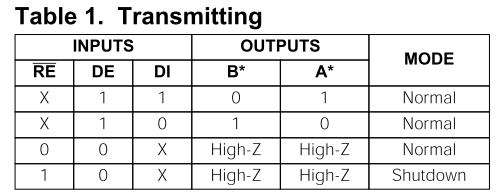
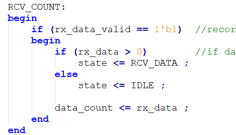

.. image:: images/images_0/88.png

============================================
"Chapter 12" RS485 Experiment
============================================
**Experimental Vivado project is "rs485_test".**

This chapter uses AN3485 module to introduce RS485 data transmission.

12.1 Experimental principle
============================================
In the UART experiment introduced earlier, RS485 uses differential signal transmission, but RS485 is half-duplex transmission, that is to say, there can only be data transmission in one direction at the same time. There are only differential signals A and B, and the signals connected to ARM or FPGA are DE (direction selection), DI (input signal TXD), RO (output signal RXD).

.. image:: images/images_12/image1.png
    :align: center

From the MAX3485 document, the sending direction, if DE is 1, that is, the output is enabled, and when the DI value is 1, the values for differential signals A and B are 1 and 0, otherwise they are 0 and 1.

From the receiving point of view, if DE is 0, and the difference between A and B is greater than or equal to +0.2V, then the RO value is 1, otherwise it is 0.

12.2 Programming
============================================
Since RS485 is a half-duplex transmission, we need to formulate a transmission protocol for handshake, set the first byte to 8'h55, which indicates the beginning of a frame of data, and the next is the transmitted data length information, due to the FIFO size limitation ( 256), the range is 1~255, followed by data. The format is: start 8'h55+data length+data.
Among them, uart_tx and uart_rx are the same as the UART experiment, only uart_test can be modified here. The function we designed is to set DE to 0 in the initial state, that is, input, wait to receive the data sent by the host computer, and cache it in FIFO, set the size of FIFO to 256, and then switch DE to 1, that is, output. Received data is read from the FIFO and sent out. Note that the cached data removes the initial 8'h55 and quantity information.
In RCV_HEAD state, judge whether the received data is "S".

.. image:: images/images_12/image4.png
    :align: center

In the RCV_COUNT state, if the data length is less than 0, it will jump to the IDLE state, and if it is greater than 0, it will enter the receiving data state.

In the RCV_DATA state, write the data into FIFO, check the data length, switch the direction of RS485 to output, and jump to the state.

.. image:: images/images_12/image6.png
    :align: center

When switching the bus state, in order to work reliably, in the WAIT state, delay 1ms to switch direction.

.. image:: images/images_12/image7.png
    :align: center

Then send the data in the FIFO, the SEND_WAIT state is to control the read enable signal fifo_rden, and judge whether the data has been sent, and enter the IDLE state after sending.

.. image:: images/images_12/image8.png
    :align: center

12.3 Experimental Tests
============================================
We use a USB-to-serial device, and connect A and B of RS485_1 to A and B of the device through DuPont cables.

.. image:: images/images_12/image9.png
    :align: center

.. image:: images/images_12/image10.png
    :align: center

.. image:: images/images_12/image11.png
    :align: center

Open the serial port tool, set the baud rate of the serial port number, select hexadecimal to send, send data starting with 8'h55, click send, and you can see the returned data in the receiving window.

.. image:: images/images_12/image12.png
    :align: center

On this basis, another interface can be tested.

.. image:: images/images_0/888.png

*ZYNQ MPSoC Development Platform FPGA Tutorial* - `Alinx Official Website <https://www.alinx.com/en>`_