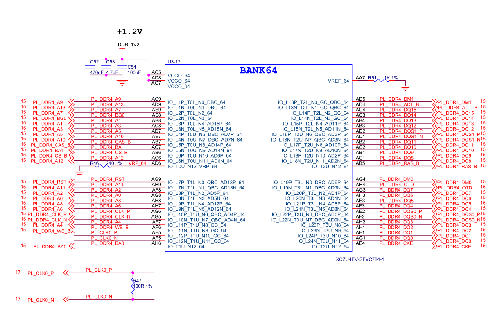
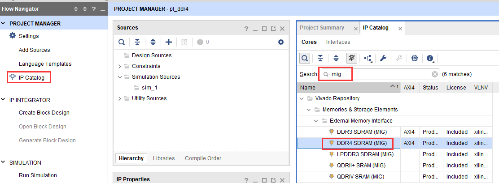
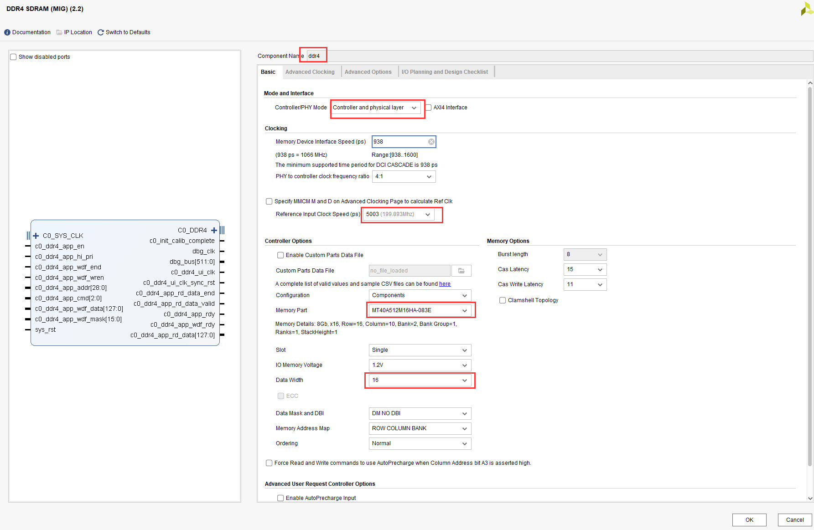
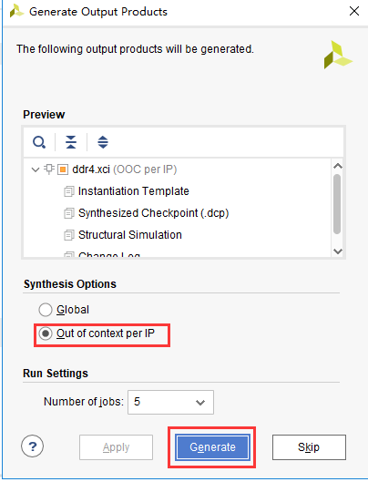
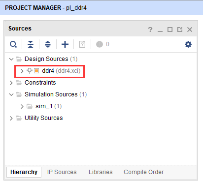
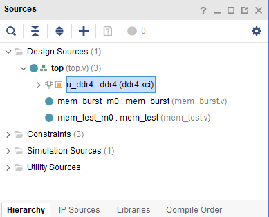
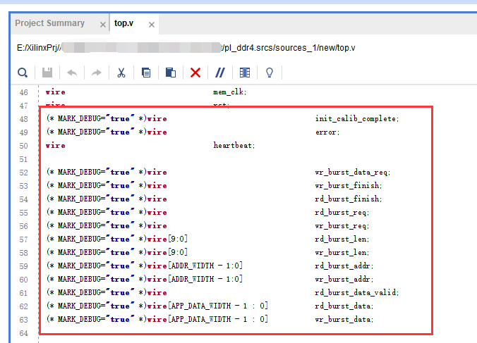
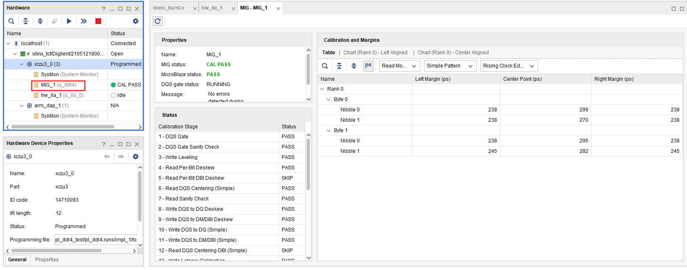
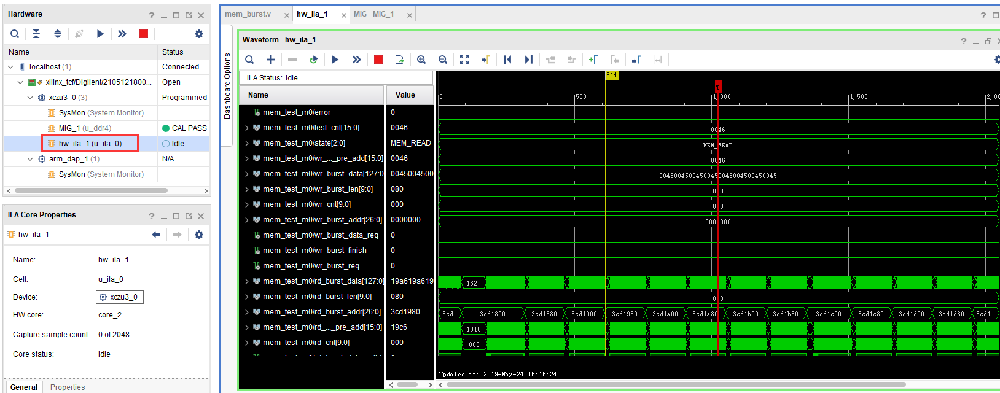

.. image:: images/images_0/88.png  

========================================
《第十三章》PL 端 DDR4 读写测试实验
========================================
**实验VIvado工程为“pl_ddr4_test”。**

13.1硬件介绍
========================================
开发板的PL端有一颗16bit ddr4,这很大程度方便我们移植以前的FPGA工程到ZYNQ系统中,同时也提供了更大的带宽。

13.2Vivado工程建立
=============================================

13.2.1创建一个PL端ddr4测试工程并配置ddr4 IP
-------------------------------------------

1) 在“IP Catalog”的搜索框搜索“mig”,快速找到“Memory Interface Generator”,双击

2) Component Name可以修改,Controller/PHY Mode选择“Controller and physical layer”,参考时钟选择200MHz,即5003ps,Momory Part选择”MT40A512M16HA-083E”,Data Width选择16,其他设置保持默认,点击OK

3) Generate

4) 生成结果如下

13.2.2添加其他测试代码
--------------------------------------------
其他代码主要功能是读写ddr3并比较数据是否一致,这里不做详细介绍,可参考工程代码。

在mem_test.v中添加mark_debug调试,具体操作流程请参考PL的”Hello World”LED实验

13.3下载调试
========================================
生成bit文件以后,使用JTAG下载到开发板,在MIG_1窗口会显示DDR4校准等信息

在hw_ila_1中可以查看调试信号

13.4实验总结
========================================
本实验通过PL端Verilog代码直接读写ddr4,我们也可以把ddr4配置成AXI接口,这样方便和ARM系统完成数据交互。

.. image:: images/images_0/888.png  

*ZYNQ MPSoC开发平台 FPGA教程*    - `Alinx官方网站 <http://www.alinx.com>`_