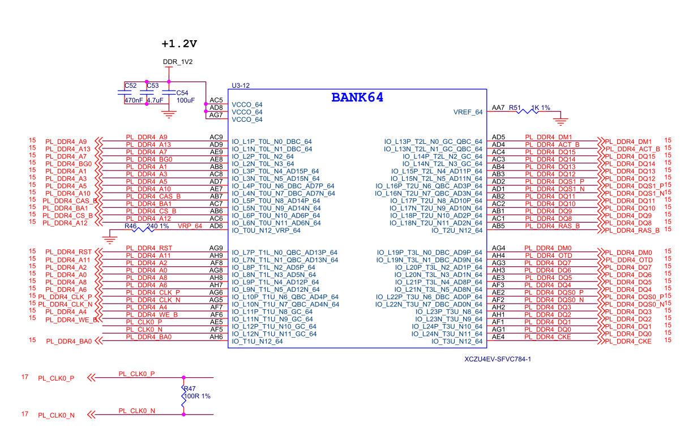
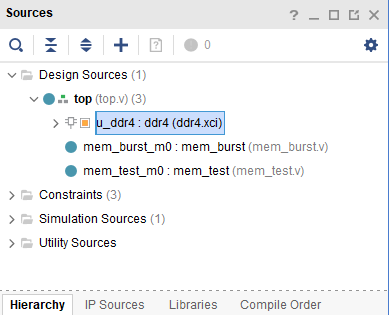
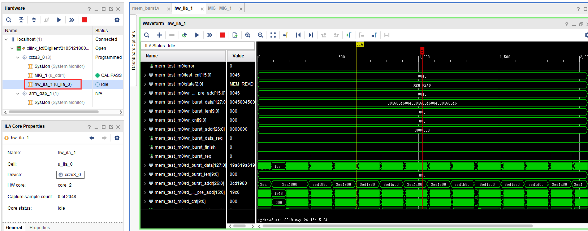

.. image:: images/images_0/88.png

============================================
"Chapter Thirteen" PL DDR4 Read and Write Test Experiment
============================================
**Experimental VIvado project is "pl_ddr4_test".**

13.1 Hardware Introduction
============================================
There is a 16bit DDR4 on the PL side of the development board, which is very convenient for us to transplant the previous FPGA project to the ZYNQ system, and also provides greater bandwidth.

13.2 Vivado project establishment
================================================

13.2.1 Create a PL side DDR4 test project and configure DDR4 IP
-----------------------------------------------

1) Search for "MIG" in the search box of "IP Catalog", quickly find "Memory Interface Generator", double-click

.. image:: images/images_13/image2.png
    :align: center

2) Component Name can be modified, Controller/PHY Mode selects "Controller and physical layer", reference clock selects 200MHz, which is 5003ps, Momory Part selects "MT40A512M16HA-083E", Data Width selects 16, other settings remain default, click OK

.. image:: images/images_13/image3.png
    :align: center

3) Generate

.. image:: images/images_13/image4.png
    :align: center

4) The generated results are as follows

.. image:: images/images_13/image5.png
    :align: center

13.2.2 Adding additional test code
--------------------------------------------
The main function of other codes is to read and write DDR3 and compare whether the data is consistent. I will not introduce it in detail here, but you can refer to the engineering code.

Add mark_debug debugging in mem_test.v, please refer to the "Hello World" LED experiment of PL for the specific operation process

.. image:: images/images_13/image7.png
    :align: center

13.3 Download and debug
============================================
After generating the bit file, use JTAG to download it to the development board, and the DDR4 calibration and other information will be displayed in the MIG_1 window

.. image:: images/images_13/image8.png
    :align: center

Debug signals can be viewed in hw_ila_1

13.4 Summary of experiments
============================================
This experiment directly reads and writes DDR4 through the Verilog code on the PL side. We can also configure DDR4 as an AXI interface, which is convenient for data interaction with the ARM system.

.. image:: images/images_0/888.png

*ZYNQ MPSoC Development Platform FPGA Tutorial* - `Alinx Official Website <https://www.alinx.com/en>`_