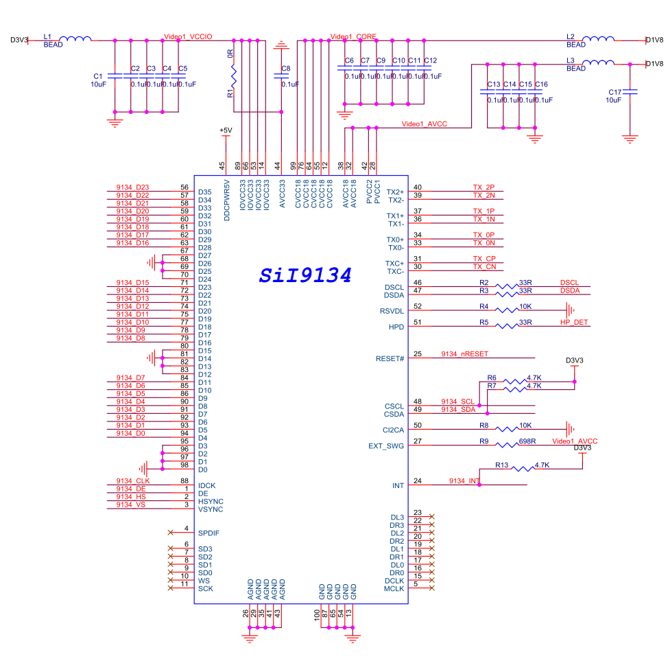
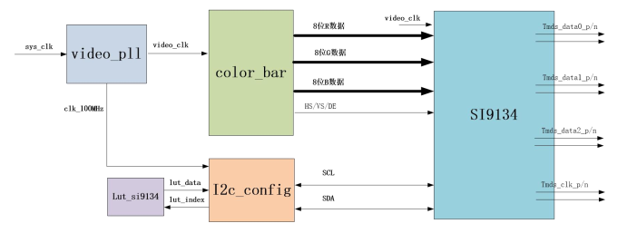
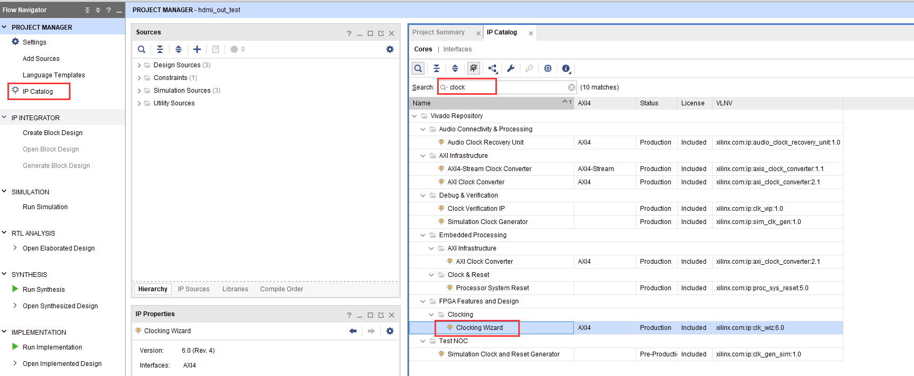
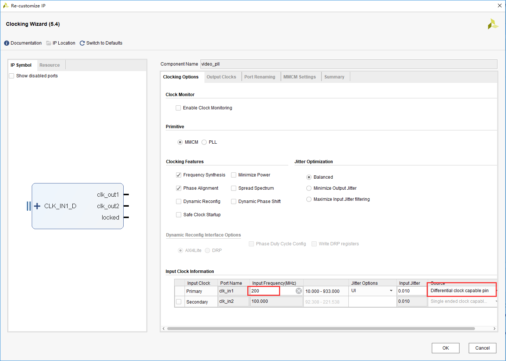
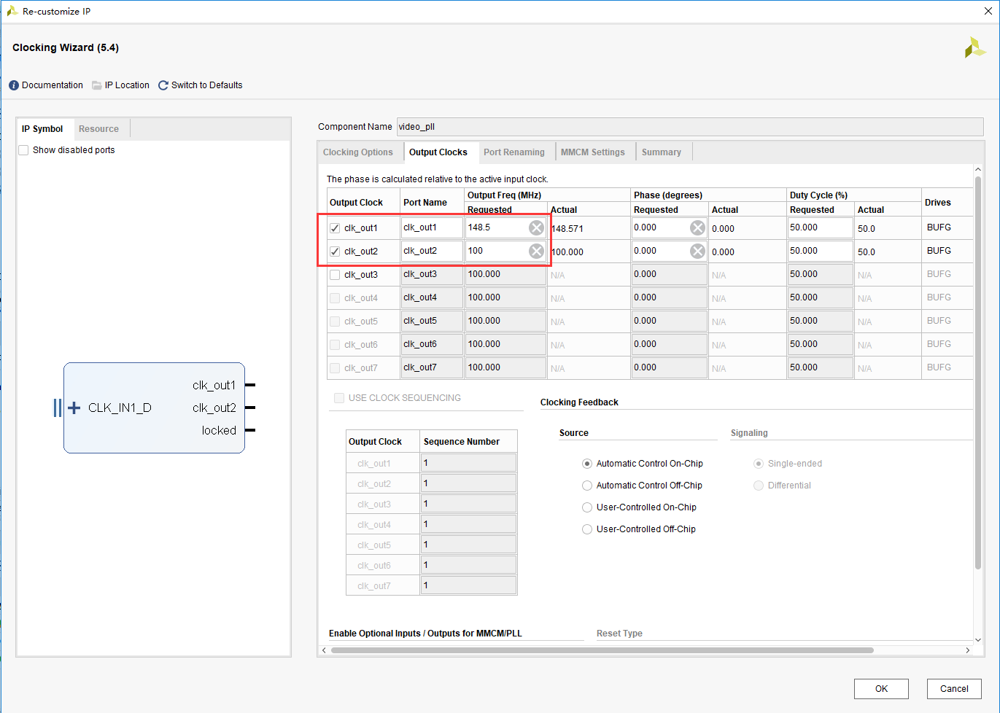
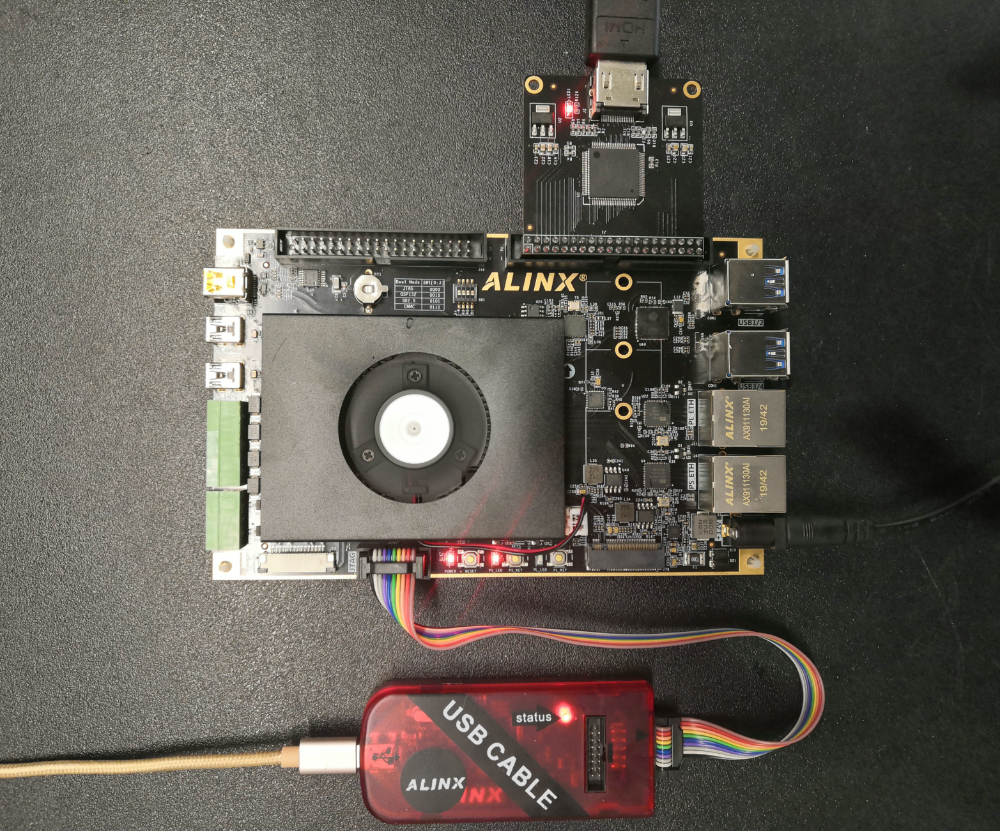

========================================
《第十四章》HDMI 输出实验
========================================
**实验VIvado工程为“hdmi_out_test”。**

前面我们介绍了led闪灯实验,只是为了了解Vivado的基本开发流程,本章这个实验相对LED闪灯实验复杂点,做一个HDMI输出的彩条,这也是我们后面学习显示、视频处理的基础。实验还不涉及到PS系统,从实验设计可以看出如果要非常好的使用ZYNQ芯片,需要良好的FPGA基础知识。

14.1硬件介绍
========================================
由于开发板上只有DP可以显示,但却是PS端的,PL端没有HDMI的接口,因此我们采用AN9134的HDMI扩展模块实现HDMI显示。将24位RGB编码输出TMDS差分信号。SIL9134功能强大,本实验只使用其中一小部分,将RGB24视频数据显示出来即可。

SI9134芯片需要通过I2C总线配置寄存器才能正常工作,从原理图中可以看出I2C总线连接到PL端的IO,可以通过PL直接配置。

14.2程序设计
========================================

- 本实验实现通过HDMI显示彩条,实验中设计了视频时序发生和彩条发生模块“color_bar.v”,I2C Master 寄存器配置模块“i2c_config.v”,配置数据查找表模块“lut_si9134.v”。
- 具体代码在这里不再一一介绍了,大家自己去看。下面针对每个模块实现的功能给大家做一下简介:
- 顶层模块top.v是项目的顶层文件,主要是实例化4个子模块(时钟模块vidio_pll, 彩条生成模块color_bar和I2C配置模块i2c_config和配置查找表模块lut_si9134。
- 彩条产生模块color_bar.v是产生8种颜色的VGA格式的彩条,彩条分别为白、黄、青、绿、紫、红、蓝和黑。产生分辨率为1920x1080刷新率为60Hz的彩条,也就是所谓的1080P的高清视频图像。所以这个模块会输出R(8位)G(8位)B(8位)图像信号、行同步、列同步和数据有效信号。
- 时钟模块video_pll调用的是一个Xilinx提供的时钟IP,通过输入的系统时钟产生一个100Mhz时钟和一个1080P的像素时钟148.5Mhz。生成时钟IP的方法是点击Project Manager目录下的IP Catalog,再选择FPGA Features and Design->Clocking->Clocking Wizard图标。

14.3添加XDC约束文件
========================================
添加以下的xdc约束文件到项目中,在约束文件里添加了时钟和HDMI相关的管脚。
::

 set_property BITSTREAM.GENERAL.COMPRESS TRUE [current_design]
 ############## clock define##################
 create_clock -period 5.000 [get_ports sys_clk_p]
 set_property PACKAGE_PIN AE5 [get_ports sys_clk_p]
 set_property IOSTANDARD DIFF_SSTL12 [get_ports sys_clk_p]
 
 set_property PACKAGE_PIN H12  [get_ports hdmi_clk]
 set_property PACKAGE_PIN G13 [get_ports {hdmi_d[0]}]
 set_property PACKAGE_PIN H13 [get_ports {hdmi_d[1]}]
 set_property PACKAGE_PIN H14 [get_ports {hdmi_d[2]}]
 set_property PACKAGE_PIN J14 [get_ports {hdmi_d[3]}]
 set_property PACKAGE_PIN K14 [get_ports {hdmi_d[4]}]
 set_property PACKAGE_PIN J12 [get_ports {hdmi_d[5]}]
 set_property PACKAGE_PIN L13 [get_ports {hdmi_d[6]}]
 set_property PACKAGE_PIN L14 [get_ports {hdmi_d[7]}]
 set_property PACKAGE_PIN C13 [get_ports {hdmi_d[8]}]
 set_property PACKAGE_PIN C14 [get_ports {hdmi_d[9]}]
 set_property PACKAGE_PIN A14 [get_ports {hdmi_d[10]}]
 set_property PACKAGE_PIN B14 [get_ports {hdmi_d[11]}]
 set_property PACKAGE_PIN A13 [get_ports {hdmi_d[12]}]
 set_property PACKAGE_PIN B13 [get_ports {hdmi_d[13]}]
 set_property PACKAGE_PIN E13 [get_ports {hdmi_d[14]}]
 set_property PACKAGE_PIN E14 [get_ports {hdmi_d[15]}]
 set_property PACKAGE_PIN F11 [get_ports {hdmi_d[16]}]
 set_property PACKAGE_PIN F12 [get_ports {hdmi_d[17]}]
 set_property PACKAGE_PIN A11 [get_ports {hdmi_d[18]}]
 set_property PACKAGE_PIN A12 [get_ports {hdmi_d[19]}]
 set_property PACKAGE_PIN C12 [get_ports {hdmi_d[20]}]
 set_property PACKAGE_PIN D12 [get_ports {hdmi_d[21]}]
 set_property PACKAGE_PIN F10 [get_ports {hdmi_d[22]}]
 set_property PACKAGE_PIN G11 [get_ports {hdmi_d[23]}]
 set_property PACKAGE_PIN F13 [get_ports hdmi_de]
 set_property PACKAGE_PIN G15 [get_ports hdmi_hs]
 set_property PACKAGE_PIN G14 [get_ports hdmi_vs]
 set_property PACKAGE_PIN B10 [get_ports hdmi_scl]
 set_property PACKAGE_PIN C11 [get_ports hdmi_sda]
 set_property PACKAGE_PIN D14 [get_ports hdmi_nreset]
 
 set_property IOSTANDARD LVCMOS33 [get_ports hdmi_scl]
 set_property IOSTANDARD LVCMOS33 [get_ports hdmi_sda]
 set_property IOSTANDARD LVCMOS33 [get_ports {hdmi_d[*]}]
 set_property IOSTANDARD LVCMOS33 [get_ports hdmi_clk]
 set_property IOSTANDARD LVCMOS33 [get_ports hdmi_de]
 set_property IOSTANDARD LVCMOS33 [get_ports hdmi_vs]
 set_property IOSTANDARD LVCMOS33 [get_ports hdmi_hs]
 set_property IOSTANDARD LVCMOS33 [get_ports hdmi_nreset]
 
 
 set_property PULLUP true [get_ports hdmi_scl]
 set_property PULLUP true [get_ports hdmi_sda]
 
 set_property SLEW FAST [get_ports {hdmi_d[*]}]
 set_property DRIVE 8 [get_ports {hdmi_d[*]}]
 set_property SLEW FAST [get_ports hdmi_clk]
 set_property SLEW FAST [get_ports hdmi_de]
 set_property SLEW FAST [get_ports hdmi_hs]
 set_property SLEW FAST [get_ports hdmi_scl]
 set_property SLEW FAST [get_ports hdmi_sda]
 set_property SLEW FAST [get_ports hdmi_vs]

14.4下载调试
========================================
保存工程并编译生成bit文件,连接HDMI模块到J45扩展口,连接HDMI接口到HDMI显示器,需要注意,这里使用1920x1080@60Hz,请确保自己的显示器支持这个分辨率。

**硬件连接图(J45扩展口)**

下载后显示器显示如下图像

.. image:: images/images_14/image7.png  
   :align: center

14.5实验总结
========================================
本实验初步接触到视频显示,涉及到视频知识,这不是zynq学习的重点,所以没有详细介绍,但zynq在视频处理领域用途广泛,需要学习者有良好的基础知识。实验中仅仅使用PL来驱动HDMI芯片,包括I2C寄存器配置,当然I2C的配置还是使用PS来配置比较合适。

.. image:: images/images_0/888.png  

*ZYNQ MPSoC开发平台 FPGA教程*    - `Alinx官方网站 <http://www.alinx.com>`_
