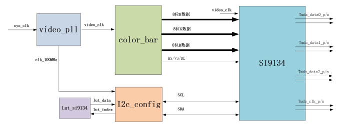
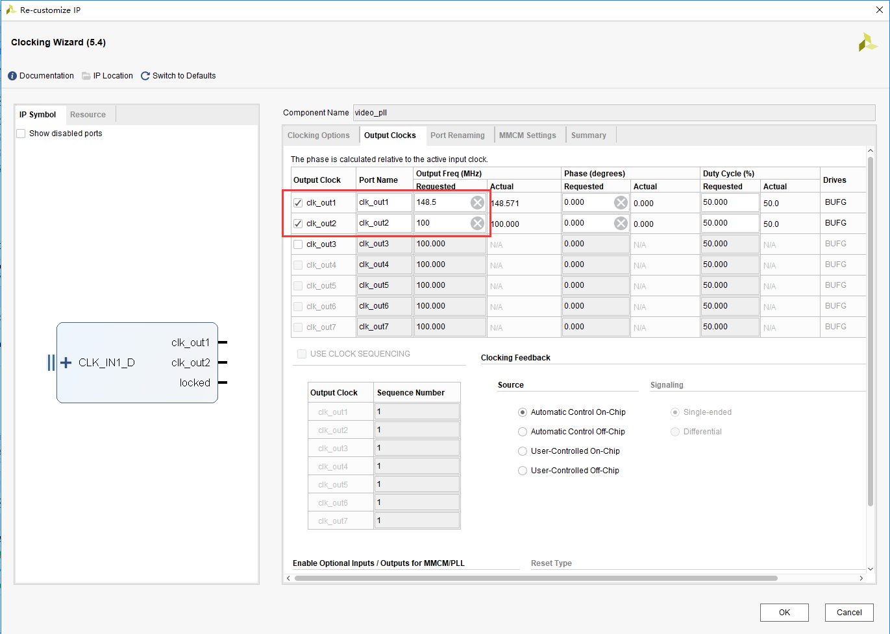
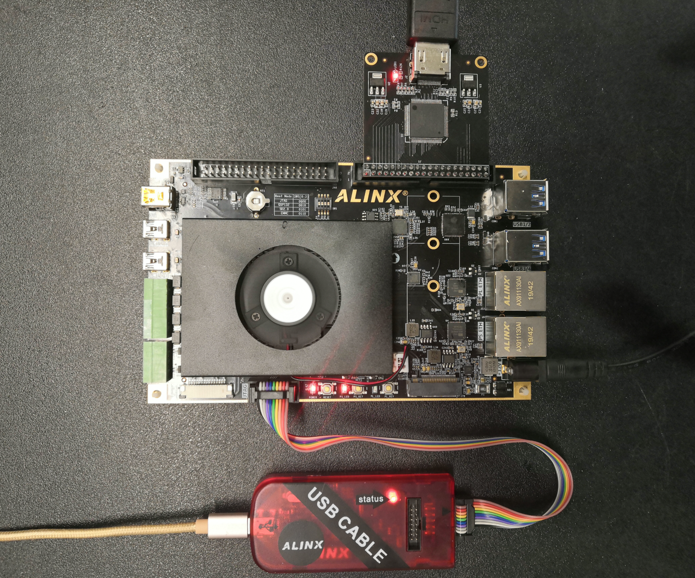

.. image:: images/images_0/88.png

============================================
"Chapter 14" HDMI output experiment
============================================
**Experimental VIvado project is "hdmi_out_test".**

We introduced the LED flashing experiment earlier, just to understand the basic development process of Vivado. This experiment is more complicated than the LED flashing experiment. It is a color bar for HDMI output, which is also the basis for us to learn display and video processing later. The experiment does not involve the PS system. From the experimental design, it can be seen that if you want to use the ZYNQ chip very well, you need a good basic knowledge of FPGA.

14.1 Hardware Introduction
============================================
Since only DP can be displayed on the development board, but it is on the PS side, and there is no HDMI interface on the PL side, so we use the AN9134 HDMI expansion module to realize HDMI display. 24-bit RGB coded output TMDS differential signal. SIL9134 is powerful, and this experiment only uses a small part of it to display the RGB24 video data.

.. image:: images/images_14/image1.png
    :align: center

The SI9134 chip needs to configure the registers through the I2C bus to work normally. From the schematic diagram, it can be seen that the I2C bus is connected to the IO of the PL terminal, which can be directly configured through the PL.

14.2 Programming
============================================

- This experiment realizes the display of color bars through HDMI. In the experiment, the video timing generation and color bar generation module "color_bar.v", the I2C Master register configuration module "i2c_config.v", and the configuration data lookup table module "lut_si9134.v" are designed.
- The specific codes will not be introduced one by one here, you can go and see for yourself. The following is a brief introduction to the functions implemented by each module:
- The top-level module top.v is the top-level file of the project, mainly to instantiate 4 sub-modules (clock module vidio_pll, color bar generation module color_bar and I2C configuration module i2c_config and configuration lookup table module lut_si9134.
- The color bar generation module color_bar.v is to generate 8 colors of color bars in VGA format, the color bars are white, yellow, blue, green, purple, red, blue and black. Generate color bars with a resolution of 1920x1080 and a refresh rate of 60Hz, which is the so-called 1080P high-definition video image. So this module will output R (8 bits) G (8 bits) B (8 bits) image signal, row sync, column sync and data valid signal.
- The clock module video_pll calls a clock IP provided by Xilinx, which generates a 100Mhz clock and a 1080P pixel clock 148.5Mhz through the input system clock. The method of generating the clock IP is to click the IP Catalog under the Project Manager directory, and then select the FPGA Features and Design->Clocking->Clocking Wizard icon.

.. image:: images/images_14/image3.png
    :align: center

.. image:: images/images_14/image4.png
    :align: center

14.3 Add XDC constraint file
============================================
Add the following xdc constraint file to the project, and add clock and HDMI related pins in the constraint file.
::

 set_property BITSTREAM.GENERAL.COMPRESS TRUE [current_design]
 ############## clock define##################
 create_clock -period 5.000 [get_ports sys_clk_p]
 set_property PACKAGE_PIN AE5 [get_ports sys_clk_p]
 set_property IOSTANDARD DIFF_SSTL12 [get_ports sys_clk_p]
 
 set_property PACKAGE_PIN H12  [get_ports hdmi_clk]
 set_property PACKAGE_PIN G13 [get_ports {hdmi_d[0]}]
 set_property PACKAGE_PIN H13 [get_ports {hdmi_d[1]}]
 set_property PACKAGE_PIN H14 [get_ports {hdmi_d[2]}]
 set_property PACKAGE_PIN J14 [get_ports {hdmi_d[3]}]
 set_property PACKAGE_PIN K14 [get_ports {hdmi_d[4]}]
 set_property PACKAGE_PIN J12 [get_ports {hdmi_d[5]}]
 set_property PACKAGE_PIN L13 [get_ports {hdmi_d[6]}]
 set_property PACKAGE_PIN L14 [get_ports {hdmi_d[7]}]
 set_property PACKAGE_PIN C13 [get_ports {hdmi_d[8]}]
 set_property PACKAGE_PIN C14 [get_ports {hdmi_d[9]}]
 set_property PACKAGE_PIN A14 [get_ports {hdmi_d[10]}]
 set_property PACKAGE_PIN B14 [get_ports {hdmi_d[11]}]
 set_property PACKAGE_PIN A13 [get_ports {hdmi_d[12]}]
 set_property PACKAGE_PIN B13 [get_ports {hdmi_d[13]}]
 set_property PACKAGE_PIN E13 [get_ports {hdmi_d[14]}]
 set_property PACKAGE_PIN E14 [get_ports {hdmi_d[15]}]
 set_property PACKAGE_PIN F11 [get_ports {hdmi_d[16]}]
 set_property PACKAGE_PIN F12 [get_ports {hdmi_d[17]}]
 set_property PACKAGE_PIN A11 [get_ports {hdmi_d[18]}]
 set_property PACKAGE_PIN A12 [get_ports {hdmi_d[19]}]
 set_property PACKAGE_PIN C12 [get_ports {hdmi_d[20]}]
 set_property PACKAGE_PIN D12 [get_ports {hdmi_d[21]}]
 set_property PACKAGE_PIN F10 [get_ports {hdmi_d[22]}]
 set_property PACKAGE_PIN G11 [get_ports {hdmi_d[23]}]
 set_property PACKAGE_PIN F13 [get_ports hdmi_de]
 set_property PACKAGE_PIN G15 [get_ports hdmi_hs]
 set_property PACKAGE_PIN G14 [get_ports hdmi_vs]
 set_property PACKAGE_PIN B10 [get_ports hdmi_scl]
 set_property PACKAGE_PIN C11 [get_ports hdmi_sda]
 set_property PACKAGE_PIN D14 [get_ports hdmi_nreset]
 
 set_property IOSTANDARD LVCMOS33 [get_ports hdmi_scl]
 set_property IOSTANDARD LVCMOS33 [get_ports hdmi_sda]
 set_property IOSTANDARD LVCMOS33 [get_ports {hdmi_d[*]}]
 set_property IOSTANDARD LVCMOS33 [get_ports hdmi_clk]
 set_property IOSTANDARD LVCMOS33 [get_ports hdmi_de]
 set_property IOSTANDARD LVCMOS33 [get_ports hdmi_vs]
 set_property IOSTANDARD LVCMOS33 [get_ports hdmi_hs]
 set_property IOSTANDARD LVCMOS33 [get_ports hdmi_nreset]
 
 
 set_property PULLUP true [get_ports hdmi_scl]
 set_property PULLUP true [get_ports hdmi_sda]
 
 set_property SLEW FAST [get_ports {hdmi_d[*]}]
 set_property DRIVE 8 [get_ports {hdmi_d[*]}]
 set_property SLEW FAST [get_ports hdmi_clk]
 set_property SLEW FAST [get_ports hdmi_de]
 set_property SLEW FAST [get_ports hdmi_hs]
 set_property SLEW FAST [get_ports hdmi_scl]
 set_property SLEW FAST [get_ports hdmi_sda]
 set_property SLEW FAST [get_ports hdmi_vs]

14.4 Download and debug
============================================
Save the project and compile to generate a bit file, connect the HDMI module to the J45 extension port, and connect the HDMI interface to the HDMI display. It should be noted that 1920x1080@60Hz is used here. Please ensure that your display supports this resolution.

**Hardware connection diagram (J45 extension port)**

After downloading, the display will display the following image

.. image:: images/images_14/image7.png
    :align: center

14.5 Summary of experiments
============================================
This experiment exposes initially video display, which involves video knowledge. This is not the focus of ZYNQ learning, so it is not introduced in detail, but ZYNQ is widely used in the field of video processing and requires learners to have good basic knowledge. In the experiment, only PL is used to drive the HDMI chip, including I2C register configuration. Of course, it is more appropriate to use PS to configure I2C.

.. image:: images/images_0/888.png

*ZYNQ MPSoC Development Platform FPGA Tutorial* - `Alinx Official Website <https://www.alinx.com/en>`_