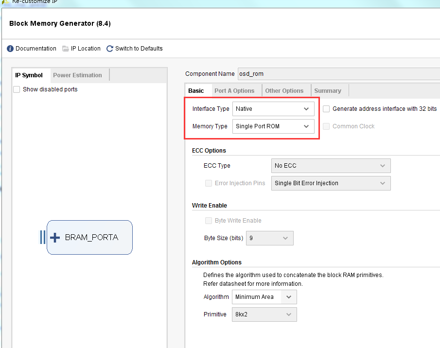
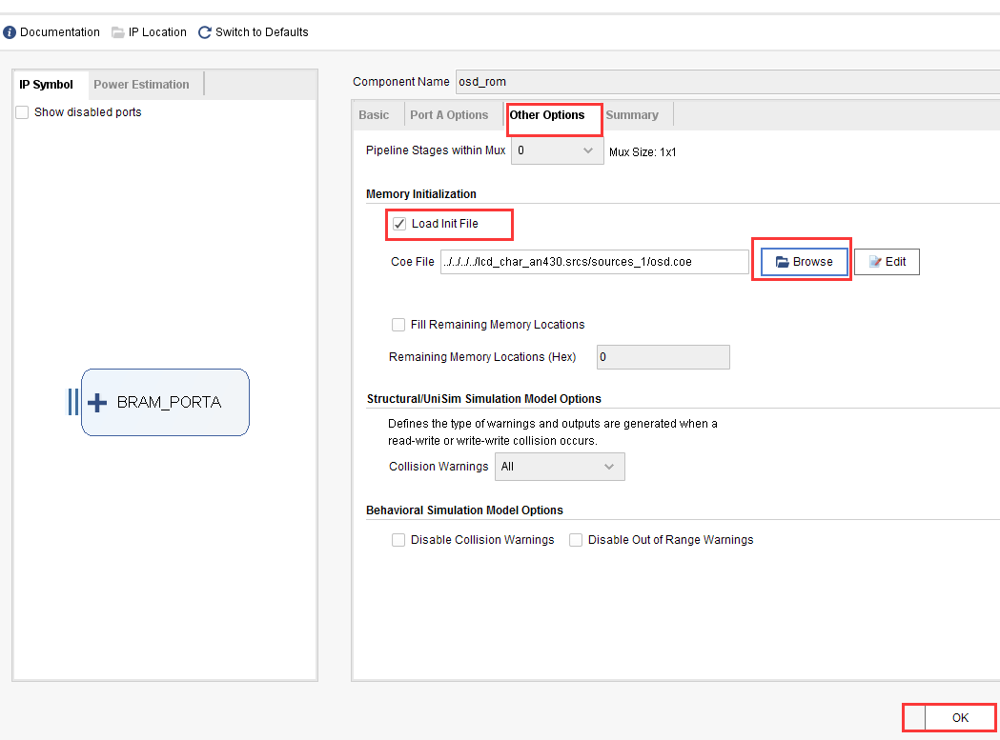

.. image:: images/images_0/88.png

============================================
"Chapter 15" HDMI Character Display Experiment
============================================
**Experimental Vivado project as "hdmi_char".**

In the HDMI output experiment, the HDMI display principle and display mode are explained. This experiment introduces how to use FPGA to realize character display. Through this experiment, we can get a deeper understanding of the HDMI display mode.

15.1 Experimental principle
============================================
In the experiment, the character is converted into a hexadecimal coe file through the character conversion tool and stored in the single-port ROM IP core, and then the converted data is read from the ROM and displayed on the HDMI.

15.2 Programming
============================================
The character display routine is to add an osd_display module on the basis of HDMI display. The "osd_display" module is used to read the converted character information stored in the ROM IP core and display it in the specified area. The program block diagram is shown in the figure below:

.. image:: images/images_15/image1.png
    :align: center

1) In the "timing_gen_xy" module, two counters "x_cnt" and "y_cnt" are defined according to the HDMI timing standard, and the "x" coordinates and "y" coordinates displayed by HDMI are generated by these two counters. In the program, "vs_edge" and "de_falling" are used to represent the field sync start signal and the valid data end signal respectively. Its principle is shown in the figure below:

.. image:: images/images_15/image2.png
    :align: center

.. csv-table::
   :header: "Signal Name", "Direction", "Description"
   :widths: 20, 10, 30

   "rst_n ",in ,"Asynchronous reset input, low reset"
   "clk ",in ,"External clock input"
   "i_hs ",in ,"Line synchronization signal"
   "i_vs ",in ,"Vertical synchronization signal"
   "i_de ",in ,"Data valid signal"
   "i_data",in ,"Color_bar data"
   "o_hs ",out ,"Output line sync signal"
   "o_vs ",out ,"Output vertical sync signal"
   "o_de ",out ,"Output data valid signal"
   "o_data ",out ,"Output data"
   "x ",out ,"Generate X coordinates"
   "y ",out ,"Generate Y coordinate"

**timing_gen_xy module port**

2) The following describes how to store the ROM IP of text information.
   First, it is necessary to generate a .coe file that can be recognized by XILINX FPGA.
   First find the "FPGA font extraction" tool under the project folder.

.. image:: images/images_15/image3.png
    :align: center

Double-click the .exe file to open the tool

.. image:: images/images_15/image4.png
    :align: center

Enter the characters to be displayed in the "Character Input" box of the extraction tool, and the font and character height can be customized. After the setting is complete, click the "Convert" button, and you can see the size of the converted character dot matrix in the lower left corner of the interface. The width and height of the dot matrix are needed in the program

.. image:: images/images_15/image5.png
    :align: center

The width and height of the dot matrix are 144x32 here, which need to be consistent with those defined in the osd_display program:

Click the "Save" button to save the file to the source file directory of this routine. It should be noted that Xilinx (.coe) should be selected under the save type, and click the "Save" button.

.. image:: images/images_15/image7.png
    :align: center

After finding the generated .coe file and opening it, you can see the following:

The process of calling the single-port ROM IP core has been introduced in the use of the previous ROM, and it is set to Single Port ROM

In the PortA Options column, set as follows:

.. image:: images/images_15/image10.png
    :align: center

Add the osd.coe file as shown below (find the coe file generated earlier), and click the "OK" button after completion:

1) The osd_display module includes the timing_gen_xy module and the osd_rom module. The character data stored in osd_rom, if the data is 1, the OSD area displays the foreground red in ROM (display ALINX core station), if the data is 0, the OSD area displays the data as the background color (color bar).

.. image:: images/images_15/image12.png
    :align: center

Set the effective signal of the area, that is, characters are displayed in this area, the starting coordinates are set to (9,9), and the area size can be set according to the area set by the character generation tool.

.. image:: images/images_15/image13.png
    :align: center

Many people may not understand the read address of the ROM. Why is [15:3], that is, one data is read out in eight clock cycles. This is because a point of a character only represents 1 bit, and the storage data width of the ROM is 8 bits, so it takes eight cycles to fetch a piece of data, and compare the value of each bit to convert a character point into a pixel on the image.

.. csv-table::
   :header: "Signal Name", "Direction", "Description"
   :widths: 20, 10, 30

   "rst_n ",in ,"Asynchronous reset input, low reset"
   "pclk ",in ,"External clock input"
   "i_hs ",in ,"Line synchronization signal"
   "i_vs ",in ,"Vertical synchronization signal"
   "i_de ",in ,"Data valid signal"
   "i_data",in ,"Color_bar data"
   "o_hs ",out ,"Output line sync signal"
   "o_vs ",out ,"Output vertical sync signal"
   "o_de ",out ,"Output data valid signal"
   "o_data ",out ,"Output data"

**osd_display module port**

15.3 Experimental phenomena
============================================
Connect the development board and the display. For the connection method, refer to the "HDMI Output Experiment" tutorial. It should be noted that the connectors of the development board should not be hot-swapped. After downloading the experiment program, you can see that the display shows characters with color bars as the background. As an HDMI output device, the development board can only be displayed through the HDMI display device. Do not try to display it through the HDMI interface of the laptop, because the laptop is also an output device.

.. image:: images/images_15/image15.png
    :align: center

The default character display position is at the coordinates (9,9), and the user can modify the following pos_y and pos_x judgment conditions to display the character at any position on the display:

.. image:: images/images_15/image16.png
    :align: center

.. image:: images/images_0/888.png

*ZYNQ MPSoC Development Platform FPGA Tutorial* - `Alinx Official Website <https://www.alinx.com/en>`_