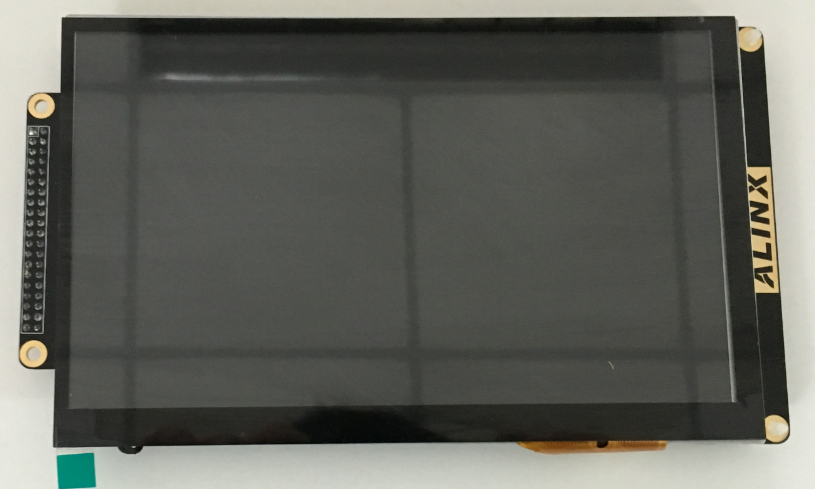
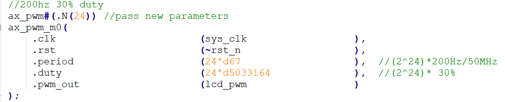

.. image:: images/images_0/88.png

============================================
"Chapter Sixteen" 7-inch LCD display experiment
============================================
**The experimental Vivado project is "lcd7_test".**

Based on the HDMI output experiment, this chapter introduces the display of the 7-inch LCD screen.

16.1 Hardware Introduction
============================================
The AN970 LCD touch screen module consists of a TFT LCD screen, a capacitive touch screen and a driver board. For details, please refer to the AN970 user manual. AN970 physical photos are as follows:

16.2 Programming
============================================
The experiment in this chapter is actually very simple. The biggest difference from HDMI display is that no I2C configuration is required, and the output can be in accordance with RGB. Below is the file structure.

.. image:: images/images_16/image2.png
    :align: center

At the same time, because the resolution of the LCD screen is 800x480, the macro definition of video_define.v needs to be modified.

.. image:: images/images_16/image3.png
    :align: center

At the same time, modify the output clock frequency of the PLL to 33MHz, that is, the pixel clock of 800x480.

.. image:: images/images_16/image4.png
    :align: center

At the same time, ax_pwm is instantiated in top.v, which is used to adjust the brightness of the LCD screen, set to 200Hz, 30% dot ratio.

16.3 Experimental phenomena
============================================
Connect the LCD screen to the J45 extension port, download the program, and you can see the color bar display.

At the same time, the routine for character display is also prepared:

Character display

.. image:: images/images_0/888.png

*ZYNQ MPSoC Development Platform FPGA Tutorial* - `Alinx Official Website <https://www.alinx.com/en>`_