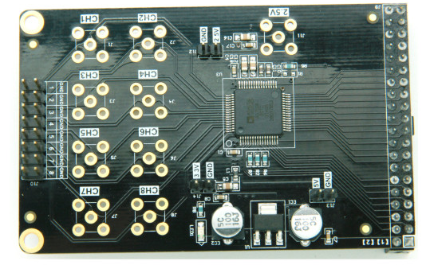
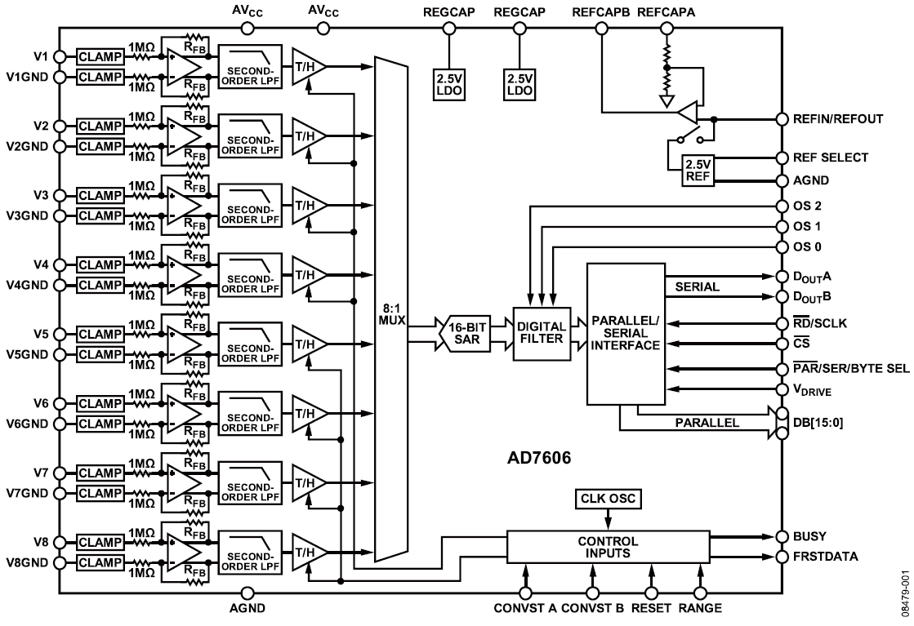
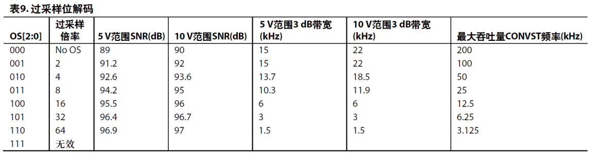
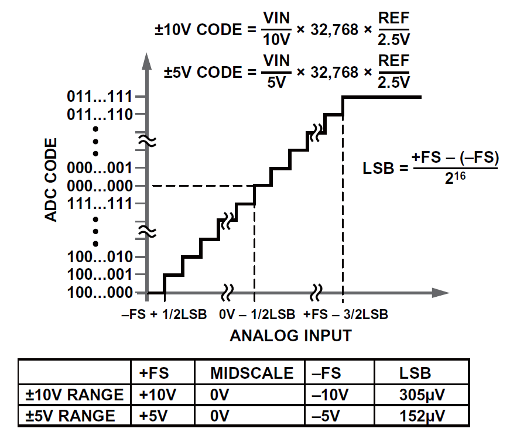
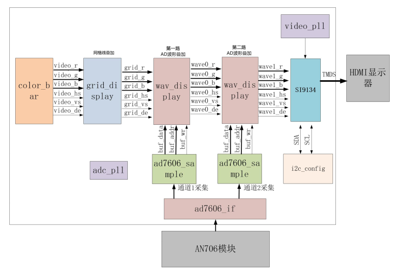
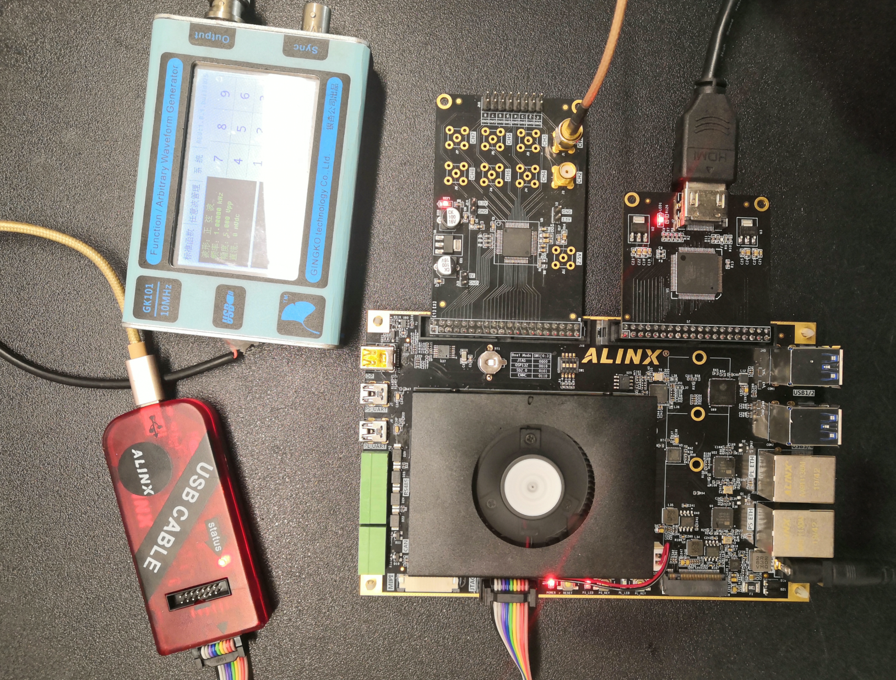

.. image:: images/images_0/88.png

============================================
"Chapter 17" AD7606 multi-channel waveform display experiment
============================================
**Experimental Vivado project is "ad7606_hdmi_test".**

This experiment uses ADC. The ADC module model used in the experiment is AN706, the maximum sampling rate is 200Khz, and the precision is 16 bits. In the experiment, the 2-way input of AN706 is displayed on the HDMI as a waveform. We can observe the waveform in a more intuitive way, which is a prototype of a digital oscilloscope.

8-channel 200K sampling 16-bit ADC module

.. image:: images/images_17/image2.png
    :align: center

Expected results of the experiment

17.1 Experimental principle
============================================

- AD7606 is an integrated 8-channel simultaneous sampling data acquisition system with on-chip input amplifier, overvoltage protection circuit, second-order analog anti-aliasing filter, analog multiplexer, 16-bit 200 kSPS SAR ADC, and a Digital filter, 2.5 V reference, reference buffer, and high-speed serial and parallel interfaces.
- The AD7606 operates from a single +5V supply and can handle ±10V and ±5V true bipolar input signals while all channels are sampled at a throughput rate of up to 200KSPS. The input clamp protection circuit can withstand voltages up to ±16.5V.
- The analog input impedance of the AD7606 is 1M ohms regardless of the sampling frequency. It operates from a single supply with on-chip filtering and high input impedance, so there is no need to drive an op amp and an external bipolar supply.
- The AD7606 anti-aliasing filter has a 3dB cut-off frequency of 22kHz; it has 40dB anti-aliasing rejection when the sampling rate is 200kSPS. Flexible digital filters are pin-driven to improve signal-to-noise ratio (SNR) and reduce 3dB bandwidth.

17.1.1 AD7606 Timing
---------------------------------------

.. image:: images/images_17/image4.png
    :align: center

AD7606 can carry on synchronous sampling of all 8 analog input channels. When two CONVST pins (CONVSTA and CONVSTB) are tied together, all channels are sampled simultaneously. The rising edge of this common CONVST signal initiates simultaneous sampling of all analog input channels (V1 to V8).

The AD7606 has an on-chip oscillator for conversion. The conversion time for all ADC channels is tCONV. The BUSY signal informs the user that a conversion is in progress, so when the rising edge of CONVST is applied, BUSY goes logic high and goes low at the end of the entire conversion process. The falling edge of the BUSY signal is used to return all eight track-and-hold amplifiers to track mode. The BUSY falling edge also indicates that data from 8 channels can now be read from the parallel bus DB[15:0].

17.1.2 AD7606 configuration
-----------------------------------------
In the hardware circuit design of AN706 8-channel AD module, we set the working mode of AD7606 by adding pull-up or pull-down resistors to the three configuration pins of AD7606.

AD7606 This chip supports external reference voltage input or internal reference voltage. If an external reference voltage is used, REFIN/REFOUT of the chip needs to be connected with a 2.5V reference source. If using the internal reference voltage. The REFIN/REFOUT pin is an internal reference voltage output of 2.5V. The REF SELECT pin is used to select the internal or external reference voltage. In this module, because the accuracy of the internal reference voltage of AD7606 is also very high (2.49V~2.505V), the circuit design chooses to use the internal reference voltage.

.. csv-table::
   :header: "Pin name", "Set level", "Description"
   :widths: 20, 10, 30

   "REF SELECT", high level, "use the internal reference voltage 2.5V"

The AD conversion data acquisition of AD7606 can adopt parallel mode or serial mode, and the user can set the communication mode by setting the PAR/SER/BYTE SEL pin level. When we design, we choose the parallel mode to read the AD data of AD7606.

.. csv-table::
   :header: "Pin name", "Set level", "Description"
   :widths: 20, 10, 30

   "PAR/SER/BYTE SEL", low level, "select parallel interface"

The input range of AD analog signal of AD7606 can be set to ±5V or ±10V, when setting ±5V input range, 1LSB=152.58uV; when setting ±10V input range, 1LSB=305.175uV. Users can set the range of analog input voltage by setting the RANGE pin level. When we design, we choose the analog voltage input range of ±5V.

.. csv-table::
   :header: "Pin name", "Set level", "Description"
   :widths: 20, 10, 30

   "RANGE", low level, "Analog signal input range selection: ±5V"

The AD7606 includes an optional digital first-order sinc filter that should be used in applications that use lower throughput rates or require higher signal-to-noise ratios. The oversampling ratio of the digital filter is controlled by the oversampling pin OS[2:0]. The table below provides the decoding of oversampling bits used to select different oversampling ratios.

In the hardware design of the AN706 module, OS[2:0] has been connected to the external interface, FPGA or CPU can choose whether to use the filter by controlling the pin level of OS[2:0] to achieve higher measurement accuracy.

17.1.3 AD7606 AD conversion
----------------------------------------
The output encoding method of AD7606 is two's complement. The designed code conversion is carried out in the middle of consecutive LSB integers (that is, 1/2LSB and 3/2LSB). The LSB size of the AD7606 is FSR/65536. The ideal transfer characteristic of the AD7606 is shown in the figure below:

17.2 Programming
============================================
The display part of this experiment is based on the previous HDMI display color bar experiment, and grid lines and waveforms are superimposed on the color bar. The block diagram of the entire project is shown in the figure below:

The ad7606_if module is the interface module of AN706, which completes the data acquisition of 8-channel AD input by AD706, generates the AD conversion signal ad_convstab according to the timing of the AD706 chip, waits for the ADC busy signal to be invalid, generates a chip select signal, and reads the 8-channel AD data in sequence.

.. csv-table::
   :header: "Signal Name", "Direction", "Width (bit)", "Description"
   :widths: 20, 10, 10, 30

   "clk ",in ,1 ,"System clock"
   "rst_n ",in ,1 ,"Asynchronous reset, low reset"
   "adc_data ",in ,16 ,"ADC data input"
   "ad_busy ",in ,1 ,"ADC busy signal"
   "first_data ",in ,1 ,"the first channel data indication signal"
   "ad_os ",out ,3 ,"ADC oversampling"
   "ad_cs ",out ,1 ,"ADC chip select"
   "ad_rd ",out ,1 ,"ADC read signal"
   "ad_reset ",out ,1 ,"ADC reset signal"
   "ad_convstab ",out ,1 ,"ADC conversion signal"
   "adc_data_valid ",in ,1 ,"ADC data is valid"
   "ad_ch1 ",out ,16 ,"ADC channel 1 data"
   "ad_ch2 ",out ,16 ,"ADC channel 2 data"
   "ad_ch3 ",out ,16 ,"ADC channel 3 data"
   "ad_ch4 ",out ,16 ,"ADC channel 4 data"
   "ad_ch5 ",out ,16 ,"ADC channel 5 data"
   "ad_ch6 ",out ,16 ,"ADC channel 6 data"
   "ad_ch7 ",out ,16 ,"ADC channel 7 data"
   "ad_ch8 ",out ,16 ,"ADC channel 8 data"

The ad7606_sample module mainly completes the single-channel data conversion of the ad706. First, the input data needs to be converted into unsigned numbers, and the final data only takes the high 8-bit data, and the data width is converted to 8 bits (in order to be compatible with other 8-bit AD module programs). In addition, collect 1280 data each time, and then wait for a period of time before continuing to collect the following 1280 data.

.. csv-table::
   :header: "Signal Name", "Direction", "Width (bit)", "Description"
   :widths: 20, 10, 10, 30

   "adc_clk ",in ,1 ,"ADC system clock"
   "rst ",in ,1 ,"Asynchronous reset, high reset"
   "adc_data ",in ,16 ,"ADC data input"
   "adc_data_valid",in ,1 ,"ADC data is valid"
   "adc_buf_wr ",out ,1 ,"ADC data write enable"
   "adc_buf_addr ",out ,12 ,"ADC data write address"
   "adc_buf_data ",out ,8 ,"Unsigned 8-bit ADC data"

ad7606_sample module port

The grid_display module mainly completes the grid line superposition of the video image. In this experiment, the color bar video is input, and then a grid is superimposed and output. This grid area is provided for the subsequent waveform display module. This grid area is located at the display level. Direction (from left to right) from 9 to 1018, vertical direction (from top to bottom) from 9 to 308 video display position.

.. image:: images/images_17/image8.png
    :align: center

.. csv-table::
   :header: "Signal Name", "Direction", "Width (bit)", "Description"
   :widths: 20, 10, 10, 30

   "pclk ",in ,1 ,"Pixel Clock"
   "rst_n ",in ,1 ,"Asynchronous reset, low level reset"
   "i_hs ",in ,1 ,"Video Line Synchronization Input"
   "i_vs ",in ,1 ,"Video field sync input"
   "i_de ",in ,1 ,"Video data valid input"
   "i_data ",in ,24 ,"Video data input"
   "o_hs ",out ,1 ,"with grid video line synchronization output"
   "o_vs ",out ,1 ,"Video field synchronization output with grid"
   "o_de ",out ,1 ,"Video output with grid"
   "o_data ",out ,24 ,"with grid video data output"

grid_display module port

The wav_display display module mainly completes the superposition display of waveform data. The module contains a dual-port ram, the write port is written by the ADC acquisition module, and the read port is the display module. When the grid display area is valid, each line of display will read the AD data value stored in RAM, and compare it with the Y coordinate to determine whether to display the waveform or not.

.. image:: images/images_17/image9.png
    :align: center

.. csv-table::
   :header: "Signal Name", "Direction", "Width (bit)", "Description"
   :widths: 20, 10, 10, 30

   "pclk ",in ,1 ,"Pixel Clock"
   "rst_n ",in ,1 ,"Asynchronous reset, low level reset"
   "wave_color ",in ,24 ,"wave color, rgb"
   "adc_clk ",in ,1 ,"ADC module clock"
   "adc_buf_wr ",in ,1 ,"ADC data write enable"
   "adc_buf_addr ",in ,12 ,"ADC data write address"
   "adc_buf_data ",in ,8 ,"ADC data, unsigned number"
   "i_hs ",in ,1 ,"Video Line Synchronization Input"
   "i_vs ",in ,1 ,"Video field sync input"
   "i_de ",in ,1 ,"Video data valid input"
   "i_data ",in ,24 ,"Video data input"
   "o_hs ",out ,1 ,"with grid video line synchronization output"
   "o_vs ",out ,1 ,"Video field synchronization output with grid"
   "o_de ",out ,1 ,"Video output with grid"
   "o_data ",out ,24 ,"with grid video data output"

wav_display module port

The configuration of RAM is as follows:

.. image:: images/images_17/image10.png
    :align: center

.. image:: images/images_17/image11.png
    :align: center

.. image:: images/images_17/image12.png
    :align: center

The timing_gen_xy module is a sub-module of other modules, which completes the coordinate generation of the video image, the x coordinate increases from left to right, and the y coordinate increases from top to bottom.

.. csv-table::
   :header: "Signal Name", "Direction", "Width (bit)", "Description"
   :widths: 20, 10, 10, 30

   "clk ",in ,1 ,"System clock"
   "rst_n ",in ,1 ,"Asynchronous reset, low level reset"
   "i_hs ",in ,1 ,"Video Line Synchronization Input"
   "i_vs ",in ,1 ,"Video field sync input"
   "i_de ",in ,1 ,"Video data valid input"
   "i_data ",in ,24 ,"Video data input"
   "o_hs ",out ,1 ,"Video line synchronization output"
   "o_vs ",out ,1 ,"Video field sync output"
   "o_de ",out ,1 ,"Video data valid output"
   "o_data ",out ,24 ,"Video data output"
   "x ",out ,12 ,"Coordinate x output"
   "y ",out ,12 ,"Coordinate y output"

timing_gen_xy module port

17.3 Experimental phenomena
============================================
The connection circuit is as follows, insert the AN706 module, and connect the SMA to the waveform generator. In order to facilitate the observation of the display effect, the waveform generator sampling frequency setting range is 500Hz~10KHz, and the maximum voltage amplitude is 10V. The result is the effect diagram at the beginning of this chapter.

Hardware Connection Diagram

.. image:: images/images_0/888.png

*ZYNQ MPSoC Development Platform FPGA Tutorial* - `Alinx Official Website <https://www.alinx.com/en>`_