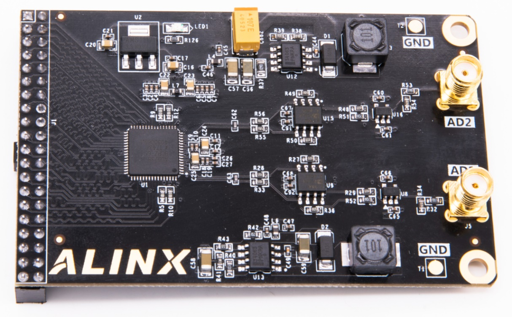
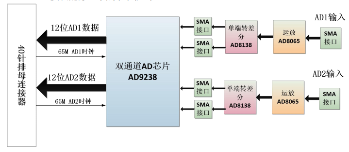
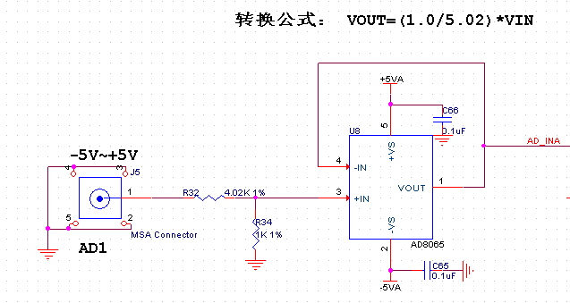
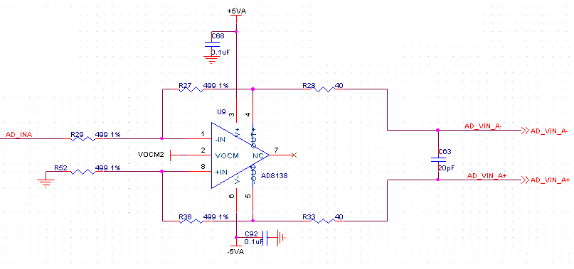
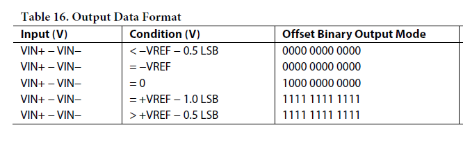
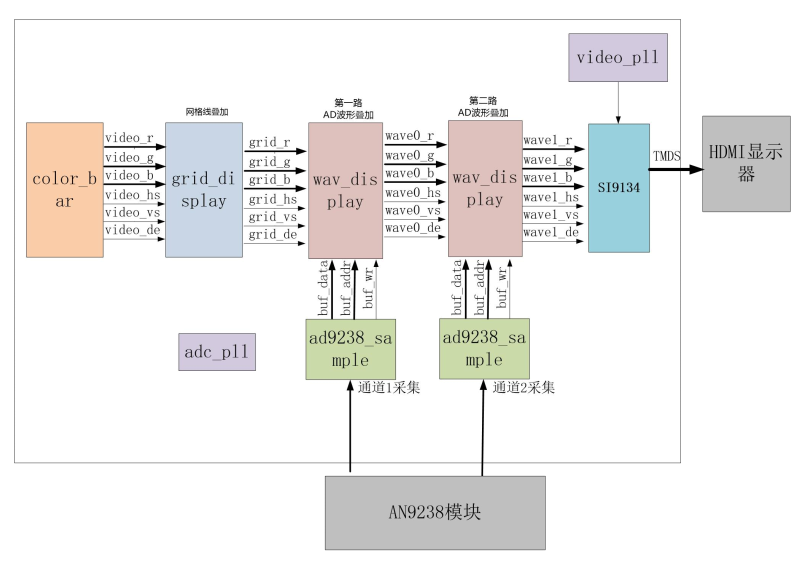
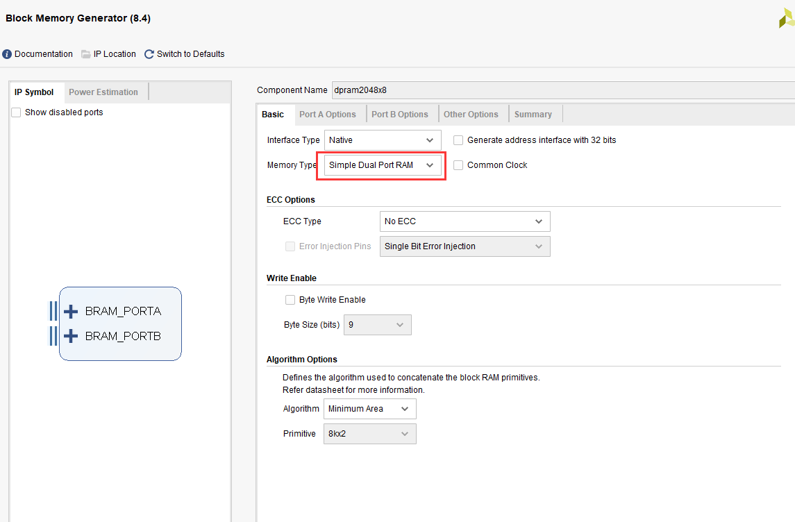
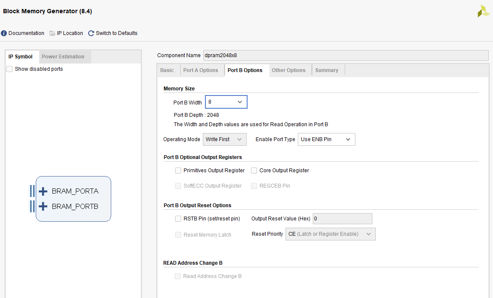
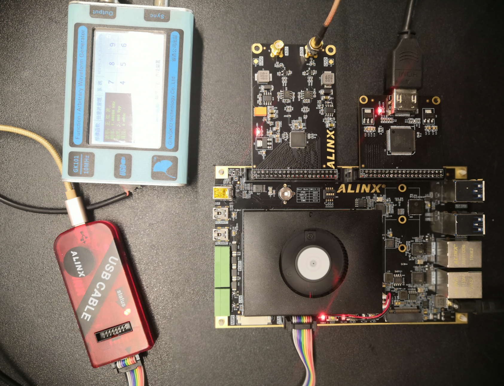
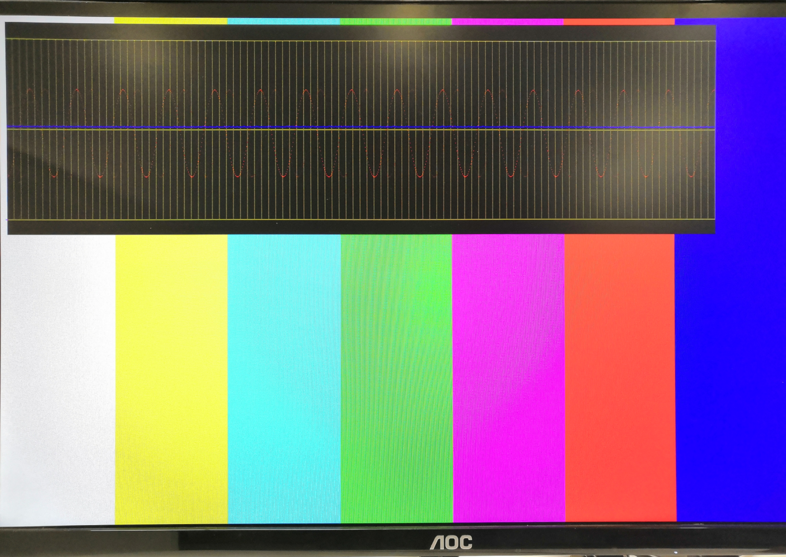

.. image:: images/images_0/88.png

============================================
"Chapter Eighteen" AD9238 Dual Channel Waveform Display Experiment
============================================
**Experimental Vivado project is "ad9238_hdmi_test".**

18.1 Hardware Introduction
============================================
18.1.1 Two-channel AD module description
----------------------------------------
The black gold high-speed AD module AN9238 is a 2-way 65MSPS, 12-bit analog signal to digital signal module. The AD conversion of the module adopts the AD9238 chip of ADI Company, and the AD9238 chip supports 2-way AD input conversion, so one piece of AD9238 chip supports 2-way AD input conversion in total. Analog signal input supports single-ended analog signal input, the input voltage range is -5V~+5V, and the interface is SMA socket.

The module has a 40-pin female header with a standard 2.54mm pitch, which is used to connect to the FPGA development board. The physical photos of the AN9238 module are as follows:

AN9238 module physical map

**Parameter Description**
The following are the detailed parameters of the AN9238 high-speed AD module:

- AD conversion chip: 1 AD9238
- AD conversion channel: 2 channels;
- AD sampling rate: 65MSPS;
- AD sampling data bits: 12 bits;
- Digital interface level standard: +3.3V CMOS level
- AD analog signal input range: -5V~+5V;
- Analog signal input interface: SMA interface;
- Measurement accuracy: about 10mV;
- Working temperature: -40°~85°;

18.1.2 Module function description
-----------------------------------------
**The principle design block diagram of the AN9238 module is as follows:**

Please refer to the AD9238 chip manual for the specific reference design of the AD9238 circuit.

1) Single-ended input and operational amplifier circuit

Single-ended input AD1 and AD2 are input through two SMA heads of J5 or J6, and the voltage of single-ended input is -5V~+5V.

On the board, the input voltage of -5V~+5V is reduced to -1V~+1V through the op amp AD8065 chip and the voltage divider resistor. If the user wants to input a wider range of voltage input, just modify the resistance of the front-end voltage divider resistor.

The following table is the analog input signal and the voltage comparison table after the AD8065 op amp output:

.. csv-table::
   :header: "AD analog input value", "AD8065 op amp output"
   :widths: 40, 40

   "-5V","-1V"
   "0V","0V"
   "+5V","+1V"

2) Single-ended to differential and AD conversion

The input voltage of -1V~+1V is converted into a differential signal (VIN+ − VIN−) by the AD8138 chip, and the common mode level of the differential signal is determined by the CML pin of the AD.

The following table is the voltage comparison table after the analog input signal to the AD8138 differential output:

.. csv-table::
   :header: "AD analog input value", "AD8065 operational amplifier output", "AD8138 differential output (VIN+−VIN−)"
   :widths: 30, 30, 30

   "-5V ",-1V ,"-1V"
   "0V ",0V ,"0V "
   "+5V ",+1V ,"+1V"

3) AD9238 conversion

The default AD is configured as offset binary, and the AD conversion value is shown in the following figure:

In the module circuit design, the VREF value of AD9238 is 1V, so the final analog signal input and AD conversion data are as follows:

.. csv-table::
   :header: "AD analog input value", "AD8055 op amp output", "AD8138 differential output (VIN+−VIN−)", "AD9238 digital output"
   :widths: 30, 30, 30, 30

   "-5V ",-1V ,-1V ,"000000000000"
   "0V ",0V ,0V ,"100000000000"
   "+5V ",+1V ,+1V ,"11111111111"

We can see from the table that when -5V is input, the digital value converted by AD9238 is the smallest, and when +5V is input, the digital value converted by AD9238 is the largest.

4) AD9238 digital output timing

The digital output of the AD9238 dual-channel AD is a +3.3V CMOS output mode, and 2 channels (A and B) have independent data and clock. The AD data converts data on the rising and falling edges of the clock, and the FPGA side can sample AD data with the AD clock.

.. image:: images/images_18/image6.png
    :align: center

18.2 Programming
============================================
The display part of this experiment is based on the previous HDMI display color bar experiment, and grid lines and waveforms are superimposed on the color bar. The block diagram of the entire project is shown in the figure below:

The ad9238_sample module mainly completes the single-channel data conversion of AN9238. The final data only takes the high 8-bit data, and the data width is converted to 8bit (in order to be compatible with other 8-bit AD module programs). In addition, collect 1280 data each time, and then wait for a period of time before continuing to collect the following 1280 data.

.. csv-table::
   :header: "Signal Name", "Direction", "Width (bit)", "Description"
   :widths: 20, 10, 10, 30

   "adc_clk ",in ,1 ,"ADC system clock"
   "rst ",in ,1 ,"Asynchronous reset, high reset"
   "adc_data ",in ,12 ,"ADC data input"
   "adc_buf_wr ",out ,1 ,"ADC data write enable"
   "adc_buf_addr ",out ,12 ,"ADC data write address"
   "adc_buf_data ",out ,8 ,"Unsigned 8-bit ADC data"

ad7606_sample module port

The grid_display module mainly completes the grid line superposition of the video image. In this experiment, the color bar video is input, and then a grid is superimposed and output. This grid area is provided for the subsequent waveform display module. This grid area is located at the display level. Direction (from left to right) from 9 to 1018, vertical direction (from top to bottom) from 9 to 308 video display position.

.. image:: images/images_18/image8.png
    :align: center

.. csv-table::
   :header: "Signal Name", "Direction", "Width (bit)", "Description"
   :widths: 20, 10, 10, 30

   "pclk ",in ,1 ,"Pixel Clock"
   "rst_n ",in ,1 ,"Asynchronous reset, low level reset"
   "i_hs ",in ,1 ,"Video Line Synchronization Input"
   "i_vs ",in ,1 ,"Video field sync input"
   "i_de ",in ,1 ,"Video data valid input"
   "i_data ",in ,24 ,"Video data input"
   "o_hs ",out ,1 ,"with grid video line synchronization output"
   "o_vs ",out ,1 ,"Video field synchronization output with grid"
   "o_de ",out ,1 ,"Video output with grid"
   "o_data ",out ,24 ,"with grid video data output"

grid_display module port

The wav_display display module mainly completes the superposition display of waveform data. The module contains a dual-port ram, the write port is written by the ADC acquisition module, and the read port is the display module. When the grid display area is valid, each line of display will read the AD data value stored in RAM, and compare it with the Y coordinate to determine whether to display the waveform or not.

.. image:: images/images_18/image9.png
    :align: center

.. csv-table::
   :header: "Signal Name", "Direction", "Width (bit)", "Description"
   :widths: 20, 10, 10, 30

   "pclk ",in ,1 ,"Pixel Clock"
   "rst_n ",in ,1 ,"Asynchronous reset, low level reset"
   "wave_color ",in ,24 ,"Wave color, rgb"
   "adc_clk ",in ,1 ,"ADC module clock"
   "adc_buf_wr ",in ,1 ,"ADC data write enable"
   "adc_buf_addr ",in ,12 ,"ADC data write address"
   "adc_buf_data ",in ,8 ,"ADC data, unsigned number"
   "i_hs ",in ,1 ,"Video Line Synchronization Input"
   "i_vs ",in ,1 ,"Video field sync input"
   "i_de ",in ,1 ,"Video data valid input"
   "i_data ",in ,24 ,"Video data input"
   "o_hs ",out ,1 ,"with grid video line synchronization output"
   "o_vs ",out ,1 ,"Video field synchronization output with grid"
   "o_de ",out ,1 ,"Video output with grid"
   "o_data ",out ,24 ,"with grid video data output"

wav_display module port

The configuration of RAM is as follows:

.. image:: images/images_18/image11.png
    :align: center

The timing_gen_xy module is a sub-module of other modules, which completes the coordinate generation of the video image, the x coordinate increases from left to right, and the y coordinate increases from top to bottom.

.. csv-table::
   :header: "Signal Name", "Direction", "Width (bit)", "Description"
   :widths: 20, 10, 10, 30

   "clk ",in ,1 ,"System clock"
   "rst_n ",in ,1 ,"Asynchronous reset, low level reset"
   "i_hs ",in ,1 ,"Video Line Synchronization Input"
   "i_vs ",in ,1 ,"Video field sync input"
   "i_de ",in ,1 ,"Video data valid input"
   "i_data ",in ,24 ,"Video data input"
   "o_hs ",out ,1 ,"Video line synchronization output"
   "o_vs ",out ,1 ,"Video field sync output"
   "o_de ",out ,1 ,"Video data valid output"
   "o_data ",out ,24 ,"Video data output"
   "x ",out ,12 ,"Coordinate x output"
   "y ",out ,12 ,"Coordinate y output"

timing_gen_xy module port

18.3 Experimental phenomena
============================================

The connection circuit is as follows. Adjust the frequency and amplitude of the signal generator. The input range of AN9238 is -5V-5V. In order to facilitate the observation of waveform data, it is recommended that the signal input frequency be 200Khz to 1Mhz. Observe the output of the display, the red waveform is CH1 input, the blue is CH2 input, the top horizontal line of the yellow grid represents 5V, the bottom horizontal line represents -5V, the middle horizontal line represents 0V, and the interval between each vertical line is 10 sampling points.

Hardware Connection Diagram

.. image:: images/images_0/888.png

*ZYNQ MPSoC Development Platform FPGA Tutorial* - `Alinx Official Website <https://www.alinx.com/en>`_