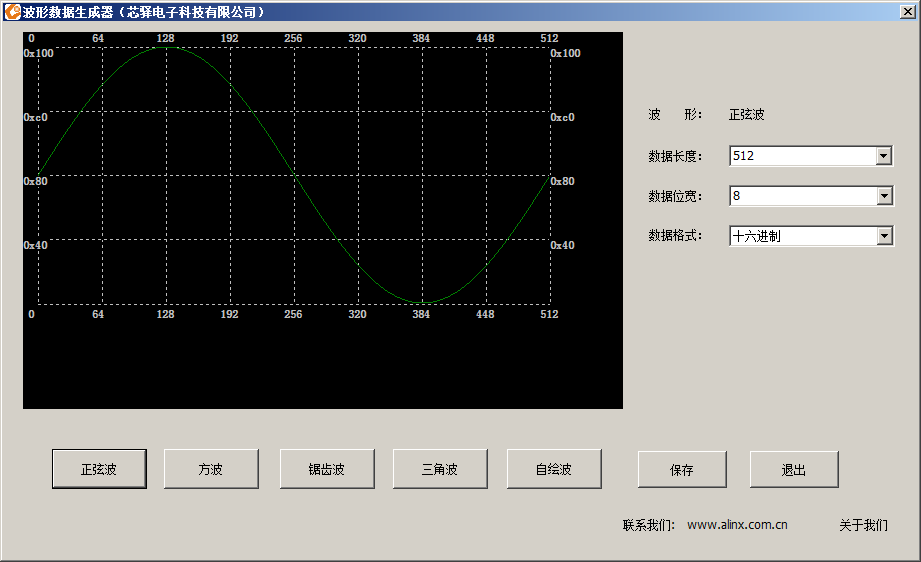

.. image:: images/images_0/88.png

============================================
"Chapter 19" ADDA Test Experiment
============================================
**The experimental Vivado project is "an108_adda_hdmi_test".**

This experiment uses ADC and DAC. The ADDA module model used in the experiment is AN108. The maximum sampling rate of ADC is 32Mhz and the precision is 8 bits. The maximum sampling rate of DAC is 125Mhz and the precision is 8 bits. In the experiment, the DAC is used to output the sine wave, and then the ADC is used to collect and display the waveform on the HDMI monitor.

.. image:: images/images_19/image1.png
    :align: center

ADDA module

.. image:: images/images_19/image2.png
    :align: center

Expected results of the experiment

19.1 Hardware Introduction
============================================

19.1.1 Digital-to-analog conversion (DA) circuit
----------------------------------------
As shown in the hardware structure diagram, the DA circuit is composed of a high-speed DA chip, a 7th-order Butterworth low-pass filter, an amplitude adjustment circuit and a signal output interface.

The high-speed DA chip we use is AD9708 launched by AD Company. AD9708 is an 8-bit, 125MSPS DA conversion chip with a built-in 1.2V reference voltage and differential current output. The internal structure of the chip is shown in the figure below

After the differential output of the AD9708 chip, in order to prevent noise interference, a 7th-order Butterworth low-pass filter is connected to the circuit with a bandwidth of 40MHz, and the frequency response is shown in the figure below

The filter parameters are shown in the figure below

After the filter, we use two pieces of high-performance 145MHz bandwidth operational amplifier AD8056 to realize the functions of differential conversion to single-ended and amplitude adjustment, which maximizes the performance of the entire circuit. For amplitude adjustment, a 5K potentiometer is used, and the final output range is -5V~5V (10Vpp).

*Note: Because the precision of the circuit is not very accurate, the final output has a certain error. It is possible that the waveform amplitude cannot reach 10Vpp, and there may be problems such as waveform clipping. These are normal conditions.*

19.1.2 Analog-to-digital conversion (AD) circuit
---------------------------------------
As shown in the hardware structure diagram, the AD circuit is composed of a high-speed AD chip, an attenuation circuit and a signal input interface.

The high-speed AD chip we use is an 8-bit AD9280 chip with a maximum sampling rate of 32MSPS launched by Analog Devices Company. The internal structure diagram is shown in the figure below.

According to the configuration in the figure below, we set the AD voltage input range as: 0V~2V

Before the signal enters the AD chip, we use an AD8056 chip to build an attenuation circuit, and the input range of the interface is -5V~+5V (10Vpp). After attenuation, the input range meets the input range of the AD chip (0~2V). The conversion formula is as follows:

.. image:: images/images_19/image9.png
    :align: center

When the input signal Vin=5(V), the signal Vad=2(V) input to AD;
When the input signal Vin=-5(V), the signal Vad=0(V) input to AD;

19.2 Programming
============================================
The program design of this experiment is basically similar to that of the AN706 waveform display experiment, except that the ADDA module is a single-channel AD, and here it is just the superposition of waveforms collected all the way. In addition, the FPGA generates sine wave data through the ROM IP and outputs it to the DA chip for DA conversion to generate a positive selection wave analog signal. The user only needs to connect the AD and DA ports of the module with a BNC line to form a loop. In this way, what is displayed on the HDMI monitor is the signal of the DA positive wave.

.. image:: images/images_19/image10.png
    :align: center

The ad9280_sample module mainly completes the AD 8-bit data acquisition and conversion of the ad9280, collects 1280 data each time, and then waits for a period of time before continuing to collect the next 1280 data.

.. csv-table::
   :header: "Signal Name", "Direction", "Width (bit)", "Description"
   :widths: 20, 10, 10, 30

   "adc_clk ",in ,1 ,"ADC system clock"
   "rst ",in ,1 ,"Asynchronous reset, high reset"
   "adc_data ",in ,8 ,"ADC data input"
   "adc_buf_wr ",out ,1 ,"ADC data write enable"
   "adc_buf_addr ",out ,12 ,"ADC data write address"
   "adc_buf_data ",out ,8 ,"Unsigned 8-bit ADC data"

ad9280_sample module port

The grid_display module mainly completes the grid line superposition of the video image. In this experiment, the color bar video is input, and then a grid is superimposed and output. This grid area is provided for the subsequent waveform display module. This grid area is located at the display level. Direction (from left to right) from 9 to 1018, vertical direction (from top to bottom) from 9 to 308 video display position.

.. image:: images/images_19/image11.png
    :align: center

.. csv-table::
   :header: "Signal Name", "Direction", "Width (bit)", "Description"
   :widths: 20, 10, 10, 30

   "pclk ",in ,1 ,"Pixel Clock"
   "rst_n ",in ,1 ,"Asynchronous reset, low level reset"
   "i_hs ",in ,1 ,"Video Line Synchronization Input"
   "i_vs ",in ,1 ,"Video field sync input"
   "i_de ",in ,1 ,"Video data valid input"
   "i_data ",in ,24 ,"Video data input"
   "o_hs ",out ,1 ,"with grid video line synchronization output"
   "o_vs ",out ,1 ,"Video field synchronization output with grid"
   "o_de ",out ,1 ,"Video output with grid"
   "o_data ",out ,24 ,"with grid video data output"

grid_display module port

The wav_display display module mainly completes the superposition display of waveform data. The module contains a dual-port ram, the write port is written by the ADC acquisition module, and the read port is the display module. When the grid display area is valid, each line of display will read the AD data value stored in RAM, and compare it with the Y coordinate to determine whether to display the waveform or not.

.. image:: images/images_19/image12.png
    :align: center

.. csv-table::
   :header: "Signal Name", "Direction", "Width (bit)", "Description"
   :widths: 20, 10, 10, 30

   "pclk ",in ,1 ,"Pixel Clock"
   "rst_n ",in ,1 ,"Asynchronous reset, low level reset"
   "wave_color ",in ,24 ,"wave color,rgb"
   "adc_clk ",in ,1 ,"ADC module clock"
   "adc_buf_wr ",in ,1 ,"ADC data write enable"
   "adc_buf_addr ",in ,12 ,"ADC data write address"
   "adc_buf_data ",in ,8 ,"ADC data, unsigned number"
   "i_hs ",in ,1 ,"Video Line Synchronization Input"
   "i_vs ",in ,1 ,"Video field sync input"
   "i_de ",in ,1 ,"Video data valid input"
   "i_data ",in ,24 ,"Video data input"
   "o_hs ",out ,1 ,"with grid video line synchronization output"
   "o_vs ",out ,1 ,"Video field synchronization output with grid"
   "o_de ",out ,1 ,"Video output with grid"
   "o_data ",out ,24 ,"with grid video data output"

wav_display module port

The timing_gen_xy module is a sub-module of other modules, which completes the coordinate generation of the video image, the x coordinate increases from left to right, and the y coordinate increases from top to bottom.

.. csv-table::
   :header: "Signal Name", "Direction", "Width (bit)", "Description"
   :widths: 20, 10, 10, 30

   "clk ",in ,1 ,"System clock"
   "rst_n ",in ,1 ,"Asynchronous reset, low level reset"
   "i_hs ",in ,1 ,"Video Line Synchronization Input"
   "i_vs ",in ,1 ,"Video field sync input"
   "i_de ",in ,1 ,"Video data valid input"
   "i_data ",in ,24 ,"Video data input"
   "o_hs ",out ,1 ,"Video line synchronization output"
   "o_vs ",out ,1 ,"Video field sync output"
   "o_de ",out ,1 ,"Video data valid output"
   "o_data ",out ,24 ,"Video data output"
   "x ",out ,12 ,"Coordinate x output"
   "y ",out ,12 ,"Coordinate y output"

timing_gen_xy module port

In addition, a ROM IP module is added in this routine, which needs to initialize data for ROM IP. Here we only introduce how to use the waveform data generation tool, find the tool under the software tool and driver folder, and its icon is as follows:

                                                        
1. Double-click the .exe to open the tool, and the opening interface is as follows:

.. image:: images/images_19/image14.png
    :align: center

2. You can choose the waveform according to your needs. In this example, select the sine wave, and keep the default data length and bit width.

3. Click the save button to save the generated data file to the project directory file (note the type of saved file):

.. image:: images/images_19/image16.png
    :align: center

4. After saving, the following dialog box appears, indicating that the save is successful, click OK and close the tool

Just save the .coe file to the generated Rom IP core, and I won’t repeat the introduction here

19.3 Experimental phenomena
============================================
Connect the DAC input of AN108 to the output of the signal generator. Here, a dedicated shielded wire is used. If other wires are used, there may be greater interference.

AN108 Connection Diagram

.. image:: images/images_19/image19.png
    :align: center

Hardware Connection Diagram

.. image:: images/images_19/image2.png
    :align: center

.. image:: images/images_0/888.png

*ZYNQ MPSoC Development Platform FPGA Tutorial* - `Alinx Official Website <https://www.alinx.com/en>`_