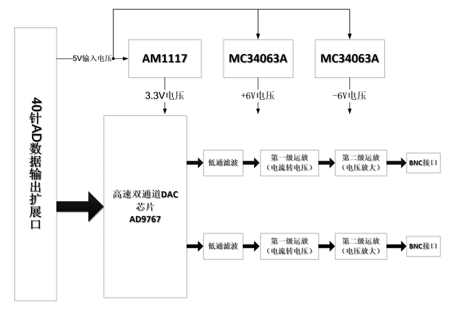
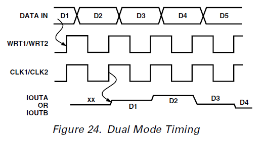
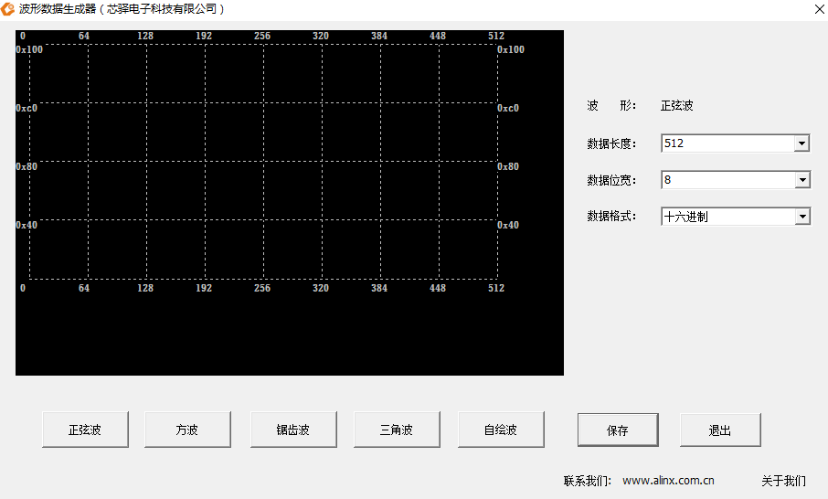
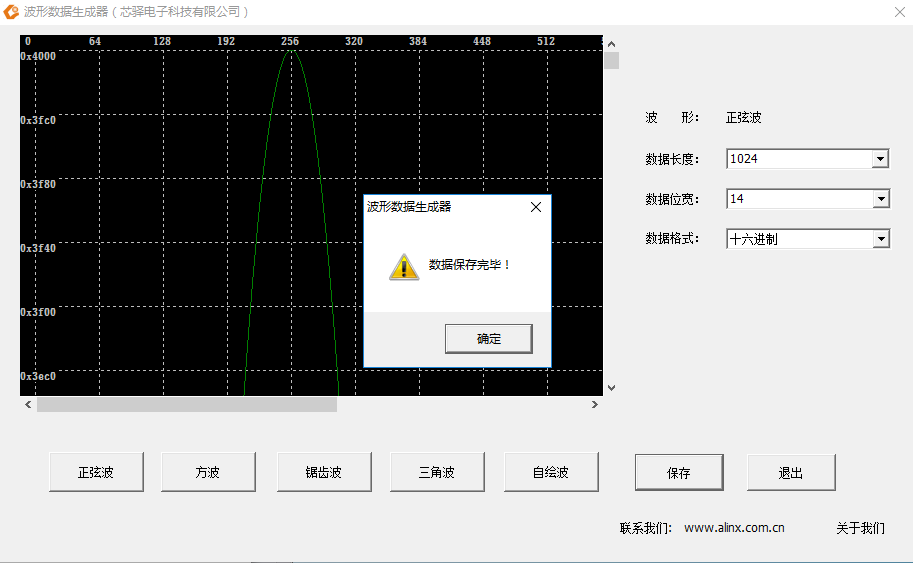
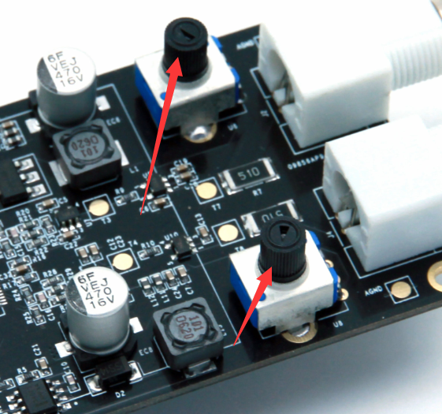

.. image:: images/images_0/88.png

============================================
"Chapter 20" AD9767 dual-channel sine wave generation experiment
============================================
**Experimental Vivado project is "ad9767_dual_sin_wave".**

This chapter introduces the experiment of using the AN9767 module to realize two-way sine wave generation.

20.1 Hardware Introduction
============================================
The dual-channel 14-bit DA output module AN9767 adopts the AD9767 chip of ANALOG DEVICES, and supports independent dual-channel, 14-bit, 125MSPS digital-to-analog conversion. The module has a 40-pin female header for connecting to the FPGA development board, and 2 BNC connectors for the output of analog signals.
The physical photos of the AN9767 module are as follows:

AN9767 Module Front View

AN9767 module rear view

20.1.1 Parameter description of AN9767 module
----------------------------------------
The following are the detailed parameters of the AN9767 dual-channel DA module:

- DA conversion chip: AD9767;
- Number of channels: 2 channels;
- DA conversion bit: 14bit;
- DA update rate: 125 MSPS;
- Output voltage range: -5V~+5V;
- Module PCB layers: 4 layers, independent power layer and GND layer;
- Module interface: 40-pin 2.54mm spacing row seat, direction downward;
- Working temperature: -40°~85° The chips used in the module meet the industrial temperature range
- Output interface: 2-way BNC analog output interface (can be directly connected to an oscilloscope with a BNC line);
  
20.1.2 Block Diagram of AN9767 Module
-----------------------------------------
The schematic design block diagram of the AN9767 module is as follows:

20.1.3 Introduction to AD9767 Chip
-----------------------------------------
The AD9767 is a dual-port, high-speed, dual-channel, 14-bit CMOS DAC. The chip integrates two high-quality TxDAC+® cores, a reference voltage source and digital interface circuits, and is packaged in a small 48-pin LQFP. The device provides excellent AC and DC performance while supporting update rates up to 125 MSPS. The functional block diagram of AD9767 is as follows:

.. image:: images/images_20/image4.png
    :align: center

20.1.4 Current-voltage conversion and amplification
--------------------------------------
The two DA outputs of AD9767 are the current output IoutA and IoutB in the form of complement code. When the AD9767 digital input is full-scale (the 14-bit data input by the DAC is high), IoutA outputs a full-scale current output of 20mA. The current output by IoutB is 0mA. The relationship between the specific current and the data of the DAC is shown in the following formula:

.. image:: images/images_20/image5.png
    :align: center

Among them IoutFS=32 x Iref. In the AN9767 module design, the value of Iref is determined by the value of resistor R16. If R16=19.2K, the value of Iref is 0.625mA. So the value of IoutFS is 20mA.

The current output by AD9767 is converted into a voltage of -1V~+1V through the first stage operational amplifier AD6045. The specific conversion circuit is shown in the figure below:

.. image:: images/images_20/image6.png
    :align: center

The -1V~+1V voltage converted by the first-stage operational amplifier is transformed into a higher-amplitude voltage signal through the second-stage operational amplifier. The amplitude of this operational amplifier can be changed by adjusting the adjustable resistor on the board. Through the second-stage operational amplifier, the output range of the analog signal is as high as -5V~+5V.

The following table is a comparison table of the digital input signal and the voltage after the output of op amps at all levels:

.. csv-table::
   :header: "DAC data input value", "AD9767 current output", "first stage op amp output", "second stage op amp output"
   :widths: 20, 20, 20, 20

   "3fff(14 bit full height) ",+20mA ,-1V ,"+5V"
   "0(14 bit all low) ",-20mA ,+1V ,"-5V"
   "2000(middle value)", 0mA, 0V, "0V"

20.1.5 Current-voltage conversion and amplification

The digital interface of the AD9767 chip can be configured as a dual-port mode (Dual) or a crossover (Interleaved) mode through the mode pin (MODE) of the chip. In the AN9767 module design, the AD9767 chip works in dual-port mode, and the dual-channel DA digital input interface is separated independently. The data timing diagram of dual-port mode (Dual) is shown in the figure below:

The DA data for the AD9767 chip is input to the chip through the clock CLK and the rising edge of the write signal WRT for DA conversion.

20.2 Programming
============================================
The DA test program of the AN9767 module is provided in the routine, and the output of the sine wave signal is realized through the AN9767 module.
The positive selection wave test program reads the positive selection wave data stored in a ROM inside the FPGA, and then outputs the positive selection wave data to the AN9767 module for digital-to-analog conversion, thereby obtaining the positive selection wave analog signal. The schematic diagram of the positive selection wave test procedure is as follows:

20.2.1 Generate ROM initialization file
---------------------------------------
In the program, we will use a ROM to store 1024 pieces of 14-bit sine wave data. First, we need to prepare the initialization file of the ROM (if it is an ALTERA development board, it is a mif file, and if it is a Xilinx development board, it is a coe file). The following is the method to generate the sine wave ROM data file:
Find the tool under the software tool and driver folder, and its icon is as follows:

.. image:: images/images_20/image10.png
    :align: center
                                                        
1. Double-click the .exe to open the tool, and the opening interface is as follows:

                  
2. You can choose the waveform according to your needs. In this example, choose a sine wave, the data length is 1024, and the data bit width is 14. Other defaults:

.. image:: images/images_20/image12.png
    :align: center
       
3. Click the save button to save the generated data file to the project directory file (note the type of saved file):

.. image:: images/images_20/image13.png
    :align: center
         
4. After saving, the following dialog box appears, indicating that the save is successful, click OK and close the tool

                   
Just save the .coe file to the generated Rom IP core. It has been introduced in the character display experiment tutorial and will not be repeated here.

20.2.2 Dual channel sine wave generation program
---------------------------------------
::

 `timescale 1ns / 1ps
 //////////////////////////////////////////////////////////////////////////////////
 //Two sine wave outputs -10V ~ +10V
 //////////////////////////////////////////////////////////////////////////////////
 module ad9767_test
 (
 //Differential system clock
     input                   	sys_clk_p,
     input                   	sys_clk_n,
 output da1_clk,             //AD9767 CH1 clock
 output da1_wrt,             //AD9767 CH1 enable
 output [13:0] da1_data,     //AD9767 CH1 data output
 
 output da2_clk,             //AD9767 CH2 clock
 output da2_wrt,             //AD9767 CH2 enable
 output [13:0] da2_data      //AD9767 CH2 data output
 
 );
 
 reg [9:0] rom_addr;
 
 wire [13:0] rom_data;
 wire clk_125M;
 
 
 assign da1_clk=clk_125M;
 assign da1_wrt=clk_125M;
 assign da1_data=rom_data;
 
 assign da2_clk=clk_125M;
 assign da2_wrt=clk_125M;
 assign da2_data=rom_data;
 
 
 //DA output sin waveform
 always @(negedge clk_125M)
 begin
  rom_addr <= rom_addr + 1'b1 ;              //The output sine wave frequency is 122Khz
  // rom_addr <= rom_addr + 4 ;              //The output sine wave frequency is 488Khz
  // rom_addr <= rom_addr + 128 ;            //The output sine wave frequency is 15.6Mhz                             
 end 
 
 
 
 ROM ROM_inst
 (
 .clka(clk_125M), // input clka
 .addra(rom_addr), // input [8 : 0] addra
 .douta(rom_data) // output [7 : 0] douta
 );
 
 
 PLL PLL_inst
 (// Clock in ports
 .clk_in1_p    (sys_clk_p        ),       // IN
 .clk_in1_n    (sys_clk_n        ),       // IN
 // Clock out ports
 .clk_out1   (               ),           // OUT
 .clk_out2   (clk_125M       ),           // OUT
 // Status and control signals
 .reset      (1'b0           ),           // IN
 .locked     (               )
 );      
 
 endmodule

In the program, a PLL IP is used to generate a 125M DA output clock, and then cyclically read 1024 data stored in the ROM, and output to the DA data lines of channel 1 and channel 2 at the same time. In the program, you can choose to output sine waves with different frequencies by adding 1, 4, or 128 to the address.

20.3 Experimental phenomena
============================================
Insert the AN9767 module into the J11 expansion port of the development board, use the BNC cable we provide to connect the output of the AN9767 to the input of the oscilloscope as shown in the figure below, then power on the development board, download the program and observe the analog signal output from the DA module on the oscilloscope wave.

.. image:: images/images_20/image15.png
    :align: center
       
Hardware Connection Diagram

The sine wave seen on the oscilloscope is as follows:

       
We can modify the address in the program to +4, as follows, so that the output points of a sine wave are 256, and the frequency of the output sine wave will be increased by 4 times:

.. image:: images/images_20/image17.png
    :align: center
       
After the program is modified and the FPGA is re-downloaded, the frequency of the sine wave becomes higher, and the waveform displayed by the oscilloscope is as follows:

.. image:: images/images_20/image18.png
    :align: center
       
Users can also change the amplitude of the output waveforms of the two channels by adjusting the adjustable resistors on the AN9767 module.

       
.. image:: images/images_0/888.png

*ZYNQ MPSoC Development Platform FPGA Tutorial* - `Alinx Official Website <https://www.alinx.com/en>`_