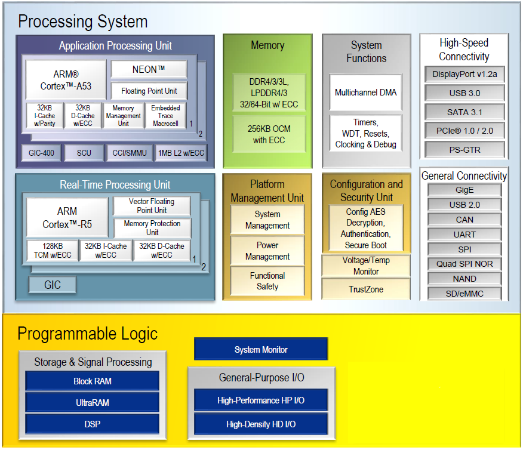
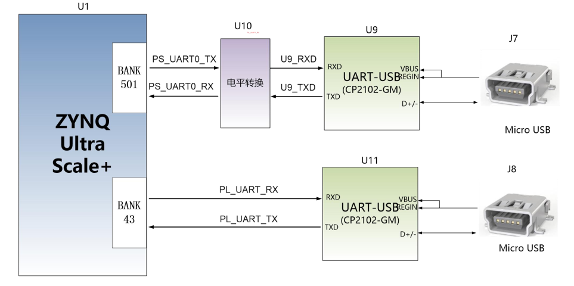

.. image:: images/images_0/88.png

============================================
"Chapter Two" Development Board Hardware Introduction
============================================

- Xinyi Electronic Technology (Shanghai) Co., Ltd. The 2020 model of the development board (model: AXU3EG) based on the XILINX Zynq UltraScale+ MPSoCs development platform has been officially released. In order to let you quickly understand this development platform, we have compiled this user manual.
- This MPSoCs development platform adopts the mode of core board plus expansion board, which is convenient for users to develop and utilize the core board twice. The core board uses the solution of XILINX Zynq UltraScale+ EG chip ZU3EG, which uses Processing System (PS) + Programmable Logic (PL) technology to integrate dual-core ARM Cortex-A53 and FPGA programmable logic on one chip. In addition, there are four 4GB high-speed DDR4 SDRAM chips, one 8GB eMMC memory chip and one 256Mb QSPI FLASH chip on the PS end of the core board; one 1GB DDR4 SDRAM chip on the PL end on the core board.
- In terms of baseboard design, we have expanded a wealth of peripheral interfaces for users, such as 1 FMC LPC interface, 1 SATA M.2 interface, 1 DP interface, 1 USB3.0 interface, 1 Gigabit Ethernet interface, 1 UART serial interface, 1 SD card interface, 2 40-pin expansion interfaces, 2 CAN bus interfaces, 2 RS485 interfaces, etc. It is a "professional" ZYNQ development platform that meets the requirements of users for various high-speed data exchange, data storage, video transmission processing, deep learning, artificial intelligence and industrial control. It provides possibility for high-speed data transmission and exchange, pre-verification and post-application of data processing. It is believed that such a product is very suitable for students, engineers and other groups engaged in the development of MPSoCs.

.. image:: images/images_2/image1.png
    :align: center

- Here, a brief function introduction of this AXU3EG MPSoCs development platform is given.
- The entire structure of the development board is designed by inheriting our consistent core board + expansion board mode. The core board and the expansion board are connected using a high-speed board-to-board connector.
- The core board is mainly composed of the minimum system of ZU3EG + 5 DDR4 + eMMC + 1 QSPI FLASH. ZU3EG adopts Zynq UltraScale+ MPSoCs EG series chip of Xilinx Company, the model is XCZU3EG-1SFVC784I. ZU3EG chip can be divided into processor system part Processor System (PS) and programmable logic part Programmable Logic (PL). On the PS end and PL end of the ZU3EG chip, 4 pieces and 1 piece of DDR4 are hung respectively, and the capacity of each piece of DDR4 is as high as 1G bytes, so that the ARM system and the FPGA system can independently process and store data. The 8GB eMMC FLASH memory chip on the PS side and a 256Mb QSPI FLASH are used to statically store the operating system, file system and user data of MPSoCs.
- The bottom board expands the rich peripheral interfaces for the core board, including 1 M.2 interface, 1 DP interface, 4 USB3.0 interfaces, 2 Gigabit Ethernet interfaces, 2 UART serial ports, and 1 SD interface Card interface, 2 40-pin expansion interfaces, 2 CAN bus interfaces, 2 RS485 interfaces, 1 MIPI interface and some button LEDs.

The following figure is a schematic diagram of the structure of the entire development system:

Through this schematic diagram, we can see the interfaces and functions that our development platform can contain.

- ZU3EG core board
   It is composed of ZU3EG + 4GB DDR4(PS) + 1GB DDR4(PL) + 8GB eMMC FLASH + 256Mb QSPI FLASH and there are two crystal oscillators to provide clock, one single-ended 33.3333MHz crystal oscillator is provided for PS system, and one differential 200MHz crystal oscillator is provided for PL Logical DDR reference clock.
- M.2 interface
   1 PCIEx1 standard M.2 interface, used to connect M.2 SSD solid-state hard disk, the communication speed is up to 6Gbps.
- DP output interface
   1 standard Display Port output display interface for displaying video images. Support up to 4K@30Hz or 1080P@60Hz output.
- USB3.0 interface
   4-way USB3.0 HOST interface, USB interface type is TYPE A. Used to connect external USB peripherals, such as connecting a mouse, keyboard, U disk, etc.
- Gigabit Ethernet interface
   2 10/100M/1000M Ethernet RJ45 interfaces, 1 for PS and 1 for PL. Used for Ethernet data exchange with computers or other network devices.
- USB UART interface
   2 UART to USB ports, 1 for PS and 1 for PL. It is used to communicate with the computer, which is convenient for users to debug. The serial port chip adopts the USB-UAR chip of Silicon Labs CP2102GM, and the USB interface adopts the MINI USB interface.
- Micro SD card holder
   1-way Micro SD card slot for storing operating system images and file systems.
- 40-pin extension port
   Two 40-pin 2.54mm pitch expansion ports can be connected to various modules of Heijin (binocular camera, TFT LCD screen, high-speed AD module, etc.). The expansion port includes 1 channel of 5V power supply, 2 channels of 3.3V power supply, 3 channels of ground, and 34 channels of IO ports.
- CAN communication interface
   2-way CAN bus interface, choose TI's SN65HVD232 chip, and the interface uses 4Pin green terminal blocks.
- 485 communication interface
   The 2-way 485 communication interface uses the MAX3485 chip of MAXIM Company. The interface adopts 6Pin green terminals.
-MIPI interface
   2 MIPI camera input ports of LANE, used to connect MIPI camera module (AN5641).
- JTAG debug port
   One 10-pin 2.54mm standard JTAG port, used for downloading and debugging of FPGA programs, users can debug and download the ZU3EG system through the XILINX downloader.
- Temperature and humidity sensor
   There is a temperature and humidity sensor chip LM75 on board, which is used to detect the temperature and humidity of the surrounding environment of the board.
-EEPROM
   1 piece of EEPROM 24LC04 with IIC interface;
- RTC real time clock
   1 built-in RTC real-time clock;
- LED lights
   5 LEDs, 2 on the core board and 3 on the bottom board. There is a power indicator light and a DONE configuration indicator light on the core board. There is 1 power indicator light and 2 user indicator lights on the bottom board.
- Button
   3 buttons, 1 reset button, 2 user buttons.

2.1 ACU3EG core board
=======================
2.1.1 Introduction
--------------------

- ACU3EG (**core board model, the same below**) core board, ZYNQ chip is based on XCZU3EG-1SFVC784I of XILINX's Zynq UltraScale+ MPSoCs EG series.
- This core board uses 5 pieces of Micron's DDR4 chip MT40A512M16GE, of which 4 pieces of DDR4 are mounted on the PS side to form a 64-bit data bus bandwidth and a capacity of 4GB. One chip is mounted on the PL end, which has a data bus width of 16 bits and a capacity of 1GB. The maximum operating speed of DDR4 SDRAM on the PS side can reach 1200MHz (data rate 2400Mbps), and the maximum operating speed of DDR4 SDRAM on the PL side can reach 1066MHz (data rate 2132Mbps). In addition, a 256MBit QSPI FLASH chip and an 8GB eMMC FLASH chip are also integrated on the core board to start storage configuration and system files.
- In order to connect with the bottom board, the 4 board-to-board connectors of this core board extend the USB2.0 interface on the PS side, Gigabit Ethernet interface, SD card interface and other remaining MIO ports; also expand 4 pairs PS MGT high-speed transceiver interface; and almost all IO ports on the PL side (HP I/O: 96, HD I/O: 84), the wiring between the XCZU3EG chip and the interface has been processed with equal length and differential processing, and the core The board size is only 80*60(mm), which is very suitable for secondary development.

.. image:: images/images_2/image3.png
    :align: center

**ACU3EG core board front view**

2.1.2 ZYNQ chip
--------------------

- The development board uses Xilinx's Zynq UltraScale+ MPSoCs EG series chips, model XCZU3EG-1SFVC784I. The PS system of the ZU3EG chip integrates 4 ARM Cortex™-A53 processors with a speed of up to 1.2Ghz and supports level 2 Cache. It also includes 2 Cortex-R5 processors with a speed of up to 500Mhz.
- The ZU3EG chip supports 32-bit or 64-bit DDR4, LPDDR4, DDR3, DDR3L, LPDDR3 memory chips, and has rich high-speed interfaces on the PS side such as PCIE Gen2, USB3.0, SATA 3.1, DisplayPort, it also supports USB2. 0, Gigabit Ethernet, SD/SDIO, I2C, CAN, UART, GPIO and other interfaces. The PL side contains rich programmable logic units, DSP and internal RAM. The overall block diagram of the ZU3EG chip is shown in Figure 2-2-1

Figure 2-2-1 Overall block diagram of ZYNQ ZU3EG chip
The main parameters of the PS system part are as follows:

- ARM quad-core Cortex™-A53 processor, speed up to 1.2GHz, each CPU 32KB level 1 instruction and data cache, 1MB level 2 cache shared by 2 CPUs.
- ARM dual-core Cortex-R5 processor, speed up to 500MHz, each CPU 32KB level 1 instruction and data cache, and 128K tightly coupled memory.
- External storage interface, support 32/64bit DDR4/3/3L, LPDDR4/3 interface.
- Static storage interface, support NAND, 2xQuad-SPI FLASH.
- High-speed connection interface, supports PCIe Gen2 x4, 2xUSB3.0, Sata 3.1, DisplayPort, 4x Tri-mode Gigabit Ethernet.
- Common connection interface: 2xUSB2.0, 2x SD/SDIO, 2x UART, 2x CAN 2.0B, 2x I2C, 2x SPI, 4x 32b GPIO.
- Power Management: Support the division of Full/Low/PL/Battery four-part power supply.
- Encryption algorithm: support RSA, AES and SHA.
- System monitoring: 10-bit 1Mbps AD sampling for temperature and voltage detection.

The main parameters of the PL logic part are as follows:

- Logic Cells:154K;
- Flip-flops: 141K;
- Lookup table LUTs : 71K;
- Block RAM: 9.4Mb;
- Clock Management Units (CMTs): 3
- Multiplier 18x25MACCs: 360

**The speed grade of XCZU3EG-1SFVC784I chip is -1, industrial grade, and the package is SFVC784.**

2.1.3 DDR4 DRAM
----------------------
  The ACU3EG core board is equipped with 5 pieces of Micron (Micron) 512MB DDR4 chips, the model is MT40A512M16GE-083E, of which 4 pieces of DDR4 are mounted on the PS side, forming a 64-bit data bus bandwidth and a capacity of 4GB. One chip is mounted on the PL end, which has a data bus width of 16 bits and a capacity of 1GB. The maximum operating speed of the DDR4 SDRAM on the PS side can reach 1200MHz (data rate 2400Mbps), and the 4 pieces of DDR4 storage system are directly connected to the memory interface of the BANK504 of the PS. The maximum operating speed of DDR4 SDRAM on the PL side can reach 1066MHz (data rate 2133Mbps), and a piece of DDR4 is connected to the BANK64 interface of the FPGA. The specific configuration of DDR4 SDRAM is shown in Table 2-3-1 below.

.. csv-table:: 
  :header: "Tag", "Chip Type", "Capacity", "Manufacturer"
  :widths: 30, 30, 30,20

  "U12,U14,U15,U16", MT40A512M16GE-083E, 512M x 16bit, "Micron"

Table 2-3-1 DDR4 SDRAM configuration
The hardware design of DDR4 needs to strictly consider the signal integrity. We have fully considered the matching resistor/terminal resistor, trace impedance control, and trace length control in the circuit design and PCB design to ensure the high-speed and stable operation of DDR4.

The hardware connection method of DDR4 on the PS side is shown in Figure 2-3-1:

.. image:: images/images_2/image5.png
    :align: center

Figure 2-3-1 The schematic diagram of DDR4 DRAM on the PS side

The hardware connection method of DDR4 DRAM on the PL side is shown in Figure 2-3-2:

.. image:: images/images_2/image6.png
    :align: center

Figure 2-3-2 PL side DDR4 DRAM schematic diagram part

PS side DDR4 SDRAM pin assignment
=========================

.. csv-table:: 
  :header: "Signal Name", "Pin Name", "Pin Number"
  :widths: 30, 30, 20

		
  "PS_DDR4_DQS0_P	    ",PS_DDR_DQS_P0_504	   ,"AF21"
  "PS_DDR4_DQS0_N	    ",PS_DDR_DQS_N0_504	   ,"AG21"
  "PS_DDR4_DQS1_P	    ",PS_DDR_DQS_P1_504	   ,"AF23"
  "PS_DDR4_DQS1_N	    ",PS_DDR_DQS_N1_504	   ,"AG23"
  "PS_DDR4_DQS2_P	    ",PS_DDR_DQS_P2_504	   ,"AF25"
  "PS_DDR4_DQS2_N	    ",PS_DDR_DQS_N2_504	   ,"AF26"
  "PS_DDR4_DQS3_P	    ",PS_DDR_DQS_P3_504	   ,"AE27"
  "PS_DDR4_DQS3_N	    ",PS_DDR_DQS_N3_504	   ,"AF27"
  "PS_DDR4_DQS4_P	    ",PS_DDR_DQS_P4_504	   ,"N23"
  "PS_DDR4_DQS4_N	    ",PS_DDR_DQS_N4_504	   ,"M23"
  "PS_DDR4_DQS5_P	    ",PS_DDR_DQS_P5_504	   ,"L23"
  "PS_DDR4_DQS5_N	    ",PS_DDR_DQS_N5_504	   ,"K23"
  "PS_DDR4_DQS6_P	    ",PS_DDR_DQS_P6_504	   ,"N26"
  "PS_DDR4_DQS6_N	    ",PS_DDR_DQS_N6_504	   ,"N27"
  "PS_DDR4_DQS7_P	    ",PS_DDR_DQS_P7_504	   ,"J26"
  "PS_DDR4_DQS7_N	    ",PS_DDR_DQS_N7_504	   ,"J27"
  "PS_DDR4_DQ0  	    ",PS_DDR_DQ0_504	   ,"AD21"
  "PS_DDR4_DQ1  	    ",PS_DDR_DQ1_504	   ,"AE20"
  "PS_DDR4_DQ2  	    ",PS_DDR_DQ2_504	   ,"AD20"
  "PS_DDR4_DQ3  	    ",PS_DDR_DQ3_504	   ,"AF20"
  "PS_DDR4_DQ4  	    ",PS_DDR_DQ4_504	   ,"AH21"
  "PS_DDR4_DQ5  	    ",PS_DDR_DQ5_504	   ,"AH20"
  "PS_DDR4_DQ6  	    ",PS_DDR_DQ6_504	   ,"AH19"
  "PS_DDR4_DQ7  	    ",PS_DDR_DQ7_504	   ,"AG19"
  "PS_DDR4_DQ8  	    ",PS_DDR_DQ8_504	   ,"AF22"
  "PS_DDR4_DQ9  	    ",PS_DDR_DQ9_504	   ,"AH22"
  "PS_DDR4_DQ10 	    ",PS_DDR_DQ10_504	   ,"AE22"
  "PS_DDR4_DQ11 	    ",PS_DDR_DQ11_504	   ,"AD22"
  "PS_DDR4_DQ12 	    ",PS_DDR_DQ12_504	   ,"AH23"
  "PS_DDR4_DQ13 	    ",PS_DDR_DQ13_504	   ,"AH24"
  "PS_DDR4_DQ14 	    ",PS_DDR_DQ14_504	   ,"AE24"
  "PS_DDR4_DQ15 	    ",PS_DDR_DQ15_504	   ,"AG24"
  "PS_DDR4_DQ16 	    ",PS_DDR_DQ16_504	   ,"AC26"
  "PS_DDR4_DQ17 	    ",PS_DDR_DQ17_504	   ,"AD26"
  "PS_DDR4_DQ18 	    ",PS_DDR_DQ18_504	   ,"AD25"
  "PS_DDR4_DQ19 	    ",PS_DDR_DQ19_504	   ,"AD24"
  "PS_DDR4_DQ20 	    ",PS_DDR_DQ20_504	   ,"AG26"
  "PS_DDR4_DQ21 	    ",PS_DDR_DQ21_504	   ,"AH25"
  "PS_DDR4_DQ22 	    ",PS_DDR_DQ22_504	   ,"AH26"
  "PS_DDR4_DQ23 	    ",PS_DDR_DQ23_504	   ,"AG25"
  "PS_DDR4_DQ24 	    ",PS_DDR_DQ24_504	   ,"AH27"
  "PS_DDR4_DQ25 	    ",PS_DDR_DQ25_504	   ,"AH28"
  "PS_DDR4_DQ26 	    ",PS_DDR_DQ26_504	   ,"AF28"
  "PS_DDR4_DQ27 	    ",PS_DDR_DQ27_504	   ,"AG28"
  "PS_DDR4_DQ28 	    ",PS_DDR_DQ28_504	   ,"AC27"
  "PS_DDR4_DQ29 	    ",PS_DDR_DQ29_504	   ,"AD27"
  "PS_DDR4_DQ30 	    ",PS_DDR_DQ30_504	   ,"AD28"
  "PS_DDR4_DQ31 	    ",PS_DDR_DQ31_504	   ,"AC28"
  "PS_DDR4_DQ32 	    ",PS_DDR_DQ32_504	   ,"T22"
  "PS_DDR4_DQ33 	    ",PS_DDR_DQ33_504	   ,"R22"
  "PS_DDR4_DQ34 	    ",PS_DDR_DQ34_504	   ,"P22"
  "PS_DDR4_DQ35 	    ",PS_DDR_DQ35_504	   ,"N22"
  "PS_DDR4_DQ36 	    ",PS_DDR_DQ36_504	   ,"T23"
  "PS_DDR4_DQ37 	    ",PS_DDR_DQ37_504	   ,"P24"
  "PS_DDR4_DQ38 	    ",PS_DDR_DQ38_504	   ,"R24"
  "PS_DDR4_DQ39 	    ",PS_DDR_DQ39_504	   ,"N24"
  "PS_DDR4_DQ40 	    ",PS_DDR_DQ40_504	   ,"H24"
  "PS_DDR4_DQ41 	    ",PS_DDR_DQ41_504	   ,"J24"
  "PS_DDR4_DQ42 	    ",PS_DDR_DQ42_504	   ,"M24"
  "PS_DDR4_DQ43 	    ",PS_DDR_DQ43_504	   ,"K24"
  "PS_DDR4_DQ44 	    ",PS_DDR_DQ44_504	   ,"J22"
  "PS_DDR4_DQ45 	    ",PS_DDR_DQ45_504	   ,"H22"
  "PS_DDR4_DQ46 	    ",PS_DDR_DQ46_504	   ,"K22"
  "PS_DDR4_DQ47 	    ",PS_DDR_DQ47_504	   ,"L22"
  "PS_DDR4_DQ48 	    ",PS_DDR_DQ48_504	   ,"M25"
  "PS_DDR4_DQ49 	    ",PS_DDR_DQ49_504	   ,"M26"
  "PS_DDR4_DQ50 	    ",PS_DDR_DQ50_504	   ,"L25"
  "PS_DDR4_DQ51 	    ",PS_DDR_DQ51_504	   ,"L26"
  "PS_DDR4_DQ52 	    ",PS_DDR_DQ52_504	   ,"K28"
  "PS_DDR4_DQ53 	    ",PS_DDR_DQ53_504	   ,"L28"
  "PS_DDR4_DQ54 	    ",PS_DDR_DQ54_504	   ,"M28"
  "PS_DDR4_DQ55 	    ",PS_DDR_DQ55_504	   ,"N28"
  "PS_DDR4_DQ56 	    ",PS_DDR_DQ56_504	   ,"J28"
  "PS_DDR4_DQ57 	    ",PS_DDR_DQ57_504	   ,"K27"
  "PS_DDR4_DQ58 	    ",PS_DDR_DQ58_504	   ,"H28"
  "PS_DDR4_DQ59 	    ",PS_DDR_DQ59_504	   ,"H27"
  "PS_DDR4_DQ60 	    ",PS_DDR_DQ60_504	   ,"G26"
  "PS_DDR4_DQ61 	    ",PS_DDR_DQ61_504	   ,"G25"
  "PS_DDR4_DQ62 	    ",PS_DDR_DQ62_504	   ,"K25"
  "PS_DDR4_DQ63 	    ",PS_DDR_DQ63_504	   ,"J25"
  "PS_DDR4_DM0  	    ",PS_DDR_DM0_504	   ,"AG20"
  "PS_DDR4_DM1  	    ",PS_DDR_DM1_504	   ,"AE23"
  "PS_DDR4_DM2  	    ",PS_DDR_DM2_504	   ,"AE25"
  "PS_DDR4_DM3  	    ",PS_DDR_DM3_504	   ,"AE28"
  "PS_DDR4_DM4  	    ",PS_DDR_DM4_504	   ,"R23"
  "PS_DDR4_DM5  	    ",PS_DDR_DM5_504	   ,"H23"
  "PS_DDR4_DM6  	    ",PS_DDR_DM6_504	   ,"L27"
  "PS_DDR4_DM7  	    ",PS_DDR_DM7_504	   ,"H26"
  "PS_DDR4_A0 	        ",PS_DDR_A0_504	       ,"W28"
  "PS_DDR4_A1 	        ",PS_DDR_A1_504	       ,"Y28"
  "PS_DDR4_A2 	        ",PS_DDR_A2_504	       ,"AB28"
  "PS_DDR4_A3 	        ",PS_DDR_A3_504	       ,"AA28"
  "PS_DDR4_A4 	        ",PS_DDR_A4_504	       ,"Y27"
  "PS_DDR4_A5 	        ",PS_DDR_A5_504	       ,"AA27"
  "PS_DDR4_A6 	        ",PS_DDR_A6_504	       ,"Y22"
  "PS_DDR4_A7 	        ",PS_DDR_A7_504	       ,"AA23"
  "PS_DDR4_A8 	        ",PS_DDR_A8_504	       ,"AA22"
  "PS_DDR4_A9 	        ",PS_DDR_A9_504	       ,"AB23"
  "PS_DDR4_A10  	    ",PS_DDR_A10_504	   ,"AA25"
  "PS_DDR4_A11  	    ",PS_DDR_A11_504	   ,"AA26"
  "PS_DDR4_A12  	    ",PS_DDR_A12_504	   ,"AB25"
  "PS_DDR4_A13  	    ",PS_DDR_A13_504	   ,"AB26"
  "PS_DDR4_WE_B  	    ",PS_DDR_A14_504	   ,"AB24"
  "PS_DDR4_CAS_B  	    ",PS_DDR_A15_504	   ,"AC24"
  "PS_DDR4_RAS_B  	    ",PS_DDR_A16_504	   ,"AC23"
  "PS_DDR4_ACT_B  	    ",PS_DDR_ACT_N_504	   ,"Y23"
  "PS_DDR4_ALERT_B  	",PS_DDR_ALERT_N_504   ,"U25"
  "PS_DDR4_BA0  	    ",PS_DDR_BA0_504	   ,"V23"
  "PS_DDR4_BA1  	    ",PS_DDR_BA1_504	   ,"W22"
  "PS_DDR4_BG0  	    ",PS_DDR_BG0_504	   ,"W24"
  "PS_DDR4_CS0_B	    ",PS_DDR_CS_N0_504	   ,"W27"
  "PS_DDR4_ODT0	        ",PS_DDR_ODT0_504	   ,"U28"
  "PS_DDR4_PARITY	    ",PS_DDR_PARITY_504    ,"V24"
  "PS_DDR4_RESET_B      ",PS_DDR_RST_N_504     ,"U23"
  "PS_DDR4_CLK0_P	    ",PS_DDR_CK0_P_504     ,"W25"
  "PS_DDR4_CLK0_N	    ",PS_DDR_CK0_N_504     ,"W26"
  "PS_DDR4_CKE0	        ",PS_DDR_CKE0_504	   ,"V28"

PL end DDR4 SDRAM pin assignment
===========================

.. csv-table::
  :header: "Signal Name", "Pin Name", "Pin Number"
  :widths: 30, 30, 20

  "PL_DDR4_DQS0_P	    ",IO_L22P_T3U_N6_DBC_AD0P_64	    ,"AE2"
  "PL_DDR4_DQS0_N	    ",IO_L22N_T3U_N7_DBC_AD0N_64	    ,"AF2"
  "PL_DDR4_DQS1_P	    ",IO_L16P_T2U_N6_QBC_AD3P_64	    ,"AD2"
  "PL_DDR4_DQS1_N	    ",IO_L16N_T2U_N7_QBC_AD3N_64	    ,"AD1"
  "PL_DDR4_DQ0	        ",IO_L24N_T3U_N11_64	            ,"AG1"
  "PL_DDR4_DQ1	        ",IO_L24P_T3U_N10_64	            ,"AF1"
  "PL_DDR4_DQ2	        ",IO_L23N_T3U_N9_64	                ,"AH1"
  "PL_DDR4_DQ3	        ",IO_L23P_T3U_N8_64	                ,"AH2"
  "PL_DDR4_DQ4	        ",IO_L21N_T3L_N5_AD8N_64	        ,"AF3"
  "PL_DDR4_DQ5	        ",IO_L21P_T3L_N4_AD8P_64	        ,"AE3"
  "PL_DDR4_DQ6	        ",IO_L20N_T3L_N3_AD1N_64	        ,"AH3"
  "PL_DDR4_DQ7	        ",IO_L20P_T3L_N2_AD1P_64	        ,"AG3"
  "PL_DDR4_DQ8	        ",IO_L18N_T2U_N11_AD2N_64	        ,"AC1"
  "PL_DDR4_DQ9	        ",IO_L18P_T2U_N10_AD2P_64	        ,"AB1"
  "PL_DDR4_DQ10	        ",IO_L17N_T2U_N9_AD10N_64	        ,"AC2"
  "PL_DDR4_DQ11	        ",IO_L17P_T2U_N8_AD10P_64	        ,"AB2"
  "PL_DDR4_DQ12	        ",IO_L15N_T2L_N5_AD11N_64	        ,"AB3"
  "PL_DDR4_DQ13	        ",IO_L15P_T2L_N4_AD11P_64	        ,"AB4"
  "PL_DDR4_DQ14	        ",IO_L14N_T2L_N3_GC_64	            ,"AC3"
  "PL_DDR4_DQ15	        ",IO_L14P_T2L_N2_GC_64	            ,"AC4"
  "PL_DDR4_DM0	        ",IO_L19P_T3L_N0_DBC_AD9P_64	    ,"AG4"
  "PL_DDR4_DM1	        ",IO_L13P_T2L_N0_GC_QBC_64	        ,"AD5"
  "PL_DDR4_A0	        ",IO_L8N_T1L_N3_AD5N_64	            ,"AG8"
  "PL_DDR4_A1	        ",IO_L3P_T0L_N4_AD15P_64	        ,"AB8"
  "PL_DDR4_A2	        ",IO_L8P_T1L_N2_AD5P_64	            ,"AF8"
  "PL_DDR4_A3	        ",IO_L3N_T0L_N5_AD15N_64	        ,"AC8"
  "PL_DDR4_A4	        ",IO_L11P_T1U_N8_GC_64	            ,"AF7"
  "PL_DDR4_A5	        ",IO_L4P_T0U_N6_DBC_AD7P_64	        ,"AD7"
  "PL_DDR4_A6	        ",IO_L9N_T1L_N5_AD12N_64	        ,"AH7"
  "PL_DDR4_A7	        ",IO_L2P_T0L_N2_64	                ,"AE9"
  "PL_DDR4_A8	        ",IO_L9P_T1L_N4_AD12P_64	        ,"AH8"
  "PL_DDR4_A9	        ",IO_L1P_T0L_N0_DBC_64	            ,"AC9"
  "PL_DDR4_A10	        ",IO_L4N_T0U_N7_DBC_AD7N_64	        ,"AE7"
  "PL_DDR4_A11	        ",IO_L7N_T1L_N1_QBC_AD13N_64	    ,"AH9"
  "PL_DDR4_A12	        ",IO_L6N_T0U_N11_AD6N_64	        ,"AC6"
  "PL_DDR4_A13	        ",IO_L1N_T0L_N1_DBC_64	            ,"AD9"
  "PL_DDR4_BA0	        ",IO_T1U_N12_64	                    ,"AH6"
  "PL_DDR4_BA1	        ",IO_L5N_T0U_N9_AD14N_64	        ,"AC7"
  "PL_DDR4_RAS_B	    ",IO_T2U_N12_64	                    ,"AB5"
  "PL_DDR4_CAS_B	    ",IO_L5P_T0U_N8_AD14P_64	        ,"AB7"
  "PL_DDR4_WE_B	        ",IO_L11N_T1U_N9_GC_64	            ,"AF6"
  "PL_DDR4_ACT_B	    ",IO_L13N_T2L_N1_GC_QBC_64	        ,"AD4"
  "PL_DDR4_CS_B	        ",IO_L6P_T0U_N10_AD6P_64	        ,"AB6"
  "PL_DDR4_BG0	        ",IO_L2N_T0L_N3_64	                ,"AE8"
  "PL_DDR4_RST	        ",IO_L7P_T1L_N0_QBC_AD13P_64	    ,"AG9"
  "PL_DDR4_CLK_N	    ",IO_L10N_T1U_N7_QBC_AD4N_64	    ,"AG5"
  "PL_DDR4_CLK_P	    ",IO_L10P_T1U_N6_QBC_AD4P_64	    ,"AG6"
  "PL_DDR4_CKE	        ",IO_T3U_N12_64	                    ,"AE4"
  "PL_DDR4_OTD	        ",IO_L19N_T3L_N1_DBC_AD9N_64	    ,"AH4"

2.1.4 QSPI Flash
--------------------------
  The ACU3EG core board is equipped with a 256MBit Quad-SPI FLASH chip to form an 8-bit bandwidth data bus. The FLASH model is MT25QU256ABA1EW9, and it uses a 1.8V CMOS voltage standard. Due to the non-volatile characteristics of QSPI FLASH, in use, it can be used as the boot device of the system to store the boot image of the system. These images mainly include FPGA bit files, ARM application code and other user data files. The specific model and related parameters of QSPI FLASH are shown in Table 2-4-1.

.. csv-table::
  :header: "Tag", "Chip Type", "Capacity", "Manufacturer"
  :widths: 30, 30, 30,20

  "U5",MT25QU256ABA1EW9, 256MBit, "Winbond"

Table 2-4-1 Models and parameters of QSPI Flash

QSPI FLASH is connected to the GPIO port of BANK500 in the PS part of the ZYNQ chip. In the system design, it is necessary to configure the function of these GPIO ports on the PS side as the QSPI FLASH interface. Figure 4-1 is the part of QSPI Flash in the schematic diagram.

Figure 2-4-1 QSPI Flash connection diagram

QSPI FLASH configuration chip pin assignment
=============================
.. csv-table::
  :header: "Signal Name", "Pin Name", "Pin Number"
  :widths: 30, 30, 10

  "MIO0_QSPI0_SCLK	",PS_MIO0_500	,"AG15"
  "MIO1_QSPI0_IO1	",PS_MIO1_500	,"AG16"
  "MIO2_QSPI0_IO2	",PS_MIO2_500	,"AF15"
  "MIO3_QSPI0_IO3	",PS_MIO3_500	,"AH15"
  "MIO4_QSPI0_IO0	",PS_MIO4_500	,"AH16"
  "MIO5_QSPI0_SS_B	",PS_MIO5_500	,"AD16"

2.1.5 eMMC Flash
--------------------------
  The ACU3EG core board is equipped with a large-capacity 8GB eMMC FLASH chip, the model is MTFC8GAKAJCN-4M, which supports the HS-MMC interface of JEDEC e-MMC V5.0 standard, and the voltage level supports 1.8V or 3.3V. The data width of eMMC FLASH and ZYNQ connection is 8bit. Due to the large capacity and non-volatile characteristics of eMMC FLASH, it can be used as a large-capacity storage device in the ZYNQ system, such as storing ARM applications, system files and other user data files. The specific models and related parameters of eMMC FLASH are shown in Table 2-5-1.

.. csv-table::
  :header: "Tag", "Chip Type", "Capacity", "Manufacturer"
  :widths: 30, 30, 30,20

  "U19",MTFC8GAKAJCN-4M, 8G Byte, "Micron"

Table 2-5-1 Models and parameters of eMMC Flash

The eMMC FLASH is connected to the GPIO port of BANK500 in the PS part of ZYNQ UltraScale+. In the system design, it is necessary to configure the function of these GPIO ports on the PS side as EMMC interface. Figure 2-5-1 is the part of eMMC Flash in the schematic diagram.

.. image:: images/images_2/image8.png
    :align: center

Figure 2-5-1 Schematic diagram of eMMC Flash connection

eMMC FLASH configuration chip pin assignment
============================
.. csv-table::
  :header: "Signal Name", "Pin Name", "Pin Number"
  :widths: 30, 30, 10

  "MMC_DAT0",PS_MIO13_500,"AH18"
  "MMC_DAT1",PS_MIO14_500,"AG18"
  "MMC_DAT2",PS_MIO15_500,"AE18"
  "MMC_DAT3",PS_MIO16_500,"AF18"
  "MMC_DAT4",PS_MIO17_500,"AC18"
  "MMC_DAT5",PS_MIO18_500,"AC19"
  "MMC_DAT6",PS_MIO19_500,"AE19"
  "MMC_DAT7",PS_MIO20_500,"AD19"
  "MMC_CMD",PS_MIO21_500, "AC21"
  "MMC_CCLK",PS_MIO22_500, "AB20"
  "MMC_RSTN",PS_MIO23_500 ,"AB18"

2.1.6 Clock configuration
--------------------------
The core board provides reference clock and RTC real-time clock for PS system and PL logic respectively, so that PS system and PL logic can work independently. The schematic diagram of the clock circuit design is shown in Figure 2-6-1 below:

Figure 2-6-1 Core board clock source

**PS system RTC real time clock**
The passive crystal Y2 on the core board provides a 32.768KHz real-time clock source for the PS system. The crystal is connected to the pins of PS_PADI_503 and PS_PADO_503 of BANK503 of the ZYNQ chip. Its schematic diagram is shown in Figure 2-6-2:

.. image:: images/images_2/image10.png
    :align: center

Figure 2-6-2 Passive crystal oscillator of RTC

RTC clock pin assignment
=================

.. csv-table::
  :header: "Signal name", "Pin"
  :widths: 30, 30

  "PS_PADI_503","N17"
  "PS_PADO_503","N18"

**PS system clock source**
The X1 crystal oscillator on the core board provides a 33.333MHz clock input for the PS part. The clock input is connected to the pin of PS_REF_CLK_503 of BANK503 of ZYNQ chip. Its schematic diagram is shown in Figure 2-6-3:

.. image:: images/images_2/image11.png
    :align: center

Figure 2-6-3 Active crystal oscillator in PS part

PS clock pin assignment
=================

.. csv-table::
  :header: "Signal name", "Pin"
  :widths: 30, 30

  "PS_CLK","R16"

**PL system clock source**
A differential 200MHz PL system clock source is provided on the board, which is used as a reference clock for the DDR4 controller. The output of the crystal oscillator is connected to the global clock (MRCC) of PL BANK64, which can be used to drive the DDR4 controller and user logic circuits in the FPGA. The schematic diagram of the clock source is shown in Figure 2-6-4

.. image:: images/images_2/image12.png
    :align: center

Figure 2-6-4 PL system clock source

PL clock pin assignment
=================

.. csv-table::
  :header: "Signal name", "Pin"
  :widths: 30, 30

  "PL_CLK0_P", "AE5"
  "PL_CLK0_N", "AF5"

2.1.7 LED lights
--------------------------
There is one red power indicator light (PWR) on the ACU3EG core board, and one is a configuration LED light (DONE). When the core board is powered on, the power indicator light will be on. When the FPGA is configured, the configuration LED will be on. The schematic diagram of LED light hardware connection is shown in Figure 2-7-1:

.. image:: images/images_2/image13.png
    :align: center

Figure 2-7-1 Schematic diagram of the hardware connection of the LED light on the core board

2.1.8 Power supply
--------------------------
The power supply voltage of the ACU3EG core board is +12V, and the core board is powered by connecting the bottom board. The core board uses a PMIC chip TPS6508641 to generate all the power required by the XCZU3EG chip. For the design of the TPS6508641 power supply, please refer to the power chip manual. The design block diagram is as follows:

.. image:: images/images_2/image14.png
    :align: center

In addition, the VCCIO power supply of BANK65 and BANK66 of the XCZU3EG chip is provided by the bottom board, which is convenient for users to modify, but the maximum power supply cannot exceed 1.8V.

2.1.9 Structure diagram
----------------
Front view (Top View)

.. image:: images/images_2/image15.png
    :align: center

2.1.10 Connector pin definition
--------------------------
The core board has a total of 4 high-speed expansion ports, which are connected to the backplane using four 120Pin inter-board connectors (J29~J32). The connector uses Panasonic's AXK5A2137YG, and the connector model corresponding to the backplane is AXK6A2337YG. Among them, J29 is connected to the IO of BANK65 and BANK66, J30 is connected to the IO of BANK25, BANK26 and BANK66 and the transceiver signal of BANK505 MGT, J31 is connected to the IO of BANK24 and BANK44, and J32 is connected to the MIO, VCCO_65, VCCO_66 and +12V power supply of PS.

*The IO level standard of BANK43~46 is 3.3V, the level standard of BANK65 and 66 is determined by the VCCO_65 and VCCO_66 power supply of the backplane, but cannot exceed +1.8V; the level standard of MIO is also 1.8V.*

Pin assignment of the J29 connector
==========================
.. csv-table::
  :header: "J29 pin", "Signal name", "Pin number", "J29 pin", "Signal name", "Pin number"
  :widths: 10, 30, 10,10,30,10

  "1	  ",B65_L2_N	,V9,  	  2	       ,B65_L22_P	,"K8"
  "3	  ",B65_L2_P	,U9,  	  4	       ,B65_L22_N	,"K7"
  "5	  ",GND	        ,—	,     6	       ,GND	    ,"—"
  "7	  ",B65_L4_N	,T8,  	  8	       ,B65_L20_P	,"J6"
  "9	  ",B65_L4_P	,R8,  	  10	   ,B65_L20_N	,"H6"
  "11	  ",GND	        ,—	,     12	   ,GND	    ,"—"
  "13	  ",B65_L1_N	,Y8,  	  14	   ,B65_L6_N	,"T6"
  "15	  ",B65_L1_P	,W8,  	  16	   ,B65_L6_P	,"R6"
  "17	  ",GND	        ,—	,     18	   ,GND	    ,"—"
  "19	  ",B65_L7_P	,L1,  	  20	   ,B65_L17_P	,"N9"
  "21	  ",B65_L7_N	,K1,  	  22	   ,B65_L17_N	,"N8"
  "23	  ",GND	        ,—	,     24	   ,GND	    ,"—"
  "25	  ",B65_L15_P	,N7,  	  26	   ,B65_L9_P	,"K2"
  "27	  ",B65_L15_N	,N6,  	  28	   ,B65_L9_N	,"J2"
  "29	  ",GND	        ,—	,     30	   ,GND	    ,"—"
  "31	  ",B65_L16_P	,P7,  	  32	   ,B65_L3_N	,"V8"
  "33	  ",B65_L16_N	,P6,  	  34	   ,B65_L3_P	,"U8"
  "35	  ",GND	        ,—	,     36	   ,GND	    ,"—"
  "37	  ",B65_L14_P	,M6,  	  38	   ,B65_L19_P	,"J5"
  "39	  ",B65_L14_N	,L5,  	  40	   ,B65_L19_N	,"J4"
  "41	  ",GND	        ,—	,     42	   ,GND	    ,"—"
  "43	  ",B65_L5_N	,T7,  	  44	   ,B65_L18_P	,"M8"
  "45	  ",B65_L5_P	,R7,  	  46	   ,B65_L18_N	,"L8"
  "47	  ",GND	        ,—	,     48	   ,GND	    ,"—"
  "49	  ",B65_L11_N	,K3,  	  50	   ,B65_L8_P	,"J1"
  "51	  ",B65_L11_P	,K4,  	  52	   ,B65_L8_N	,"H1"
  "53	  ",GND	        ,—	,     54	   ,GND	    ,"—"
  "55	  ",B65_L10_N	,H3,  	  56	   ,B65_L24_N	,"H8"
  "57	  ",B65_L10_P	,H4,  	  58	   ,B65_L24_P	,"H9"
  "59	  ",GND	        ,—	,     60	   ,GND	    ,"—"
  "61	  ",B66_L3_P	,F2,  	  62	   ,B65_L12_P	,"L3"
  "63	  ",B66_L3_N	,E2,  	  64	   ,B65_L12_N	,"L2"
  "65	  ",GND	        ,—	,     66	   ,GND	    ,"—"
  "67	  ",B66_L1_P	,G1,  	  68	   ,B65_L13_N	,"L6"
  "69	  ",B66_L1_N	,F1,  	  70	   ,B65_L13_P	,"L7"
  "71	  ",GND	        ,—	,     72	   ,GND	    ,"—"
  "73	  ",B66_L6_P	,G5,  	  74	   ,B65_L21_P	,"J7"
  "75	  ",B66_L6_N	,F5,  	  76	   ,B65_L21_N	,"H7"
  "77	  ",GND	        ,—	,     78	   ,GND	    ,"—"
  "79	  ",B66_L16_P	,G8,  	  80	   ,B65_L23_P	,"K9"
  "81	  ",B66_L16_N	,F7,  	  82	   ,B65_L23_N	,"J9"
  "83	  ",GND	        ,—	,     84	   ,GND	    ,"—"
  "85	  ",B66_L15_P	,G6,  	  86	   ,B66_L5_N	,"E3"
  "87	  ",B66_L15_N	,F6,  	  88	   ,B66_L5_P	,""
  "89	  ",GND	        ,—	,     90	   ,GND	    ,"—"
  "91	  ",B66_L4_P	,G3,  	  92	   ,B66_L2_P	,"E1"
  "93	  ",B66_L4_N	,F3,  	  94	   ,B66_L2_N	,"D1"
  "95	  ",GND	        ,—	,     96	   ,GND	    ,"—"
  "97	  ",B66_L11_P	,D4,  	  98	   ,B66_L20_P	,"C6"
  "99	  ",B66_L11_N	,C4,  	  100	   ,B66_L20_N	,"B6"
  "101	  ",GND	        ,—	,     102	   ,GND	    ,"—"
  "103	  ",B66_L12_P	,C3,  	  104	   ,B66_L7_P	,"C1"
  "105	  ",B66_L12_N	,C2,  	  106	   ,B66_L7_N	,"B1"
  "107	  ",GND	        ,—	,     108	   ,GND	    ,"—"
  "109	  ",B66_L13_P	,D7,  	  110	   ,B66_L10_P	,"B4"
  "111	  ",B66_L13_N	,D6,  	  112	   ,B66_L10_N	,"A4"
  "113	  ",GND	        ,—	,     114	   ,GND	    ,"—"
  "115	  ",B66_L8_P	,A2,  	  116	   ,B66_L9_P	,"B3"
  "117	  ",B66_L8_N	,A1,  	  118	   ,B66_L9_N	,"A3"
  "119	  ",GND	        ,—	,     120	   ,GND	    ,"— "

Pin assignment of the J30 connector
=========================
.. csv-table::
  :header: "J30 pin", "Signal name", "Pin number", "J30 pin", "Signal name", "Pin number"
  :widths: 10, 30, 10,10,30,10

  "1	",B66_L14_P	  ,E5	, 2	    ,FPGA_TDI	,"R18"
  "3	",B66_L14_N	  ,D5	, 4	    ,FPGA_TCK	,"R19"
  "5	",GND	      ,—	, 6	    ,GND	    ,"—"
  "7	",B66_L22_P	  ,C8	, 8	    ,FPGA_TDO	,"T21"
  "9	",B66_L22_N	  ,B8	, 10	,FPGA_TMS	,"N21"
  "11	",GND	      ,—	, 12	,GND	    ,"—"
  "13	",B66_L19_N	  ,A5	, 14	,B66_L21_N	,"A6"
  "15	",B66_L19_P	  ,B5	, 16	,B66_L21_P	,"A7"
  "17	",GND	      ,—	, 18	,GND	    ,"—"
  "19	",B66_L24_P	  ,C9	, 20	,B66_L17_P	,"F8"
  "21	",B66_L24_N	  ,B9	, 22	,B66_L17_N	,"E8"
  "23	",GND	      ,—	, 24	,GND	    ,"—"
  "25	",B66_L23_N	  ,A8	, 26	,B25_L9_P	,"C11"
  "27	",B66_L23_P	  ,A9	, 28	,B25_L9_N	,"B10"
  "29	",GND	      ,—	, 30	,GND	    ,"—"
  "31	",B25_L5_N	  ,F10	, 32	,B25_L10_P	,"B11"
  "33	",B25_L5_P	  ,G11	, 34	,B25_L10_N	,"A10"
  "35	",GND	      ,—	, 36	,GND	    ,"—"
  "37	",B66_L18_N	  ,D9	, 38	,B25_L12_P	,"D12"
  "39	",B66_L18_P	  ,E9	, 40	,B25_L12_N	,"C12"
  "41	",GND	      ,—	, 42	,GND	    ,"—"
  "43	",B25_L4_N	  ,H12	, 44	,B25_L11_P	,"A12"
  "45	",B25_L4_P	  ,J12	, 46	,B25_L11_N	,"A11"
  "47	",GND	      ,—	, 48	,GND	    ,"—"
  "49	",B26_L11_P	  ,K14	, 50	,B25_L6_N	,"F11"
  "51	",B26_L11_N	  ,J14	, 52	,B25_L6_P	,"F12"
  "53	",GND	      ,—	, 54	,GND	    ,"—"
  "55	",B26_L10_N	  ,H13	, 56	,B26_L6_N	,"E13"
  "57	",B26_L10_P	  ,H14	, 58	,B26_L6_P	,"E14"
  "59	",GND	      ,—	, 60	,GND	    ,"—"
  "61	",B26_L7_N	  ,F13	, 62	,B26_L3_N	,"A13"
  "63	",B26_L7_P	  ,G13	, 64	,B26_L3_P	,"B13"
  "65	",GND	      ,—	, 66	,GND	    ,"—"
  "67	",B26_L9_N	  ,G14	, 68	,B26_L2_N	,"A14"
  "69	",B26_L9_P	  ,G15	, 70	,B26_L2_P	,"B14"
  "71	",GND	      ,—	, 72	,GND	    ,"—"
  "73	",B26_L5_N	  ,D14	, 74	,B26_L4_N	,"C13"
  "79	",B26_L5_P	  ,D15	, 76	,B26_L4_P	,"C14"
  "77	",GND	      ,—	, 78	,GND	    ,"—"
  "79	",B26_L1_P	  ,B15	, 80	,B26_L12_P	,"L14"
  "81	",B26_L1_N	  ,A15	, 82	,B26_L12_N	,"L13"
  "83	",GND	      ,—	, 84	,GND	    ,"—"
  "85	",505_CLK2_P  ,	C21	, 86	,505_CLK1_P	,"E21"
  "87	",505_CLK2_P  ,	C22	, 88	,505_CLK1_P	,"E22"
  "89	",GND	      ,—	, 90	,GND	    ,"—"
  "91	",505_CLK0_P  ,	F23	, 92	,505_CLK3_P	,"A21"
  "93	",505_CLK0_N  ,	F24	, 94	,505_CLK3_N	,"A22"
  "95	",GND	      ,—	, 96	,GND	    ,"—"
  "97	",505_TX3_P	  ,B23	, 98	,505_TX1_P	,"D23"
  "99	",505_TX3_N	  ,B24	, 100	,505_TX1_N	,"D24"
  "101	",GND	      ,—	, 102	,GND	    ,"—"
  "103	",505_RX3_P	  ,A25	, 104	,505_TX0_P	,"E25"
  "105	",505_RX3_N	  ,A26	, 106	,505_TX0_N	,"E26"
  "107	",GND	      ,—	, 108	,GND	    ,"—"
  "109	",505_TX2_P	  ,C25	, 110	,505_RX1_P	,"D27"
  "111	",505_TX2_N	  ,C26	, 112	,505_RX1_N	,"D28"
  "113	",GND	      ,—	, 114	,GND	    ,"—"
  "115	",505_RX2_P	  ,B27	, 116	,505_RX0_P	,"F27"
  "117	",505_RX2_N	  ,B28	, 118	,505_RX0_N	,"F28"
  "119	",GND	      ,—	, 120	,GND	    ,"—"

Pin assignment of the J31 connector
========================
.. csv-table::
  :header: "J31 pin", "Signal name", "Pin number", "J31 pin", "Signal name", "Pin number"
  :widths: 10, 30, 10,10,30,10

  "1	",B24_L10_P	,  Y14	, 2	    ,B24_L7_P	,"AA13"
  "3	",B24_L10_N	,  Y13	, 4	    ,B24_L7_N	,"AB13"
  "5	",GND	    ,  —	, 6	    ,GND	    ,"—"
  "7	",B24_L6_P	,  AC14	, 8	    ,B44_L6_P	,"AC12"
  "9	",B24_L6_N	,  AC13	, 10	,B44_L6_N	,"AD12"
  "11	",GND	    ,  —	, 12	,GND	    ,"—"
  "13	",B24_L5_P	,  AD15	, 14	,B44_L7_P	,"AD11"
  "15	",B24_L5_N	,  AD14	, 16	,B44_L7_N	,"AD10"
  "17	",GND	    ,  —	, 18	,GND	    ,"—"
  "19	",B24_L1_P	,  AE15	, 20	,B44_L8_N	,"AC11"
  "21	",B24_L1_N	,  AE14	, 22	,B44_L8_P	,"AB11"
  "23	",GND	    ,  —	, 24	,GND	    ,"—"
  "25	",B24_L12_P	,  Y12	, 26	,B24_L2_P	,"AG14"
  "27	",B24_L12_N	,  AA12	, 28	,B24_L2_N	,"AH14"
  "29	",GND	    ,  —	, 30	,GND	    ,"—"
  "31	",B24_L3_P	,  AG13	, 32	,—	        ,"—"
  "33	",B24_L3_N	,  AH13	, 34	,—	        ,"—"
  "35	",GND	    ,  —	, 36	,GND	    ,"—"
  "37	",B44_L12_N	,  AB9	, 38	,B44_L9_P	,"AA11"
  "39	",B44_L12_P	,  AB10	, 40	,B44_L9_N	,"AA10"
  "41	",GND	    ,  —	, 42	,GND	    ,"—"
  "43	",B44_L10_N	,  Y10	, 44	,B44_L3_P	,"AH12"
  "45	",B44_L10_P	,  W10	, 46	,B44_L3_N	,"AH11"
  "47	",GND	    ,  —	, 48	,GND	    ,"—"
  "49	",B24_L11_N	,  W11	, 50	,B44_L1_N	,"AH10"
  "51	",B24_L11_P	,  W12	, 52	,B44_L1_P	,"AG10"
  "53	",GND	    ,  —	, 54	,GND	    ,"—"
  "55	",B24_L9_N	,  W13	, 56	,B24_L4_P	,"AE13"
  "57	",B24_L9_P	,  W14	, 58	,B24_L4_N	,"AF13"
  "59	",GND	    ,  —	, 60	,GND	    ,"—"
  "61	",B24_L8_P	,  AB15	, 62	,B44_L5_P	,"AE12"
  "63	",B24_L8_N	,  AB14	, 64	,B44_L5_N	,"AF12"
  "65	",GND	    ,  —	, 66	,GND	    ,"—"
  "67	",B44_L2_N	,  AG11	, 68	,B44_L4_N	,"AF10"
  "69	",B44_L2_P	,  AF11	, 70	,B44_L4_P	,"AE10"
  "71	",GND	    ,  —	, 72	,GND	    ,"—"
  "73	",VBAT_IN	,  Y18	, 74	,B44_L11_P	,"Y9"
  "75	",MR	    ,  —	, 76	,B44_L11_N	,"AA8"
  "77	",GND	    ,  —	, 78	,GND	    ,"—"
  "79	",—	        ,  —	, 80	,PS_POR_B	,"P16"
  "81	",—	        ,  —	, 82	,—	        ,"—"
  "83	",GND	    ,  —	, 84	,GND	    ,"—"
  "86	",—	        ,  —	, 86	,—	        ,"—"
  "87	",—	        ,  —	, 88	,—	        ,"—"
  "89	",GND	    ,  —	, 90	,GND	    ,"—"
  "91	",224_CLK0_P,  	Y6	, 92	,224_CLK1_P	,"V6"
  "93	",224_CLK0_N,  	Y5	, 94	,224_CLK1_N	,"V5"
  "95	",GND	    ,  —	, 96	,GND	    ,"—"
  "97	",224_RX3_P	,  P2	, 98	,224_TX3_P	,"N4"
  "99	",224_RX3_N	,  P1	, 100	,224_TX3_N	,"N3"
  "101	",GND	    ,  —	, 102	,GND	    ,"—"
  "103	",224_RX2_P	,  T2	, 104	,224_TX2_P	,"R4"
  "105	",224_RX2_N	,  T1	, 106	,224_TX2_N	,"R3"
  "107	",GND	    ,  —	, 108	,GND	    ,"—"
  "109	",224_RX1_P	,  V2	, 110	,224_TX1_P	,"U4"
  "111	",224_RX1_N	,  V1	, 112	,224_TX1_N	,"U3"
  "113	",GND	    ,  —	, 114	,GND	    ,"—"
  "115	",224_RX0_P	,  Y2	, 116	,224_TX0_P	,"W4"
  "117	",224_RX0_N	,  Y1	, 118	,224_TX0_N	,"W3"
  "119	",GND	    ,  —	, 120	,GND	    ,"—"

Pin assignment of the J32 connector
=======================
.. csv-table::
  :header: "J32 pin", "Signal name", "Pin number", "J32 pin", "Signal name", "Pin number"
  :widths: 10, 30, 10,10,30,10

  "1	",PS_MIO35	,  H17	, 2	    ,PS_MIO30	,"F16"
  "3	",PS_MIO29	,  G16	, 4	    ,PS_MIO31	,"H16"
  "5	",GND	    ,  —	, —	    ,GND	   ,"—"
  "7	",—	        ,  —	, 8	    ,PS_MIO58	,"F18"
  "9	",—	        ,  —	, 10	,PS_MIO53	,"D16"
  "11	",GND	    ,  —	, 12	,GND	   ,"—"
  "13	",PS_MODE0	,  P19	, 14	,PS_MIO52	,"G18"
  "15	",PS_MODE1	,  P20	, 16	,PS_MIO55	,"B16"
  "17	",GND	    ,  —	, 18	,GND	   ,"—"
  "19	",PS_MODE2	,  R20	, 20	,PS_MIO56	,"C16"
  "21	",PS_MODE3	,  T20	, 22	,PS_MIO57	,"A16"
  "23	",GND	    ,  —	, 24	,GND	   ,"—"
  "25	",PS_MIO36	,  K17	, 26	,PS_MIO54	,"F17"
  "27	",PS_MIO37	,  J17	, 28	,PS_MIO27	,"J15"
  "29	",GND	    ,  —	, 30	,GND	   ,"—"
  "31	",—	        ,  —	, 32	,PS_MIO28	,"K15"
  "33	",PS_MIO77	,  F20	, 34	,PS_MIO59	,"E17"
  "35	",GND	    ,  —	, 36	,GND	   ,"—"
  "37	",PS_MIO76	,  B20	, 38	,PS_MIO60	,"C17"
  "39	",—	        ,  —	, 40	,PS_MIO61	,"D17"
  "41	",GND	    ,  —	, 42	,GND	   ,"—"
  "43	",PS_MIO39	,  H19	, 44	,PS_MIO62	,"A17"
  "45	",PS_MIO38	,  H18	, 46	,PS_MIO63	,"E18"
  "47	",GND	    ,  —	, 48	,GND	   ,"—"
  "49	",—	        ,  —	, 50	,PS_MIO65	,"A18"
  "51	",PS_MIO40	,  K18	, 52	,PS_MIO66	,"G19"
  "53	",GND	    ,  —	, 54	,GND	   ,"—"
  "55	",PS_MIO44	,  J20	, 56	,PS_MIO67	,"B18"
  "57	",PS_MIO45	,  K20	, 58	,PS_MIO68	,"C18"
  "59	",GND	    ,  —	, 60	,GND	   ,"—"
  "61	",PS_MIO47	,  H21	, 62	,PS_MIO64	,"E19"
  "63	",PS_MIO48	,  J21	, 64	,PS_MIO69	,"D19"
  "65	",GND	    ,  —	, 66	,GND	   ,"—"
  "67	",PS_MIO41	,  J19	, 68	,PS_MIO74	,"D20"
  "69	",PS_MIO32	,  J16	, 70	,PS_MIO73	,"G21"
  "71	",GND	    ,  —	, 72	,GND	   ,"—"
  "73	",PS_MIO46	,  L20	, 74	,PS_MIO72	,"G20"
  "75	",PS_MIO50	,  M19	, 76	,PS_MIO71	,"B19"
  "77	",GND	    ,  —	, 78	,GND	   ,"—"
  "79	",PS_MIO49	,  M18	, 80	,PS_MIO75	,"A19"
  "81	",PS_MIO34	,  L17	, 82	,PS_MIO70	,"C19"
  "83	",GND	    ,  —	, 84	,GND	   ,"—"
  "85	",PS_MIO26	,  L15	, 86	,PS_MIO43	,"K19"
  "87	",PS_MIO24	,  AB19	, 88	,PS_MIO51	,"L21"
  "89	",GND	    ,  —	, 90	,GND	   ,"—"
  "91	",PS_MIO25	,  AB21	, 92	,PS_MIO42	,"L18"
  "93	",—	        ,  —	, 94	,PS_MIO33	,"L16"
  "95	",GND	    ,  —	, 96	,GND	   ,"—"
  "97	",—	        ,  —	, 98	,—	       ,"—"
  "99	",VCCO_65	,  —	, 100	,VCCO_66	,"—"
  "101	",VCCO_65	,  —	, 102	,VCCO_66	,"—"
  "103	",VCCO_65	,  —	, 104	,VCCO_66	,"—"
  "105	",GND	    ,  —	, 106	,GND	   ,"—"
  "107	",+12V	    ,  —	, 108	,+12V	   ,"—"
  "109	",+12V	    ,  —	, 110	,+12V	   ,"—"
  "111	",+12V	    ,  —	, 112	,+12V	   ,"—"
  "113	",+12V	    ,  —	, 114	,+12V	   ,"—"
  "115	",+12V	    ,  —	, 116	,+12V	   ,"—"
  "117	",+12V	    ,  —	, 118	,+12V	   ,"—"
  "119	",+12V	    ,  —	, 120	,+12V	   ,"—"

2.2 Expansion board
==============

 
2.2.1 Introduction
--------------
Through the previous function introduction, we can understand the functions of the expansion board

- 1 M.2 interface
- 1 channel DP output interface
- 4 USB3.0 ports
- 2 Gigabit Ethernet ports
- 2-way USB Uart interface
- 1 way Micro SD card holder
- 1 way MIPI camera interface
- 2 40-pin expansion ports
- 2 CAN communication interfaces
- 2-way 485 communication interface
- JTAG debug port
- 1 way temperature sensor
- 1 way EEPROM
- 1 channel RTC real time clock;
- 3 LED lights
- 3 buttons

2.2.2 M.2 interface
--------------------------
The AXU3EG development board is equipped with a PCIE x1 standard M.2 interface, which is used to connect to M.2 SSD solid state drives, and the communication speed is up to 6Gbps. The M.2 interface uses the M key slot and only supports PCI-E, not SATA. When users choose SSD solid state drives, they need to choose PCIE type SSD solid state drives.

The PCIE signal is directly connected to the BANK505 PS MGT transceiver of ZU3EG, and the 1-way TX signal and RX signal are connected to the LANE1 of the MGT in a differential signal mode. The clock of PCIE is provided by Si5332 chip, the frequency is 100Mhz, the schematic diagram of M.2 circuit design is shown in Figure 3-2-1 below:

.. image:: images/images_2/image17.png
    :align: center

3-2-1 M.2 Interface Design Diagram

M.2 interface ZYNQ pin assignment
=======================
.. csv-table::
  :header: "Signal Name", "Pin Name", "Pin Number", "Remarks"
  :widths: 30, 30, 10, 30

  "PCIE_TX_P ", 505_TX0_P ,E25 ,"PCIE data sending positive"
  "PCIE _TX_N ", 505_TX0_N ,E26 ,"PCIE data send negative"
  "PCIE _RX_P ", 505_RX0_P , F27 ,"PCIE data receiving positive"
  "PCIE _RX_N ", 505_RX0_N , F28 ,"PCIE data receiving negative"
  "505_PCIE_REFCLK_P ", 505_CLK0_P , F23 ,"PCIE reference clock positive"
  "505_PCIE_REFCLK_N ", 505_CLK0_N , F24 ,"PCIE reference clock negative"
  "PCIE_RSTn_MIO37 ", PS_MIO37_501 , J17 ,"PCIE reset signal"

2.2.3 DP display interface
--------------------------
The AXU3EG development board has a standard DisplayPort output display interface for displaying video images. The interface supports VESA DisplayPort V1.2a output standard, up to 4K x 2K@30Fps output, supports Y-only, YCbCr444, YCbCr422, YCbCr420 and RGB video formats, each color supports 6, 8, 10, or 12 bits.

The DisplayPort data transmission channel is directly driven by ZU3EG's BANK505 PS MGT, and the MGT's LANE2 and LANE3 TX signals are connected to the DP connector in a differential signal mode. The DisplayPort auxiliary channel is connected to the MIO pins of the PS. The schematic diagram of DP output interface design is shown in Figure 3-3-1 below:

.. image:: images/images_2/image18.png
    :align: center

3-3-1 Design schematic diagram of DP interface

DisplayPort interface ZYNQ pin assignment
=============================
.. csv-table::
  :header: "Signal Name", "ZYNQ Pin Name", "ZYNQ Pin Number", "Remarks"
  :widths: 30, 30, 10, 30

  "GT0_DP_TX_P ", 505_TX3_P ,B23 ,"DP data low send positive"
  "GT0_DP_TX_N ", 505_TX3_N ,B24 ,"DP data low send negative"
  "GT1_DP_TX_P ", 505_TX2_P ,C25 ,"DP data high bit send positive"
  "GT1_DP_TX_N ", 505_TX2_N ,C26 ,"DP data high send negative"
  "505_CLK1_P ", 505_CLK2_P ,C21 ,"DP reference clock positive"
  "505_CLK1_N ", 505_CLK2_N , C22 ,"DP reference clock negative"
  "DP_AUX_OUT ", PS_MIO27 , J15 ,"DP auxiliary data output"
  "DP_AUX_IN ", PS_MIO30 ,F16 ,"DP auxiliary data input"
  "DP_OE ", PS_MIO29 ,G16 ,"DP auxiliary data output enable"
  "DP_HPD ", PS_MIO28 ,K15 ,"DP insertion signal detection"

2.2.4 USB3.0 interface
--------------------------
There are 4 USB3.0 ports on the AXU3EG expansion board, which supports HOST working mode, and the data transmission speed is up to 5.0Gb/s. USB3.0 is connected through the PIPE3 interface, and USB2.0 is connected to the external USB3320C chip through the ULPI interface to realize high-speed USB3.0 and USB2.0 data communication.

The USB interface is a flat USB interface (USB Type A), which is convenient for users to connect different USB Slave peripherals (such as USB mouse, keyboard or U disk) at the same time. The schematic diagram of USB3.0 connection is shown in 3-4-1:

3-4-1 Schematic diagram of USB3.0 interface

USB interface pin assignment
=============================

.. csv-table::
  :header: "Signal Name", "Pin Name", "Pin Number", "Remarks"
  :widths: 30, 30, 10, 30

  "USB_SSTXP ",505_TX1_P ,D23 ,"USB3.0 data sending positive"
  "USB_SSTXN ",505_TX1_N ,D24 ,"USB3.0 data transmission negative"
  "USB_SSRXP ",505_RX1_P ,D27 ,"USB3.0 data receiving positive"
  "USB_SSRXN ",505_RX1_N ,D28 ,"USB3.0 data receiving negative"
  "USB_DATA0 ",PS_MIO56 ,C16 ,"USB2.0 data Bit0"
  "USB_DATA1 ",PS_MIO57 ,A16 ,"USB2.0 data Bit1"
  "USB_DATA2 ", PS_MIO54 , F17 ,"USB2.0 data Bit2"
  "USB_DATA3 ", PS_MIO59 , E17 ,"USB2.0 data Bit3"
  "USB_DATA4 ",PS_MIO60 ,C17 ,"USB2.0 data Bit4"
  "USB_DATA5 ",PS_MIO61 ,D17 ,"USB2.0 data Bit5"
  "USB_DATA6 ",PS_MIO62 ,A17 ,"USB2.0 data Bit6"
  "USB_DATA7 ",PS_MIO63 ,E18 ,"USB2.0 data Bit7"
  "USB_STP ",PS_MIO58 ,F18 ,"USB2.0 stop signal"
  "USB_DIR ",PS_MIO53 ,D16 ,"USB2.0 data direction signal"
  "USB_CLK ",PS_MIO52 ,G18 ,"USB2.0 clock signal"
  "USB_NXT ",PS_MIO55 ,B16 ,"USB2.0 next data signal"
  "USB_RESET_N ",PS_MIO31 ,H16 ,"USB2.0 reset signal"

2.2.5 Gigabit Ethernet interface
--------------------
There are 2 Gigabit Ethernet interfaces on the AXU3EG expansion board, one of which is connected to the PS terminal, and the other is connected to the PL terminal. The GPHY chip uses Micrel's KSZ9031RNX Ethernet PHY chip to provide users with network communication services. The KSZ9031RNX chip supports 10/100/1000 Mbps network transmission rate, and communicates with the MAC layer of the ZU3EG system through the RGMII interface. KSZ9031RNX supports MDI/MDX self-adaptation, various speed self-adaptation, Master/Slave self-adaptation, and supports MDIO bus for PHY register management.

When KSZ9031RNX is powered on, it will detect the level status of some specific IOs to determine its own working mode. Table 3-5-1 describes the default setting information after the GPHY chip is powered on.

.. csv-table::
  :header: "Configuration Pin", "Description","Configuration Value"
  :widths: 30, 30, 30

  "PHYAD[2:0] ", The PHY address of MDIO/MDC mode, "PHY Address is 011"
  "CLK125_EN", Enable 125Mhz clock output selection, "Enable"
  "LED_MODE", LED light mode configuration, "Single LED light mode"
  "MODE0~MODE3", Link adaptive and full-duplex configuration, "10/100/1000 adaptive, compatible with full-duplex, half-duplex"

Table 3-5-1PHY chip default configuration values

When the network is connected to Gigabit Ethernet, the data transmission between ZYNQ and PHY chip KSZ9031RNX communicates through the RGMII bus, the transmission clock is 125Mhz, and the data is sampled on the rising and falling edges of the clock.

When the network is connected to 100M Ethernet, the data transmission between ZYNQ and PHY chip KSZ9031RNX communicates through RMII bus, and the transmission clock is 25Mhz. Data is sampled on the rising and falling edges of the clock.

Figure 3-5-1 is a schematic diagram of the ZYNQ Ethernet PHY chip connection:

.. image:: images/images_2/image20.png
    :align: center

Figure 3-6-1 Diagram of connection between ZYNQ and GPHY

Gigabit Ethernet pinout
===========================

.. csv-table::
  :header: "Signal Name", "Pin Name", "Pin Number", "Remarks"
  :widths: 30, 30, 10, 30

  "PHY1_TXCK ",PS_MIO64 , E19 ,"Ethernet 1 RGMII transmit clock"
  "PHY1_TXD0 ",PS_MIO65 , A18 ,"Ethernet 1 send data bit0"
  "PHY1_TXD1 ",PS_MIO66 , G19 ,"Ethernet 1 send data bit1"
  "PHY1_TXD2 ",PS_MIO67 , B18 ,"Ethernet 1 sends data bit2"
  "PHY1_TXD3 ",PS_MIO68 , C18 ,"Ethernet 1 sends data bit3"
  "PHY1_TXCTL ",PS_MIO69 , D19 ,"Ethernet 1 transmit enable signal"
  "PHY1_RXCK ",PS_MIO70 , C19 ,"Ethernet 1 RGMII receive clock"
  "PHY1_RXD0 ",PS_MIO71 , B19 ,"Ethernet 1 receive data Bit0"
  "PHY1_RXD1 ",PS_MIO72 , G20 ,"Ethernet 1 Receive Data Bit1"
  "PHY1_RXD2 ",PS_MIO73 , G21 ,"Ethernet 1 receive data Bit2"
  "PHY1_RXD3 ",PS_MIO74 , D20 ,"Ethernet 1 receive data Bit3"
  "PHY1_RXCTL ",PS_MIO75 , A19 ,"Ethernet 1 receive data valid signal"
  "PHY1_MDC ",PS_MIO76 , B20 ,"Ethernet 1 MDIO Management Clock"
  "PHY1_MDIO ",PS_MIO77 , F20 ,"Ethernet 1 MDIO management data"
  "PHY2_TXCK ",B66_L17_N , E8 ,"Ethernet 2 RGMII transmit clock"
  "PHY2_TXD0 ",B66_L18_P , E9 ,"Ethernet 2 send data bit0"
  "PHY2_TXD1 ",B66_L18_N , D9 ,"Ethernet 2 send data bit1"
  "PHY2_TXD2 ",B66_L23_P , A9 ,"Ethernet 2 send data bit2"
  "PHY2_TXD3 ",B66_L23_N , A8 ,"Ethernet 2 send data bit3"
  "PHY2_TXCTL ",B66_L24_N , B9 ,"Ethernet 2 transmit enable signal"
  "PHY2_RXCK ",B66_L14_P , E5 ,"Ethernet 2 RGMII Receive Clock"
  "PHY2_RXD0 ",B66_L19_N , A5 ,"Ethernet 2 receive data Bit0"
  "PHY2_RXD1 ",B66_L19_P , B5 ,"Ethernet 2 receive data Bit1"
  "PHY2_RXD2 ",B66_L17_P , F8 ,"Ethernet 2 receive data Bit2"
  "PHY2_RXD3 ",B66_L24_P , C9 ,"Ethernet 2 receive data Bit3"
  "PHY2_RXCTL ",B66_L22_N , B8 ,"Ethernet 2 receive data valid signal"
  "PHY2_MDC",B66_L21_N , A6 ,"Ethernet 2 MDIO Management Clock"
  "PHY2_MDIO ",B66_L22_P , C8 ,"Ethernet 2 MDIO Management Data"
  "PHY2_RESET ",B66_L14_N , D5 ,"Ethernet 2 reset signal"

2.2.6 USB UART interface
---------------------
The AXU3EG expansion board is equipped with 2 UART-to-USB interfaces, one is connected to the PS terminal and the other is connected to the PL terminal. The conversion chip adopts the USB-UAR chip of Silicon Labs CP2102GM, and the USB interface adopts the MINI USB interface, which can be connected to the USB port of the upper PC with a USB cable for serial data communication. The schematic diagram of the USB Uart circuit design is shown in the figure below:

3-6-1 Schematic diagram of USB to serial port

ZYNQ pin assignment for USB to serial port
=============================

.. csv-table::
  :header: "Signal Name", "Pin Name", "Pin Number", "Remarks"
  :widths: 30, 30, 10, 30

  "PS_UART0_TX ",PS_MIO43 ,K19 ,"PS UART data output"
  "PS_UART0_RX ",PS_MIO42 ,L18 ,"PS UART data input"
  "PL_UART_TX ",B43_L3_P ,AH12 ,"PL UART data output"
  "PL_UART_RX ",B43_L3_N ,AH11 ,"PL UART data input"

2.2.7 SD card slot
--------------------------
The AXU3EG expansion board includes a Micro SD card interface to provide users with access to the SD card memory, which is used to store the BOOT program of the ZU3EG chip, the Linux operating system kernel, the file system and other user data files.

The SDIO signal is connected to the IO signal of ZU3EG's PS BANK501, because the VCCIO of 501 is set to 1.8V, but the data level of the SD card is 3.3V, here we use the TXS02612 level converter to connect.

The schematic diagram of ZU3EG PS and SD card connector is shown in Figure 3-7-1.

.. image:: images/images_2/image22.png
    :align: center

Figure 3-7-1 Schematic diagram of SD card connection

SD card slot pin assignment
=============================
.. csv-table::
  :header: "Signal Name", "Pin Name", "Pin Number", "Remarks"
  :widths: 30, 30, 10, 30

  "SD_CLK ",PS_MIO51 ,l21 ,"SD clock signal"
  "SD_CMD ",PS_MIO50 ,M19 ,"SD command signal"
  "SD_D0", PS_MIO46, L20, "SD data Data0"
  "SD_D1 ",PS_MIO47 ,H21 ,"SD data Data1"
  "SD_D2", PS_MIO48, J21, "SD data Data2"
  "SD_D3 ",PS_MIO49 ,M18 ,"SD data Data3"
  "SD_CD",PS_MIO45 ,K20 ,"SD card detection signal"

2.2.8 40-pin extension port
--------------------
The AXU3EG expansion board reserves two 40-pin expansion ports J45 and J46 with a standard spacing of 2.54mm, which are used to connect various modules of Heijin or external circuits designed by the user. The expansion port has 40 signals, of which 5V power supply 1 , 2 channels of 3.3V power supply, 3 channels of ground, and 34 channels of IO ports. The IO of the expansion port is connected to the IO of the ZYNQ chip BANK44, 24, 25, and 26, and the level standard is 3.3V.

Pin assignment of J45 extension port ZYNQ
=============================
.. csv-table::
  :header: "J45 pin", "Signal name", "pin number", "J17 pin", "Signal name", "Pin number"
  :widths: 10, 30, 10, 10, 30, 10

  "1 ",GND , — ,2 ,+5V ,"—"
  "3",B45_L9_N ,B10 ,4 ,B45_L9_P ,"C11"
  "5",B45_L5_N ,F10 ,6 ,B45_L5_P ,"G11"
  "7",B45_L12_N ,C12 ,8 ,B45_L12_P ,"D12"
  "9",B45_L11_N ,A11 ,10 ,B45_L11_P ,"A12"
  "11 ",B45_L6_N , F11 ,12 ,B45_L6_P ,"F12"
  "13",B46_L6_N , E13 ,14 ,B46_L6_P ,"E14"
  "15",B46_L3_N ,A13 ,16 ,B46_L3_P ,"B13"
  "17",B46_L2_N ,A14 ,18 ,B46_L2_P ,"B14"
  "19",B46_L4_N ,C13 ,20 ,B46_L4_P ,"C14"
  "21",B46_L12_N ,L13 ,22 ,B46_L12_P ,"L14"
  "23",B45_L4_N ,H12 ,24 ,B45_L4_P ,"J12"
  "25",B46_L11_N , J14 ,26 ,B46_L11_P ,"K14"
  "27",B46_L10_N ,H13 ,28 ,B46_L10_P ,"H14"
  "29",B46_L7_N ,F13 ,30 ,B46_L7_P ,"G13"
  "31",B46_L9_N ,G14 ,32 ,B46_L9_P ,"G15"
  "33 ",B46_L5_N , D14 ,34 ,B46_L5_P ,"D15"
  "35",B46_L1_N ,A15 ,36 ,B46_L1_P ,"B15"
  "37 ",GND , — ,38 ,GND ,"—"
  "39 ",+3.3V , — ,40 ,+3.3V ,"—"

Pin assignment of J46 extension port ZYNQ
=============================
.. csv-table::
  :header: "J46 pin", "Signal name", "Pin number", "J13 pin", "Signal name", "Pin number"
  :widths: 10, 30, 10, 10, 30, 10

  "1	",GND	    ,—	    ,2	, +5V	    ,"—  "
  "3	",B43_L2_N	,AG11	,4	, IO2_1P	,"Y14"
  "5	",B44_L8_N	,AB14	,6	, IO2_2P	,"AA13"
  "7	",B44_L9_N	,W13	,8	, IO2_3P	,"AC12"
  "9	",B44_L11_N	,W11	,10	, IO2_4P	,"AD11"
  "11	",B43_L10_N	,Y10	,12	, IO2_5P	,"AB11"
  "13	",B43_L12_N	,AB9	,14	, IO2_6P	,"AG14"
  "15	",B44_L3_N	,AH13	,16	, IO2_7P	,"AC14"
  "17	",B44_L12_N	,AA12	,18	, IO2_8P	,"AD15"
  "19	",B44_L1_N	,AE14	,20	, IO2_9P	,"AH12"
  "21	",B44_L5_N	,AD14	,22	, IO2_10P	,"AA11"
  "23	",B44_L6_N	,AC13	,24	, IO2_11P	,"Y9"
  "25	",B44_L10_N	,Y13	,26	, IO2_12P	,"AE10"
  "27	",B44_L2_N	,AH14	,28	, IO2_13P	,"AE12"
  "29	",B43_L8_N	,AC11	,30	, IO2_14P	,"AG10"
  "31	",B43_L7_N	,AD10	,32	, IO2_15P	,"AF11"
  "33	",B43_L6_N	,AD12	,34	, IO2_16P	,"W10"
  "35	",B44_L7_N	,AB13	,36	, IO2_17P	,"AB10"
  "37	",GND	    ,—	    ,38	, GND	    ,"—"
  "39	",+3.3V	    ,—	    ,40	, +3.3V	    ,"—"

2.2.9 CAN communication interface
----------------------
There are 2 CAN communication interfaces on the AXU3EG expansion board, which are connected to the MIO interface of BANK501 on the PS system side. The CAN transceiver chip selects the SN65HVD232C chip of TI Company to provide CAN communication service for users.

Figure 3-9-1 is a schematic diagram of the connection of the CAN transceiver chip on the PS side

.. image:: images/images_2/image23.png
    :align: center

Figure 3-10-1 Schematic diagram of the connection of the CAN transceiver chip at the PS end

CAN communication pin assignment
=============================
.. csv-table::
  :header: "Signal Name", "Pin Name", "Pin Number", "Remarks"
  :widths: 30, 30, 10, 30

  "PS_CAN1_TX ",PS_MIO32 ,J16 ,"CAN1 Transmitter"
  "PS_CAN1_RX ",PS_MIO33 ,L16 ,"CAN1 receiver"
  "PS_CAN2_TX ",PS_MIO39 ,H19 ,"CAN2 sender"
  "PS_CAN2_RX ",PS_MIO38 ,H18 ,"CAN2 receiver"

2.2.10 485 communication interface
----------------------
There are two 485 communication interfaces on the AXU3EG expansion board, and the 485 communication ports are connected to the IO interfaces of BANK43~45 on the PL side. The 485 transceiver chip selects the MAX3485 chip of MAXIM Company to provide 485 communication services for users.

Figure 3-11-1 is a schematic diagram of the connection of the 485 transceiver chip at the PL end

.. image:: images/images_2/image24.png
    :align: center

Figure 3-11-1 Schematic diagram of connection of PL terminal 485 communication

RS485 communication pin assignment
=============================
.. csv-table::
  :header: "Signal Name", "Pin Name", "Pin Number", "Remarks"
  :widths: 30, 30, 10, 30

  "PL_485_TXD1 ", B43_L1_N , AH10 ,"The first 485 sender"
  "PL_485_RXD1 ", B44_L4_P , AE13 ,"The first 485 receiving end"
  "PL_485_DE1 ", B45_L10_P , B11 ,"The first 485 transmission enable"
  "PL_485_TXD2 ", B43_L1_N , AG10 ,"The second 485 sender"
  "PL_485_RXD2 ", B44_L4_N , AF13 ,"The second 485 receiver"
  "PL_485_DE2 ",B45_L10_N ,A10 ,"The second 485 transmission enable"

2.2.11 MIPI interface
--------------------------
The bottom board contains a MIPI camera interface, which can be used to connect our MIPI OV5640 camera module (AN5641). MIPI interface 15PIN FPC connector, for 2 LANE data and 1 pair of clocks, connected to the differential IO pins of BANK65, the level standard is 1.2V; other control signals are connected to the IO of BANK43, the level standard is 3.3V.

.. image:: images/images_2/image25.png
    :align: center

Figure 3-11-1 Schematic diagram of HDMI interface design

MIPI interface pin assignment
=============================
.. csv-table::
  :header: "Signal Name", "ZYNQ Pin Name", "ZYNQ Pin Number", "Remarks"
  :widths: 30, 30, 10, 30

  "MIPI_CLK_P ",B65_L1_P , W8 ,"MIPI input clock positive"
  "MIPI_CLK_N ",B65_L1_N , Y8 ,"MIPI input clock negative"
  "MIPI_LAN0_P ",B65_L2_P , U9 ,"MIPI input data LANE0 positive"
  "MIPI_LAN0_N ",B65_L2_N , V9 ,"MIPI input data LANE0 negative"
  "MIPI_LAN1_P ",B65_L3_P , U8 ,"MIPI input data LANE1 positive"
  "MIPI_LAN1_N ",B65_L3_N , V8 ,"MIPI input data LANE1 negative"
  "CAM_GPIO ",B43_L4_P , AE10 ,"Camera GPIO control"
  "CAM_CLK ",B43_L4_N , AF10 ,"Camera clock input"
  "CAM_SCL ",B43_L11_P , Y9 ,"Camera I2C clock"
  "CAM_SDA ",B43_L11_N , AA8 ,"Camera I2C data"

2.2.12 JTAG debug port
-------------------
A JTAG interface is reserved on the AXU3EG expansion board for downloading the ZYNQ UltraScale+ program or firmware to FLASH. In order not to damage the ZYNQ UltraScale+ chip caused by hot plugging, we added a protection diode to the JTAG signal to ensure that the voltage of the signal is within the acceptable range of the FPGA and avoid damage to the ZYNQ UltraScale+ chip.

.. image:: images/images_2/image26.png
    :align: center

Figure 3-12-1 The JTAG interface part in the schematic diagram

2.2.13RTC real time
--------------------
The ZU3EG chip has the function of RTC real-time clock inside, with year, month, day, hour, minute, second and week timing functions. A 32.768KHz passive clock needs to be connected externally to provide an accurate clock source to the internal clock circuit, so that the RTC can provide accurate clock information. At the same time, in order to keep the real-time clock running normally after the product is powered off, it is generally necessary to configure an additional battery to power the clock chip. The BT1 on the development board is a 1.5V button battery (model LR1130, the voltage is 1.5V). When the system loses the battery, the button battery can also supply power to the RTC system and provide continuous time information. Figure 3-12-1 is the schematic diagram of the RTC real-time clock

.. image:: images/images_2/image27.png
    :align: center

Figure 3-13-1 is the schematic diagram of the RTC real-time clock

2.2.14 EEPROM and temperature sensor
-------------------------
The AXU3EG development board has a piece of EEPROM on board, the model is 24LC04, the capacity is: 4Kbit (2*256*8bit), and it is connected to the PS terminal through the IIC bus for communication. In addition, there is a high-precision, low power consumption, digital temperature sensor chip on the board, the model is LM75 of ON Semiconductor Company, and the temperature accuracy of the LM75 chip is 0.5 degrees. The EEPROM and temperature sensor are mounted on the Bank 500 MIO of ZYNQ UltraScale+ through the I2C bus. Figure 3-14-1 is the schematic diagram of EEPROM and temperature sensor

.. image:: images/images_2/image28.png
    :align: center

Figure 3-14-1 Schematic diagram of EEPROM and sensor

EEPROM communication pin assignment
=============================
.. csv-table::
  :header: "Signal Name", "Pin Name", "Pin Number", "Remarks"
  :widths: 30, 30, 10, 30

  "PS_IIC1_SCL ",PS_MIO24 ,AB19 ,"I2C clock signal"
  "PS_IIC1_SDA ",PS_MIO25 ,AB21 ,"I2C data signal"

2.2.15 LED lights
--------------------------
There are 3 LEDs on the AXU3EG expansion board. Contains 1 power indicator, 1 PS control indicator, 1 PL control indicator. The user can control the on and off through the program. When the IO voltage connected to the user LED light is low, the user LED light is off, and when the IO voltage connected to it is high, the user LED light will be lit. The schematic diagram of the hardware connection of the user LED light is shown in Figure 3-15-1:

Figure 3-15-1 Schematic diagram of hardware connection of user LED lights

Pin assignment for user LED lights
=============================
.. csv-table::
  :header: "Signal Name", "Pin Name", "Pin Number", "Remarks"
  :widths: 30, 30, 10, 30

  "PS_LED1 ",PS_MIO40 ,K18 ,"User PS LED light"
  "PL_LED1 ",B43_L5_P ,AE12 ,"User PL LED light"

2.2.16 Buttons
--------------------------
There is a reset button RESET and 2 user buttons on the AXU3EG expansion board. The reset signal is connected to the reset chip input of the core board, and the user can use this reset button to reset the ZYNQ system. One of the user buttons is connected to the MIO of the PS, and the other is connected to the IO of the PL. Both the reset button and the user button are active at low level, and the connection diagram of the user button is shown in Figure 3-16-1:

Figure 3-16-1 Schematic diagram of reset button connection

ZYNQ pin assignment for buttons
=============================
.. csv-table::
  :header: "Signal Name", "Pin Name", "Pin Number", "Remarks"
  :widths: 30, 30, 10, 30

  "PS_KEY1",PS_MIO26, L15 , "PS key 1 input"
  "PL_KEY1",B43_L5_N, AF12, "PL key 1 input"

2.2.17 DIP switch configuration
--------------------------
There is a 4-bit DIP switch SW1 on the development board to configure the startup mode of the ZYNQ system. The AXU3EG system development platform supports 4 startup modes. These 4 startup modes are JTAG debug mode, QSPI FLASH, EMMC and SD2.0 card startup mode. After the ZU3EG chip is powered on, it will detect the level of (PS_MODE0~3) to determine the startup mode. Users can select different startup modes through the DIP switch SW1 on the expansion board. SW1 startup mode configuration is shown in Table 3-17-1 below.

.. image:: images/images_2/image31.png
    :align: center

Table 3-17-1 SW1 startup mode configuration

2.2.18 Power supply
--------------------------
The power input voltage of AXU3EG development board is DC12V. The bottom board is converted into +5V, +3.3V, +1.8V through 1-way DC/DC power chip TPS54620 and 2-way DC/DC power chip MP1482. In addition, the backplane generates +1.2V through the LDO to supply power to the core board BANK65, and the power supply of BANK66 is +1.8V. The schematic diagram of the power supply design on the board is shown in Figure 3-18-1 below:

Figure 3-18-1 The power interface part in the schematic diagram

Function of individual power distribution
===========================

.. csv-table::
  :header: "Power", "Function"
  :widths: 30, 30

  "+5.0V", "USB power supply"
  "+1.8V", "Ethernet, USB2.0, core board BANK66"
  "+3.3V", "Ethernet,USB2.0,SD,DP,CAN,RS485"
  "+1.2V", "Core board BANK65"

2.2.19 Fan
--------------------------
Because ZU3EG will generate a lot of heat when it works normally, we added a heat sink and fan to the chip on the board to prevent the chip from overheating. The control of the fan is controlled by the ZYNQ chip, and the control pin is connected to the IO of BANK43 (AA11). If the IO level output is low, the MOSFET transistor is turned on, and the fan works. If the IO level output is high, the fan stops. The fan design on the board is shown in Figure 3-19-1 below:

Figure 3-19-1 The fan design in the schematic diagram of the development board

The fan has been fixed on the development board with screws before leaving the factory. The power supply of the fan is connected to the J42 socket. The red one is the positive pole, and the black one is the negative pole.

2.2.20 Structural dimension drawing
--------------------------

Figure 3-20-1 Front View (Top View)

.. image:: images/images_0/888.png

*ZYNQ MPSoC Development Platform FPGA Tutorial* - `Alinx Official Website <https://www.alinx.com/en>`_