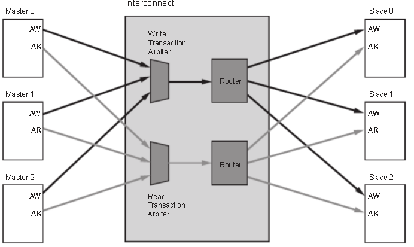

.. image:: images/images_0/88.png

============================================
"Chapter 1" Introduction to Ultrascale+ MPSoC
============================================

  The Zynq UltraScale+ MPSoC family is Xilinx's second generation Zynq platform. The highlight is that the FPGA contains a complete ARM processing subsystem (PS) including a quad-core Cortex-A53 processor or a dual-core Cortex-A53 plus a dual-core Cortex-R5 processor. The entire processor is built with the processor as the center and the processor subsystem integrates a memory controller and a large number of peripherals so that the processor core is completely independent of the programmable logic unit in Zynq, that is to say, if the programmable logic unit (PL) is not used temporarily, The subsystem of the ARM processor can also work independently, which is essentially different from the previous FPGA, which is centered on the processor.
 
  Zynq is two major functional blocks, the PS part and the PL part. To put it bluntly, it is the SOC part of ARM and the FPGA part. Among them, PS integrates APU ARM Cortex™-A53 processor, RPU Cortex-R5 processor, AMBA® interconnection, internal memory (OCM), external memory interface (DDR Controller) and peripherals (IOU). These peripherals (IOU) mainly include USB bus interface, Ethernet interface, SD/eMMC interface, I2C bus interface, CAN bus interface, UART interface, GPIO, etc. High-speed interfaces such as PCIe, SATA, Display Port.

.. image:: images/images_1/image1.png
    :align: center

**Overall block diagram of ZYNQ MPSoC chip**

PS: The processing system (Processing System) is the part of ARM's SoC that has nothing to do with FPGA.

PL: Programmable logic (Progarmmable Logic), which is the FPGA part.

1.1 PS and PL interconnection technology
============================================

- ZYNQ is a product that tightly combines high-performance ARM Cortex-A53 series processors and high-performance FPGAs in a single chip. In order to realize high-speed communication and data interaction between ARM processors and FPGAs, the performance of ARM processors and FPGAs is fully utilized Advantages, it is necessary to design an efficient interconnection path between the on-chip high-performance processor and the FPGA. Therefore, how to design an efficient PL and PS data interaction path is the top priority of ZYNQ chip design, and it is also one of the keys to the success of product design. In this section, we will mainly introduce the connection between PS and PL, so that users can understand the connection technology between PS and PL.
- In fact, in the specific design, we often do not need to do too much work on the connection. After we add the IP core, the system will automatically use the AXI interface to connect our IP core to the processor. We only need to do a little more That's it.
- The full name of AXI is Advanced eXtensible Interface. It is an interface protocol introduced by Xilinx from the 6 series of FPGAs. It mainly describes the data transmission method between the master device and the slave device. Continue to use in ZYNQ, the version is AXI4, so we often see AXI4.0, ZYNQ internal devices have AXI interface. In fact, AXI is a part of AMBA (Advanced Microcontroller Bus Architecture) proposed by ARM. It is a high-performance, high-bandwidth, and low-latency on-chip bus, which is also used to replace the previous AHB and APB buses. The first version of AXI (AXI3) was included in AMBA 3.0 released in 2003, and the second version of AXI, AXI (AXI4), was included in AMBA 4.0 released in 2010.
- The AXI protocol mainly describes the data transmission method between the master device and the slave device, and the connection between the master device and the slave device is established through a handshake signal. When the slave device is ready to receive data, it sends out a READY signal. When the data of the master device is ready, it will send and maintain the VALID signal, indicating that the data is valid. Data is transmitted only when both the VALID and READY signals are valid. When these two signals remain valid, the master device will continue to transmit the next data. The master can cancel the VALID signal, or the slave can cancel the READY signal to terminate the transmission. The AXI protocol is shown in the figure. At T2, the READY signal of the slave device is valid, and at T3, the VILID signal of the master device is valid, and the data transmission starts.

.. image:: images/images_1/image2.png
    :align: center

AXI handshake timing diagram

In ZYNQ, AXI-Lite, AXI4 and AXI-Stream are supported. Through Table 5-1, we can see the characteristics of these three AXI interfaces.

.. csv-table:: interface features
   :header: "Interface Protocol", "Features", "Applications"
   :widths: 15, 20, 30

   "AXI4-Lite", Address/Single Data Transfer, "Low Speed Peripheral or Control"
   "AXI4", Address/Burst Transfer, "Bulk Transfer of Addresses"
   "AXI4-Stream", data only, burst transfer, "data stream and media stream transfer"

- AXI4-Lite:
   With the characteristics of light weight and simple structure, it is suitable for small batch data and simple control occasions. Batch transmission is not supported, and only one word (32bit) can be read and written at a time. Mainly used to access some low-speed peripherals and control of peripherals.
- AXI4:
   The interface is similar to that of AXI-Lite, except that one more function is batch transmission, which can continuously read and write a piece of address at one time. That is to say, it has the burst function of data reading and writing.
   Both of the above two methods adopt the memory mapping control method, that is, ARM codes the user-defined IP into a certain address for access, and reads and writes as if reading and writing its own on-chip RAM. The programming is also very convenient, and the development difficulty is relatively low. The cost is that resources are occupied too much, and additional signal lines such as read address lines, write address lines, read data lines, write data lines, and write response lines are required.
- AXI4-Stream:
   This is a continuous stream interface that does not require address lines (much like a FIFO, just keep reading or writing). For this type of IP, ARM cannot be controlled by the above memory mapping method (FIFO has no concept of address at all), and there must be a conversion device, such as an AXI-DMA module, to realize the conversion from memory mapping to streaming interface. There are many occasions where AXI-Stream is applicable: video stream processing, communication protocol conversion, digital signal processing, wireless communication, etc. Its essence is a data path constructed for numerical streams, and a continuous data stream is built from the source (such as ARM memory, DMA, wireless receiving front end, etc.) to the sink (such as HDMI display, high-speed AD audio output, etc.). This interface is suitable for real-time signal processing.

AXI4 and AXI4-Lite interfaces consist of 5 different lanes:

- Read Address Channel
- Write Address Channel
- Read Data Channel
- Write Data Channel
- Write Response Channel

Each of these channels is an independent AXI handshake protocol. The following two figures show the read and write models respectively:

.. image:: images/images_1/image3.png
    :align: center

AXI read data channel

.. image:: images/images_1/image4.png
    :align: center

AXI write data channel

- The AXI bus protocol is implemented by hardware in the ZYNQ chip, including 12 physical interfaces, namely S_AXI_HP{0:3}_FPD, S_AXI_LPD, S_AXI_ACE_FPD, S_AXI_ACP_FPD, S_AXI_HPC{0,1}_FPD, M_AXI_HPM{0,1}_FPD , M_AXI_HPM0_LPD interface.
- S_AXI_HP{0:3}_FPD interface is a high-performance/bandwidth AXI4 standard interface, there are four in total, and the PL module is connected as the master device. Mainly used for PL to access memory on PS (DDR and FPD Main Switch)
- S_AXI_LPD interface, a high-performance port, connects PL to LPD. Low-latency access to OCM and TCM, and access to PS-side DDR.
- S_AXI_HPC{0,1}_FPD interface, connects PL to FPD, can connect to CCI, access L1 and L2 Cache, due to access to DDR controller through CCI, there will be a large delay.
- M_AXI_HPM{0,1}_FPD interface, high-performance bus, PS is master, connects FPD to PL, can be used for CPU, DMA, PCIe, etc. to push a large amount of data from PS to PL.
- M_AXI_HPM0_LPD interface, low-latency interface bus, PS is the master, connects LPD to PL, can directly access BRAM, DDR, etc. on the PL side, and is often used to configure registers on the PL side.

- Only M_AXI_HPM{0,1}_FPD and M_AXI_HPM0_LPD are Master Ports, that is, the host interface, and the rest are Slave Ports (slave interfaces). The host interface has the authority to initiate read and write. ARM can use the two host interfaces to actively access PL logic. In fact, it maps PL to a certain address. Reading and writing PL registers is like reading and writing its own memory. The remaining slave interfaces are passive interfaces, which accept reading and writing from the PL, and accept them in reverse. In PS and PL interconnection applications, the most commonly used interfaces are S_AXI_HP{0:3}_FPD, M_AXI_HPM{0,1}_FPD and M_AXI_HPM0_LPD.
- The ARM on the PS side directly has hardware to support the AXI interface, while the PL needs to use logic to implement the corresponding AXI protocol. Xilinx provides off-the-shelf IP such as AXI-DMA, AXI-GPIO, AXI-Dataover, AXI-Stream in the Vivado development environment to implement the corresponding interface. When using it, add it directly from the Vivado IP list to realize the corresponding function. The following figure shows various DMA IPs under Vivado:

.. image:: images/images_1/image6.png
    :align: center

The following is an introduction to the functions of several commonly used AXI interface IPs:

- AXI-DMA: realize the conversion from PS memory to PL high-speed transmission high-speed channel AXI-HP<---->AXI-Stream
- AXI-FIFO-MM2S: realize the conversion from PS memory to PL general transmission channel AXI-HPM<----->AXI-Stream
- AXI-Datamover: realize the conversion from PS memory to PL high-speed transmission high-speed channel AXI-HP<---->AXI-Stream, but this time it is completely controlled by PL, and PS is completely passive.
- AXI-VDMA: Realize the conversion from PS memory to PL high-speed transmission high-speed channel AXI-HP<---->AXI-Stream, but only for two-dimensional data such as video and image.
- AXI-CDMA: This is done by PL to move data from one location of the memory to another without CPU intervention.
- About how to use these IPs, we will give examples in the following chapters. Sometimes, users need to develop their own defined IP to communicate with PS, at this time, the wizard can be used to generate the corresponding IP. User-defined IP cores can have interfaces such as AXI4-Lite, AXI4, AXI-Stream, PLB and FSL. The latter two are not used because ARM does not support them.
- With the above official IP and the custom IP generated by the wizard, users do not need to know much about AXI timing (unless they encounter problems), because Xilinx has encapsulated all the details related to AXI timing, and users only need to You need to focus on your own logic implementation.
- Strictly speaking, the AXI protocol is a point-to-point master-slave interface protocol. When multiple peripherals need to exchange data with each other, we need to add an AXI Interconnect module, that is, the AXI interconnection matrix. The function is to provide one or more AXI masters. A switching mechanism in which a device is connected to one or more AXI slave devices (somewhat similar to a switch matrix in a switch).
- This AXI Interconnect IP core can support up to 16 master devices and 16 slave devices. If more interfaces are needed, several IP cores can be added.

The basic connection modes of AXI Interconnect are as follows:

- N-to-1 Interconnect
- to-N Interconnect
- N-to-M Interconnect (Crossbar Mode)
- N-to-M Interconnect (Shared Access Mode)

.. image:: images/images_1/image7.png
    :align: center

Many-to-one case

.. image:: images/images_1/image8.png
    :align: center

One-to-many situation

Many-to-many read and write address channels

.. image:: images/images_1/image10.png
    :align: center

Many-to-many read and write data channels

The AXI interface devices inside ZYNQ are interconnected through the interconnection matrix, which not only ensures the efficiency of data transmission, but also ensures the flexibility of connection. In Xilinx, in Vivado, we provide the IP core axi_interconnect that realizes this interconnection matrix, and we only need to call it.

AXI Interconnect IP

1.2 Brief introduction of ZYNQ chip development process
============================================
- Since ZYNQ integrates CPU and FPGA, developers need to design not only the ARM operating system application program and device driver, but also the hardware logic design of the FPGA part. In the development, we need to understand the Linux operating system and system architecture, and also need to build a hardware design platform between FPGA and ARM system. Therefore, the development of ZYNQ requires the collaborative design and development of software and hardware personnel. This is the so-called "software-hardware co-design" in ZYNQ development.
- The design and development of the hardware system and software system of the ZYNQ system requires the following development environment and debugging tools: Xilinx Vivado.
- The Vivado design suite realizes the design and development of the FPGA part, pin and timing constraints, compilation and simulation, and realizes the design process from RTL to bitstream. Vivado is not a simple upgrade of the ISE design suite, but a brand new design suite. It replaces all important tools of the ISE Design Suite, such as Project Navigator, Xilinx Synthesis Technology, Implementation, CORE Generator, Constraint, Simulator, Chipscope Analyzer, FPGA Editor and other design tools.
- Xilinx SDK (Software Development Kit), SDK is the Xilinx software development kit (SDK), based on the Vivado hardware system, the system will automatically configure some important parameters, including tool and library paths, compiler options, JTAG and flash memory settings , the debugger connects to the bare metal board support package (BSP). The SDK also provides drivers for all supported Xilinx IP hard cores. The SDK supports IP hard core (on FPGA) and processor software collaborative debugging, we can use advanced C or C++ language to develop and debug ARM and FPGA systems, and test whether the hardware system is working properly. The SDK software is also included with the Vivado software and does not need to be installed separately.

The development of ZYNQ is also a method of hardware first and then software. The specific process is as follows:

1. Create a new project on Vivado and add an embedded source file.
2. Add and configure some basic peripherals of PS and PL in Vivado, or need to add custom peripherals.
3. Generate the top-level HDL file in Vivado and add the constraint file. Then compile and generate a bitstream file (.bit).
4. Export the hardware information to the SDK software development environment. In the SDK environment, you can write some debugging software to verify the hardware and software, and combine the bitstream file to debug the ZYNQ system separately.
5. Generate FSBL file in SDK.
6. Generate u-boot.elf and bootloader images in the VMware virtual machine.
7. Generate a BOOT.bin file in the SDK through the FSBL file, the bitstream file system.bit and the u-boot.elf file.
8. Generate the Ubuntu kernel image file Zimage and the Ubuntu root file system in VMware. In addition, it is necessary to write a driver for FPGA custom IP.
9. Put the BOOT, kernel, device tree, and root file system files into the SD card, turn on the power supply of the development board, and the Linux operating system will start from the SD card.

The above is a typical ZYNQ development process, but ZYNQ can also be used as an ARM alone, so that there is no need for PL-side resources, and it is not much different from traditional ARM development. ZYNQ can also only use the PL part, but the configuration of the PL still needs to be completed by the PS, that is, the firmware that only needs the PL cannot be solidified through the traditional flash curing method.

1.3 What skills are required to learn ZYNQ
============================================
Learning ZYNQ is more demanding than learning FPGA, MCU, ARM and other traditional tool development, and it is not easy to learn ZYNQ well.

Software developer

- Principles of computer composition
- C, C++ language
- computer operating system
- tcl script
- Good English reading foundation

Logic developer

- Principles of computer composition
- C language
- Fundamentals of digital circuits
  
.. image:: images/images_0/888.png

*ZYNQ MPSoC Development Platform FPGA Tutorial* - `Alinx Official Website <https://www.alinx.com/en>`_