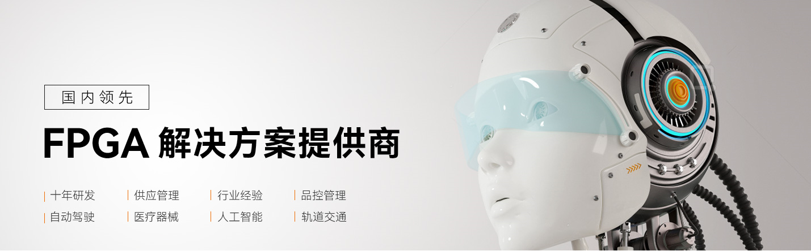

.. image:: images/images_0/8.png

==============
About ALINX
==============

Xinyi Electronic Technology (Shanghai) Co., Ltd., established in 2012, is headquartered in Shanghai Songjiang Lingang Science and Technology City. It is a vehicle-mounted intelligent product and FPGA technology solution company. Focusing on in-vehicle smart products, ALINX brand focuses on FPGA product and solution customization. After ten years of development, the company's products have been exported to more than 30 countries overseas.

- In 2018, the company passed the high-tech enterprise certification and passed the ISO9001 quality system certification;
- In 2019, won the "Science and Technology Innovation Award" of Jiuting Town, Songjiang District, Shanghai;
- In 2020, won the title of "Specialized Special New Enterprise" in Shanghai;
- In 2021, apply for the technology innovation fund project of Shanghai technology-based small and medium-sized enterprises, pass the certification of national-level technology-based small and medium-sized enterprises, and pass the review of high-tech enterprise certification;
- In 2022, obtain special development funds for Shanghai Zhangjiang National Independent Innovation Demonstration Zone and pass the certification of "Shanghai Innovative Small and Medium Enterprises";

ALINX is the official partner of XILINX, the world's leading FPGA chip company, and the official partner of Ziguang Tongchuang, a leading domestic FPGA chip company. At the same time, as Baidu's AI partner, ALINX has customized the Edgeboard series edge devices of the domestic AI flying paddle system for Baidu . Through years of research and development investment, more than 100 FPGA SoM modules and supporting boards have been launched, and more than 1,000 enterprise batch users have been accumulated, tens of thousands of independent developers, and the market share is far ahead.

Through the business model of products + customized services, ALINX will continue to increase investment in product research and development and technical research, continue to cooperate with customers in vertical industries, focus on high-end equipment, and assist customers in solving technical problems in the industry.

Contact information
=============

- Official website : http://www.alinx.com
- Technical Forum : http://www.heijin.org
- Service hotline: 021-67676997
- Technical Support : avic@alinx.com
- Company address: Room 202, Building 18, No. 518, Xinzhuan Road, Songjiang District, Shanghai
- Official flagship store: http://alinx.jd.com