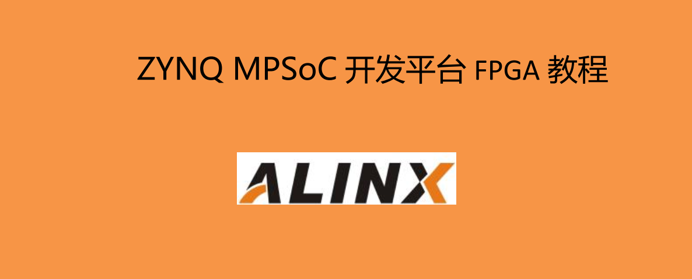

============================================
    citation
============================================

- First of all, thank you for purchasing the ZYNQ development boards AXU3EG, AXU4EV, and AXU5EV produced by Xinyi Electronic Technology (Shanghai) Co., Ltd.! Your support and trust in us and our products have given us the confidence and courage to move forward.
- Some people want to ask whether zero foundation can learn ZYNQ? It depends on where the zero is. If you can’t even understand the schematic diagram, you don’t know what an array is in C language, and you have no concept of pointers. This is a negative foundation. Learn ZYNQ must have basic hardware knowledge and proficiency in C language.
- This tutorial is part of the FPGA tutorial. Through continuous practice, master the basic process of FPGA development. Although it does not explain many principles, practice makes perfect, practice more, and gradually master the mysteries.
 
Company website: Http://www.alinx.com.cn

Technical Forum: http://www.heijin.org

Official flagship store: http://alinx.jd.com

E-mail: avic@alinx.com.cn

Tel: 021-67676997

Fax: 021-37737073

ALINX WeChat public account:

.. image:: images/images_0/1.png

*ZYNQ MPSoC Development Platform FPGA Tutorial* - `Alinx Official Website <https://www.alinx.com/en>`_