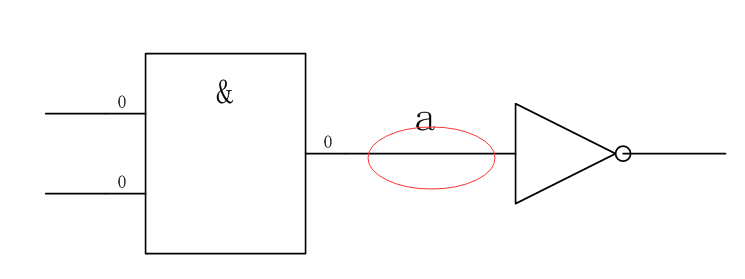
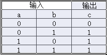
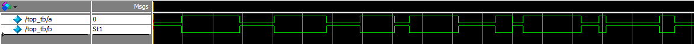
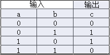
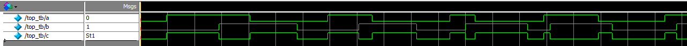
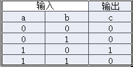
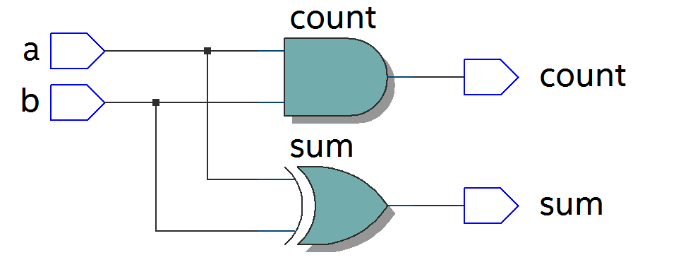
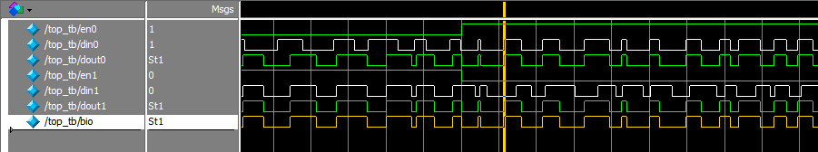
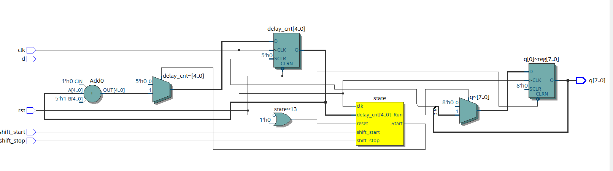

.. image:: images/images_0/88.png

============================================
"Chapter Three" Introduction to Verilog Basic Modules
============================================
3.1 Introduction
============================================
This article mainly introduces the basic modules of verilog and lays a solid foundation, which will be of great help to in-depth study of FPGA.

3.2 Data Types
============================================

**Constant**

- Integers: Integers can be represented by binary b or B, octal o or O, decimal d or D, hexadecimal h or H, for example, 8'b00001111 represents an 8-bit wide binary integer, 4'ha represents 4 bits Bit-wide hexadecimal integer.
- X and Z: X stands for indeterminate value, z stands for high resistance value, for example, 5'b00x11, the third digit is indefinite value, 3'b00z means the lowest digit is high resistance value.
- Underscore: When the number of digits is too long, it can be used to divide the number of digits and improve the readability of the program, such as 8'b0000_1111
- Parameter parameter: parameter can use identifiers to define constants, and only use identifiers to improve readability and maintainability. For example, define parameter width = 8; define register reg [width-1:0] a; that is, define 8-bit wide register.
- Parameter transfer: If there are defined parameters in a module, the parameters can be passed when other modules call this module, and the parameters can be modified, as shown below, represented by # ( ) after the module.
  
For example, define the module as follows
  
call module
::

 module rom 
 #( 
   parameter depth =15, 
   parameter width = 8  
   )
   ( 
 input [depth-1:0] addr , 
 input [width-1:0] data , 
 output result 
 ) ; 
 endmodule 	
 module top() ; 
 wire [31:0] addr ; 
 wire [15:0] data ; 
 wire result ; 
 rom 
 #( 
   .depth(32), 
   .width(16)  
   )
 r1  
 ( 
 .addr(addr) , 
 .data(data) , 
 .result(result) 
 ) ;  
 endmodule 

Parameter can be used for parameter transfer between modules, while localparam is only used in this module and cannot be used for parameter transfer. Localparam is mostly used to define the state of the state machine.

3.3 Variables
============================================
A variable refers to the amount that can change its value when the program is running. The following mainly introduces several commonly used variable types.

3.3.1 Wire type
----------------------------------------
Wire type variables, also called network type variables, are used for physical connections between structural entities, such as between gates, and cannot store values. Use continuous assignment statement assign to assign values, defined as wire [n-1:0] a ; Among them, n represents the bit width, such as defining wire a; assign a = b; is to connect the node of b to the connection a. As shown in the figure below, the connection between two entities is the wire type variable.

3.3.2 Reg type
----------------------------------------
Reg type variables, also known as register variables, can be used to store values and must be used in the always statement. It is defined as reg [n-1:0] a; it represents a register with a width of n bits, such as reg [7:0] a; it represents a register a with a width of 8 bits. The register q is defined as shown below, and the generated circuit is sequential logic. The structure on the right is a D flip-flop.

.. image:: images/images_3/image2.png  
   :align: center

::

 module top(d, clk, q) ; 
 input  d  ; 
 input clk ; 
 output reg q ; 
 always @(posedge clk) 
 begin 
   q <= d ; 
 end   
 endmodule 

	
Combinational logic can also be generated, such as data selector, sensitive signal has no clock, reg Mux is defined, and the final generated circuit is combination logic.

.. image:: images/images_3/image3.png  
   :align: center

::

 module top(a, b, c, d, sel, Mux) ; 
 input   a ; 
 input   b ; 
 input   c ; 
 input   d ; 
 input [1:0] sel ; 
 output reg Mux ; 
 always @(sel or a or b or c or d) 
 begin 
   case(sel) 
     2'b00 : Mux = a ; 
     2'b01 : Mux = b ; 
     2'b10 : Mux = c ; 
     2'b11 : Mux = d ; 
   endcase 
 end  
 endmodule 	

3.3.3 Memory type
----------------------------------------
The memory type can be used to define RAM, ROM and other memories. Its structure is reg [n-1:0] memory name [m-1:0], which means m registers with n-bit width. For example, reg [7:0] ram [255:0] means that 256 8-bit registers are defined, 256 is the depth of the memory, and 8 is the data width.

3.4 Operators
============================================
Operators can be divided into the following categories:

  (1) Arithmetic operators (+,-,*,/,% )
  (2) Assignment operators (=,<= )
  (3) Relational operators (>,<,>=,<=,==, != )
  (4) Logical operators (&&,||, ! )
  (5) Conditional operator ( ?: )
  (6) Bitwise operators (~,|,^,&,^~ )
  (7) Shift operators (<<,>> )
  (8) concatenation operator ({ } )

3.4.1 Arithmetic operators
----------------------------------------
"+" (addition operator), "-" (subtraction operator), "*" (multiplication operator), "/" (division operator, such as 7/3 =2 ), "%" (modulo operation symbol, that is, to find the remainder, such as 7%3=1, the remainder is 1)

3.4.2 Assignment Operators
---------------------------------------
"=" blocking assignment, "<=" non-blocking assignment. Blocking assignment means executing one assignment statement before executing the next one, which can be understood as sequential execution, and the assignment is executed immediately; non-blocking assignment can be understood as parallel execution, regardless of the order, and the assignment is performed after the execution of the always block statement is completed . As in the following blocking assignment:

Code is shown below:
:: 

 module top(din,a,b,c,clk); 
 input din; 
 input clk; 
 output reg a,b,c; 
 always @(posedge clk)  
 begin 
         a = din; 
         b = a; 
         c = b; 
 end 
 endmodule 	

The testbench file is as follows:
::

 `timescale 1 ns/1 ns 
 module top_tb() ; 
 reg din ; 
 reg clk ; 
 wire a,b,c ; 
 initial 
 begin 
   din =  0 ; 
   clk = 0  ; 
   forever 
   begin     
     #({$random}%100) 
     din = ~din ; 
   end 
 end 
 always #10 clk = ~clk ; 
 top  t0(.din(din),.a(a),.b(b),.c(c),.clk(clk)) ; 
 endmodule 

It can be seen from the simulation results that on the rising edge of clk, the value of a is equal to din, and is immediately assigned to b, and the value of b is assigned to c.

.. image:: images/images_3/image4.png
    :align: center

If it is changed to non-blocking assignment, the simulation results are as follows. On the rising edge of clk, the value of a is not immediately assigned to b, b is the original value of a, similarly, c is the original value of b

.. image:: images/images_3/image5.png
    :align: center

It can be seen from the RTL diagrams of the two that there are obvious differences:

.. image:: images/images_3/image6.png
    :align: center
    
Blocking assignment RTL diagram

.. image:: images/images_3/image7.png
    :align: center

Non-blocking assignment RTL diagram
**Under normal circumstances, non-blocking assignments are used in sequential logic circuits to avoid competition hazards during simulation. Blocking assignments are used in combinational logic, and changes are made immediately after the assignment statement is executed. Blocking assignments must be used in the assign statement.**

3.4.3 Relational operators
---------------------------------------
Used to represent the relationship between two operands, such as a>b, a<b, mostly used to judge conditions, for example:

 if (a>=b) q <=1'b1 ;

 else q <= 1'b0 ;

Indicates that if the value of a is greater than or equal to the value of b, the value of q is 1, otherwise the value of q is 0

3.4.4 Logical operators
---------------------------------------
"&&" (logical AND of two operands), "||" (logical OR of two operands), "!" (logical NOT of a single operand), for example:
If (a>b && c <d) indicates that the condition is a>b and c<d; if (!a) indicates that the condition is that the value of a is not 1, that is, 0.

3.4.5 Conditional Operators
---------------------------------------
"?:" is a conditional judgment, similar to if else, such as assign a = (i>8)?1'b1:1'b0; judge whether the value of i is greater than 8, if it is greater than 8, the value of a is 1, otherwise is 0.

3.4.6 Bitwise operators
---------------------------------------
"~" bitwise inversion, "|" bitwise or, "^" bitwise exclusive or, "&" bitwise and, "^" bitwise same or, except for "~" which only needs one operand, others Several require two operands, such as a&b, a|b. The specific application is explained in the combinatorial logic section later.

3.4.7 Shift operators
---------------------------------------
"<<" left shift operator, ">>" right shift operator, such as a<<1, shifts 1 bit to the left, a>>2, shifts two bits to the right.

3.4.8 Concatenation operator
---------------------------------------
"{ }" concatenation operator, splicing multiple signals bit by bit, such as {a[3:0], b[1:0]}, concatenating the lower 4 bits of a and the lower 2 bits of b into 6-bit data . In addition, {n{a[3:0]}} means to splice n a[3:0], and {n{1'b0}} means to splice n bits of 0. For example, {8{1'b0}} is expressed as 8'b0000_0000.

3.4.9 Priority levels
---------------------------------------
The precedence levels of the various operators are as follows:

.. image:: images/images_3/image8.png
    :align: center

3.5 Combination logic
============================================
This section mainly introduces combinatorial logic. The characteristic of combinatorial logic circuits is that the output at any time depends only on the input signal, and the output changes immediately when the input signal changes, independent of the clock.

3.5.1 AND gate
---------------------------------------
In verilog, "&" is used to represent bitwise AND, such as c=a&b, the truth table is as follows, the result is 1 when both a and b are equal to 1, and the RTL representation is as shown in the right figure

.. image:: images/images_3/image9.png
    :align: center
                    

The code is implemented as follows:
::

 module top(a, b, c) ; 
 input  a ; 
 input  b ; 
 output c ; 
 assign c = a & b ; 
 endmodule 

The testbench file is as follows:
::

 `timescale 1 ns/1 ns 
 module top_tb() ; 
 reg a ; 
 reg b ; 
 wire c ; 
 initial 
 begin 
   a = 0 ; 
   b = 0 ; 
   forever 
   begin     
     #({$random}%100) 
     a = ~a ; 
     #({$random}%100)  
     b = ~b ;  
   end 
 end 
 top  t0(.a(a), .b(b),.c(c)) ; 
 endmodule 
 
The simulation results are as follows:

.. image:: images/images_3/image11.png  
   :align: center
 
If the bit width of a and b is greater than 1, for example, define input [3:0] a, input [3:0] b, then a&b refers to the corresponding phase AND of a and b. Such as a[0]&b[0], a[1]&b[1].

3.5.2 OR Gate
---------------------------------
In verilog, "|" means bitwise or, such as c = a|b, the truth table is as follows, and the result is 0 when both a and b are 0.

 
.. image:: images/images_3/image13.png
    :align: center
                         
The code is implemented as follows:
::

 module top(a, b, c) ; 
 input  a ; 
 input  b ; 
 output c ; 
 assign c = a | b ; 
 endmodule 	

The testbench files are as follows:
::

 `timescale 1 ns/1 ns 
 module top_tb() ; 
 reg a ; 
 reg b ; 
 wire c ; 
 initial 
 begin 
   a = 0 ; 
   b = 0 ; 
   forever 
   begin     
     #({$random}%100) 
     a = ~a ; 
     #({$random}%100)  
     b = ~b ;  
   end 
 end 
 top  t0(.a(a), .b(b),.c(c)) ; 
 endmodule 

The simulation results are as follows:

.. image:: images/images_3/image14.png  
   :align: center
 
Similarly, if the bit width is greater than 1, it is bitwise or.

3.5.3 NOT gate
------------------------------------
In verilog, "~" means bitwise inversion, such as b=~a, the truth table is as follows, b is equal to the opposite number of a.

.. image:: images/images_3/image15.png  
   :align: center

.. image:: images/images_3/image16.png  
   :align: center
                           
The code is implemented as follows: 
::

 module top(a, b) ; 
 input   a ; 
 output  b ; 
 assign b = ~a ; 
 endmodule 	

The testbench files are as follows:
:: 

 `timescale 1 ns/1 ns 
 module top_tb() ; 
 reg  a ; 
 wire b ; 
 initial 
 begin 
   a = 0 ;   
   forever 
   begin     
     #({$random}%100) 
     a = ~a ;     
   end 
 end 
 top  t0(.a(a), .b(b)) ; 
 endmodule

The simulation results are as follows:

3.5.4 XOR
---------------------------------------
In verilog, "^" is used to represent XOR, such as c= a^b, the truth table is as follows, when a and b are the same, the output is 0.

             
The code is implemented as follows:
::

 module top(a, b, c) ; 
 input  a ; 
 input  b ; 
 output c ; 
 assign c = a ^ b ; 
 endmodule 

The testbench files are as follows:
::

 `timescale 1 ns/1 ns 
 module top_tb() ; 
 reg a ; 
 reg b ; 
 wire c ; 
 initial 
 begin 
   a = 0 ; 
   b = 0 ; 
   forever 
   begin     
     #({$random}%100) 
     a = ~a ; 
     #({$random}%100)  
     b = ~b ;  
   end 
 end 
 top  t0(.a(a), .b(b),.c(c)) ; 
 endmodule

The simulation results are as follows:

 
3.5.5 Comparator
--------------------------------------
In verilog, it is expressed as greater than ">", equal to "==", less than "<", greater than or equal to ">=", less than or equal to "<=", not equal to "!=", and greater than an example, such as c= a > b ; means that if a is greater than b, then the value of c is 1, otherwise it is 0. The truth table is as follows:

 
.. image:: images/images_3/image22.png  
   :align: center
 
The code is implemented as follows:
::

 module top(a, b, c) ; 
 input  a ; 
 input  b ; 
 output c ; 
 assign c = a > b ; 
 endmodule 

The testbench files are as follows:
::

 `timescale 1 ns/1 ns 
 module top_tb() ; 
 reg a ; 
 reg b ; 
 wire c ; 
 initial 
 begin 
   a = 0 ; 
   b = 0 ; 
   forever 
   begin     
     #({$random}%100) 
     a = ~a ; 
     #({$random}%100)  
     b = ~b ;  
   end 
 end 
 top  t0(.a(a), .b(b),.c(c)) ; 
 endmodule 

The simulation results are as follows:

.. image:: images/images_3/image23.png  
   :align: center
 
3.5.6 Half Adder
------------------------------
The half adder and the full adder are the basic units in the arithmetic operation circuit. Since the half adder does not consider the carry from the low bit, it is called a half adder. The sum represents the addition result, and the count represents the carry. The truth table can be Expressed as follows:

.. image:: images/images_3/image24.png  
   :align: center
 

 
According to the truth table, the code can be written as follows:
::

 module top(a, b, sum, count) ; 
 input  a ; 
 input  b ; 
 output sum ; 
 output count ; 
 assign sum = a ^ b ; 
 assign count = a & b ; 
 endmodule

The testbench files are as follows:
::

 `timescale 1 ns/1 ns 
 module top_tb() ; 
 reg a ; 
 reg b ; 
 wire sum ; 
 wire count ; 
 initial 
 begin 
   a = 0 ; 
   b = 0 ; 
   forever 
   begin     
     #({$random}%100) 
     a = ~a ; 
     #({$random}%100)  
     b = ~b ;  
   end 
 end 
 top  t0(.a(a), .b(b), 
 .sum(sum), .count(count)) ; 
 endmodule 

The simulation results are as follows:

.. image:: images/images_3/image26.png  
   :align: center
 
3.5.7 Full Adder
----------------------------------
The full adder needs to add the carry signal cin from the low bit, and the truth table is as follows:

.. image:: images/images_3/image27.png
    :align: center
 
.. image:: images/images_3/image28.png
    :align: center
 
Code is shown below:
::

 module top(cin, a, b, sum, count) ; 
 input cin ; 
 input  a ; 
 input  b ; 
 output sum ; 
 output count ; 
 assign {count,sum} = a + b + cin ; 
 endmodule	

The testbench files are as follows:
::

 `timescale 1 ns/1 ns 
 module top_tb() ; 
 reg a ; 
 reg b ; 
 reg cin ; 
 wire sum ; 
 wire count ; 
 initial 
 begin 
   a = 0 ; 
   b = 0 ; 
   cin = 0 ; 
   forever 
   begin     
     #({$random}%100) 
     a = ~a ; 
     #({$random}%100)  
 b = ~b ;  
 #({$random}%100)  
     cin = ~cin ;  
   end 
 end 
 top  t0(.cin(cin),.a(a), .b(b), 
 .sum(sum), .count(count)) ; 
 endmodule 

The simulation results are as follows:

.. image:: images/images_3/image29.png  
   :align: center
 
3.5.8 Multiplier
--------------------------------------
The expression of multiplication is also very simple, just use "*", such as a*b, the example code is as follows:
::

 module top(a, b, c) ; 
 input  [1:0] a ; 
 input  [1:0] b ; 
 output [3:0] c ; 
 assign c = a * b ; 
 endmodule	
 
 `timescale 1 ns/1 ns 
 module top_tb() ; 
 reg [1:0] a ; 
 reg [1:0] b ; 
 wire [3:0] c ; 
 initial 
 begin 
   a = 0 ; 
   b = 0 ; 
   forever 
   begin     
     #({$random}%100) 
     a = ~a ; 
     #({$random}%100)  
     b = ~b ;  
   end 
 end 
 top  t0(.a(a), .b(b),.c(c)) ; 
 endmodule 

The simulation results are as follows:

.. image:: images/images_3/image30.png  
   :align: center

3.5.9 Data Selector
--------------------------------
Data selectors are often used in verilog. By selecting signals, different input signals are selected to output to the output terminal, as shown in the truth table below, four select one data selector, sel[1:0] is the selection signal, a, b, c, d are input signals, and Mux is an output signal.

.. image:: images/images_3/image31.png  
   :align: center

.. image:: images/images_3/image56.png  
   :align: center

Code is shown below:
::

 module top(a, b, c, d, sel, Mux) ; 
 input   a ; 
 input   b ; 
 input   c ; 
 input   d ; 
 input [1:0] sel ; 
 output reg Mux ; 
 always @(sel or a or b or c or d) 
 begin 
   case(sel) 
     2'b00 : Mux = a ; 
     2'b01 : Mux = b ; 
     2'b10 : Mux = c ; 
     2'b11 : Mux = d ; 
   endcase 
 end 
 endmodule 

The testbench files are as follows:
::

 `timescale 1 ns/1 ns 
 module top_tb() ; 
 reg  a ; 
 reg  b ; 
 reg  c ; 
 reg  d ; 
 reg [1:0] sel ; 
 wire  Mux ; 
 initial 
 begin 
   a = 0 ; 
   b = 0 ; 
   c = 0 ; 
   d = 0 ; 
   forever 
   begin     
     #({$random}%100) 
     a = {$random}%3 ; 
     #({$random}%100)  
     b = {$random}%3 ; 
     #({$random}%100) 
     c = {$random}%3 ; 
     #({$random}%100)  
     d = {$random}%3 ; 
   end 
   end 
 initial 
 begin 
   sel = 2'b00 ; 
   #2000 sel =  2'b01 ; 
   #2000 sel =  2'b10 ; 
   #2000 sel =  2'b11 ; 
 end 
 top  
 t0(.a(a), .b(b),.c(c),.d(d), .sel(sel),
 .Mux(Mux)) ; 
 endmodule 

The simulation results are as follows

.. image:: images/images_3/image32.png  
   :align: center

3.5.10 3-8 Decoder
---------------------------------
The 3-8 decoder is a very commonly used device, and its truth table is shown below. According to the values of A2, A1, and A0, different results can be obtained.

.. image:: images/images_3/image33.png  
   :align: center

.. image:: images/images_3/image34.png  
   :align: center

Code shown as below:                                     
::

 module top(addr, decoder) ; 
 input  [2:0] addr ; 
 output reg [7:0] decoder ; 
 always @(addr) 
 begin 
   case(addr) 
     3'b000 : decoder = 8'b1111_1110 ; 
     3'b001 : decoder = 8'b1111_1101 ; 
     3'b010 : decoder = 8'b1111_1011 ; 
     3'b011 : decoder = 8'b1111_0111 ; 
     3'b100 : decoder = 8'b1110_1111 ; 
     3'b101 : decoder = 8'b1101_1111 ; 
     3'b110 : decoder = 8'b1011_1111 ; 
     3'b111 : decoder = 8'b0111_1111 ;    
   endcase 
 end 
 endmodule 

The testbench files are as follows:
::

 `timescale 1 ns/1 ns 
 module top_tb() ; 
 reg  [2:0]  addr ; 
 wire  [7:0] decoder ;  
 initial 
 begin 
   addr = 3'b000 ; 
   #2000 addr =  3'b001 ; 
   #2000 addr =  3'b010 ; 
   #2000 addr =  3'b011 ; 
   #2000 addr =  3'b100 ; 
   #2000 addr =  3'b101 ; 
   #2000 addr =  3'b110 ; 
   #2000 addr =  3'b111 ; 
 end 
 top  
 t0(.addr(addr),.decoder(decoder)) ; 
 endmodule

The simulation results are as follows:

.. image:: images/images_3/image35.png  
   :align: center

3.5.11 Three-state gates
---------------------------
In the use of FPGA, bidirectional IO is often used, and tri-state gates are needed, such as bio = en? din: 1'bz; where en is the enable signal, which is used to open and close the tri-state gate. It realizes two-way IO, please refer to the code. The stimulus file implements the connection of two bidirectional IOs.

.. image:: images/images_3/image36.png  
   :align: center

::

 module top(en, din, dout, bio) ; 
 input  din  ; 
 input  en ; 
 output dout ; 
 inout bio ; 
 assign bio = en? din : 1'bz ; 
 assign dout = bio ; 
 endmodule 
 
The testbench files are as follows:
::

 `timescale 1 ns/1 ns 
 module top_tb() ; 
 reg en0 ; 
 reg din0 ; 
 wire dout0 ; 
 reg en1 ; 
 reg din1 ; 
 wire dout1 ; 
 wire bio ; 
 initial 
 begin 
   din0 = 0 ; 
   din1 = 0 ; 
   forever 
   begin     
     #({$random}%100) 
     din0 = ~din0 ; 
     #({$random}%100)     
 din1 = ~din1 ; 
   end 
 end 
 initial 
 begin 
   en0 = 0 ; 
   en1 = 1 ; 
   #100000  
   en0 = 1 ; 
   en1 = 0 ;   
 end 
 top  
 t0(.en(en0),.din(din0),.dout(dout0),.bi
 o(bio)) ; 
 top  
 t1(.en(en1),.din(din1),.dout(dout1),.bi
 o(bio)) ; 
 endmodule

The testbench file structure is as follows

.. image:: images/images_3/image37.png  
   :align: center

The simulation results are as follows, when en0 is 0 and en1 is 1, channel 1 is open, bidirectional IO bio is equal to din1 of channel 1, channel 1 sends data out, channel 0 receives data, and dout0 is equal to bio; when en0 is 1 , when en1 is 0, channel 0 is open, bidirectional IO bio is equal to din0 of channel 0, channel 0 sends data out, channel 1 receives data, and dout1 is equal to bio

3.6 Temporal logic
============================================
The characteristic of the logic function of the combinational logic circuit is that the output at any time only depends on the input at the current time, and has nothing to do with the original state of the circuit. The characteristic of sequential logic in logic function is that the output at any time not only depends on the current input signal, but also depends on the original state of the circuit. The following is a typical sequential logic analysis.

3.6.1 D flip-flop
----------------------------------------
The D flip-flop stores data on the rising or falling edge of the clock, and the output is the same as the state of the input signal before the clock transition.

Code is shown below:
::

 module top(d, clk, q) ; 
 input  d  ; 
 input clk ; 
 output reg q ; 
 always @(posedge clk) 
 begin 
   q <= d ; 
 end 
 endmodule 

The testbench files are as follows:
::

 `timescale 1 ns/1 ns 
 module top_tb() ; 
 reg d ; 
 reg clk ; 
 wire q ; 
 initial 
 begin 
   d = 0 ; 
   clk = 0 ; 
   forever 
   begin     
     #({$random}%100) 
     d = ~d ; 
   end 
 end 
 always #10 clk = ~clk ; 
 top  t0(.d(d),.clk(clk),.q(q)) ; 
 endmodule 

The RTL diagram is represented as follows

.. image:: images/images_3/image57.png  
   :align: center

The simulation results are as follows. It can be seen that at time t0, the value of d is 0, and the value of q is also 0; when d changes at time t1, the value is 1, then q also changes accordingly, and the value becomes 1. It can be seen that within a clock cycle between t0-t1, no matter how the value of the input signal d changes, the value of q remains unchanged, that is, it has a storage function, and the saved value is on the jump edge of the clock When the value of d.

.. image:: images/images_3/image39.png  
   :align: center

3.6.2 Two-stage D flip-flop
------------------------------
The software performs timing analysis according to the model of two-level D flip-flops. Specifically, it can analyze the difference between the data output by the two D flip-flops at the same time. The RTL diagram is as follows:

.. image:: images/images_3/image40.png
    :align: center

Code shown below:                     
::

 module top(d, clk, q, q1) ; 
 input  d  ; 
 input clk ; 
 output reg q ; 
 output reg q1 ; 
 always @(posedge clk) 
 begin 
   q <= d ; 
 end 
 always @(posedge clk) 
 begin 
   q1 <= q ; 
 end 
 endmodule 

The testbench files are as follows:
::

 `timescale 1 ns/1 ns 
 module top_tb() ; 
 reg d ; 
 reg clk ; 
 wire q ; 
 wire q1 ; 
 initial 
 begin 
   d = 0 ; 
   clk = 0 ; 
   forever 
   begin     
     #({$random}%100) 
     d = ~d ; 
   end 
 end 
 always #10 clk = ~clk ; 
 top  
 t0(.d(d),.clk(clk),.q(q),.q1(q1)) ; 
 endmodule

The simulation results are as follows, you can see that at t0, d is 0, q output is 0, at t1, q changes with the data of d, and the value of q is still 0 before this clock jump, then q1 The value of q is still 0, at time t2, the value of q before the clock jump is 1, then the value of q1 is correspondingly 1, and q1 lags one cycle behind q.

.. image:: images/images_3/image41.png
    :align: center

3.6.3 D flip-flop with asynchronous reset
-----------------------------------------------
Asynchronous reset means that it is independent of the clock. Once the asynchronous reset signal is valid, the reset operation is triggered. This function is often used when writing code to reset and initialize signals. Its RTL diagram is as follows:

.. image:: images/images_3/image42.png
    :align: center

The code is as follows, pay attention to put the asynchronous reset signal in the sensitive list, if it is a low level reset, it is negedge, if it is a high level reset, it is posedge
::
    
  module top(d, rst, clk, q) ;
  input d;
  input rst;
  input clk;
  output reg q ;
  always @(posedge clk or negedge rst)
  begin
    if (rst == 1'b0)
      q <= 0 ;
    else
      q <= d;
  end
  endmodule

The testbench files are as follows:
::

  `timescale 1 ns/1 ns
  module top_tb() ;
  reg d;
  reg rst;
  reg clk;
  wire q;
  initial
  begin
    d = 0;
    clk = 0;
    forever
    begin
      #({$random}%100)
      d = ~d;
    end
  end
  initial
  begin
    rst = 0;
    #200 rst = 1;
  end
  always #10 clk = ~clk;
  top
  t0(.d(d),.rst(rst),.clk(clk),.q(q)) ;
  endmodule

The simulation results are as follows. It can be seen that before the reset signal, although the data of the input signal d has changed, because it is in the reset state, the input signal q is always 0, and the value of q is normal after the reset.

.. image:: images/images_3/image43.png
    :align: center

3.6.4 D flip-flop with asynchronous reset and synchronous clear
-----------------------------------------------
As mentioned above, the asynchronous reset is independent of the clock operation, while the synchronous clear is operated synchronously under the clock signal. Of course, it is not limited to the synchronous clear, and it can also be other synchronous operations. The RTL diagram is as follows:

.. image:: images/images_3/image44.png
    :align: center

The code is as follows, unlike the asynchronous reset, the synchronous operation cannot put the signal into the sensitive list
::

  module top(d, rst, clr, clk, q) ;
  input d;
  input rst;
  input clr;
  input clk;
  output reg q ;
  always @(posedge clk or negedge rst)
  begin
    if (rst == 1'b0)
      q <= 0 ;
    else if (clr == 1'b1)
      q <= 0 ;
    else
      q <= d;
  end
  endmodule

The testbench files are as follows:
::

  `timescale 1 ns/1 ns
  module top_tb() ;
  reg d;
  reg rst;
  reg clr;
  reg clk;
  wire q;
  initial
  begin
    d = 0;
    clk = 0;
    forever
    begin
      #({$random}%100)
      d = ~d;
    end
  end
  initial
  begin
    rst = 0;
    clr = 0;
    #200 rst = 1;
    #200 clr = 1 ;
    #100 clr = 0 ;
  end
  always #10 clk = ~clk;
  top
  t0(.d(d), .rst(rst), .clr(clr), .clk(clk),
  .q(q)) ;
  endmodule

The simulation results are as follows. It can be seen that after the clr signal is pulled high, q is not cleared immediately, but is cleared after the next rising edge of clk, that is, clr is synchronized with clk.

.. image:: images/images_3/image45.png
    :align: center

3.6.5 Shift Register
-----------------------------------
The shift register is to move one bit to the left or right when each clock pulse comes. Due to the characteristics of the D flip-flop, the data output is synchronized with the clock edge. Its structure is as follows. When each clock comes, each D flip-flop The output q of is equal to the value output by the previous D flip-flop, so as to realize the function of shifting.

.. image:: images/images_3/image46.png
    :align: center

Code: 				                       
::

  module top(d, rst, clk, q) ;
  input d;
  input rst;
  input clk;
  output reg [7:0] q ;
  always @(posedge clk or negedge rst)
  begin
    if (rst == 1'b0)
      q <= 0 ;
    else
      q <= {q[6:0], d} ; //shift left
    //q <= {d, q[7:1]} ; //shift right
  end
  endmodule

The testbench files are as follows:
::

  `timescale 1 ns/1 ns
  module top_tb() ;
  reg d;
  reg rst;
  reg clk;
  wire [7:0] q;
  initial
  begin
    d = 0;
    clk = 0;
    forever
    begin
      #({$random}%100)
      d = ~d;
    end
  end
  initial
  begin
    rst = 0;
    #200 rst = 1;
  end
  always #10 clk = ~clk;
  top
  t0(.d(d),.rst(rst),.clk(clk),.q(q)) ;
  endmodule

The simulation results are as follows, you can see that after reset, each rising edge of clk shifts one bit to the left

3.6.6 Single-port RAM
-----------------------------------
The write address and read address of the single-port RAM share the same address, the code is as follows, where reg [7:0] ram [63:0] means that 64 8-bit width data are defined. Addr_reg is defined, which can keep the read address and send the data after a delay of one cycle.
::

  module top
  (
    input [7:0] data,
    input [5:0] addr,
    input wr,
    input clk,
    output [7:0] q
  );
  reg [7:0] ram[63:0]; //declare ram
  reg [5:0] addr_reg; //addr register
  always @ (posedge clk)
  begin
    if (wr) //write
      ram[addr] <= data;
    addr_reg <= addr;
  end
  assign q = ram[addr_reg]; //read data
  endmodule

::
     
  `timescale 1 ns/1 ns
  module top_tb() ;
  reg [7:0] data;
  reg[5:0] addr;
  reg wr;
  reg clk;
  wire [7:0] q;
  initial
  begin
    data = 0;
    addr = 0;
    wr = 1;
    clk = 0;
    end
  always #10 clk = ~clk;
  always @(posedge clk)
  begin
    data <= data + 1'b1;
    addr <= addr + 1'b1;
  end
  top t0(.data(data),
          .addr(addr),
          .clk(clk),
          .wr(wr),
          .q(q)) ;
  endmodule

The simulation results are as follows, you can see that the output of q is consistent with the written data

.. image:: images/images_3/image48.png
    :align: center

3.6.7 Pseudo dual-port RAM
--------------------------------
The read and write addresses of the pseudo dual-port RAM are independent, and the write or read address can be randomly selected, and the read and write operations can be performed at the same time. The code is as follows, the en signal is defined in the stimulus file, and the read address is sent when it is valid.
::

  module top
  (
    input [7:0] data,
    input [5:0] write_addr,
    input [5:0] read_addr,
    input wr,
    input rd,
    input clk,
    output reg [7:0] q
  );
  reg [7:0] ram[63:0]; //declare ram
  reg [5:0] addr_reg; //addr register
  always @ (posedge clk)
  begin
    if (wr) //write
      ram[write_addr] <= data;
    if (rd) //read
       q <= ram[read_addr];
  end
  endmodule

The testbench files are as follows:
::

  `timescale 1 ns/1 ns
  module top_tb() ;
  reg [7:0] data;
  reg[5:0] write_addr;
  reg[5:0] read_addr;
  reg wr;
  reg clk;
  reg rd ;
  wire [7:0] q;
  initial
  begin
    data = 0;
    write_addr = 0;
    read_addr = 0;
    wr = 0;
    rd = 0;
    clk = 0;
    #100 wr = 1;
    #20 rd = 1 ;
  end
  always #10 clk = ~clk;
  always @(posedge clk)
  begin
    if (wr)
    begin
       data <= data + 1'b1;
       write_addr <= write_addr + 1'b1;
       if (rd)
         read_addr <= read_addr + 1'b1;
    end
  end
  top t0(.data(data),
          .write_addr(write_addr),
          .read_addr(read_addr),
          .clk(clk),
          .wr(wr),
          .rd(rd),
          .q(q)) ;
  endmodule

The simulation results are as follows, you can see that when rd is valid, the read address is operated and the data is read out

.. image:: images/images_3/image49.png
    :align: center

3.6.8 True dual-port RAM
True dual-port RAM has two sets of control lines and data lines, allowing two systems to read and write to it, the code is as follows:
::

 module top  
 ( 
   input [7:0] data_a, data_b, 
   input [5:0] addr_a, addr_b, 
   input wr_a, wr_b, 
   input rd_a, rd_b, 
   input clk, 
   output reg [7:0] q_a, q_b 
 ); 
 reg [7:0] ram[63:0];   //declare ram 
 //Port A 
 always @ (posedge clk) 
 begin 
   if (wr_a)               //write 
     begin 
      ram[addr_a] <= data_a; 
      q_a <= data_a ; 
     end 
 	  if (rd_a)                    
 //read 
      q_a <= ram[addr_a]; 
 end
 //Port B 
 always @ (posedge clk) 
 begin 
   if (wr_b)               //write 
     begin 
      ram[addr_b] <= data_b; 
      q_b <= data_b ; 
     end 
   if (rd_b)                    
 //read 
      q_b <= ram[addr_b]; 
 end 
 endmodule 	

::

 `timescale 1 ns/1 ns 
 module top_tb() ; 
 reg [7:0] data_a, data_b ; 
 reg [5:0] addr_a, addr_b ; 
 reg wr_a, wr_b ; 
 reg rd_a, rd_b ;  
 reg clk ; 
 wire [7:0] q_a, q_b ; 
 initial 
 begin 
   data_a = 0 ; 
   data_b = 0 ; 
   addr_a = 0 ; 
   addr_b = 0 ; 
   wr_a = 0 ; 
   wr_b = 0 ; 
   rd_a =  0 ; 
   rd_b = 0 ; 
   clk = 0 ; 
   #100 wr_a = 1 ; 
   #100 rd_b = 1 ; 
 end 
 always #10 clk = ~clk ; 
 always @(posedge clk) 
 begin 
   if (wr_a) 
   begin 
     data_a <= data_a + 1'b1 ; 
     addr_a <= addr_a + 1'b1 ; 
   end 
   else     
 begin 
      data_a <= 0 ; 
      addr_a <= 0 ; 
   end 
 end 
 always @(posedge clk) 
 begin 
   if (rd_b) 
     begin 
      addr_b <= addr_b + 1'b1 ;     
     end 
   else addr_b <= 0 ; 
 end 
 top  
 t0(.data_a(data_a), .data_b(data_b), 
         .addr_a(addr_a), .addr_b(addr_b
 ), 
         .wr_a(wr_a), .wr_b(wr_b), 
         .rd_a(rd_a), .rd_b(rd_b), 
         .clk(clk),         
         .q_a(q_a), .q_b(q_b)) ; 
 endmodule 
 

The simulation results are as follows

.. image:: images/images_3/image50.png  
   :align: center

3.6.9 Single port ROM
---------------------------------
ROM is used to store data, you can initialize ROM according to the following code form, but this method is more troublesome to deal with large-capacity ROM, it is recommended to use the ROM IP core that comes with FPGA to implement, and add initialization files.
Code										
::

  module top
  (
    input [3:0] addr,
    input clk,
    output reg [7:0] q
  );
  
  always @(posedge clk)
  begin
    case(addr)
     4'd0 : q <= 8'd15 ;
     4'd1 : q <= 8'd24 ;
     4'd2 : q <= 8'd100 ;
     4'd3 : q <= 8'd78 ;
     4'd4 : q <= 8'd98 ;
     4'd5 : q <= 8'd105 ;
     4'd6 : q <= 8'd86 ;
     4'd7 : q <= 8'd254 ;
     4'd8 : q <= 8'd76 ;
     4'd9 : q <= 8'd35 ;
     4'd10 : q <= 8'd120 ;
     4'd11 : q <= 8'd85 ;
     4'd12 : q <= 8'd37 ;
     4'd13 : q <= 8'd19 ;
     4'd14 : q <= 8'd22 ;
     4'd15 : q <= 8'd67 ;
     default: q <= 8'd0 ;
    end case
  end
  endmodule

Incentive document
::

  `timescale 1 ns/1 ns
  module top_tb() ;
  reg[3:0] addr;
  reg clk;
  wire [7:0] q;
  
  initial
  begin
    addr = 0;
    clk = 0;
  end
  always #10 clk = ~clk;
  always @(posedge clk)
  begin
       addr <= addr + 1'b1;
  end
  top t0(.addr(addr),
          .clk(clk),
          .q(q)) ;
  endmodule

The simulation results are as follows

.. image:: images/images_3/image51.png
    :align: center

3.6.10 Finite State Machine
-----------------------------------------
Finite state machines are often used in verilog to process relatively complex logic, set different states, jump to corresponding states according to trigger conditions, and perform corresponding processing in different states. The finite state machine mainly uses always and case statements. The following is an example of a four-state finite state machine.

.. image:: images/images_3/image52.png
    :align: center

An 8-bit shift register is designed in the program. In the Idle state, judge whether the shift_start signal is high. If it is high, enter the Start state, delay 100 cycles in the Start state, enter the Run state, and perform shift processing. If The shift_stop signal is valid, enter the Stop state, in the Stop state, clear the value of q, and then jump to the Idle state.
Mealy finite state machine, the output is not only related to the current state, but also related to the input signal, which will be connected to the input signal in RTL.
::

  module top
  (
    input shift_start,
    input shift_stop,
    input rst,
    input clk,
    input d,
    output reg [7:0] q
  );
  
  parameter Idle = 2'd0 ; //Idle state
  parameter Start = 2'd1 ; //Start state
  parameter Run = 2'd2 ; //Run state
  parameter Stop = 2'd3 ; //Stop state
   
  reg [1:0] state ; //statement
  reg [4:0] delay_cnt ; //delay counter
  
  always @(posedge clk or negedge rst)
  begin
    if (!rst)
    begin
     state <= Idle;
     delay_cnt <= 0 ;
     q <= 0 ;
     end
    else
    case(state)
      Idle : begin
               if (shift_start)
                  state <= Start;
      end
      Start : begin
                if (delay_cnt == 5'd99)
                begin
                  delay_cnt <= 0 ;
                  state <= Run;
                end
                else
                  delay_cnt <= delay_cnt + 1'b1;
              end
      Run : begin
                if (shift_stop)
                   state <= Stop;
                else
                   q <= {q[6:0], d} ;
              end
      Stop : begin
                q <= 0 ;
                state <= Idle;
             end
    default: state <= Idle;
     end case
  end
  endmodule

For the Moore finite state machine, the output is only related to the current state and has nothing to do with the input signal. The input signal only affects the state change and does not affect the output. For example, the processing of delay_cnt and q is only related to the state state.
::

  module top
  (
    input shift_start,
    input shift_stop,
    input rst,
    input clk,
    input d,
    output reg [7:0] q
  );
  
  parameter Idle = 2'd0 ; //Idle state
  parameter Start = 2'd1 ; //Start state
  parameter Run = 2'd2 ; //Run state
  parameter Stop = 2'd3 ; //Stop state
   
  reg [1:0] current_state ; //statement
  reg [1:0] next_state;
  reg [4:0] delay_cnt ; //delay counter
  //First part: statement transition
  always @(posedge clk or negedge rst)
  begin
    if (!rst)
     current_state <= Idle;
    else
     current_state <= next_state;
  end
  //Second part: combination logic, judge statement transition condition
  always @(*)
  begin
    case(current_state)
      Idle : begin
                if (shift_start)
                    next_state <= Start;
                else
                    next_state <= Idle;
      end
      Start : begin
                if (delay_cnt == 5'd99)
                    next_state <= Run;
                else
                    next_state <= Start;
              end
      Run : begin
                if (shift_stop)
                   next_state <= Stop;
                else
                   next_state <= Run;
              end
      Stop : next_state <= Idle ;
     default: next_state <= Idle;
    end case
  end
  //Last part: output data
  always @(posedge clk or negedge rst)
  begin
    if (!rst)
      delay_cnt <= 0 ;
    else if (current_state == Start)
      delay_cnt <= delay_cnt + 1'b1;
    else
      delay_cnt <= 0 ;
  end
  
  always @(posedge clk or negedge rst)
  begin
    if (!rst)
      q <= 0 ;
    else if (current_state == Run)
      q <= {q[6:0], d} ;
    else
      q <= 0 ;
  end
            
  
  endmodule

Two ways of writing are used in the above two programs. The first Mealy state machine adopts a one-segment writing method and only uses an always statement. All state transitions, judgment state transition conditions, and data output are all in an always statement, the disadvantage is that if there are too many states, the entire program will be lengthy. The second Moore state machine uses a three-segment writing method. The state transition uses an always statement. The judgment state transition condition is a combination logic. An always statement is used. The data output is also a separate always statement, which is more intuitive to write. It is clear, and it will not appear cumbersome when there are many states.

.. image:: images/images_3/image53.png  
   :align: center

Mealy finite state machine RTL diagram

Moore finite state machine RTL diagram

The testbench files are as follows:
::

  `timescale 1 ns/1 ns
  module top_tb() ;
  reg shift_start;
  reg shift_stop;
  reg rst;
  reg clk;
  reg d;
  wire [7:0] q;
  
  initial
  begin
    rst = 0;
    clk = 0;
    d = 0;
    #200 rst = 1;
    forever
    begin
      #({$random}%100)
      d = ~d;
    end
  end
  
  initial
  begin
    shift_start = 0;
    shift_stop = 0;
    #300 shift_start = 1;
    #1000 shift_start = 0;
          shift_stop = 1;
    #50 shift_stop = 0;
  end
  
  always #10 clk = ~clk;
  
  top t0
  (
    .shift_start(shift_start),
    .shift_stop(shift_stop),
    .rst(rst),
    .clk(clk),
    .d(d),
    .q(q)
  );
  endmodule

The simulation results are as follows:

.. image:: images/images_3/image55.png
    :align: center

3.7 Summary
============================================
This document introduces the commonly used modules in combinational logic and sequential logic. Among them, the finite state machine is more complicated, but it is often used. I hope you can understand it deeply. Using more in the code and thinking more will help you quickly improve your level.

.. image:: images/images_0/888.png

*ZYNQ MPSoC Development Platform FPGA Tutorial* - `Alinx Official Website <https://www.alinx.com/en>`_