# 在系列开发板AXU2CG-E、AXU3EG、AXU4EV-E、AXU5EV-E上使用Linux
---
## 本路径中的内容 
	│
	└── linux
		│
		├── hardware
		│	│
		│	├── AXU2CG-E 
		│	│	│
		│	│	└── design_1_wrapper.xsa	//AXU2CG-E开发板的硬件描述文件
		│	│
		│	├── AXU3CG 
		│	│	│
		│	│	└── design_1_wrapper.xsa	//AXU3EG开发板的硬件描述文件
		│	│
		│	├── AXU4EV-E 
		│	│	│
		│	│	└── design_1_wrapper.xsa	//AXU4EV-E开发板的硬件描述文件
		│	│
		│	└── AXU5EV-E 
		│		│	
		│	 	└── design_1_wrapper.xsa	//AXU5EV-E开发板的硬件描述文件
		│
		├── petalinux	//petalinux工程文件夹
		│
		├── auto_config_petalinux_hardware.sh	//自动设置硬件描述文件的shell脚本
		│
		├── set_offline_sstate_and_downloads.sh	//设置离线或在线编译的shell脚本
		│
		├── README_CN.md	//本文档
		│
		└── README_EN.md	//English README 
---
## 创建和使用PETALINUX工程
- 关于XILINX开发套件的版本：**请务必使用2020.1版本的XILINX开发套件**，包括Vivado、Petalinux以及其他。
- 关于**离线编译**：petalinux工程编译时会从网上获取大量的必要资源，编译速度也依赖于网速，如果网络不稳定还有可能在等待很久之后编译失败，总之有很多弊端。因此**强烈建议使用离线编译**，首先从AMD|XILINX官网下载离线编译所需要的离线资源包[sstate_aarch64_2020.1.tar.gz](https://xilinx-ax-dl.entitlenow.com/dl/ul/2020/06/01/R210329478/sstate_aarch64_2020.1.tar.gz?hash=EqeKX8hOtjjXirWfThN0NA&expires=1677753350&filename=sstate_aarch64_2020.1.tar.gz)、[downloads_2020.1.tar.gz](https://xilinx-ax-dl.entitlenow.com/dl/ul/2020/06/01/R210329480/downloads_2020.1.tar.gz?hash=zfojKvkf1j-MM0E3Ba9UkQ&expires=1677753365&filename=downloads_2020.1.tar.gz)到Ubuntu系统的文件夹中并解压（解压完成后可以删除压缩包）。如下图：\
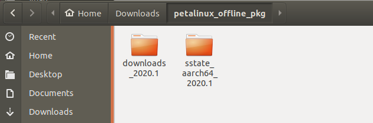\
记录这两个包的路径，注意**加粗**的部分：\
/home/alinx/Downloads/petalinux_offline_pkg/sstate_aarch64_2020.1/**aarch64**
**file://**/home/alinx/Downloads/petalinux_offline_pkg/downloads_2020.1/**downloads**\
先说到这里，后面再介绍如何通过这两个路径来设置petalinux工程的离线编译。
### 方法一：使用本路径中的*PETALINUX工程文件夹*
1. 把本路径中的所有文件拷贝到Ubuntu系统的文件夹中，如下图：\
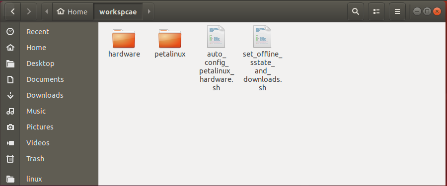
2. 在这个路径中打开终端，设置petalinux的环境变量。\
如果你的petalinux工具和我一样安装在 */opt/pkg/petalinux* 路径，则使用下面命令来设置环境变量：\
`source /opt/pkg/petalinux/settings.sh`\
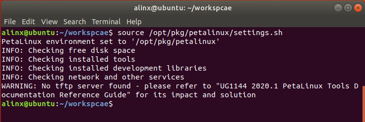
3. 如果你不需要或者不想使用离线编译，则可以跳过这一步。使用*set_offline_sstate_and_downloads.sh* 脚本设置离线编译：\
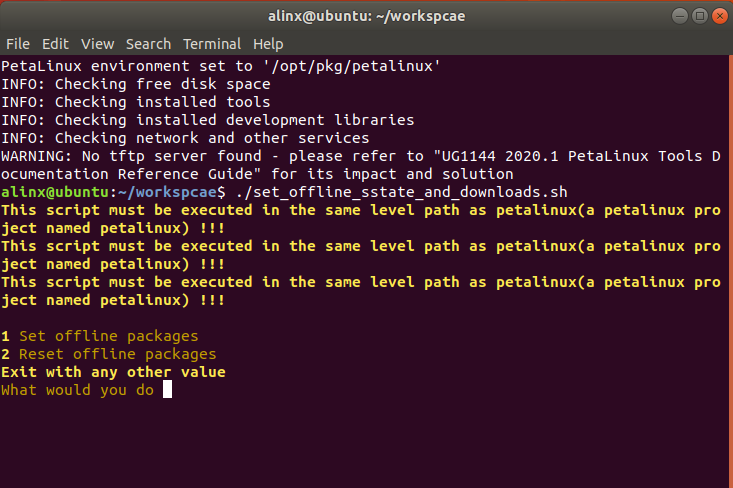\
输入1设置离线编译，输入2恢复成在线编译，输入其他任意值退出脚本，这里我选择1。因为我的sstate资源包路径和默认的设置相同，所以直接按回车就可以了。如果你的sstate资源包路径和默认的路径不同，则需要在这里输入你的路径然后按回车：\
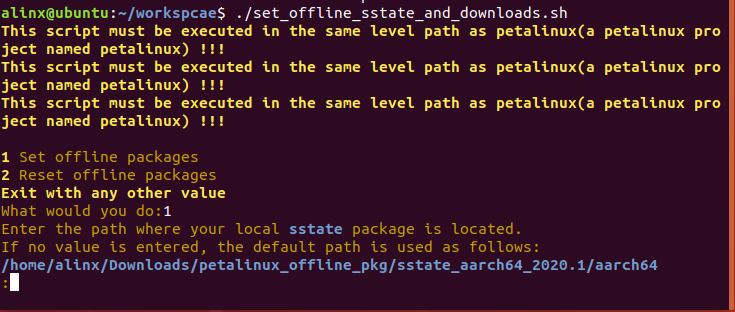\
然后downloads资源包路径也是一样的设置。按回车等待提示*offline package set over*：\
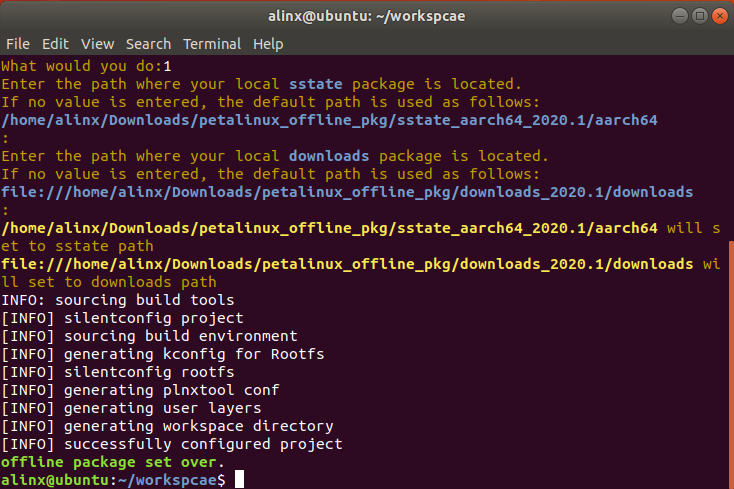
4. 使用*hardware*路径中的硬件描述文件来配置petalinux工程的硬件信息，可以使用*auto_config_petalinux_hardware.sh*脚本来完成设置，如下图：\
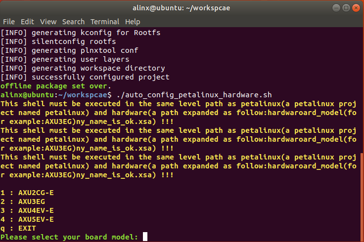\
根据提示完成操作，选择你的开发板型号，我以AXU2CG-E为例：\
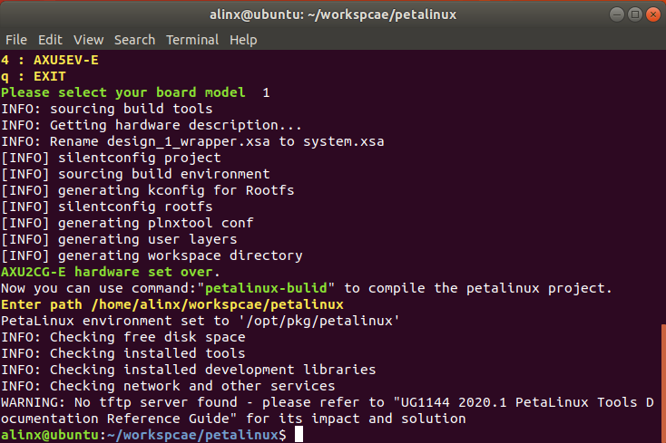
5. 现在就可以编译petalinux工程了，在终端中输入下面的命令编译工程并在编译完成后打包BOOT.bin：\
`petalinux-build && petalinux-package --boot --u-boot --fsbl --fpga --force`\
即使是使用离线编译，每个工程的第一次编译都会花上较长的时间。耐心等待编译完成：\
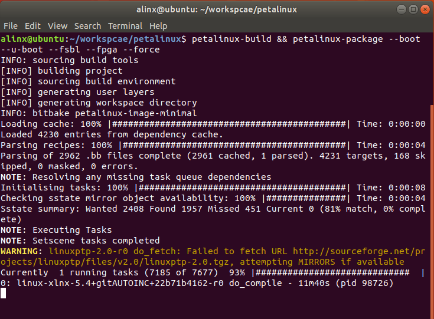\
编译成功!!!并且打包了BOOT.bin：\
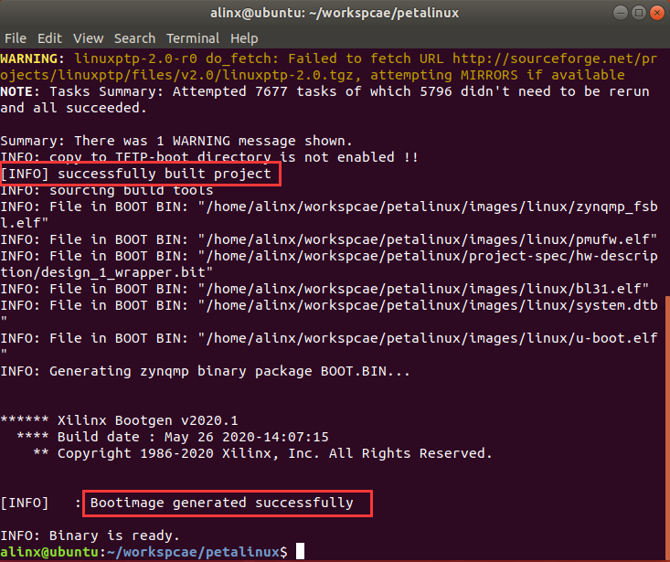
6. 查看petalinux工程 */image/linux* 路径，这里就是编译和打包的结果文件。我们需要其中的BOOT.bin、image.ub、boot.scr以及rootfs.tar.gz这四个文件，在开发板上启动LINUX：\
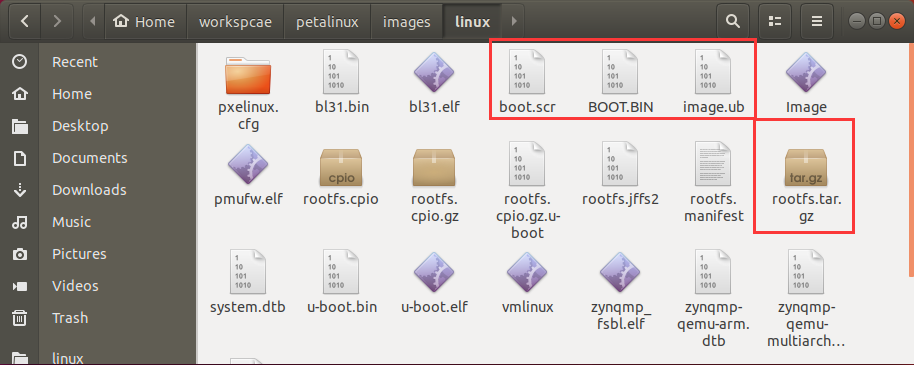

### 方法二：使用RELEASE版本中的BSP包创建PETALINUX工程
1. 把bsp文件拷贝到Ubuntu系统的文件夹中，以AXU4EV-E为例，如下图：\
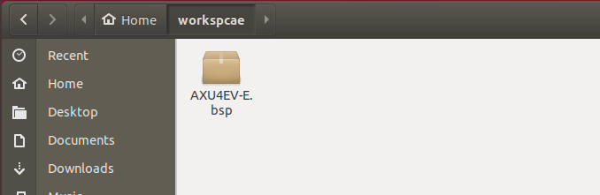
2. 在当前路径中打开终端，设置petalinux的环境变量。\
如果你的petalinux工具和我一样安装在 /opt/pkg/petalinux 路径，则使用下面命令来设置环境变量：\
`source /opt/pkg/petalinux/settings.sh`
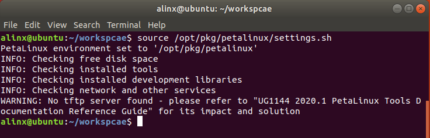
3. 用下面的命令，通过petalinux的bsp包来创建petalinux工程：\
`petalinux-create -t project -n petalinux -s ./AXU4EV-E.bsp`\
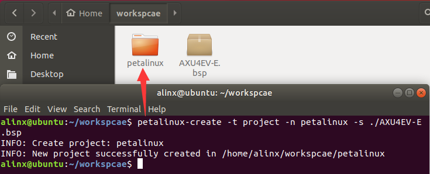
4. 如果需要配置离线编译，参考**方法一**的步骤 **[3]**。
5. 使用bsp包创建的petalinux工程不需任何设置，进入petalinux工程路径\
`cd ./petalinux/`\
直接编译并打包BOOT.bin即可：\
`petalinux-build && petalinux-package --boot --u-boot --fsbl --fpga --force`\
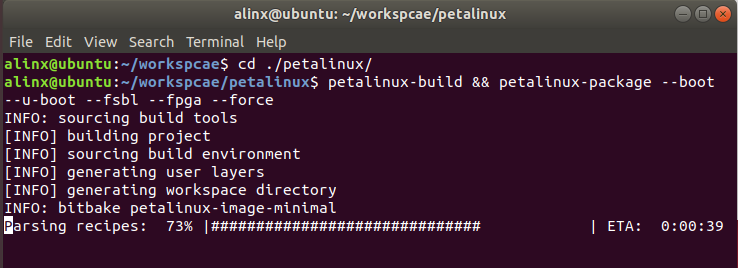\
编译和打包完成后，结果文件在petalinux工程的 */image/linux* 路径中：\

---
## 在开发板上启动LINUX
1. 以SD卡启动为例，把开发板上的拨码开关调整到从SD卡启动的状态，如下图：\
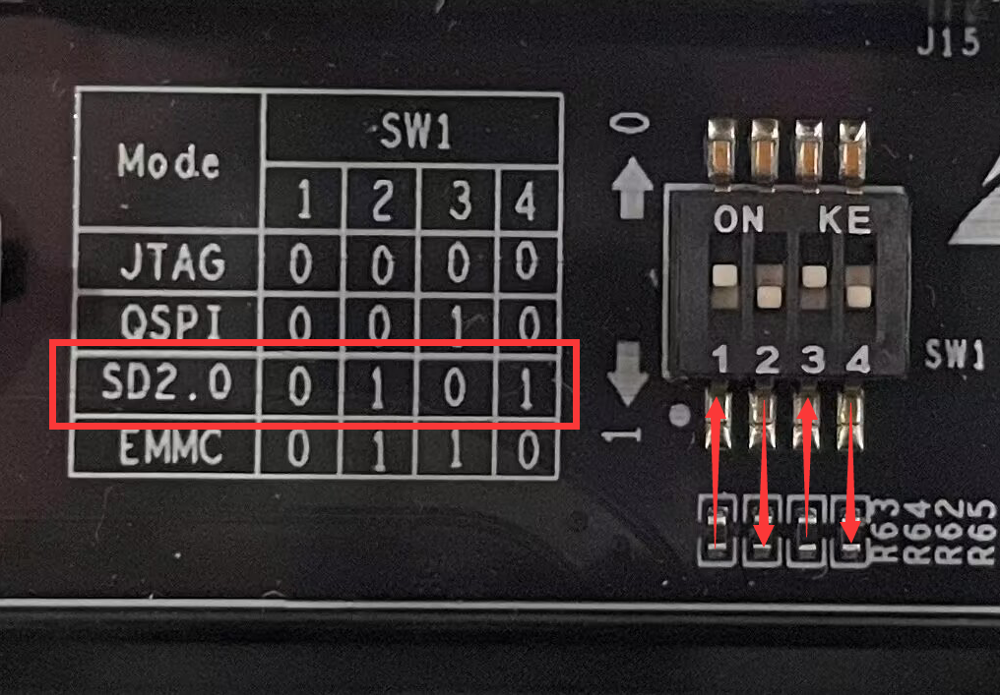\
拨码开关在开发板的这个位置：\
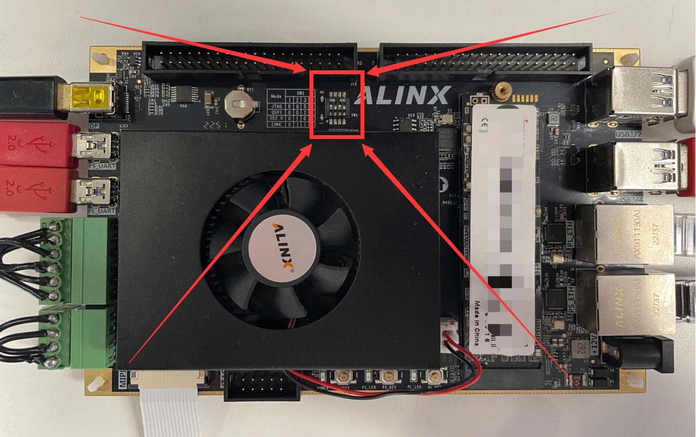
2. 接下来需要制作用于启动Linux的SD卡。把SD卡(例如通过读卡器)连接到Ubuntu系统，然后在Ubuntu系统中打开Disks工具：\
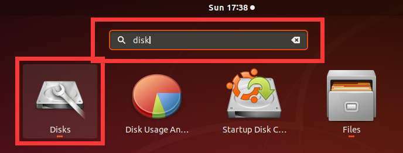\
我的SD卡是这里的**31 GB Drive**。选则它，可以看到SD卡中有三块区域分别是：\
a. 名为**BOOT**的FAT类型的分区\
b. 名为**ROOTFS**的Ext4类型的分区\
c. Free Space\
\
这也就是我们需要的状态，如果你的SD卡也是这样的状态(对分区的大小没有严格要求)，跳过步骤[2]即可。但是为了演示一个完整的流程，我先把SD恢复成没有分过区的状态，选择对应的分区，点击\" **-** \"图标可以删除当前分区，最终变成如下图的状态：\
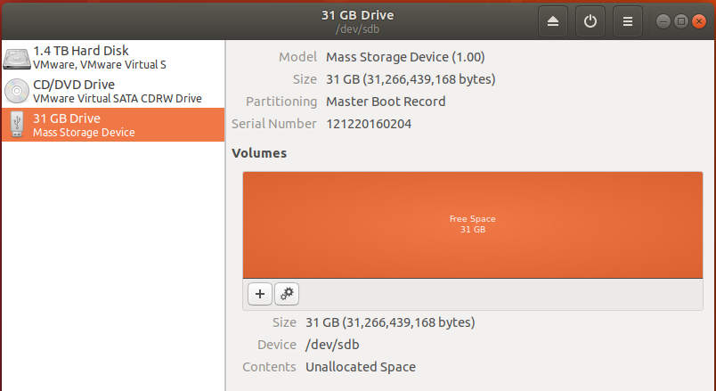\
点击\" **+** \"图标可以创建新的分区，第一个分区需要是**FAT**格式，大小分配2G，名字命名为**BOOT**：\
\
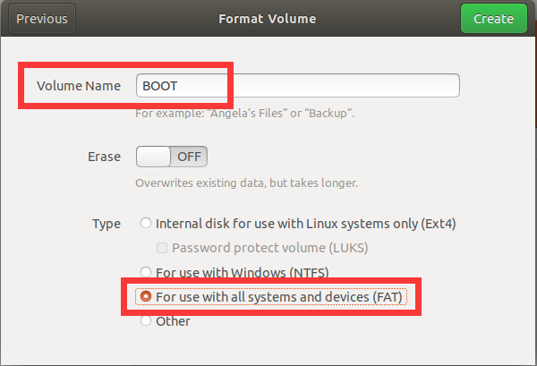\
点击**Create**按钮完成分区创建，点击\"**▶**\"按钮挂载分区：\
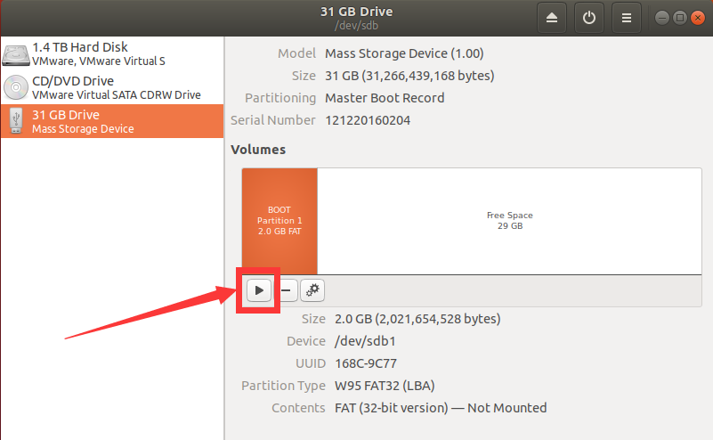\
点击**Free Space**，用类似的步骤创建第二个分区，格式选**Ext4**，大小分配20G(根据你的实际需求和限制调整)，命名为**ROOTFS**：\
\
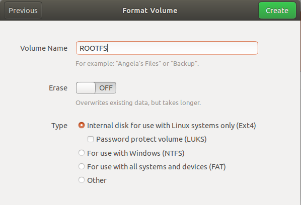\
最终状态如下图，注意，需要把两个分区都挂载上：\
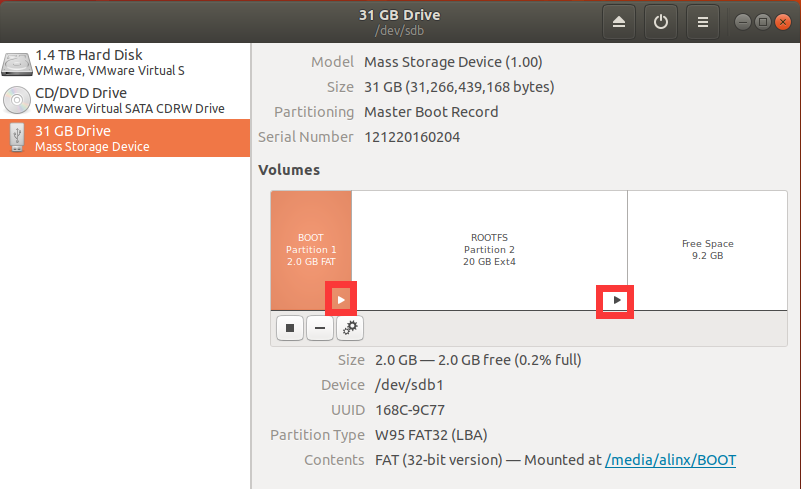
3. SD卡分区完成后，把启动系统需要的文件拷贝到对应分区。\
把*boot.scr* 、*BOOT.bin* 、*image.ub* 三个文件拷贝到**BOOT**分区：\
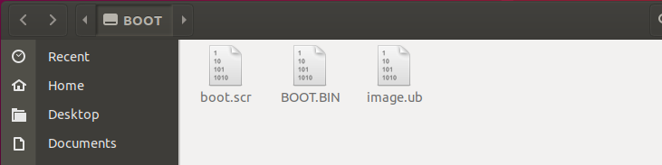\
把*rootfs.tar.gz* 用root权限解压到**ROOTFS**分区，在*rootfs.tar.gz* 所在路径打开终端，输入下面的命令：\
`sudo tar zxvf ./rootfs.tar.gz -C /media/alinx/ROOTFS/ && sync`\
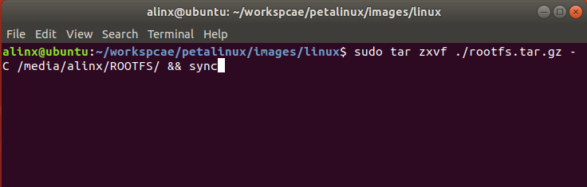\
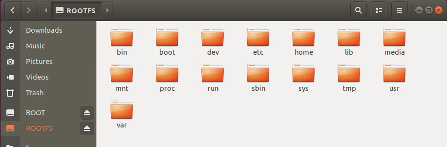
4. 弹出SD卡，插到开发板的SD卡槽中：\
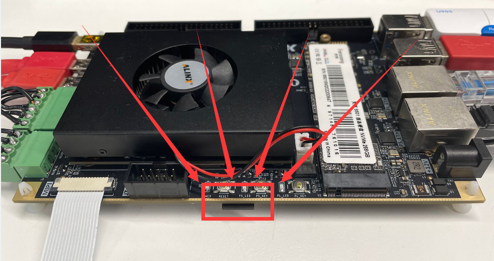\
连接PS_UART到PC(***PC上需要安装CP210x的驱动***)：\
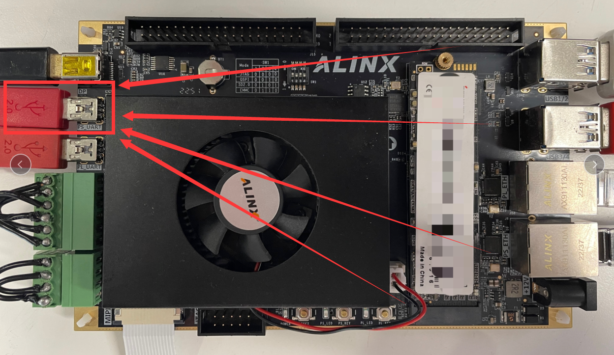
打开串口工具，选择我们刚才连接的COM口，波特率设置为115200，关闭流控制，点击OK按钮：\
\
连接12V电源：\
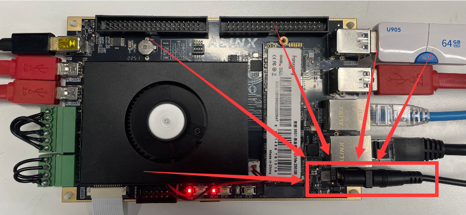\
可以看到串口工具中输出信息：\
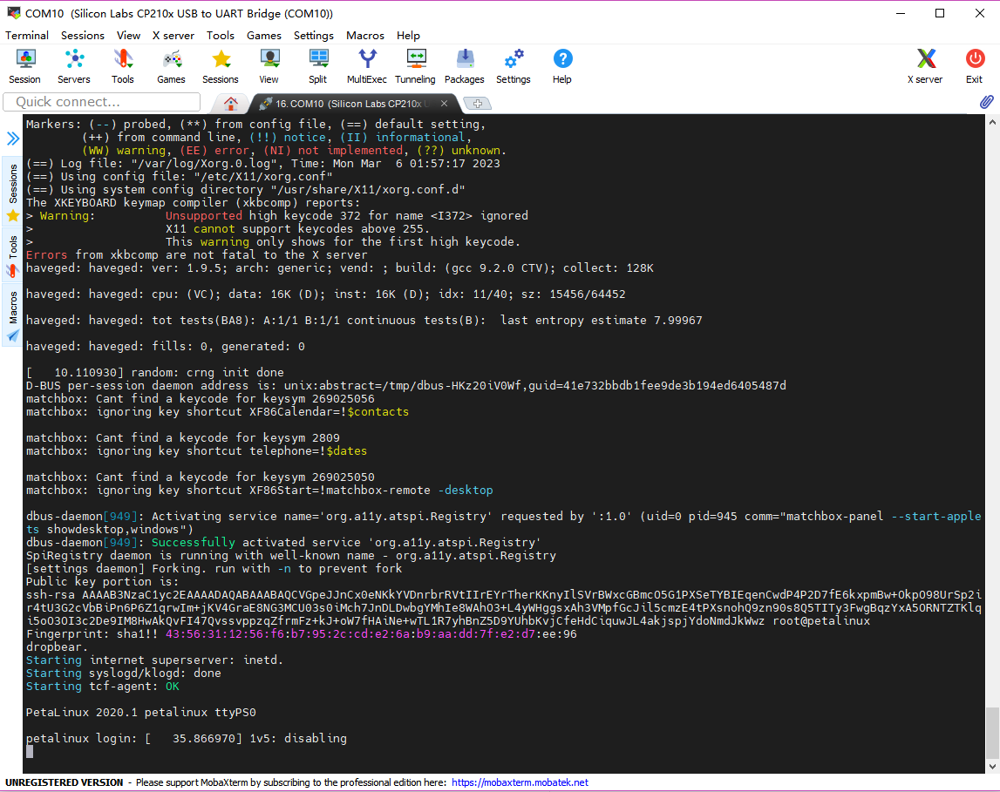\
系统已经成功启动，输入用户名**root**、密码**root**可以登陆系统。
---
## 在LINUX中使用开发板上的接口和外设
- AXU2CG-E、AXU3EG、AXU4EV-E、AXU5EV-E开发板上有这些接口和外设：\
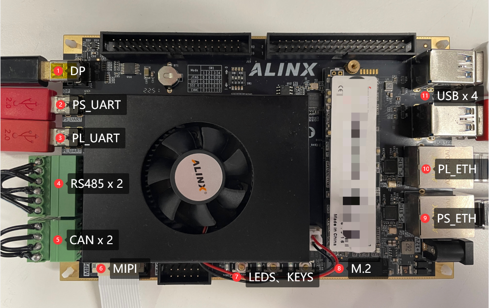\
①DP\
②PS_UART\
③PL_UART\
④RS485 x 2\
⑤CAN x 2\
⑥MIPI\
⑦LEDS、KEYS\
⑧M.2\
⑨PS_ETH\
⑩PL_ETH\
⑪USB x 4\
⑫EMMC(图中不可见)\
⑬EEPRM(图中不可见)\
⑭QSPI FLASH(图中不可见)\
⑮DS1308(图中不可见)\
PS：在前面制作的开发板上的Linux系统中，我集成了一些脚本在 *~/shells_for_testing_peripheral_devices/* 路径中用于测试这些接口和外设，你也可以参考这些脚本来使用这些接口和外设：\
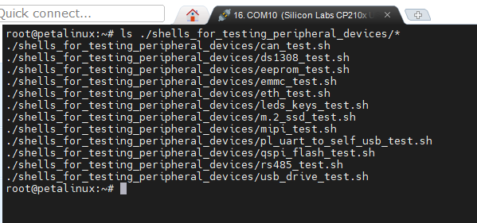\
### ①DP
#### 1.1什么是DP
DP (DisplayPort) 接口是一种数字视频和音频接口标准，用于连接计算机、电视、显示器、音响等设备。它是一种开放标准，由 Video Electronics Standards Association (VESA) 组织制定。\
DP 接口的物理接口有两种，一种是矩形形状的标准 DP 接口，另一种是圆形形状的 Mini DP 接口。我们的开发板上使用的就是Mini DP接口。
#### 1.2在Linux中使用DP
把DP连接到显示器上即可，系统启动后可以看到Macthbox的桌面：\
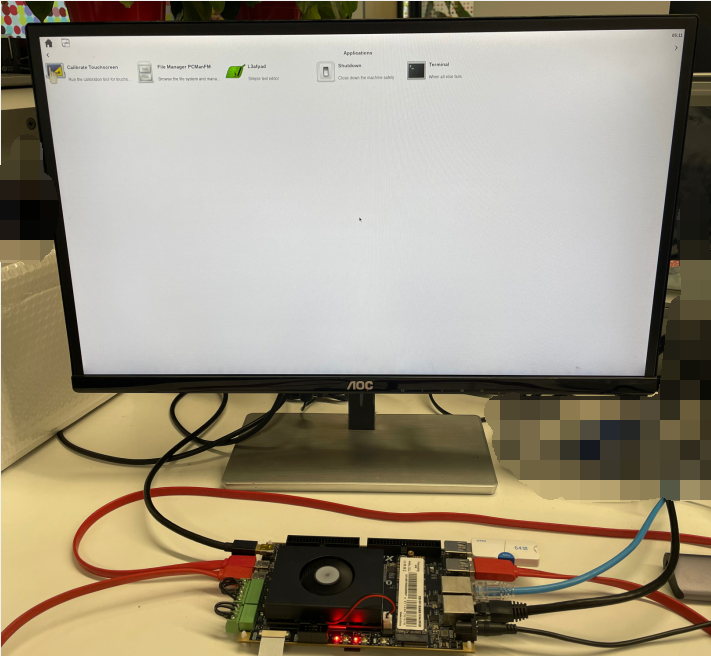
### ②PS_UART
#### 2.1什么是PS_UART
UART是一种通信协议，全称为“通用异步收发传输器”（Universal Asynchronous Receiver/Transmitter）。它是一种串行通信协议，可以用于在微控制器、传感器、电脑周边设备、通信设备等之间传输数据。\
UART使用两根信号线来进行数据传输：一根是数据线（TX），负责发送数据；另一根是接收线（RX），负责接收数据。UART通信使用异步传输方式，也就是说，通信双方的时钟信号不同步，需要在数据传输中加入起始位、停止位和奇偶校验位来保证数据的正确性。\
UART的主要优点是简单、灵活和广泛使用。由于它是一种通用协议，可以在各种不同的设备之间进行通信，因此在嵌入式系统和通信领域中应用广泛。\
PS_UART是ZYNQMP芯片中ARM端(也叫做PS端)的UART接口。
#### 2.2在Linux中使用PS_UART
PS_UART在我们制作的系统中用于Linux的默认终端窗口，把PS_UART连接到PC(***PC上需要安装CP210x的驱动***)：\
\
用串口工具打开对应的COM，设置波特率设置为115200，关闭流控制，点击OK按钮：\
\
启动开发板后可以看到串口工具中打印信息：\
\
PS_UART在我们制作的Linux系统中的设备是 */dev/ttyPS0* ，使用`echo "PS_UART test" > /dev/ttyPS0`命令可以通过PS_UART接口传输数据：\
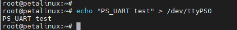\
可以看到串口有回显，但是PS_UART被用于终端窗口，因此不建议对 */dev/ttyPS0* 进行操作。
### ③PL_UART
#### 3.1什么是PL_UART
PL_UART区别于PS_UART，是ZYNQMP芯片中FPGA端(也叫做PL端)的UART接口。
#### 3.2在Linux中使用PL_UART
把PL_UART连接到PC(***PC上需要安装CP210x的驱动***)：\
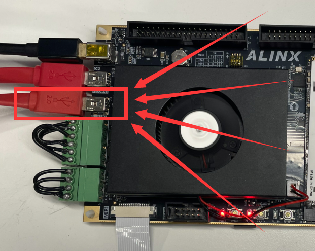\
打开串口工具，选择对应COM，波特率设置为115200：\
\
**COM的编号取决于你的PC，如果此时你的PS_UART和PL_UART都接在PC上，那么至少能看到两个后缀是*Silicon Labs CP210x USB to UART Bridge* 的COM：**\
\
在开发板的Linux系统中PL_UART设备是 */dev/ttyPS3*，默认波特率是9600，可以用这个命令来设置波特率：\
`stty -F /dev/ttyPS3 ispeed 115200 ospeed 115200 cs8`\
我们把它设置成115200和串口工具的设置对应，然后使用命令：\
`cat /dev/ttyPS3`\
来显示PL_UART收到的数据：\
\
在串口工具中发送一些数据，可以看到系统中收到了这些数据：\
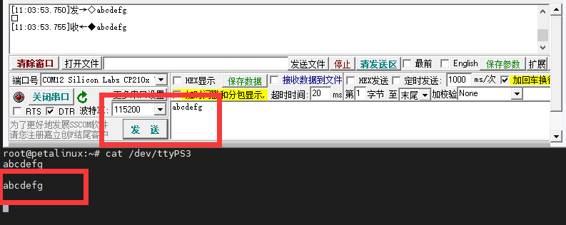\
在键盘上按*ctrl v*退出*cat /dev/ttyPS3*命令，然后用命令：\
`echo "PL_UART test" > /dev/ttyPS3`\
通过PL_UART发送数据*PL_UART test* 到PC，PC上串口工具可以收到数据：\

#### 3.3使用系统内置的脚本测试PL_UART
把PL_UART连接到开发板的任意一个USB口上：\
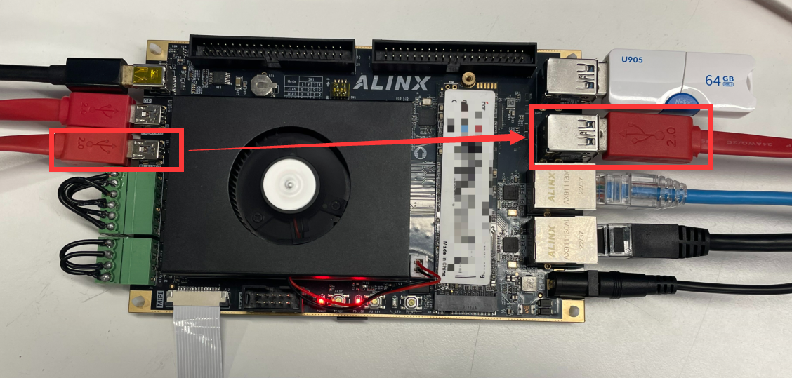\
运行 *~/shells_for_testing_peripheral_devices/* 中的 *pl_uart_to_self_usb_test.sh* 脚本：\
\
输出\"*pl uart to self usb test OK* \"说明PL_UART完好(ps：这个脚本同时也验证了USB接口完好)。
### ④RS485 x 2
#### 4.1什么是RS485
RS485是一种常用的串行通信协议，也称为EIA-485协议。它是由美国电子工业协会（EIA）制定的标准，用于在多个设备之间进行数据通信，可以在较长的距离范围内传输数据，具有高速传输和高可靠性的特点。\
RS485可以支持多个设备之间的点对点通信和多点通信，即一个主机可以与多个从机进行通信，也可以实现多个从机之间的通信，实现灵活的网络拓扑结构。RS485的传输距离最远可以达到1200米，传输速度可以达到10Mbps，在实际应用中，通常采用的是9600bps或者115200bps的通信速率。\
在我们的开发板中RS485是PL端的设备，是通过FPGA的IP实现的。
#### 4.2在Linux中使用RS485
开发板上有两路RS485，在系统中对应的设备文件是 */dev/ttyS1* 和 */dev/ttyS2* 。**RS485设备的操作方式和UART相同**。但需要注意，由于PL端IP的限制，这两个RS485的波特率固定为9600，设置成其他值会使设备无法正常工作。
#### 4.3使用系统内置的脚本测试RS485
把两路RS485互联：\
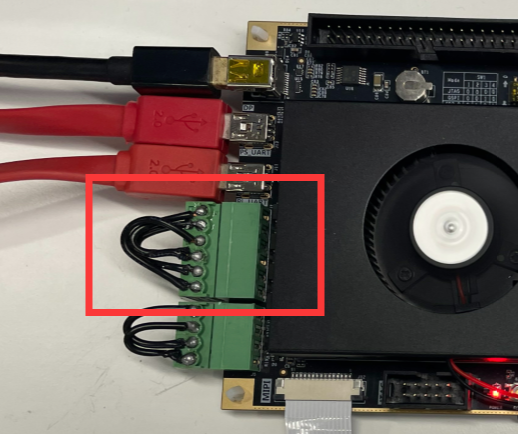 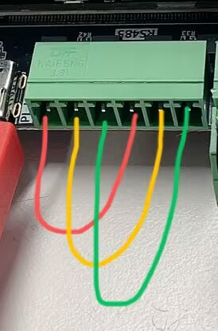\
运行 *~/shells_for_testing_peripheral_devices/* 中的 *rs485_test.sh* 脚本：\
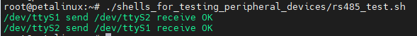\
如上图所示，双向收发测试OK，接口完好。
### ⑤CAN x 2
#### 5.1什么是CAN
CAN总线是一种串行通信总线，它是一种广泛应用于汽车电子、工业控制和机器人等领域的通信协议。CAN总线能够支持多个节点之间的数据通信，具有高效、可靠的特点。\
在CAN总线中，每个节点都可以发送和接收数据，节点之间通过总线连接。CAN总线采用差分信号的方式传输数据，这种方式可以减少电磁干扰和噪声的影响，提高信号传输的可靠性。\
CAN总线的数据帧分为标准帧和扩展帧两种类型。标准帧包含11位标识符和8个字节的数据，扩展帧则包含29位标识符和8个字节的数据。\
在Linux系统中，可以通过SocketCAN接口来实现对CAN总线的控制和数据传输。\
SocketCAN是一个开源的Linux内核模块，它提供了CAN总线的协议栈和驱动程序，并为用户层应用程序提供了一组接口，以便对CAN总线进行控制和数据传输。用户可以通过ipconfig命令来配置CAN接口和设置CAN总线的参数。\
#### 5.2在Linux中使用CAN
使用`ifconfig -a`命令可以看到开发板上有两路can即*can0* 和*can1* ：\
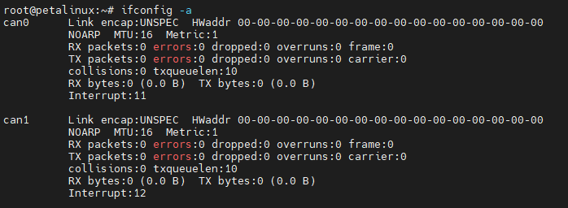\
使用这条命令来设置can0的bitrate并启动can0\
`ip link set can0 up type can bitrate 1000000`\
使用这条命令可以接收can0收到的数据：\
`candump can0`\
使用这条命令可以通过can0发送id为\"5A1\"的十六进制数据\"11 22 33 44 55\"到CAN总线上：\
`cansend can0 5A1#11.2233.4455`
#### 5.3使用系统内置的脚本测试CAN
把两路can互联：\
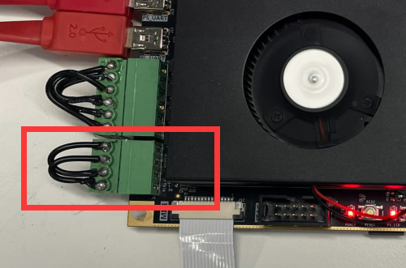 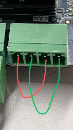\
运行 *~/shells_for_testing_peripheral_devices/* 中的 *can_test.sh* 脚本：\
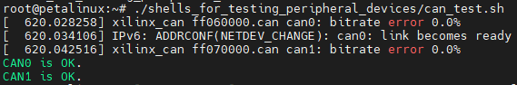
### ⑥MIPI
#### 6.1什么是MIPI
MIPI是移动行业处理器接口(Mobile Industry Processor Interface)的缩写，是由一些主要移动设备制造商创建的组织MIPI联盟所制定的一系列接口标准。\
MIPI主要致力于定义一系列用于移动设备的硬件和软件接口标准，包括像相机、显示器、控制器等通信接口，以帮助移动设备的各个部分之间更高效地交换数据和控制信号。MIPI协议具有高带宽、低功耗、可扩展性、可靠性和安全性等特点，非常适用于现代移动设备。\
除了移动设备，MIPI的应用还逐渐扩展到了其他领域，如汽车、物联网、医疗设备等，成为了通信和控制的重要接口之一。\
我们开发版当前系统的系统中MIPI被设计成了输入，可以连接MIPI摄像头使用。
#### 6.2在Linux中使用MIPI
首先我们连接显示器到DP口并接入一个MIPI接口的OV5640摄像头(请不要带电操作)：\
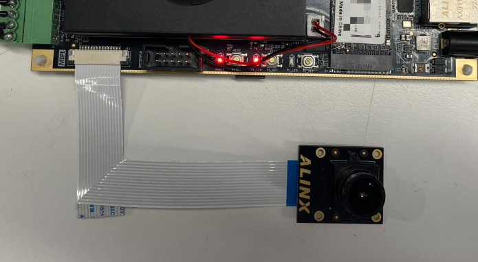\
在系统启动并登录后使用命令：\
`media-ctl -p -d /dev/media0`\
如果可以成功获取设备下各节点信息，则说明设备ov5640的i2c连接正常。\
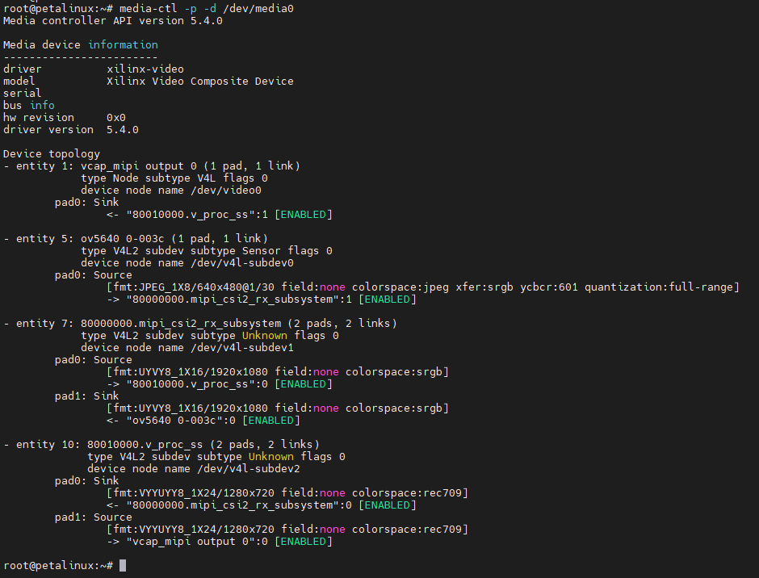\
根据上面的信息，我们可以获取到设备节点名如下：
```
ov5640 0-003c
80000000.mipi_csi2_rx_subsystem
80010000.v_proc_ss
```
使用下面的命令设置摄像头为1920x1080、UYVY格式：
```
media-ctl -V '"ov5640 0-003c":0 [fmt:UYVY8_1X16/1920x1080@1/30 field:none]'
media-ctl -V '"80000000.mipi_csi2_rx_subsystem":0 [fmt:UYVY8_1X16/1920x1080 field:none]'
media-ctl -V '"80000000.mipi_csi2_rx_subsystem":1 [fmt:UYVY8_1X16/1920x1080 field:none]'
media-ctl -V '"80010000.v_proc_ss":0 [fmt:UYVY8_1X16/1920x1080 field:none]'
media-ctl -V '"80010000.v_proc_ss":1 [fmt:UYVY8_1X16/1920x1080 field:none]'
```
然后使用下面的命令在显示器上显示1920x1080的摄像头图像：\
`gst-launch-1.0 -e v4l2src device=/dev/video0 ! video/x-raw,format=YUY2,width=1920,height=1080 ! kmssink bus-id=fd4a0000.zynqmp-display fullscreen-overlay=1`
#### 6.3使用系统内置的脚本测试MIPI
连接显示器到DP口，连接MIPI摄像头到MIPI口，运行 *~/shells_for_testing_peripheral_devices/* 中的 *mipi_test.sh* 脚本(*ps：按**ctrl+c**组合键退出该脚本。*)：\
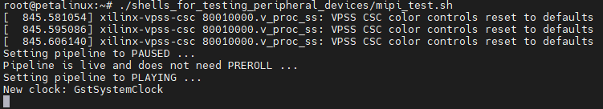\
显示其中显示摄像头图像：\
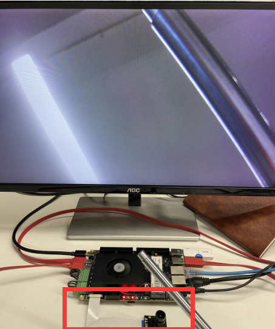
### ⑦LEDS、KEYS
#### 7.1开发板上的LEDs和KEYs
开发板上有三组LED和KEY。第一组是POWER指示灯和RESET按钮，第二组是PS端的LED和KEY，第三组是PL端的LED和KEY。上电后默认POWER和PL_LED点亮：\
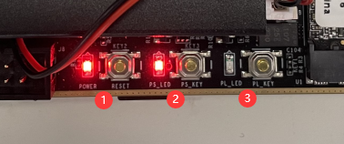
#### 7.2在Linux中使用LEDs和KEYs
使用LEDs和KEYs实际上就是配置和使用GPIO，在Linux中只需要知道GPIO号就可以使用对应的IO口。PS_LED的GPIO号为373，PS_KEY的GPIO号为359，PL_LED的GPIO号为509，PL_KEY的GPIO号为510。
LED对应的IO需要配置成输出，以PS_LED为例，使用GPIO输出的步骤如下：
```
#导出对应的端口
echo 373 >> /sys/class/gpio/export
#设置这个端口为输出
echo out >> /sys/class/gpio/gpio373/direction
#使这个端口输出高电平，点亮LED
echo 1 >> /sys/class/gpio/gpio373/value
#使这个端口输出低电平，熄灭LED
echo 0 >> /sys/class/gpio/gpio373/value
```
KEY对应的IO需要配置成输出，以PL_KEY为例，使用GPIO输入的步骤如下：
```
#导出对应的端口
echo 510 >> /sys/class/gpio/export
#设置这个端口为输入
echo in >> /sys/class/gpio/gpio510/direction
#读取这个IO当前的电平状态
cat /sys/class/gpio/gpio510/value
```

#### 7.3使用系统内置的脚本测试LEDs和KEYs
运行 *~/shells_for_testing_peripheral_devices/* 中的 *leds_keys_test.sh* 脚本(*ps：按**ctrl+c**组合键退出该脚本。*)。然后可以用PS_KEY控制PS_LED点亮和熄灭，PL_KEY控制PS_LED点亮和熄灭：\
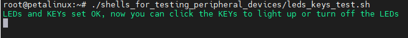
### ⑧M.2
#### 8.1什么是M.2
M.2是一种高速、低功耗的接口，用于连接外部设备，如固态硬盘、NVMe设备等等。\
M.2接口由PCI Express（PCIe）和SATA（串行ATA）两种协议组成，可用于数据传输、存储和通信。PCIe协议提供了更快的传输速度和更多的带宽，而SATA协议则更适合于低功耗和高容量的存储设备。
#### 8.2在系统中使用M.2接口
以SSD设备为例，在开发板的M.2接口上接上SSD(请不要带电操作)：\
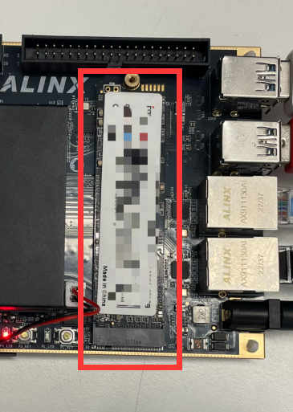\
然后启动开发板，登录Linux，如果能找到 */dev/nvme0n1* 说明SSD已经成功被识别到了。\
如果这个SSD已经被分过区了，那么还能找到 */dev/nvme0n1p1*, */dev/nvme0n1p2* 等分区对应的设备操作文件。\
如果SSD没有分区或者分区的文件系统格式Linux系统不支持，可以使用**fdisk**工具来分配分区，使用**mkfs**命令制作文件系统以及使用mount命令挂载。\
例如下面的命令将会删除 */dev/nvme0n1* 的第一个分区并新建一个分区，再把这个分格式化成ext4并挂载到 */run/media/nvme0n1p1* ：
```
#删除/dev/nvme0n1的一个分区并新建一个分区
echo "d

n
p
1


w
" | fdisk /dev/nvme0n1
#把/dev/nvme0n1p1分区格式化成ext4格式
echo "y

" | mkfs.ext4 /dev/nvme0n1p1
#挂载/dev/nvme0n1p1到/run/media/nvme0n1p1
mount /dev/nvme0n1p1 /run/media/nvme0n1p1
```

#### 8.3使用系统内置的脚本测试M.2 SSD
运行 *~/shells_for_testing_peripheral_devices/* 中的 *m.2_ssd_test.sh* 脚本：\
\
根据你的SSD的使用情况会用不同打印信息，但只要M.2接口和SSD是完好的最终肯定会输出\"*ssd read write OK* \"。
### ⑨PS_ETH
#### 9.1什么是ETH
在Linux操作系统中，\"ETH\" 通常指的是网络接口设备，它是用于在计算机与网络之间进行通信的硬件设备。在Linux中，可以使用 *ifconfig* 命令来管理和配置网络接口设备。可以通过ETH接口把开发板和其他网络设备连接在同一网络中，以便进行数据传输。\
在以太网协议中，每个设备都被分配一个唯一的MAC地址，以便在网络中进行识别和通信。当计算机通过网络接口设备发送数据时，它们将被封装在以太网帧中，并使用MAC地址进行路由和传输。
开发板上的PS_ETH是PS端的ETH，PS_ETH则是PL端用IP实现的ETH，但是在系统中他们的使用方法都是一样的
#### 9.2在Linux中使用ETH
连接PS_ETH和PL_ETH(比如通过路由器或交换机)到局域网：\
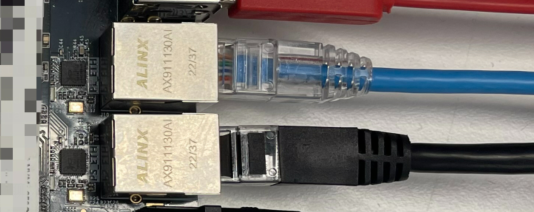\
然后开发板上电，登陆系统，使用 *ifconfig* 可以查看当前ETH的状态：\
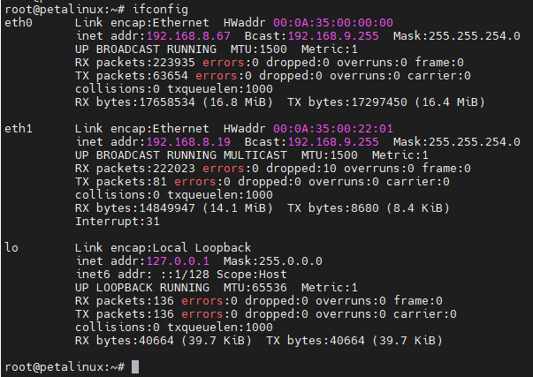\
如果你的路由器或交换机支持DHCP，eth0和eth1都会自动连接并分配到ip。\
如果没有被分配ip则需要用下面的命令来手动分配，例如：\
`ifconfig eth0 192.168.8.67`\
*ifconfig* 命令还可以用来设置子网掩码；如果需要修改MAC地址则需要修改 */etc/network/interfaces* ；如果要设置网关则需要用到**route**命令；如果需要修改DNS则需要修改 */etc/resolv.conf* ，相关的配置就不详细讲了，一般来说只要通过网线连接到局域网，系统上电之后就可以直接使用eth0了。\
如果要使用eth1的话，还需要设置一下eth1的默认网关，网关的ip地址取决于你的局域网，**如果你的eth1和eth0接在同一个局域网的同一个网段则可以参考eth0的设置**，例如：\
```
#先用route查看eth0的网关
route
#设置eth1的默认网关和eth0相同，假如上面route命令查看到eth0的默认网关为192.168.8.1
route add default gw 192.168.8.1 eth1
#再用route命令查看确认一下eth1的默认网关
route
```
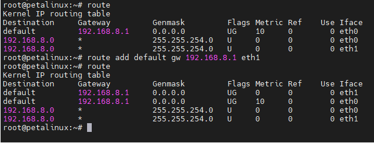\
可以使用**ping**命令来测试网络通断，通过 **-c** 参数设置ping的次数，通过 **-I** (大写的i)参数选择网口：\
`ping -c 1 -I eth1 www.baidu.com`\
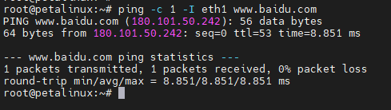
#### 9.3使用系统内置的脚本设置并测试ETH
运行 *~/shells_for_testing_peripheral_devices/* 中的 *m.2_ssd_test.sh* 脚本，这个脚本后可以带一个参数，即你想ping的地址，比如这里我ping了一下百度，如果不加参数则默认ping *www.google.com* ：\
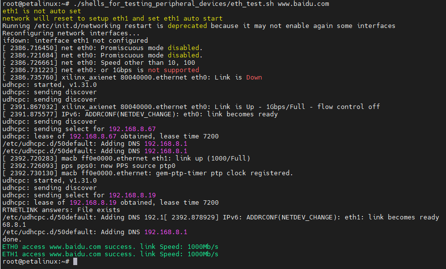\
最后会显示ping的结果和网口link的速度。
### ⑩PL_ETH
**见⑨PS_ETH**。
### ⑪USB x 4
#### 11.1什么是USB
USB是Universal Serial Bus的缩写，它是一种通用的数据传输标准，用于将计算机或其他设备与其他设备连接，包括打印机、键盘、鼠标、扫描仪、数字相机、移动设备和其他各种外部设备。\
随着技术的不断发展，USB的版本也在不断更新。USB 1.0是最早的版本，传输速度很慢，但是随着USB 2.0的推出，传输速度得到了显著提高。USB 3.0和USB 3.1是更快的版本，提供更高的传输速度和更多的功率。同时，USB还可以支持不同的数据传输协议，包括HID（人体接口设备）、音频、视频和存储设备等。\
我们的开发板上有四个USB3.0接口。
#### 11.2在Linux系统上使用USB
实际上常用USB设备都可以直接在这个系统上使用。比如鼠标键盘，都可以直接配合桌面来使用。使用U盘这些存储工具的话则需要注意分区和文件系统格式，可以参考**⑧M.2**中SSD的分区和格式化方法。
#### 11.3使用系统内置的脚本测试U盘
使用 *~/shells_for_testing_peripheral_devices/* 中的 *usb_drive_test.sh* 脚本( *ps：这个系统是不支持NTFS文件系统的，所以NTFS分区的U盘无法直接使用* )：\
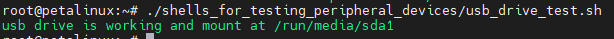
### ⑫EMMC
#### 12.1什么是EMMC
#### 12.2在Linux系统上使用EMMC
#### 12.3使用系统内置的脚本测试EMMC
运行 *~/shells_for_testing_peripheral_devices/* 中的 *emmc_test.sh* 脚本：\

### ⑬EEPRM
#### 13.1什么是EEPROM
#### 13.2在Linux系统上使用EEPROM
#### 13.3使用系统内置的脚本测试EEPROM
运行 *~/shells_for_testing_peripheral_devices/* 中的 *eeprom_test.sh* 脚本：\

### ⑭QSPI FLASH
#### 14.1什么是QSPI FLASH
#### 14.2在Linux系统上使用QSPI FLASH
#### 14.3使用系统内置的脚本测试QSPI FLASH
运行 *~/shells_for_testing_peripheral_devices/* 中的 *qspi_flash_test.sh* 脚本：\
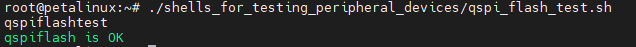
### ⑮DS1308
#### 15.1什么是DS1308
#### 15.2在Linux系统上使用DS1308
#### 15.3使用系统内置的脚本测试DS1308
运行 *~/shells_for_testing_peripheral_devices/* 中的 *ds1308_test.sh* 脚本：\
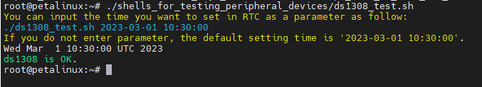

---
访问[ALINX官方网站](https://www.alinx.com)以获取更多信息。