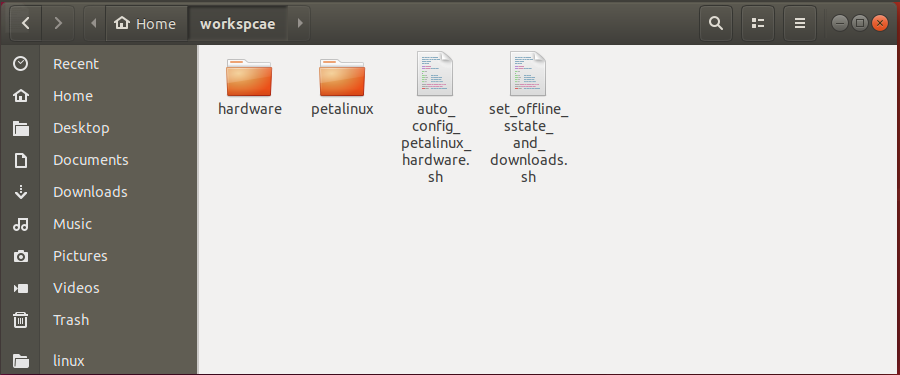

# 在系列开发板AXU2CG-E、AXU3EG、AXU4EV-E、AXU5EV-E上使用Linux
--- 
---
## 本路径中的内容 
	│
	└── linux
		│
		├── hardware
		│	│
		│	├── AXU2CG-E 
		│	│	│
		│	│	└── design_1_wrapper.xsa	//AXU2CG-E开发板的硬件描述文件
		│	│
		│	├── AXU3CG 
		│	│	│
		│	│	└── design_1_wrapper.xsa	//AXU3EG开发板的硬件描述文件
		│	│
		│	├── AXU4EV-E 
		│	│	│
		│	│	└── design_1_wrapper.xsa	//AXU4EV-E开发板的硬件描述文件
		│	│
		│	└── AXU5EV-E 
		│		│	
		│	 	└── design_1_wrapper.xsa	//AXU5EV-E开发板的硬件描述文件
		│
		├── petalinux	//petalinux工程文件夹
		│
		├── auto_config_petalinux_hardware.sh	//自动设置硬件描述文件的shell脚本
		│
		├── set_offline_sstate_and_downloads.sh	//快速设置离线或在线编译的shell脚本
		│
		├── README_CN.md	//本文档
		│
		└── README_EN.md	//English README 
---
## 创建和使用PETALINUX工程
### 使用本路径中的*PETALINUX工程文件夹*
1. 把本路径中的所有文件拷贝到Ubuntu系统的文件夹中，如下图：

### 使用RELEASE版本中的BSP包创建PETALINUX工程
1. 把bsp文件拷贝到Ubuntu系统的文件夹中，如下图：

2. 在这个文件夹中打开终端。如果你的petalinux安装在*_/opt/pkg/petalinux_*路径，则使用下面命令来设置环境变量`source /opt/pkg/petalinux/settings.sh`
3. 使用
---
## 在开发板上启动LINUX
---
## 验证开发板上的接口和外设

---
访问[ALINX官方网站](https://www.alinx.com)以获取更多信息。