[返回首页](../)
## 从SD卡启动开发板上的LINUX

---
### 1.调整拨码开关
把开发板上的拨码开关调整到从SD卡启动的状态，如下图：\
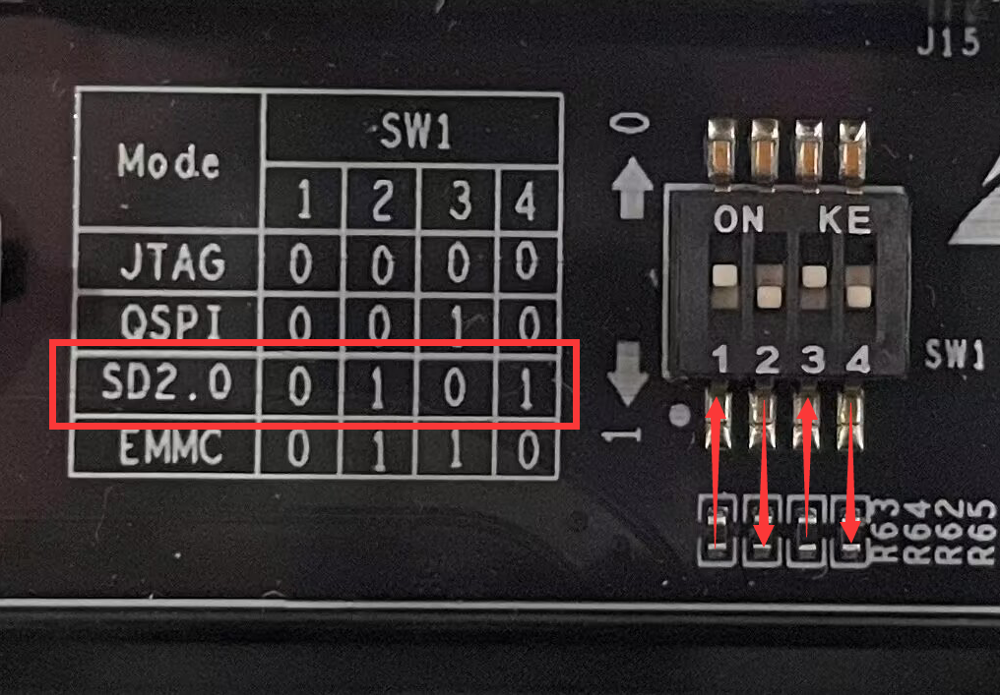\
拨码开关在开发板的这个位置：\
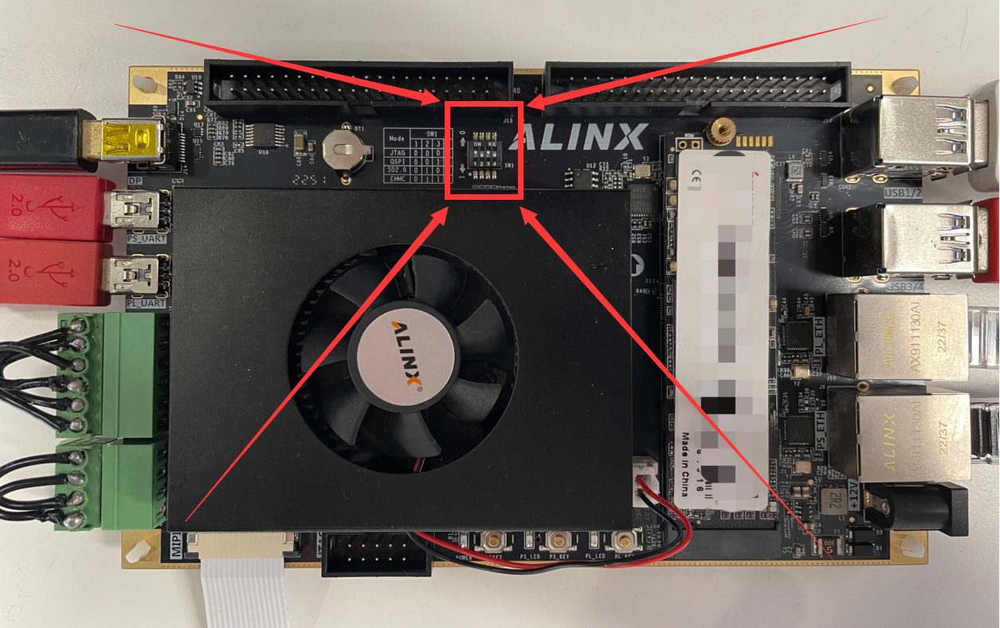

---
### 2.设置SD卡分区
接下来需要制作用于启动Linux的SD卡。把SD卡(例如通过读卡器)连接到Ubuntu系统，然后在Ubuntu系统中打开Disks工具：\
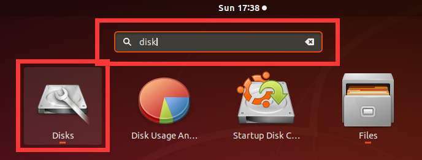\
我的SD卡是这里的**31 GB Drive**。选则它，可以看到SD卡中有三块区域分别是：\
a. 名为**BOOT**的FAT类型的分区\
b. 名为**ROOTFS**的Ext4类型的分区\
c. Free Space\
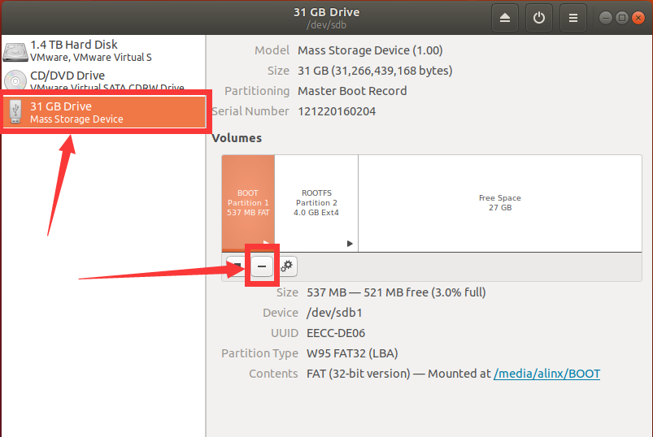\
这也就是我们需要的状态，如果你的SD卡也是这样的状态(对分区的大小没有严格要求)，跳过步骤[2]即可。但是为了演示一个完整的流程，我先把SD恢复成没有分过区的状态，选择对应的分区，点击\" **-** \"图标可以删除当前分区，最终变成如下图的状态：\
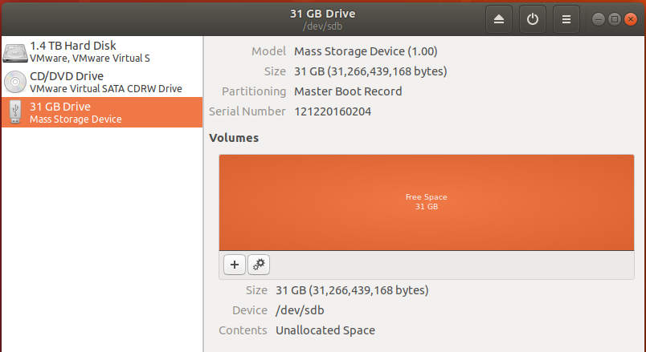\
点击\" **+** \"图标可以创建新的分区，第一个分区需要是**FAT**格式，大小分配2G，名字命名为**BOOT**：\
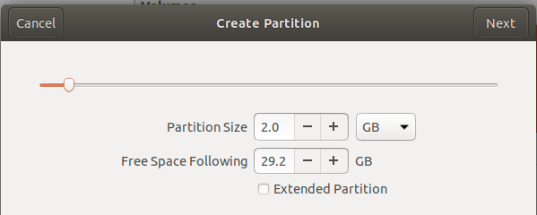\
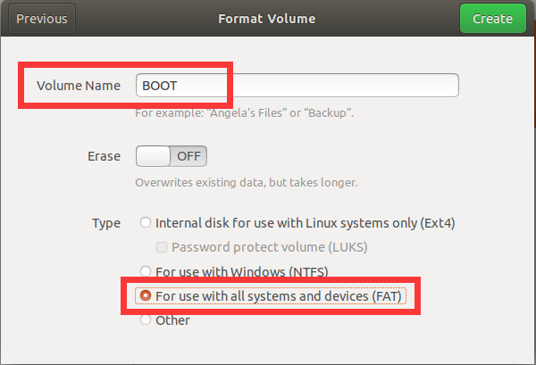\
点击**Create**按钮完成分区创建，点击\"**▶**\"按钮挂载分区：\
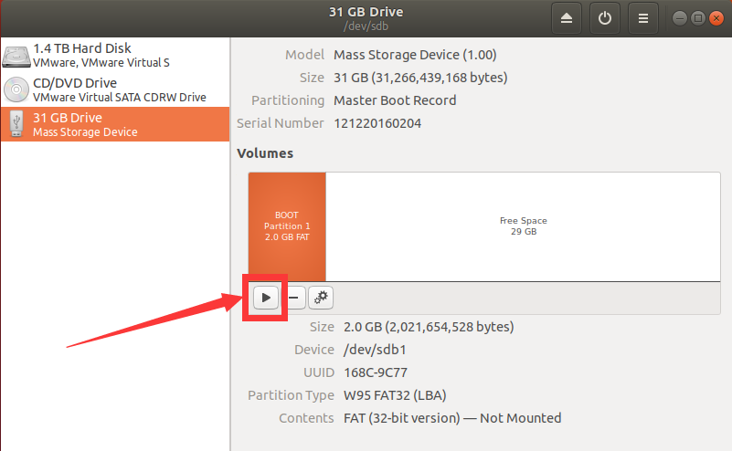\
点击**Free Space**，用类似的步骤创建第二个分区，格式选**Ext4**，大小分配20G(根据你的实际需求和限制调整)，命名为**ROOTFS**：\
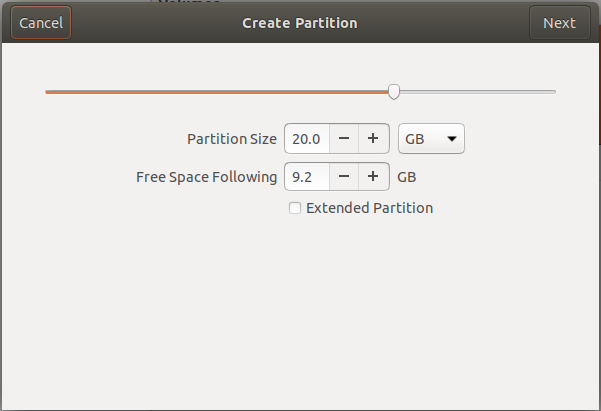\
\
最终状态如下图，注意，需要把两个分区都挂载上：\
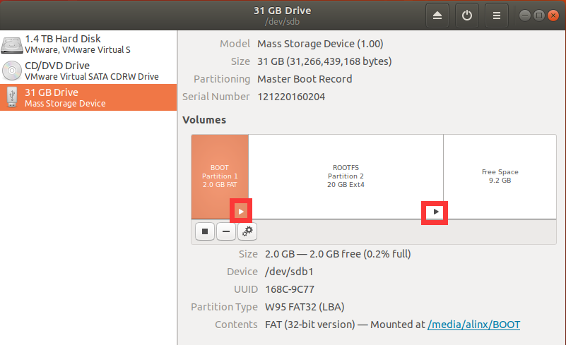

---
### 3.填充SD卡分区
SD卡分区完成后，把启动系统需要的文件拷贝到对应分区。\
ps：可以在release版本中找到*boot.scr* 、*BOOT.bin* 、*image.ub*、*rootfs.tar.gz* 等文件。也可以自己编译petalinux工程获取这些文件。  \
把*boot.scr* 、*BOOT.bin* 、*image.ub* 三个文件拷贝到**BOOT**分区：\
\
把*rootfs.tar.gz* 用root权限解压到**ROOTFS**分区，在*rootfs.tar.gz* 所在路径打开终端，输入下面的命令：\
`sudo tar zxvf ./rootfs.tar.gz -C /media/alinx/ROOTFS/ && sync`\
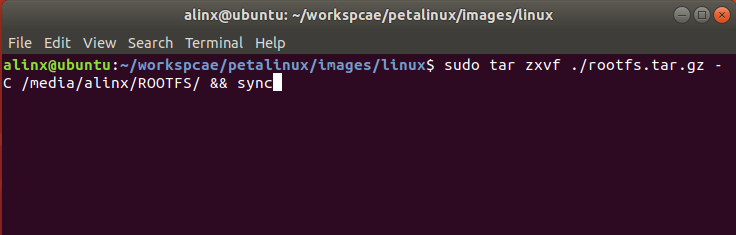\
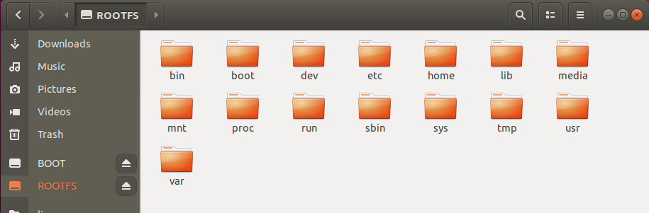\
然后从Ubuntu中弹出SD卡。

---
### 4.启动Linux
把刚才制作的SD卡插到开发板的SD卡槽中：\
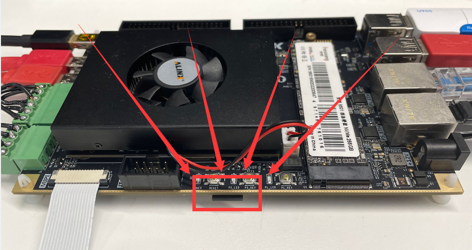\
连接PS_UART到PC(***PC上需要安装CP210x的驱动***)：\
\
打开串口工具，选择我们刚才连接的COM口，波特率设置为115200，关闭流控制，点击OK按钮：\
\
连接12V电源：\
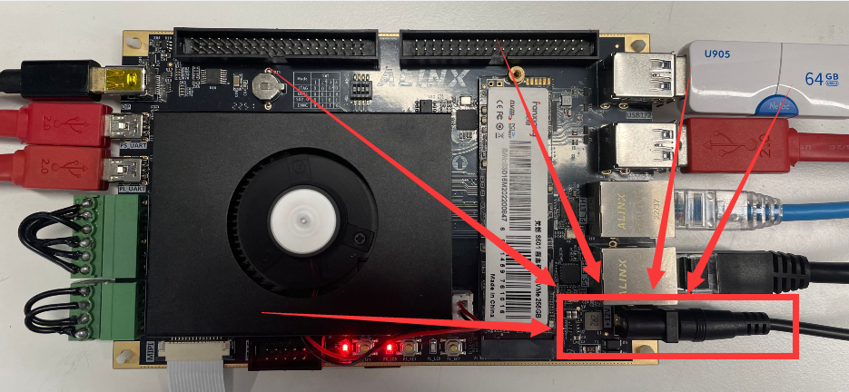\
可以看到串口工具中输出信息：\
\
系统已经成功启动，输入用户名**root**、密码**root**可以登陆系统。

---
---
- 访问[ALINX官方网站](https://www.alinx.com)以获取更多信息。