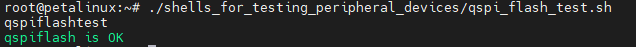

[返回首页](../)
## 在LINUX中使用开发板上的接口和外设

---
- AXU2CG-E、AXU3EG、AXU4EV-E、AXU5EV-E开发板上有这些接口和外设：\
\
①DP\
②PS_UART\
③PL_UART\
④RS485 x 2\
⑤CAN x 2\
⑥MIPI\
⑦LEDS、KEYS\
⑧M.2\
⑨PS_ETH\
⑩PL_ETH\
⑪USB x 4\
⑫EMMC(图中不可见)\
⑬EEPRM(图中不可见)\
⑭QSPI FLASH(图中不可见)\
⑮DS1308(图中不可见)\
⑯LM75(图中不可见)\
PS：在前面制作的开发板上的Linux系统中，我集成了一些脚本在 *~/shells_for_testing_peripheral_devices/* 路径中用于测试这些接口和外设，你也可以参考这些脚本来使用这些接口和外设：\


---
### ①DP
#### 1.1什么是DP
DP (DisplayPort) 接口是一种数字视频和音频接口标准，用于连接计算机、电视、显示器、音响等设备。它是一种开放标准，由 Video Electronics Standards Association (VESA) 组织制定。\
DP 接口的物理接口有两种，一种是矩形形状的标准 DP 接口，另一种是圆形形状的 Mini DP 接口。我们的开发板上使用的就是Mini DP接口。
#### 1.2在Linux中使用DP
把DP连接到显示器上即可，系统启动后可以看到Macthbox的桌面：\

### ②PS_UART
#### 2.1什么是PS_UART
UART是一种通信协议，全称为“通用异步收发传输器”（Universal Asynchronous Receiver/Transmitter）。它是一种串行通信协议，可以用于在微控制器、传感器、电脑周边设备、通信设备等之间传输数据。\
UART使用两根信号线来进行数据传输：一根是数据线（TX），负责发送数据；另一根是接收线（RX），负责接收数据。UART通信使用异步传输方式，也就是说，通信双方的时钟信号不同步，需要在数据传输中加入起始位、停止位和奇偶校验位来保证数据的正确性。\
UART的主要优点是简单、灵活和广泛使用。由于它是一种通用协议，可以在各种不同的设备之间进行通信，因此在嵌入式系统和通信领域中应用广泛。\
PS_UART是ZYNQMP芯片中ARM端(也叫做PS端)的UART接口。
#### 2.2在Linux中使用PS_UART
PS_UART在我们制作的系统中用于Linux的默认终端窗口，把PS_UART连接到PC(***PC上需要安装CP210x的驱动***)：\
\
用串口工具打开对应的COM，设置波特率设置为115200，关闭流控制，点击OK按钮：\
\
启动开发板后可以看到串口工具中打印信息：\
\
PS_UART在我们制作的Linux系统中的设备是 */dev/ttyPS0* ，使用`echo "PS_UART test" > /dev/ttyPS0`命令可以通过PS_UART接口传输数据：\
\
可以看到串口有回显，但是PS_UART被用于终端窗口，因此不建议对 */dev/ttyPS0* 进行操作。

---
### ③PL_UART
#### 3.1什么是PL_UART
PL_UART区别于PS_UART，是ZYNQMP芯片中FPGA端(也叫做PL端)的UART接口。
#### 3.2在Linux中使用PL_UART
把PL_UART连接到PC(***PC上需要安装CP210x的驱动***)：\
\
打开串口工具，选择对应COM，波特率设置为115200：\
\
**COM的编号取决于你的PC，如果此时你的PS_UART和PL_UART都接在PC上，那么至少能看到两个后缀是*Silicon Labs CP210x USB to UART Bridge* 的COM：**\
\
在开发板的Linux系统中PL_UART设备是 */dev/ttyPS3*，默认波特率是9600，可以用这个命令来设置波特率：\
`stty -F /dev/ttyPS3 ispeed 115200 ospeed 115200 cs8`\
我们把它设置成115200和串口工具的设置对应，然后使用命令：\
`cat /dev/ttyPS3`\
来显示PL_UART收到的数据：\
\
在串口工具中发送一些数据，可以看到系统中收到了这些数据：\
\
在键盘上按*ctrl v*退出*cat /dev/ttyPS3*命令，然后用命令：\
`echo "PL_UART test" > /dev/ttyPS3`\
通过PL_UART发送数据*PL_UART test* 到PC，PC上串口工具可以收到数据：\

#### 3.3使用系统内置的脚本测试PL_UART
把PL_UART连接到开发板的任意一个USB口上：\
\
运行 *~/shells_for_testing_peripheral_devices/* 中的 *pl_uart_to_self_usb_test.sh* 脚本：\
\
输出\"*pl uart to self usb test OK* \"说明PL_UART完好(ps：这个脚本同时也验证了USB接口完好)。

---
### ④RS485 x 2
#### 4.1什么是RS485
RS485是一种常用的串行通信协议，也称为EIA-485协议。它是由美国电子工业协会（EIA）制定的标准，用于在多个设备之间进行数据通信，可以在较长的距离范围内传输数据，具有高速传输和高可靠性的特点。\
RS485可以支持多个设备之间的点对点通信和多点通信，即一个主机可以与多个从机进行通信，也可以实现多个从机之间的通信，实现灵活的网络拓扑结构。RS485的传输距离最远可以达到1200米，传输速度可以达到10Mbps，在实际应用中，通常采用的是9600bps或者115200bps的通信速率。\
在我们的开发板中RS485是PL端的设备，是通过FPGA的IP实现的。
#### 4.2在Linux中使用RS485
开发板上有两路RS485，在系统中对应的设备文件是 */dev/ttyS1* 和 */dev/ttyS2* 。**RS485设备的操作方式和UART相同**。但需要注意，由于PL端IP的限制，这两个RS485的波特率固定为9600，设置成其他值会使设备无法正常工作。
#### 4.3使用系统内置的脚本测试RS485
把两路RS485互联：\
 \
运行 *~/shells_for_testing_peripheral_devices/* 中的 *rs485_test.sh* 脚本：\
\
如上图所示，双向收发测试OK，接口完好。

---
### ⑤CAN x 2
#### 5.1什么是CAN
CAN总线是一种串行通信总线，它是一种广泛应用于汽车电子、工业控制和机器人等领域的通信协议。CAN总线能够支持多个节点之间的数据通信，具有高效、可靠的特点。\
在CAN总线中，每个节点都可以发送和接收数据，节点之间通过总线连接。CAN总线采用差分信号的方式传输数据，这种方式可以减少电磁干扰和噪声的影响，提高信号传输的可靠性。\
CAN总线的数据帧分为标准帧和扩展帧两种类型。标准帧包含11位标识符和8个字节的数据，扩展帧则包含29位标识符和8个字节的数据。\
在Linux系统中，可以通过SocketCAN接口来实现对CAN总线的控制和数据传输。\
SocketCAN是一个开源的Linux内核模块，它提供了CAN总线的协议栈和驱动程序，并为用户层应用程序提供了一组接口，以便对CAN总线进行控制和数据传输。用户可以通过ipconfig命令来配置CAN接口和设置CAN总线的参数。\
#### 5.2在Linux中使用CAN
使用`ifconfig -a`命令可以看到开发板上有两路can即*can0* 和*can1* ：\
\
使用这条命令来设置can0的bitrate并启动can0：\
`ip link set can0 up type can bitrate 1000000`\
使用这条命令可以接收can0收到的数据：\
`candump can0`\
使用这条命令可以通过can0发送id为\"5A1\"的十六进制数据\"11 22 33 44 55\"到CAN总线上：\
`cansend can0 5A1#11.2233.4455`
#### 5.3使用系统内置的脚本测试CAN
把两路can互联：\
 \
运行 *~/shells_for_testing_peripheral_devices/* 中的 *can_test.sh* 脚本：\


---
### ⑥MIPI
#### 6.1什么是MIPI
MIPI是移动行业处理器接口(Mobile Industry Processor Interface)的缩写，是由一些主要移动设备制造商创建的组织MIPI联盟所制定的一系列接口标准。\
MIPI主要致力于定义一系列用于移动设备的硬件和软件接口标准，包括像相机、显示器、控制器等通信接口，以帮助移动设备的各个部分之间更高效地交换数据和控制信号。MIPI协议具有高带宽、低功耗、可扩展性、可靠性和安全性等特点，非常适用于现代移动设备。\
除了移动设备，MIPI的应用还逐渐扩展到了其他领域，如汽车、物联网、医疗设备等，成为了通信和控制的重要接口之一。\
我们开发版当前系统的系统中MIPI被设计成了输入，可以连接MIPI摄像头使用。
#### 6.2在Linux中使用MIPI
首先我们连接显示器到DP口并接入一个MIPI接口的OV5640摄像头(请不要带电操作)：\
\
在系统启动并登录后使用命令：\
`media-ctl -p -d /dev/media0`\
如果可以成功获取设备下各节点信息，则说明设备ov5640的i2c连接正常。\
\
根据上面的信息，我们可以获取到设备节点名如下：
```
ov5640 0-003c
80000000.mipi_csi2_rx_subsystem
80010000.v_proc_ss
```
使用下面的命令设置摄像头为1920x1080、UYVY格式：
```
media-ctl -V '"ov5640 0-003c":0 [fmt:UYVY8_1X16/1920x1080@1/30 field:none]'
media-ctl -V '"80000000.mipi_csi2_rx_subsystem":0 [fmt:UYVY8_1X16/1920x1080 field:none]'
media-ctl -V '"80000000.mipi_csi2_rx_subsystem":1 [fmt:UYVY8_1X16/1920x1080 field:none]'
media-ctl -V '"80010000.v_proc_ss":0 [fmt:UYVY8_1X16/1920x1080 field:none]'
media-ctl -V '"80010000.v_proc_ss":1 [fmt:UYVY8_1X16/1920x1080 field:none]'
```
然后使用下面的命令在显示器上显示1920x1080的摄像头图像：\
`gst-launch-1.0 -e v4l2src device=/dev/video0 ! video/x-raw,format=YUY2,width=1920,height=1080 ! kmssink bus-id=fd4a0000.zynqmp-display fullscreen-overlay=1`
#### 6.3使用系统内置的脚本测试MIPI
连接显示器到DP口，连接MIPI摄像头到MIPI口，运行 *~/shells_for_testing_peripheral_devices/* 中的 *mipi_test.sh* 脚本(*ps：按**ctrl+c**组合键退出该脚本。*)：\
\
显示器中显示摄像头图像：\


---
### ⑦LEDS、KEYS
#### 7.1开发板上的LEDs和KEYs
开发板上有三组LED和KEY。第一组是POWER指示灯和RESET按钮，第二组是PS端的LED和KEY，第三组是PL端的LED和KEY。上电后默认POWER和PS_LED点亮：\

#### 7.2在Linux中使用LEDs和KEYs
使用LEDs和KEYs实际上就是配置和使用GPIO，在Linux中只需要知道GPIO号就可以使用对应的IO口。PS_LED的GPIO号为373，PS_KEY的GPIO号为359，PL_LED的GPIO号为509，PL_KEY的GPIO号为510。\
LED对应的IO需要配置成输出，以PS_LED为例，使用GPIO输出的步骤如下：
```
#导出对应的端口
echo 373 >> /sys/class/gpio/export
#设置这个端口为输出
echo out >> /sys/class/gpio/gpio373/direction
#使这个端口输出高电平，点亮LED
echo 1 >> /sys/class/gpio/gpio373/value
#使这个端口输出低电平，熄灭LED
echo 0 >> /sys/class/gpio/gpio373/value
```
KEY对应的IO需要配置成输出，以PL_KEY为例，使用GPIO输入的步骤如下：
```
#导出对应的端口
echo 510 >> /sys/class/gpio/export
#设置这个端口为输入
echo in >> /sys/class/gpio/gpio510/direction
#读取这个IO当前的电平状态
cat /sys/class/gpio/gpio510/value
```

#### 7.3使用系统内置的脚本测试LEDs和KEYs
运行 *~/shells_for_testing_peripheral_devices/* 中的 *leds_keys_test.sh* 脚本(*ps：按**ctrl+c**组合键退出该脚本。*)。然后可以用PS_KEY控制PS_LED点亮和熄灭，PL_KEY控制PS_LED点亮和熄灭：\


---
### ⑧M.2
#### 8.1什么是M.2
M.2是一种高速、低功耗的接口，用于连接外部设备，如固态硬盘、NVMe设备等等。\
M.2接口由PCI Express（PCIe）和SATA（串行ATA）两种协议组成，可用于数据传输、存储和通信。PCIe协议提供了更快的传输速度和更多的带宽，而SATA协议则更适合于低功耗和高容量的存储设备。
#### 8.2在系统中使用M.2接口
以SSD设备为例，在开发板的M.2接口上接上SSD(请不要带电操作)：\
\
然后启动开发板，登录Linux，如果能找到 */dev/nvme0n1* 说明SSD已经成功被识别到了。\
如果这个SSD已经被分过区了，那么还能找到 */dev/nvme0n1p1*, */dev/nvme0n1p2* 等分区对应的设备操作文件。\
如果SSD没有分区或者分区的文件系统格式Linux系统不支持，可以使用**fdisk**工具来分配分区，使用**mkfs**命令制作文件系统以及使用mount命令挂载。\
例如下面的命令将会删除 */dev/nvme0n1* 的第一个分区并新建一个分区，再把这个分格式化成ext4并挂载到 */run/media/nvme0n1p1* ：
```
#解挂分区
umount /dev/nvme0n1p1
#删除/dev/nvme0n1的一个分区并新建一个分区
echo "d

n
p
1


w
" | fdisk /dev/nvme0n1
#把/dev/nvme0n1p1分区格式化成ext4格式
echo "y

" | mkfs.ext4 /dev/nvme0n1p1
#挂载/dev/nvme0n1p1到/run/media/nvme0n1p1
mount /dev/nvme0n1p1 /run/media/nvme0n1p1
```
挂载之后，就可以在挂载的路径中操作文件了，而这些文件最终都会被保存在SSD中。
#### 8.3使用系统内置的脚本测试M.2 SSD
运行 *~/shells_for_testing_peripheral_devices/* 中的 *m.2_ssd_test.sh* 脚本：\
\
根据你的SSD的使用情况会用不同打印信息，但只要M.2接口和SSD是完好的最终肯定会输出\"*ssd read write OK* \"。

---
### ⑨PS_ETH
#### 9.1什么是ETH
在Linux操作系统中，\"ETH\" 通常指的是网络接口设备，它是用于在计算机与网络之间进行通信的硬件设备。在Linux中，可以使用 *ifconfig* 命令来管理和配置网络接口设备。可以通过ETH接口把开发板和其他网络设备连接在同一网络中，以便进行数据传输。\
在以太网协议中，每个设备都被分配一个唯一的MAC地址，以便在网络中进行识别和通信。当计算机通过网络接口设备发送数据时，它们将被封装在以太网帧中，并使用MAC地址进行路由和传输。\
开发板上的PS_ETH是PS端的ETH，PS_ETH则是PL端用IP实现的ETH，但是在系统中他们的使用方法都是一样的。
#### 9.2在Linux中使用ETH
连接PS_ETH和PL_ETH(比如通过路由器或交换机)到局域网：\
\
然后开发板上电，登陆系统，使用 *ifconfig* 可以查看当前ETH的状态：\
\
如果你的路由器或交换机支持DHCP，eth0和eth1都会自动连接并分配到ip。\
如果没有被分配ip则需要用下面的命令来手动分配，例如：\
`ifconfig eth0 192.168.8.67`\
*ifconfig* 命令还可以用来设置子网掩码；如果需要修改MAC地址则需要修改 */etc/network/interfaces* ；如果要设置网关则需要用到**route**命令；如果需要修改DNS则需要修改 */etc/resolv.conf* ，相关的配置就不详细讲了，一般来说只要通过网线连接到局域网，系统上电之后就可以直接使用eth0了。\
如果要使用eth1的话，还需要设置一下eth1的默认网关，网关的ip地址取决于你的局域网，**如果你的eth1和eth0接在同一个局域网的同一个网段则可以参考eth0的设置**，例如：
```
#先用route查看eth0的网关
route
#设置eth1的默认网关和eth0相同，假如上面route命令查看到eth0的默认网关为192.168.8.1
route add default gw 192.168.8.1 eth1
#再用route命令查看确认一下eth1的默认网关
route
```
\
可以使用**ping**命令来测试网络通断，通过 **-c** 参数设置ping的次数，通过 **-I** (大写的i)参数选择网口：\
`ping -c 1 -I eth1 www.baidu.com`\

#### 9.3使用系统内置的脚本设置并测试ETH
运行 *~/shells_for_testing_peripheral_devices/* 中的 *eth_test.sh* 脚本，这个脚本后可以带一个参数，即你想ping的地址，比如这里我ping了一下百度，如果不加参数则默认ping *www.google.com* ：\
\
最后会显示ping的结果和网口link的速度。

---
### ⑩PL_ETH
**见⑨PS_ETH**。

---
### ⑪USB x 4
#### 11.1什么是USB
USB是Universal Serial Bus的缩写，它是一种通用的数据传输标准，用于将计算机或其他设备与其他设备连接，包括打印机、键盘、鼠标、扫描仪、数字相机、移动设备和其他各种外部设备。\
随着技术的不断发展，USB的版本也在不断更新。USB 1.0是最早的版本，传输速度很慢，但是随着USB 2.0的推出，传输速度得到了显著提高。USB 3.0和USB 3.1是更快的版本，提供更高的传输速度和更多的功率。同时，USB还可以支持不同的数据传输协议，包括HID（人体接口设备）、音频、视频和存储设备等。\
我们的开发板上有四个USB3.0接口。
#### 11.2在Linux系统上使用USB
实际上常用USB设备都可以直接在这个系统上使用。比如鼠标键盘，都可以直接配合桌面来使用。使用U盘这些存储工具的话则需要注意分区和文件系统格式，可以参考**⑧M.2**中SSD的分区和格式化方法。U盘接入到系统之后，设备操作文件一般是 */dev/sda1* 、  */dev/sda2* 等等。
#### 11.3使用系统内置的脚本测试U盘
使用 *~/shells_for_testing_peripheral_devices/* 中的 *usb_drive_test.sh* 脚本( *ps：这个系统是不支持NTFS文件系统的，所以NTFS分区的U盘无法直接使用* )：\


---
### ⑫EMMC
#### 12.1什么是EMMC
eMMC（Embedded MultiMediaCard）是一种被嵌入式设备广泛采用的存储器件，它将闪存芯片、控制器、主机接口和闪存管理软件集成在一个小型封装中。eMMC的体积小、功耗低、性价比高，是嵌入式设备存储方案中的一种常见选择。\
eMMC主要应用于移动设备（例如智能手机、平板电脑、数字相机等）以及汽车、工业控制等领域的嵌入式设备中。它提供了一种高速、可靠的存储解决方案，支持快速启动和数据读写，可以存储操作系统、应用程序、媒体文件等数据。\
在我们的开发板上集成了一个8G的EMMC。
#### 12.2在Linux系统上使用EMMC
EMMC在Linux系统中的操作文件是 */dev/mmcblk0* ，使用方法和**⑧M.2**中SSD的使用方法类似：设置分区并格式化分区最后挂载分区。例如：
```
#解挂分区
umount /dev/mmcblk0p1
#删除/dev/mmcblk0的一个分区并新建一个分区
echo "d

n
p
1


w
" | fdisk /dev/mmcblk0
#把/dev/mmcblk0p1分区格式化成ext4格式
echo "y

" | mkfs.ext4 /dev/mmcblk0p1
#挂载/dev/mmcblk0p1到/media/sd-mmcblk0p1
mount /dev/mmcblk0p1 /media/sd-mmcblk0p1
```
挂载之后，就可以在挂载的路径中操作文件了，而这些文件最终都会被保存在EMMC中。
#### 12.3使用系统内置的脚本测试EMMC
运行 *~/shells_for_testing_peripheral_devices/* 中的 *emmc_test.sh* 脚本：\


---
### ⑬EEPRM
#### 13.1什么是EEPROM
EEPROM是一种非易失性存储器（NVM），它是电可擦可编程只读存储器（EPROM）的改进版本。EEPROM可以通过电子信号进行擦除和编程。\
EEPROM通常用于存储小量的数据，例如芯片上的配置信息、产品序列号、加密密钥等。在一些电子设备中，EEPROM还可以用来存储用户设置和个人资料等数据。\
与闪存相比，EEPROM具有更快的读取速度和更高的耐用性，但容量较小。与DRAM相比，EEPROM具有更长的数据保持时间，但写入速度较慢。
#### 13.2在Linux系统上使用EEPROM
eeprom在系统中的操作文件是 */sys/bus/i2c/devices/1-0050/eeprom* 。\
使用命令：\
`echo -e "test e2prom\n" > /sys/bus/i2c/devices/1-0050/eeprom`\
可以往eeprom中写入引号中的数据。\
使用命令：\
`cat /sys/bus/i2c/devices/1-0050/eeprom`\
可以查看eeprom中的内容。\

#### 13.3使用系统内置的脚本测试EEPROM
运行 *~/shells_for_testing_peripheral_devices/* 中的 *eeprom_test.sh* 脚本：\


---
### ⑭QSPI FLASH
#### 14.1什么是QSPI FLASH
Flash是一种高速闪存存储器，常用于嵌入式系统和其他应用中，用于存储程序代码、配置数据和其他信息。\
QSPI Flash是一种基于SPI接口的闪存芯片，它通过四个并行数据线（quad interface）进行通信，与传统的SPI Flash相比，可以实现更快的数据传输速度，通常达到几十MHz的传输速度。QSPI Flash的容量通常在几兆字节到几十兆字节之间。\
QSPI Flash具有许多优点，包括快速读写速度、低功耗、可擦写性、易于集成和使用等。此外，它还可以通过软件进行编程和擦除，而无需任何外部设备或信号线。
#### 14.2在Linux系统上使用QSPI FLASH
在当前的Linux系统中QSPI FLASH被用于存储u-boot的环境变量，如果修改了u-boot的环境变量那么操作QSPI FLASH就需要小心了。\
QSPI FLASH在系统中的操作文件是 */dev/mtd0*。\
FLASH设备在写之前需要先擦，使用下面的命令可以擦除QSPI FLASH的第一个扇区：\
`flash_erase /dev/mtd0 0 1`\
*/dev/mtd0* 是块设备，可以用**dd**命令来读写文件到 */dev/mtd0*。\
用下面的命令写文件到 */dev/mtd0* ：
```
touch /home/root/.qspiflashwrite
echo "qspiflash test" > /home/root/.qspiflashwrite
dd of=/dev/mtd0 if=/home/root/.qspiflashwrite bs=4096 count=1
```
用下面的命令从 */dev/mtd0* 读取数据到文件：
```
touch /home/root/.qspiflashread
dd if=/dev/mtd0 of=/home/root/.qspiflashread  bs=4096 count=1
```
#### 14.3使用系统内置的脚本测试QSPI FLASH
运行 *~/shells_for_testing_peripheral_devices/* 中的 *qspi_flash_test.sh* 脚本：\


---
### ⑮DS1308
#### 15.1什么是DS1308
DS1308是一种低功耗实时时钟芯片。
#### 15.2在Linux系统上使用DS1308
在我们的Linux系统中，DS1308的设备操作文件是 */dev/rtc0*。可以用**hwclock**命令来读写 */dev/rtc0*。例如：
```
#设置系统时间为"2023-03-01 10:30:00"
date --set="2023-03-01 10:30:00"
#把系统时间写入到/dev/rtc0
hwclock -f /dev/rtc0 -w
#用/dev/rtc0中的时间更新系统时间
hwclock -f /dev/rtc0 -r
```

#### 15.3使用系统内置的脚本测试DS1308
运行 *~/shells_for_testing_peripheral_devices/* 中的 *ds1308_test.sh* 脚本：\


---
### ⑯LM75
#### 16.1什么是LM75
LM75是一种数字温度传感器芯片，由德州仪器（Texas Instruments）公司生产。它可以测量环境温度，并通过I2C总线与其他设备进行通信。是一个性能稳定、精度高、可靠性好的数字温度传感器芯片。
#### 16.2在Linux系统上使用LM75
在Linux中直接读取 */sys/bus/i2c/devices/1-0048/hwmon/hwmon0/temp1_input* 就可以获取到LM75采集的温度值，**单位是m°C**：\
`cat /sys/bus/i2c/devices/1-0048/hwmon/hwmon0/temp1_input`\
\
这里读到的温度是31750m°C，也就是31.75°C。

---
---
- 访问[ALINX官方网站](https://www.alinx.com)以获取更多信息。
