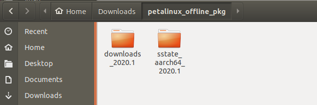
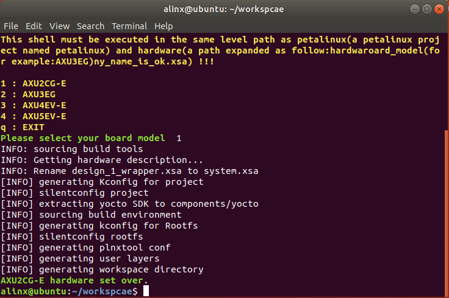
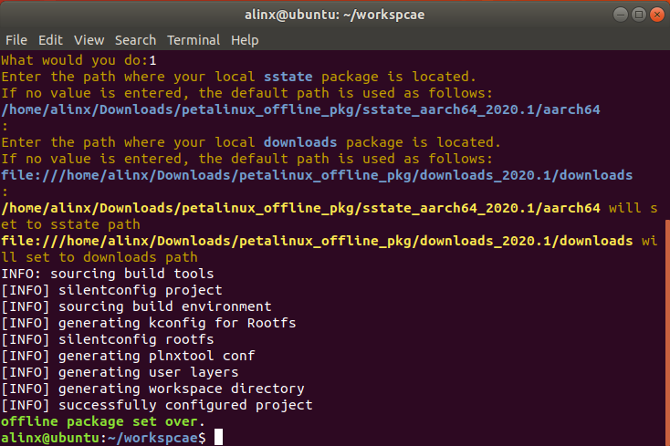
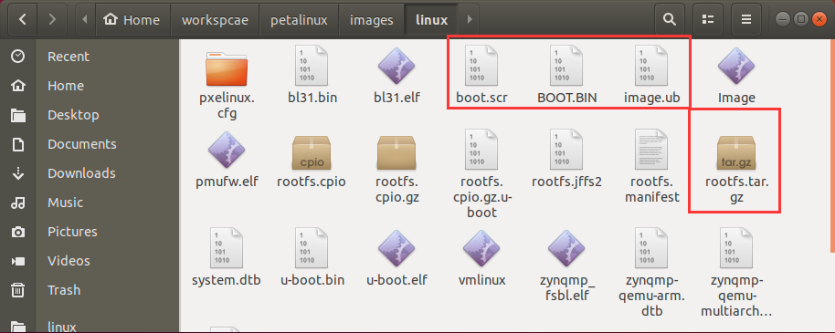
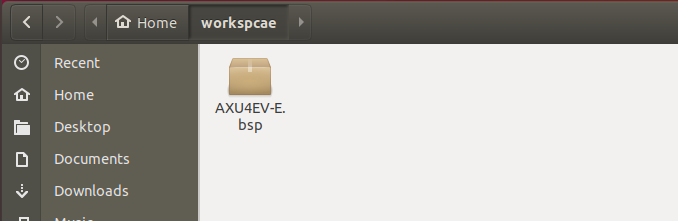
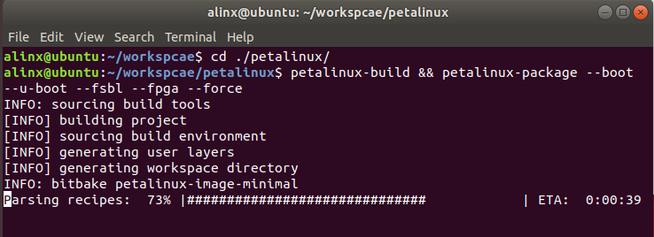

[返回首页](../)
## 创建和使用PETALINUX工程
- 关于XILINX开发套件的版本：**请务必使用2020.1版本的XILINX开发套件**，包括Vivado、Petalinux以及其他。
- 关于**离线编译**：petalinux工程编译时会从网上获取大量的必要资源，编译速度也依赖于网速，如果网络不稳定还有可能在等待很久之后编译失败，总之有很多弊端。因此**强烈建议使用离线编译**，首先从AMD|XILINX官网下载离线编译所需要的离线资源包[sstate_aarch64_2020.1.tar.gz](https://xilinx-ax-dl.entitlenow.com/dl/ul/2020/06/01/R210329478/sstate_aarch64_2020.1.tar.gz?hash=EqeKX8hOtjjXirWfThN0NA&expires=1677753350&filename=sstate_aarch64_2020.1.tar.gz)、[downloads_2020.1.tar.gz](https://xilinx-ax-dl.entitlenow.com/dl/ul/2020/06/01/R210329480/downloads_2020.1.tar.gz?hash=zfojKvkf1j-MM0E3Ba9UkQ&expires=1677753365&filename=downloads_2020.1.tar.gz)到Ubuntu系统的文件夹中并解压（解压完成后可以删除压缩包）。如下图：\
\
记录这两个包的路径，后面再介绍如何通过这两个路径来设置petalinux工程的离线编译。注意**加粗**的部分：\
/home/alinx/Downloads/petalinux_offline_pkg/sstate_aarch64_2020.1/**aarch64**
**file://**/home/alinx/Downloads/petalinux_offline_pkg/downloads_2020.1/**downloads**

---
### 方法一：使用本路径中的*PETALINUX工程文件夹*
1. 把本路径中的所有文件拷贝到Ubuntu系统的文件夹中，如下图：\

2. 在这个路径中打开终端，设置petalinux的环境变量。\
如果你的petalinux工具和我一样安装在 */opt/pkg/petalinux* 路径，则使用下面命令来设置环境变量：\
`source /opt/pkg/petalinux/settings.sh`\

3. 使用*hardware* 路径中的硬件描述文件来配置petalinux工程的硬件信息，可以使用*auto_config_petalinux_hardware.sh* 脚本来完成设置，如下图：\
\
根据提示完成操作，选择你的开发板型号，我以AXU2CG-E为例：\

4. 如果你不需要或者不想使用离线编译，则可以跳过这一步。使用*set_offline_sstate_and_downloads.sh* 脚本设置离线编译：\
\
输入1设置离线编译，输入2恢复成在线编译，输入其他任意值退出脚本，这里我选择1。因为我的sstate资源包路径和默认的设置相同，所以直接按回车就可以了。如果你的sstate资源包路径和默认的路径不同，则需要在这里输入你的路径然后按回车：\
\
然后downloads资源包路径也是一样的设置。按回车等待提示*offline package set over*：\

5. 现在就可以编译petalinux工程了，在终端中输入下面的命令编译工程并在编译完成后打包BOOT.bin：\
`cd ./petalinux && petalinux-build && petalinux-package --boot --u-boot --fsbl --fpga --force`\
即使是使用离线编译，每个工程的第一次编译都会花上较长的时间。耐心等待编译完成：\
\
编译成功!!!并且打包了BOOT.bin：\

6. 查看petalinux工程 */image/linux* 路径，这里就是编译和打包的结果文件。我们需要其中的BOOT.bin、image.ub、boot.scr以及rootfs.tar.gz这四个文件，在开发板上启动LINUX：\

---
### 方法二：使用RELEASE版本中的BSP包创建PETALINUX工程
1. 把bsp文件拷贝到Ubuntu系统的文件夹中，以AXU4EV-E为例，如下图：\

2. 在当前路径中打开终端，设置petalinux的环境变量。\
如果你的petalinux工具和我一样安装在 /opt/pkg/petalinux 路径，则使用下面命令来设置环境变量：\
`source /opt/pkg/petalinux/settings.sh`

3. 用下面的命令，通过petalinux的bsp包来创建petalinux工程：\
`petalinux-create -t project -n petalinux -s ./AXU4EV-E.bsp`\

4. 如果需要配置离线编译，参考**方法一**的步骤 **[4]**。
5. 使用bsp包创建的petalinux工程不需任何设置，进入petalinux工程路径\
`cd ./petalinux/`\
直接编译并打包BOOT.bin即可：\
`petalinux-build && petalinux-package --boot --u-boot --fsbl --fpga --force`\
\
编译和打包完成后，结果文件在petalinux工程的 */image/linux* 路径中：\

---
---
- 访问[ALINX官方网站](https://www.alinx.com)以获取更多信息。