[Back to Home](../)
## Start the linux on the development board from the SD card

---
### 1.Adjust the dial switch
Adjust the dial switch on the development board to the state of starting from the SD card, as shown below:\
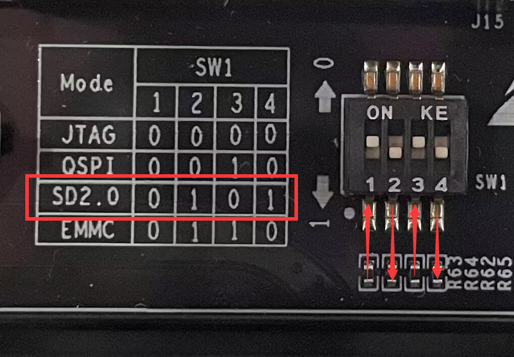\
This position of the dial -dial switch is in the development board:\
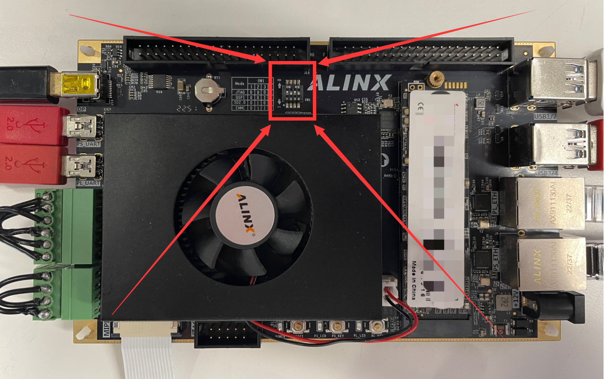

---
### 2.Set SD card partition
Next, you need to make the SD card for launching Linux. Connect the SD card (such as a card reader) to the Ubuntu system, and then open the DISKS tool in the Ubuntu system:\
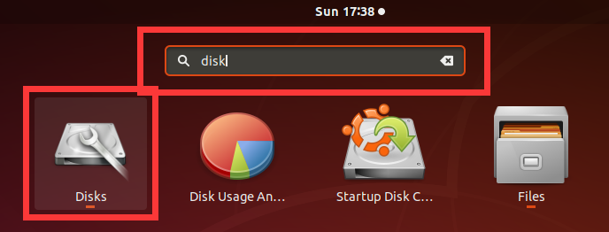\
My SD card is the **31 GB Drive** here. Select it, you can see that there are three areas in the SD card:\
a. FAT type partition named **BOOT**\
b. Ext4 type partition named **ROOTFS**\
c. Free Space\
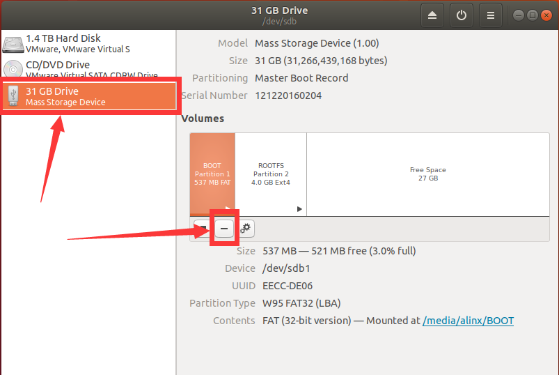\
This is the state we need. If your SD card is in the same state (there is no strict requirement on the size of the partition), just skip step [2]. However, in order to demonstrate a complete process, I will restore the SD to the state without partition, select the corresponding partition, click the \" **-** \" icon to delete the current partition, and finally change to the state as shown below:\
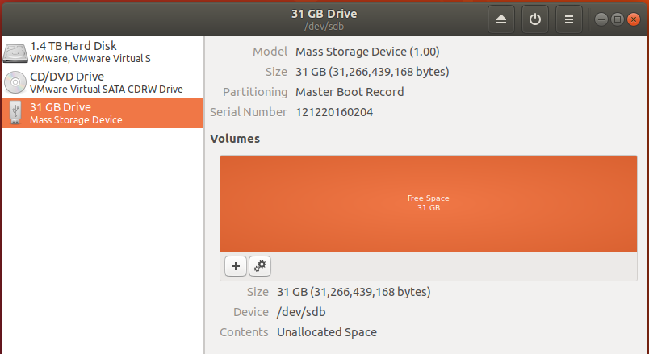\
Click the \" **+** \" icon to create a new partition. The first partition needs to be in the format of **FAT**, with a size of 2G and a name of **BOOT**:\
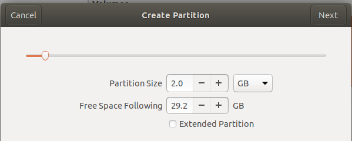\
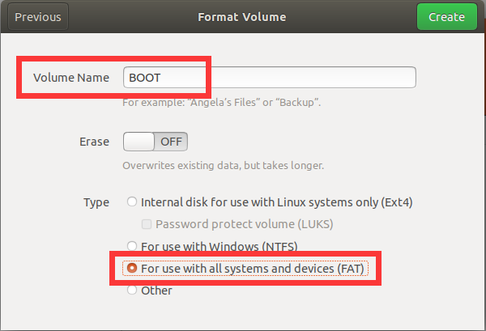\
Click the **Create** button to complete the partition creation, and click \" **▶** \" button mount partition:\
\
Click **Free Space** to create a second partition using similar steps. Select **Ext4** as the format. The size allocation is 20G (adjusted according to your actual needs and restrictions). The name is **ROOTFS**:\
\
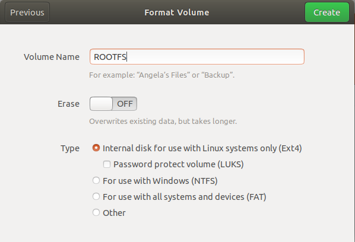\
The final status is shown in the following figure. Note that you need to mount both partitions:\
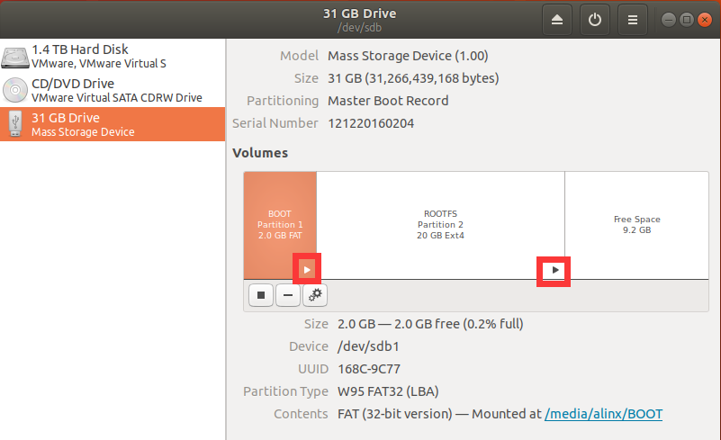

---
### 3.Populate SD card partitions
After the partition of the SD card is completed, copy the files needed to start the system to the corresponding partition.\
Ps: You can find *boot. scr*, *BOOT. bin*, *image. ub*, *rootfs. tar. gz*  in the release version. You can also compile the petalinux project to obtain these files.\
Copy the *boot.scr*, *BOOT.bin*, and *image.ub* files to the **BOOT** partition:\
\
Extract *rootfs.tar.gz* to the **ROOTFS** partition with root privileges, open the terminal in the path of *rootfs.tar.gz*, and enter the following command:\
`sudo tar zxvf ./rootfs.tar.gz -C /media/alinx/ROOTFS/ && sync`\
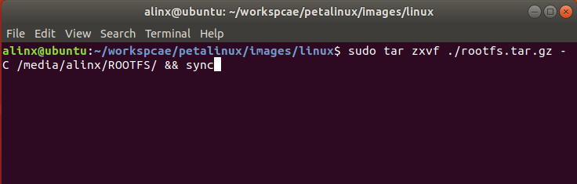\
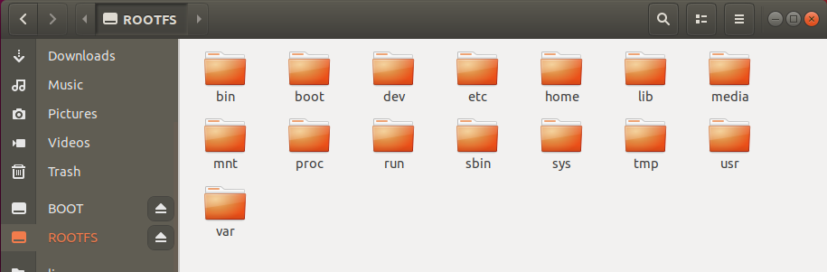\
Then eject the SD card from Ubuntu.

---
### 4.Start Linux
Insert the SD card just made into the SD card slot of the development board:\
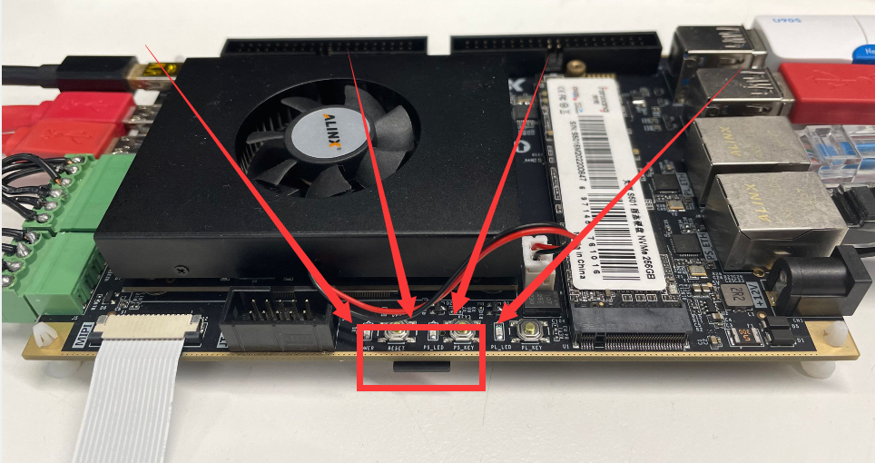\
Connect PS_UART to PC (***The driver of CP210x needs to be installed on the PC*** ):\
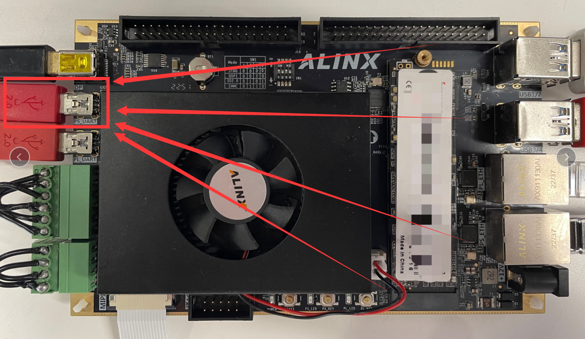\
Open the serial port tool, select the COM port we just connected, set the baud rate to 115200, close the flow control, and click the OK button:\
\
Connect 12V power supply:\
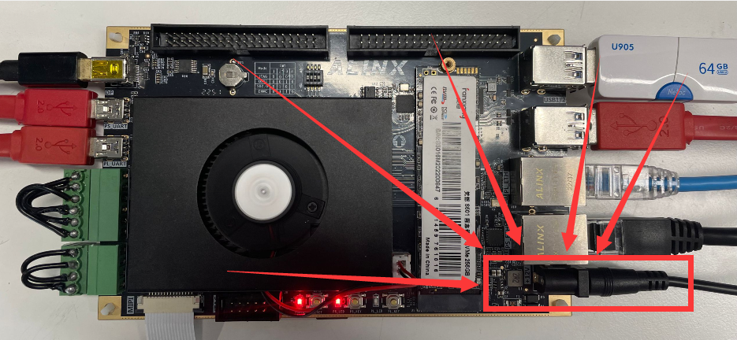\
You can see the output information in the serial port tool:\
\
The system has been started successfully. Enter the user name **root** and password **root** to log in to the system.

---
---
- Visit [ALINX official website](https://www.alinx.com) for more information.