[Back to Home](../)
## Use the interfaces and peripherals on the development board in LINUX

---
- These interfaces and peripherals are available on the development board AXU2CG-E, AXU3EG, AXU4EV-E, AXU5EV-E :\
\
①DP\
②PS_UART\
③PL_UART\
④RS485 x 2\
⑤CAN x 2\
⑥MIPI\
⑦LEDS、KEYS\
⑧M.2\
⑨PS_ETH\
⑩PL_ETH\
⑪USB x 4\
⑫EMMC(Not visible in the figure)\
⑬EEPRM(Not visible in the figure)\
⑭QSPI FLASH(Not visible in the figure)\
⑮DS1308(Not visible in the figure)\
⑯LM75(Not visible in the figure)\
PS：In the Linux system on the development board made earlier, I integrated some scripts in *~/shells_for_testing_peripheral_devices/* path which use to test these interfaces and peripherals. You can also refer to these scripts to use these interfaces and peripherals:\


---
### ①DP
#### 1.1What is DP
DP (DisplayPort) interface is a digital video and audio interface standard used to connect computers, televisions, monitors, audio and other equipment. It is an open standard developed by Video Electronics Standards Association (VESA).\
There are two physical interfaces of DP interface, one is the standard DP interface in rectangular shape, and the other is the Mini DP interface in circular shape. The Mini DP interface is used on our development board.
#### 1.2Using DP in Linux
Connect DP to the display, and you can see the desktop of Macthbox after the system is started :\
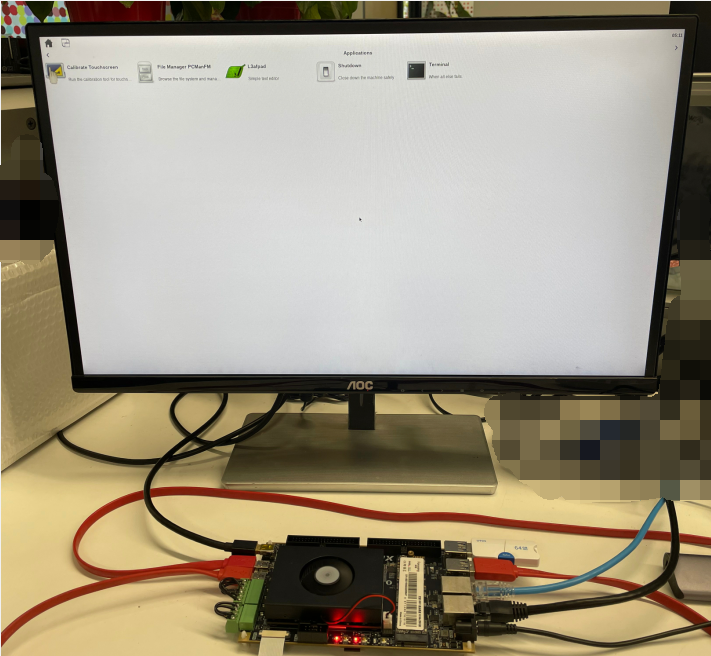
### ②PS_UART
#### 2.1What is PS_UART
UART is a communication protocol, which is called "Universal Asynchronous Receiver/Transmitter". It is a serial communication protocol that can be used to transmit data between microcontrollers, sensors, computer peripheral devices, communication devices, etc.\
UART uses two signal lines for data transmission: one is the data line (TX), which is responsible for sending data; The other is the receiving line (RX), which is responsible for receiving data. UART communication uses asynchronous transmission mode, that is, the clock signals of both sides of the communication are not synchronized, and the start bit, stop bit and parity bit need to be added in the data transmission to ensure the correctness of the data.\
The main advantages of UART are simple, flexible and widely used. Because it is a general protocol that can communicate between different devices, it is widely used in embedded systems and communication fields.\
PS_ UART is the UART interface of ARM end (also called PS end) in ZYNQMP chip.
#### 2.2Using PS_UART in Linux
PS_UART is used as the default terminal console for Linux in our system. Connect PS_UART to the PC(***The driver of CP210x needs to be installed on the PC***) :\
\
Open the corresponding COM with the serial port tool, set the baud rate to 115200, close the flow control, and click the OK button :\
\
After starting the development board, you can see the print information in the serial port tool :\
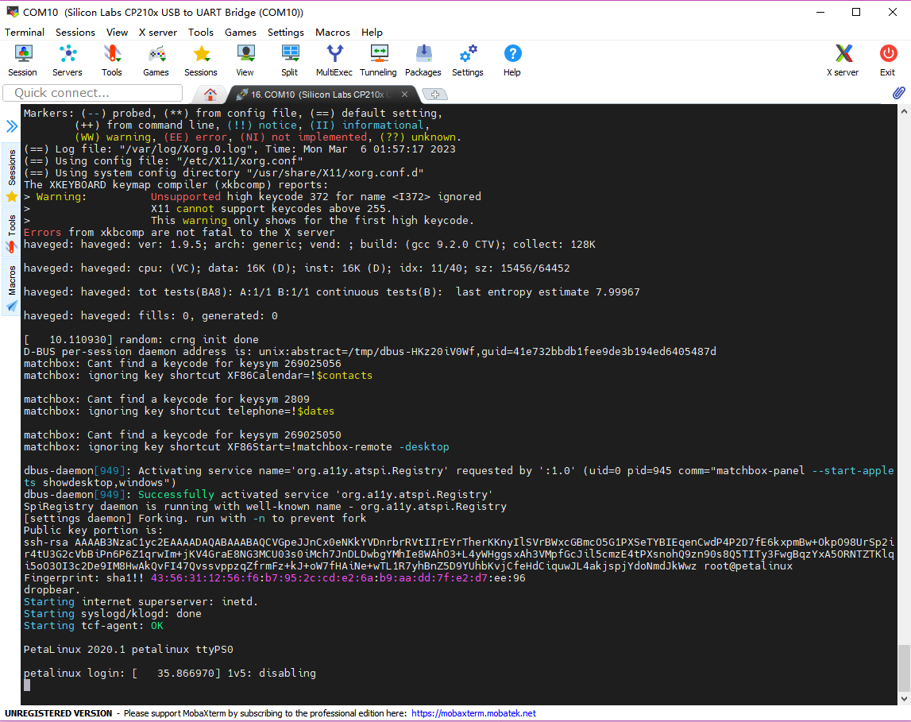\
The device of PS_UART in our Linux system is */dev/ttyPS0*. You can use PS_UART interface transmits data by using the `echo "PS_UART test" > /dev/ttyPS0` command :\
\
You can see that the serial port has echo. But PS_UART is used for terminal console, so it is not recommended to operate */dev/ttyPS0*.

---
### ③PL_UART
#### 3.1What isPL_UART
PL_UART区别于PS_UART，是ZYNQMP芯片中FPGA端(也叫做PL端)的UART接口。
#### 3.2Using PL_UART in Linux
Connect the PL_UART to the PC(***The driver of CP210x needs to be installed on the PC*** ).\
\
Open the serial port tool, select the corresponding COM, and set the baud rate to 115200 :\
\
**The number of COM depends on your PC. If your PS_UART and PL_UART are all connected to PC, you can see at least two COM suffixes with *Silicon Labs CP210x USB to UART Bridge* :**\
\
In the Linux system of the development board, the PL_UART device is */dev/ttyPS3*, and the default baud rate is 9600. You can use this command to set the baud rate.\
`stty -F /dev/ttyPS3 ispeed 115200 ospeed 115200 cs8`\
We set it to 115200 corresponding to the setting of the serial port tool, and then use the following command to print the data received by UART :\
`cat /dev/ttyPS3`\
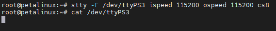\
Then send some data in the serial port tool, and you can see that the system has received these data :\
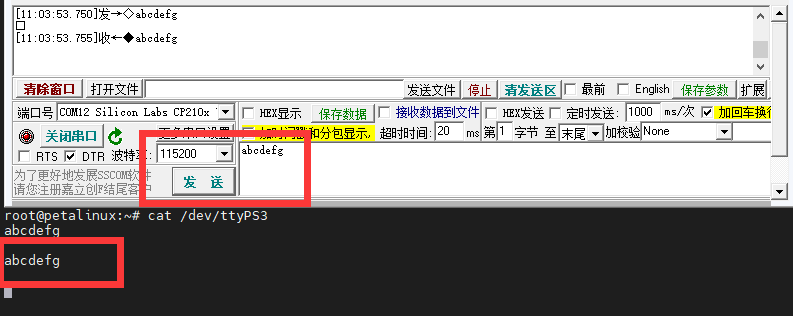\
Press *ctrl v* on the keyboard to exit the *cat /dev/ttyPS3* command, and then use the following command to send data \"*PL_UART test*\" to the PC through PL_UART. The serial port tool can receive data:\
`echo "PL_UART test" > /dev/ttyPS3`\
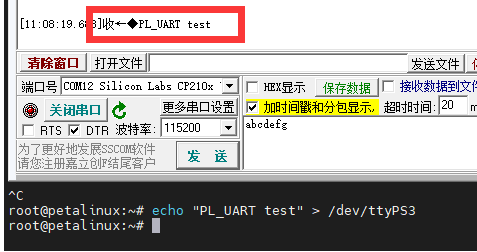
#### 3.3Use the built-in script in Linux to test PL_UART
Connect the PL_UART to any USB port on the development board :\
\
Run the *pl_uart_to_self_usb_test.sh*  script in *~/shells_for_testing_peripheral_devices/* :\
\
Output \"*pl uart to self usb test OK* \" indicates that the UART is intact(ps: this script also verifies that the USB interface is intact).

---
### ④RS485 x 2
#### 4.1What is RS485
RS485 is a common serial communication protocol, also known as EIA-485 protocol. It is a standard formulated by the American Electronic Industry Association (EIA), which is used for data communication between multiple devices. It can transmit data over a long distance. It has the characteristics of high-speed transmission and high reliability.\
RS485 can support point-to-point communication and multi-point communication between multiple devices, that is, a host can communicate with multiple slaves, and can also achieve communication between multiple slaves, to achieve a flexible network topology. The maximum transmission distance of RS485 can reach 1200 meters, and the transmission speed can reach 10 Mbps. In practical applications, the communication rate of 9600 bps or 115200 bps is usually used.\
In our development board, RS485 is a PL-end device, which is realized through FPGA IP.
#### 4.2Using RS485 in Linux
There are two RS485 channels on the development board. The corresponding device files in the system are */dev/ttyS1* and */dev/ttyS2*. RS485 equipment operates in the same way as PS_UART and PL_UART. However, it should be noted that the **baud rate of these two RS485 is fixed at 9600** due to the IP limit at the PL. Setting baud rate of these two RS485 to other values will prevent the device from working properly.
#### 4.3Use the built-in script in Linux to test RS485
Interconnect two RS485 channels：\
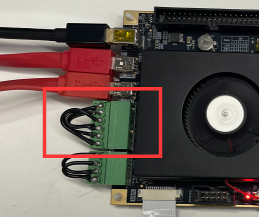 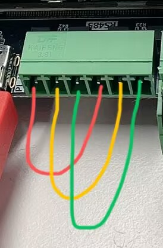\
Run the *rs485_test.sh* script in *~/shells_for_testing_peripheral_devices/* :\
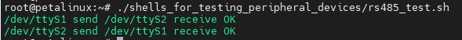\
As shown in the figure above, the two-way transceiver test is OK, the interface is intact.

---
### ⑤CAN x 2
#### 5.1What is CAN
CAN bus is a serial communication bus, which is a communication protocol widely used in automotive electronics, industrial control and robotics. CAN bus can support data communication between multiple nodes, which is efficient and reliable.\
In the CAN bus, each node can send and receive data, and the nodes are connected through the bus. CAN bus uses differential signal to transmit data, which can reduce the influence of electromagnetic interference and noise and improve the reliability of signal transmission.\
The data frame of CAN bus is divided into standard frame and extended frame. The standard frame contains 11-bit identifier and 8-byte data, while the extended frame contains 29-bit identifier and 8-byte data.\
In Linux system, the control and data transmission of CAN bus can be realized through Socket CAN interface.\
SocketCAN is an open source Linux kernel module, which provides the protocol stack and driver of the CAN bus, and provides a set of interfaces for user-level applications to control and transmit data on the CAN bus. The user can configure the CAN interface and set the parameters of the CAN bus through the ipconfig command.
#### 5.2Using CAN in Linux
Use the command \"`ifconfig - a`\" to see that there are two can channels on the development board, namely *can0* and *can1* :\
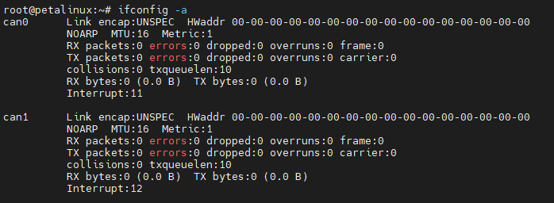\
Use this command to set the bitrate of can0 and start can0 :\
`ip link set can0 up type can bitrate 1000000`\
Use this command to receive the data received by can0 :\
`candump can0`\
Use this command to send hex data \"11 22 33 44 55\" with id \"5A1\" via can0 to the CAN bus :\
`cansend can0 5A1#11.2233.4455`
#### 5.3Use the built-in script in Linux to test CAN
Interconnect the two CANs:\
 \
Run the *can_test.sh* script in *~/shells_for_testing_peripheral_devices/* :\


---
### ⑥MIPI
#### 6.1What is MIPI
MIPI is the abbreviation of Mobile Industry Processor Interface. It is a series of interface standards developed by the MIPI Alliance, an organization created by some major mobile device manufacturers.\
MIPI is mainly committed to defining a series of hardware and software interface standards for mobile devices, including communication interfaces such as cameras, monitors and controllers, to help various parts of mobile devices exchange data and control signals more efficiently. MIPI protocol has the characteristics of high bandwidth, low power consumption, scalability, reliability and security, and is very suitable for modern mobile devices.\
In addition to mobile devices, the application of MIPI has also gradually expanded to other fields, such as automobiles, the Internet of Things, medical devices, etc., and has become one of the important interfaces for communication and control.\
In the current system of our development board, MIPI is designed as an input, which can be connected to the MIPI camera.
#### 6.2Using MIPI in Linux
First, connect a screen to the DP port and connect an OV5640 camera with a MIPI interface to development board(please do not operate with power) :\
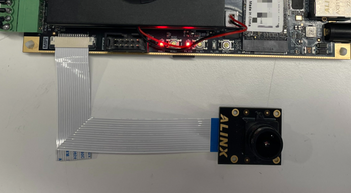\
After the system is started and logged in, use the following command：\
`media-ctl -p -d /dev/media0`\
If the node information under the device can be obtained successfully, it means that the i2c connection of the device ov5640 is normal.\
\
According to the above information, we can obtain the device node name as follows :
```
ov5640 0-003c
80000000.mipi_csi2_rx_subsystem
80010000.v_proc_ss
```
Use the following command to set the camera to 1920x1080, UYVY :
```
media-ctl -V '"ov5640 0-003c":0 [fmt:UYVY8_1X16/1920x1080@1/30 field:none]'
media-ctl -V '"80000000.mipi_csi2_rx_subsystem":0 [fmt:UYVY8_1X16/1920x1080 field:none]'
media-ctl -V '"80000000.mipi_csi2_rx_subsystem":1 [fmt:UYVY8_1X16/1920x1080 field:none]'
media-ctl -V '"80010000.v_proc_ss":0 [fmt:UYVY8_1X16/1920x1080 field:none]'
media-ctl -V '"80010000.v_proc_ss":1 [fmt:UYVY8_1X16/1920x1080 field:none]'
```
Then use the following command to display 1920x1080 camera image on the display :\
`gst-launch-1.0 -e v4l2src device=/dev/video0 ! video/x-raw,format=YUY2,width=1920,height=1080 ! kmssink bus-id=fd4a0000.zynqmp-display fullscreen-overlay=1`
#### 6.3Use the built-in script in Linux to test MIPI
Connect the display to the DP port, connect the MIPI camera to the MIPI port, run the *mipi_test.sh*  script in *~/shells_for_testing_peripheral_devices/* (*ps：Press **ctrl+c** to exit the script.*)：\
\
The camera image is displayed in the screen :\


---
### ⑦LEDS、KEYS
#### 7.1LEDs and KEYs on the development board
There are three groups of LEDs and KEY on the development board. The first group is the POWER indicator and RESET button, the second group is the LED and KEY at the PS, and the third group is the LED and KEY at the PL. The POWER and PS_LED light up after power-on:\
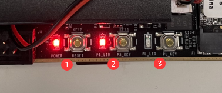
#### 7.2Using LEDs and KEYs in Linux
Using LEDs and KEYs is actually configuring and using GPIO. In Linux, you only need to know the GPIO number to use the corresponding IO port. The GPIO number of PS_LED is 373, the GPIO number of PS_KEY is 359, the GPIO number of PL_LED is 509, and the GPIO number of PL_KEY is 510.\
The IO corresponding to LED needs to be configured as output. Take PS_LED as an example, the steps to use GPIO output are as follows :
```
#Export the corresponding port
echo 373 >> /sys/class/gpio/export
#Set this port as output
echo out >> /sys/class/gpio/gpio373/direction
#Make this port output high level and light LED
echo 1 >> /sys/class/gpio/gpio373/value
#Make this port output low level and turn off LED
echo 0 >> /sys/class/gpio/gpio373/value
```
The IO corresponding to KEY needs to be configured as output. Taking PL_KEY as an example, the steps to use GPIO input are as follows :
```
#Export the corresponding port
echo 510 >> /sys/class/gpio/export
#Set this port as input
echo in >> /sys/class/gpio/gpio510/direction
#Read the current level state of this IO
cat /sys/class/gpio/gpio510/value
```

#### 7.3Use the built-in script in Linux to test LEDs and KEYs
Run the *leds_keys_test.sh* script in *~/shells_for_testing_peripheral_devices/* (*ps：Press **ctrl+c** to exit the script.*). Then you can use PS_KEY to control the PS_LED to turn on and off, and PL_KEY to control the PS_LED to turn on and off :\


---
### ⑧M.2
#### 8.1What is M.2
M.2 is a high-speed, low-power interface for connecting external devices, such as solid-state hard disk, NVMe devices, etc.\
M.2 Interface consists of PCI Express (PCIe) and SATA (Serial ATA) protocols, which can be used for data transmission, storage and communication. PCIe protocol provides faster transmission speed and more bandwidth, while SATA protocol is more suitable for low-power and high-capacity storage devices.
#### 8.2Use M.2 interface in the system
Take SSD equipment as an example, connect SSD on the M.2 interface of the development board (please do not operate with power) :\
\
Then start the development board and log in to Linux. If you can find */dev/nvme0n1*, it means that the SSD has been successfully recognized.\
If this SSD has been partitioned, you can also find the device operation files corresponding to partitions like */dev/nvme0n1p1*, */dev/nvme0n1p2* and so on.\
If the SSD does not have a partition or the file system format of the partition is not supported by the Linux system, you can use the **fdisk** tool to allocate the partition, use the **mkfs** tool to set the file system formart, and use the **mount** command to mount it.
For example, the following command will delete the first partition of  */dev/nvme0n1*  and create a new partition, then format the partition into ext4 and mount it to */run/media/nvme0n1p1* :\
```
#Unmount partition
umount /dev/nvme0n1p1
#Delete a partition of /dev/nvme0n1 and create a new partition
echo "d

n
p
1


w
" | fdisk /dev/nvme0n1
#Format the /dev/nvme0n1p1 partition into ext4
echo "y

" | mkfs.ext4 /dev/nvme0n1p1
#mount /dev/nvme0n1p1 on /run/media/nvme0n1p1
mount /dev/nvme0n1p1 /run/media/nvme0n1p1
```
After mounting, you can operate on files in the mounted path, and these files will eventually be saved in the SSD.
#### 8.3Use the built-in script in Linux to test M.2 SSD
Run the *m.2_ssd_test.sh*  script in *~/shells_for_testing_peripheral_devices/* :\
\
Different information will be printed according to the usage of your SSD, but as long as the M.2 interface and SSD are intact, \"*ssd read write OK* \" will be output.

---
### ⑨PS_ETH
#### 9.1What is ETH
在Linux操作系统中，\"ETH\" 通常指的是网络接口设备，它是用于在计算机与网络之间进行通信的硬件设备。在Linux中，可以使用 *ifconfig* 命令来管理和配置网络接口设备。可以通过ETH接口把开发板和其他网络设备连接在同一网络中，以便进行数据传输。\
在以太网协议中，每个设备都被分配一个唯一的MAC地址，以便在网络中进行识别和通信。当计算机通过网络接口设备发送数据时，它们将被封装在以太网帧中，并使用MAC地址进行路由和传输。
开发板上的PS_ETH是PS端的ETH，PS_ETH则是PL端用IP实现的ETH，但是在系统中他们的使用方法都是一样的。
In the Linux operating system, \"ETH\" usually refers to the network interface device, which is the hardware device used to communicate between the computer and the network. In Linux, you can use the *ifconfig* command to manage and configure network interface devices. The development board and other network devices can be connected in the same network through the ETH interface for data transmission.\
In the Ethernet protocol, each device is assigned a unique MAC address for identification and communication in the network. When computers send data through network interface devices, they will be encapsulated in Ethernet frames and routed and transmitted using MAC addresses.\
The PS_ETH on the development board is the ETH on the PS side, and the PS_ETH is the ETH on the PL side implemented by IP, but their use methods are the same in the system.
#### 9.2Using ETH in Linux
Connect PS_ETH and PL_ETH (such as through network router or network switch) to the LAN :\
\
Then power on the development board, log in to the system, and use *ifconfig* to view the current ETH status :\
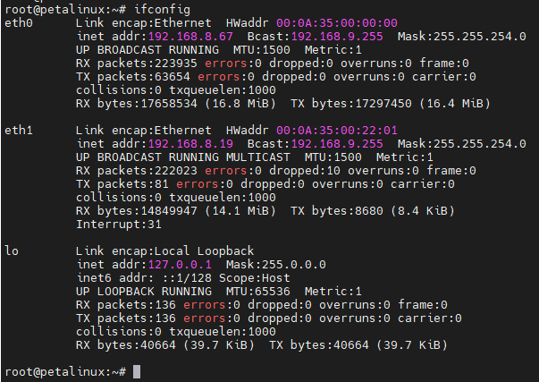\
If your router or switch supports DHCP, both eth0 and eth1 will be automatically connected and be assigned an IP address.\
If no IP address is assigned, you need to use the following command to assign it manually, for example :\
`ifconfig eth0 192.168.8.67`\
The *ifconfig* command can also be used to set the subnet mask; If the MAC address needs to be modified, */etc/network/interfaces* needs to be modified; If you want to set the gateway, you need to use command **route**; If you need to modify DNS, you need to modify */etc/resolv.conf*. The relevant configuration will not be detailed, generally, as long as you connect to the LAN through the network cable, you can use eth0 directly after the system is powered on.\
如果要使用eth1的话，还需要设置一下eth1的默认网关，网关的ip地址取决于你的局域网，**如果你的eth1和eth0接在同一个局域网的同一个网段则可以参考eth0的设置**，例如：
If you want to use eth1, you need to set the default gateway of eth1. The address of the gateway depends on your LAN. If your eth1 and eth0 are connected to the same segment of the same LAN, you can refer to the settings of eth0, for example :
```
#Use route to view the gateway of eth0 first
route
#Set the default gateway of eth1 to be the same as eth0. For example the above route command shows that the default gateway of eth0 is 192.168.8.1
route add default gw 192.168.8.1 eth1
#Use the route command to check and confirm the default gateway of eth1
route
```
\
可以使用**ping**命令来测试网络通断，通过 **-c** 参数设置ping的次数，通过 **-I** (大写的i)参数选择网口：\
You can use the **ping** command to test the network connection and disconnection, set the number of pings through the **-c** parameter, and select the network interface through the **-I**(uppercase i) parameter :\
`ping -c 1 -I eth1 www.baidu.com`\

#### 9.3Use the built-in script in Linux to test ETH
Run the *eth_test.sh*  script in *~/shells_for_testing_peripheral_devices/*. This script can be followed by a parameter, that is, the address you want to ping. For example, here I ping www.baidu.com. If no parameter is added, the default is ping *www.google.com* :\
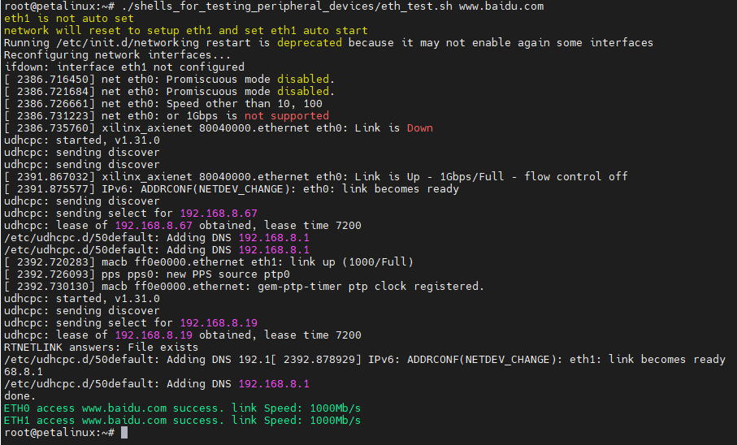\
Finally, the result of the ping and the speed of the network interface link will be print.

---
### ⑩PL_ETH
**See ⑨PS_ETH**.

---
### ⑪USB x 4
#### 11.1What is USB
USB is the abbreviation of Universal Serial Bus. It is a universal data transmission standard used to connect computers or other devices with other devices, including printers, keyboards, mice, scanners, digital cameras, mobile devices and other external devices.\
With the continuous development of technology, the version of USB is also constantly updated. USB 1.0 is the earliest version and the transmission speed is very slow, but with the introduction of USB 2.0, the transmission speed has been significantly improved. USB 3.0 and USB 3.1 are faster versions, providing higher transmission speed and more power. At the same time, USB can also support different data transmission protocols, including HID (human interface device), audio, video and storage devices.\
There are four USB3.0 interfaces on our development board.
#### 11.2Using USB on Linux systems
In fact, common USB devices can be used directly on this system. For example, the mouse and keyboard can be used directly with the desktop. If you use the storage tools such as USB flash disk, you need to pay attention to the partition and file system format. You can refer to the partition and format method of SSD in **⑧M.2**. After the USB flash disk is connected to the system, the device operation files are generally */dev/sda1*, */dev/sda2*, etc.
#### 11.3Use the built-in script in Linux to test USB Drive
Run the *usb_drive_test.sh*  script in *~/shells_for_testing_peripheral_devices/* ( *ps：This system does not support the NTFS file system, so the USB flash drive of the NTFS partition cannot be used directly* ) :\


---
### ⑫EMMC
#### 12.1What is EMMC
EMMC (Embedded MultiMediaCard) is a storage device widely used by embedded devices. It integrates flash memory chip, controller, host interface and flash memory management software into a small package. With its small size, low power consumption and high cost performance, eMMC is a common choice in embedded device storage solutions.\
EMMC is mainly used in mobile devices (such as smart phones, tablets, digital cameras, etc.) and embedded devices in automotive, industrial control and other fields. It provides a high-speed and reliable storage solution, supports fast startup and data reading and writing, and can store operating system, application programs, media files and other data.\
An 8G EMMC is integrated on our development board.
#### 12.2Using EMMC on Linux
The operation file of EMMC in Linux system is */dev/mmcblk0*. The use method is similar to that of SSD in **⑧M.2** : set the partition, format the partition, and finally mount the partition. for example :
```
#Unmount partition
umount /dev/mmcblk0p1
#Delete a partition of /dev/mmcblk0 and create a new partition
echo "d

n
p
1


w
" | fdisk /dev/mmcblk0
#Format the /dev/mmcblk0p1 partition into ext4 format
echo "y

" | mkfs.ext4 /dev/mmcblk0p1
#mount /dev/mmcblk0p1 on /media/sd-mmcblk0p1
mount /dev/mmcblk0p1 /media/sd-mmcblk0p1
```
After mounting, you can operate on files in the mounted path, and these files will eventually be saved in EMMC.
#### 12.3Use the built-in script in Linux to test EMMC
Run the *emmc_test.sh* script in *~/shells_for_testing_peripheral_devices/*  :\


---
### ⑬EEPRM
#### 13.1What is EEPROM
EEPROM is a non-volatile memory (NVM), which is an improved version of the electrically erasable programmable read-only memory (EPROM). EEPROM can be erased and programmed by electronic signals.\
EEPROM is usually used to store a small amount of data, such as configuration information on the chip, product serial number, encryption key, etc. In some electronic devices, EEPROM can also be used to store user settings and personal data.\
Compared with flash memory, EEPROM has faster reading speed and higher durability, but smaller capacity. Compared with DRAM, EEPROM has longer data retention time, but slower write speed.
#### 13.2Using EEPROM on Linux
The operating file of eeprom in the system is */sys/bus/i2c/devices/1-0050/eeprom*.\
Use the following command to write data to eeprom :\
`echo -e "test e2prom\n" > /sys/bus/i2c/devices/1-0050/eeprom`\
Use the following command to view the contents of eeprom :\
`cat /sys/bus/i2c/devices/1-0050/eeprom`\

#### 13.3Use the built-in script in Linux to test EEPROM
Run the *eeprom_test.sh* script in *~/shells_for_testing_peripheral_devices/*  :\


---
### ⑭QSPI FLASH
#### 14.1What is QSPI FLASH
Flash is a kind of high-speed flash memory, which is often used in embedded systems and other applications to store program code, configuration data and other information.\
QSPI Flash is a flash chip based on SPI interface. It communicates through four parallel data lines (quad interfaces). Compared with traditional SPI Flash, it can achieve faster data transmission speed, usually up to tens of MHz. The capacity of QSPI Flash is usually between a few megabytes and tens of megabytes.\
QSPI Flash has many advantages, including fast read and write speed, low power consumption, erasability, easy integration and use, etc. In addition, it can be programmed and erased by software without any external equipment or signal line.
#### 14.2Using QSPI FLASH on Linux systems
In the current Linux system, QSPI FLASH is used to store the environment variables of u-boot. If you modify the environment variables of u-boot, you need to be careful when operating QSPI FLASH.
The operation file of QSPI FLASH in the system is */dev/mtd0*.
The FLASH device needs to be erased before writing. Use the following command to erase the first sector of QSPI FLASH :\
`flash_erase /dev/mtd0 0 1`\
*/dev/mtd0* is a block device. You can use the **dd** command to read or write files to */dev/mtd0*.\
Write the file to */dev/mtd0 with the following command* :
```
touch /home/root/.qspiflashwrite
echo "qspiflash test" > /home/root/.qspiflashwrite
dd of=/dev/mtd0 if=/home/root/.qspiflashwrite bs=4096 count=1
```
Use the following command to read data from */dev/mtd0* to a file :
```
touch /home/root/.qspiflashread
dd if=/dev/mtd0 of=/home/root/.qspiflashread  bs=4096 count=1
```
#### 14.3Use the built-in script in Linux to test QSPI FLASH
Run the *qspi_flash_test.sh* script in *~/shells_for_testing_peripheral_devices/*  :\


---
### ⑮DS1308
#### 15.1What is DS1308
DS1308 is a low-power real-time clock chip.
#### 15.2Using DS1308 on Linux systems
In our Linux system, the device operation file of DS1308 is */dev/rtc0*. You can use the **hwclock** command to read and write */dev/rtc0*. For example:
```
#Set the system time to "2023-03-01 10:30:00"
date --set="2023-03-01 10:30:00"
#Write the system time to/dev/rtc0
hwclock -f /dev/rtc0 -w
#Update the system time with the time in /dev/rtc0
hwclock -f /dev/rtc0 -r
```
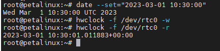
#### 15.3Use the built-in script in Linux to test DS1308
Run the *ds1308_test.sh* script in *~/shells_for_testing_peripheral_devices/* :\
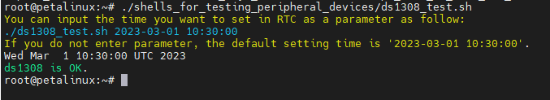

---
### ⑯LM75
#### 16.1What is LM75
LM75 is a digital temperature sensor chip produced by Texas Instruments. It can measure the ambient temperature and communicate with other devices through I2C bus. It is a digital temperature sensor chip with stable performance, high accuracy and good reliability.
#### 16.2Using LM75 on Linux systems
The temperature value collected by LM75 can be obtained by directly reading */sys/bus/i2c/devices/1-0048/hwmon/hwmon0/temp1_input* in Linux, **the unit of this data is m°C**:\
`cat /sys/bus/i2c/devices/1-0048/hwmon/hwmon0/temp1_input`\
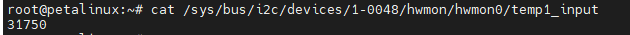\
The temperature read here is 31750m°C, equal to 31.75°C.

---
---
- Visit [ALINX official website](https://www.alinx.com) for more information.
