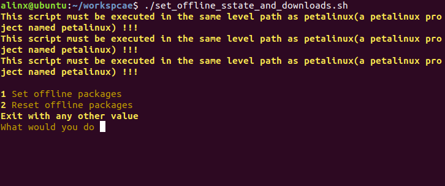
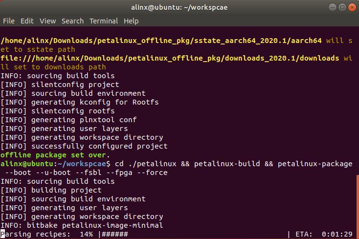

[Back to Home](../)
## Create and use PETALINUX project
- About the version of XILINX development kit: **Please be sure to use the 2020.1 version of XILINX development kit**, including Vivado, Petalinux and others.
- About the **offline compilation**: Petalinux project will obtain a lot of necessary resources from the Internet when compiling, and the speed of compilation depends on the network speed. If the network is unstable, it may have failed to compile after a long wait. In short, there are many disadvantages. Therefore, **it is strongly recommended to use offline compilation**. First, download the offline resource packages\([sstate_aarch64_2020.1.tar.gz](https://xilinx-ax-dl.entitlenow.com/dl/ul/2020/06/01/R210329478/sstate_aarch64_2020.1.tar.gz?hash=EqeKX8hOtjjXirWfThN0NA&expires=1677753350&filename=sstate_aarch64_2020.1.tar.gz)、[downloads_2020.1.tar.gz](https://xilinx-ax-dl.entitlenow.com/dl/ul/2020/06/01/R210329480/downloads_2020.1.tar.gz?hash=zfojKvkf1j-MM0E3Ba9UkQ&expires=1677753365&filename=downloads_2020.1.tar.gz)\) required for offline compilation from AMD|XILINX official website to the folder of the Ubuntu system and decompress (you can delete the compressed package after decompression). As shown below :\
\
Record the paths of these two packages. Later, we will introduce how to set the offline compilation of the petalinux project through these two paths. Note **Bold** :\
/home/alinx/Downloads/petalinux_offline_pkg/sstate_aarch64_2020.1/**aarch64**\
**file://**/home/alinx/Downloads/petalinux_offline_pkg/downloads_2020.1/**downloads**

---
### Method 1: Use the *PETALINUX project folder* in this path
1. Copy all files in this path to the Ubuntu system folder, as shown below :\

2. Open the terminal in this path and set the environment variable of petalinux.\
If your petalinux tool is installed in the */opt/pkg/petalinux* path like me, use the following command to set the environment variables :\
`source /opt/pkg/petalinux/settings.sh`\

3. Use the hardware description file in the*Hardware*path to configure the hardware information of the petalinux project. You can use*Auto_config_petalinux_hardware.sh* to complete the settings, as shown below :\
\
After completing the operation according to the prompt, select your development board model, here I use AXU2CG-E as an example :\

4. If you do not need or want to use offline compilation, you can skip this step. Use *set_offline_sstate_and_Downloads.sh* script to set offline compilation :\
\
Enter **1** to set offline compilation, enter **2** to restore petalinux project into online compilation, and enter other arbitrary values to exit the script. Here I choose 1. My SSTATE resource package path is the same as the default settings, so I just press Enter directly. If your SSTATE resource package path is different from the default path, you need to enter your path here and then press Enter : \
\
Then DOWNLOADS resource package path is the same. Press Enter and wait for the prompt *Offline package set over* :\

5. Now you can compile the Petalinux project. Enter the following command in the terminal to compile the project and package BOOT.bin after the compilation is completed :\
`cd ./petalinux && petalinux-build && petalinux-package --boot --u-boot --fsbl --fpga --force`\
Even if it is compiled offline, the first compilation of each project will take a longer time. Please wait patiently for the compilation to complete :\
\
Compilation succeeded!!! And the BOOT.bin is packaged :\
 
6. Check the */image/linux* path in the petalinux project. Here is the compiled and packaged result file. We need *BOOT.bin*, *image.ub*, *boot.scr* and *rootfs.tar.gz* to start LINUX on the development board:\

---
### Method 2: Use the BSP package in the RELEASE version to create a petalinux project
1. Copy the bsp file to the Ubuntu system folder, taking AXU4EV-E as an example, as shown in the following figure :\

2. Open the terminal in this path and set the environment variable of petalinux.\
If your petalinux tool is installed in the */opt/pkg/petalinux* path like me, use the following command to set the environment variables :\
`source /opt/pkg/petalinux/settings.sh`

3. Use the following command to create a petalinux project through the bsp package of petalinux :\
`petalinux-create -t project -n petalinux -s ./AXU4EV-E.bsp`\

4. If you need to configure offline compilation, refer to step **[4]** of **Method 1**.
5. The petalinux project created by using the bsp package does not need any settings. Enter the petalinux project path :\
`cd ./petalinux/`\
Directly compile and package BOOT.bin :\
`petalinux-build && petalinux-package --boot --u-boot --fsbl --fpga --force`\
\
After compilation and packaging, the result file is in the */image/linux* path of the petalinux project :\

---
---
- Visit [ALINX official website](https://www.alinx.com) for more information.

